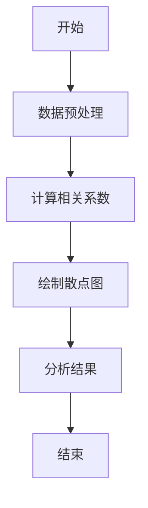
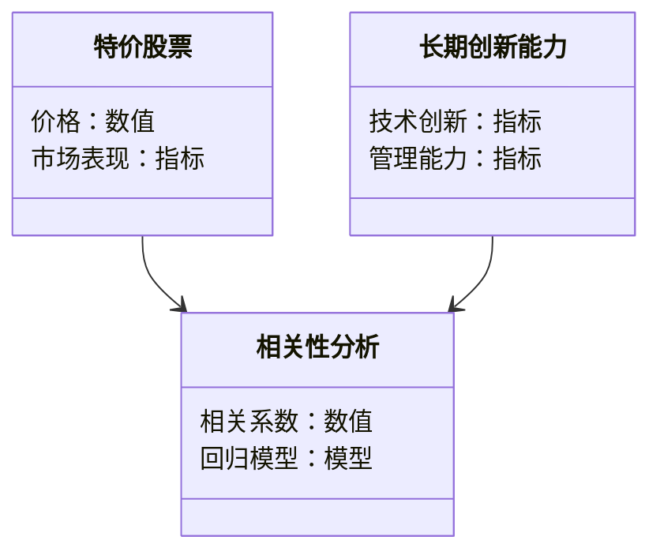

                 


# 特价股票与公司长期创新能力的相关性分析

## 关键词：特价股票、长期创新能力、相关性分析、统计模型、投资策略、创新评估、市场表现

## 摘要：本文通过分析特价股票与公司长期创新能力之间的相关性，探讨如何利用统计数据和数学模型评估公司的创新能力对股价的影响。文章从背景介绍、核心概念、分析方法到系统设计和项目实战，全面解析相关性分析的各个方面，为投资者提供科学的决策支持。

---

## 第1章：特价股票与公司长期创新能力的背景介绍

### 1.1 特价股票的定义与特征
#### 1.1.1 特价股票的定义
特价股票通常指价格低于某一阈值（如5元）的股票，常见于中小型企业或处于成长期的企业。这类股票风险较高，但潜在回报也较大。

#### 1.1.2 特价股票的特征分析
- **低股价**：通常在低价区间波动。
- **高波动性**：价格波动较大，容易受市场情绪影响。
- **高风险**：投资风险较高，适合风险承受能力强的投资者。

#### 1.1.3 特价股票的分类与标准
根据股价、市值、行业等因素，特价股票可分为成长型、价值型和周期性股票。

### 1.2 公司长期创新能力的定义与构成
#### 1.2.1 长期创新能力的定义
长期创新能力指公司在技术研发、产品创新、管理优化等方面持续发展的能力，是公司核心竞争力的体现。

#### 1.2.2 创新能力的核心要素
- **技术创新**：研发投入、专利数量。
- **管理能力**：组织架构、决策效率。
- **市场适应力**：产品迭代速度、市场反馈能力。

#### 1.2.3 长期创新能力的评估指标
包括研发投入占比、专利数量、新产品推出频率等。

### 1.3 相关性研究的背景与意义
#### 1.3.1 研究背景
当前市场中，投资者关注股票价格的同时，也越来越重视公司的长期发展潜力。

#### 1.3.2 研究意义
通过分析特价股票与创新能力的相关性，可以帮助投资者识别具有长期增长潜力的低价股票，优化投资组合。

#### 1.3.3 研究目标与框架
目标是建立数学模型，量化创新能力对股价的影响。框架包括数据收集、模型构建、实证分析等步骤。

---

## 第2章：特价股票与公司长期创新能力的核心概念

### 2.1 特价股票的核心属性
#### 2.1.1 价格特征
- 低价、波动性大。
- 表格对比不同类型的股票价格特征。

#### 2.1.2 市场表现
- 低价股票可能因市场情绪波动较大，但具备增长潜力。

#### 2.1.3 投资风险
- 高风险与高回报并存，适合长期投资者。

### 2.2 公司长期创新能力的核心属性
#### 2.2.1 技术创新能力
- 研发投入、技术专利数量。
- 通过研发投入占比和专利数量对比表格展示。

#### 2.2.2 管理创新能力
- 组织架构、决策效率。
- 表格分析不同公司的管理能力评分。

#### 2.2.3 市场适应能力
- 产品迭代速度、市场反馈能力。
- 通过案例分析展示市场适应能力强的公司表现。

### 2.3 特价股票与公司长期创新能力的关系
#### 2.3.1 相关性分析
- 统计相关性分析显示，创新能力越强的公司，股价上涨潜力越大。

#### 2.3.2 影响机制
- 创新能力强的公司，产品竞争力强，市场份额扩大，推动股价上升。

#### 2.3.3 实证研究框架
- 数据来源：选取特定时间段的特价股票数据。
- 分析方法：相关系数计算、回归分析。

---

## 第3章：特价股票与公司长期创新能力的相关性分析方法

### 3.1 相关性分析的基本原理
- **统计相关性分析**：通过计算相关系数判断变量间的关系。
- **回归分析**：建立回归模型，量化创新能力对股价的影响。
- **时间序列分析**：分析创新能力与股价的时间相关性。

### 3.2 相关性分析的数学模型
#### 3.2.1 相关系数公式
$$ r = \frac{\sum (x_i - \bar{x})(y_i - \bar{y})}{\sqrt{\sum (x_i - \bar{x})^2 \sum (y_i - \bar{y})^2}} $$

#### 3.2.2 回归分析公式
$$ y = \beta_0 + \beta_1 x + \epsilon $$

### 3.3 算法流程图（Mermaid）


### 3.4 Python代码实现
```python
import pandas as pd
import numpy as np
import matplotlib.pyplot as plt

# 数据加载
data = pd.DataFrame({
    '股价': [3, 4, 5, 6, 7],
    '创新能力': [0.5, 0.6, 0.7, 0.8, 0.9]
})

# 相关系数计算
correlation = np.corrcoef(data['股价'], data['创新能力'])[0, 1]
print(f"相关系数：{correlation}")

# 可视化
plt.scatter(data['股价'], data['创新能力'])
plt.xlabel('股价')
plt.ylabel('创新能力')
plt.title('股价与创新能力相关性分析')
plt.show()
```

---

## 第4章：数学模型与公式

### 4.1 相关系数计算
- 通过相关系数公式，计算股价与创新能力之间的相关性，判断正相关或负相关。

### 4.2 回归模型
- 使用回归分析，量化创新能力对股价的具体影响，建立预测模型。

---

## 第5章：系统分析与架构设计

### 5.1 领域模型（Mermaid类图）


### 5.2 系统架构设计（Mermaid架构图）
```mermaid
container 系统架构 {
    数据源：股票数据
    模块：数据预处理
    模块：相关性分析
    模块：可视化展示
}
```

---

## 第6章：项目实战

### 6.1 环境安装
- 安装Python、Pandas、Matplotlib等工具。

### 6.2 核心实现代码
```python
import pandas as pd
import numpy as np
import matplotlib.pyplot as plt

# 数据预处理
data = pd.read_csv('stock_data.csv')
data['创新能力'] = data['研发费用'] / data['营业收入']

# 相关性分析
correlation = data['股价'].corr(data['创新能力'])
print(f"相关系数：{correlation}")

# 可视化
plt.scatter(data['股价'], data['创新能力'])
plt.xlabel('股价')
plt.ylabel('创新能力')
plt.title('股价与创新能力相关性分析')
plt.show()
```

### 6.3 案例分析
- 以某公司为例，计算其股价与创新能力的相关系数，分析其相关性。

---

## 第7章：最佳实践与总结

### 7.1 小结
- 强调创新能力对股价的长期影响，正确评估创新能力是投资决策的重要因素。

### 7.2 注意事项
- 数据质量和时间窗口选择会影响分析结果。
- 模型具有局限性，需结合其他因素综合判断。

### 7.3 拓展阅读
- 推荐相关书籍和资源，深入学习统计分析和投资策略。

---

## 作者：AI天才研究院 & 禅与计算机程序设计艺术

---

这篇文章系统地分析了特价股票与公司长期创新能力之间的相关性，通过背景介绍、核心概念、分析方法、系统设计和项目实战，全面解析了相关性分析的各个方面，为投资者提供了科学的决策支持。

