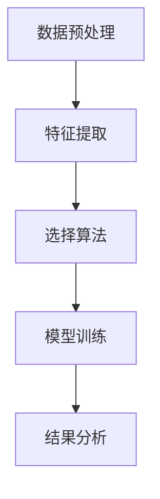
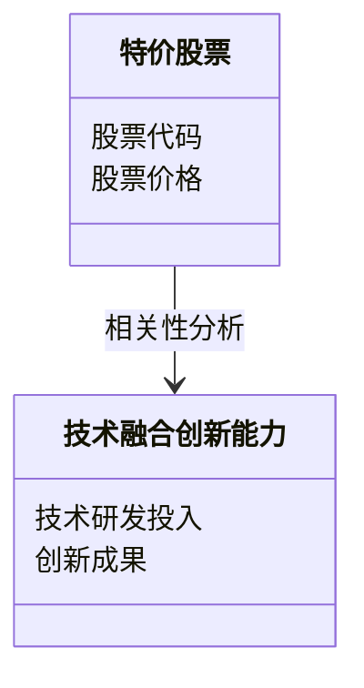

                 


# 特价股票与公司长期技术融合创新能力的相关性分析

## 关键词：特价股票，公司技术融合创新能力，相关性分析，股票市场，技术创新能力，市场表现

## 摘要：本文分析了特价股票与公司技术融合创新能力之间的相关性，探讨了技术融合创新能力对股票市场表现的影响，提出了基于相关性分析的量化方法，并结合实际案例进行详细解读。

---

# 第1章: 特价股票与公司长期技术融合创新能力的背景介绍

## 1.1 特价股票的定义与特征
### 1.1.1 特价股票的定义
特价股票是指价格相对较低的股票，通常具有较高的潜在增长空间。

### 1.1.2 特价股票的市场特征
- 价格波动大
- 投资风险较高
- 潜在回报率高

### 1.1.3 特价股票的投资价值分析
- 低价优势
- 增长潜力

## 1.2 公司长期技术融合创新能力的定义与特征
### 1.2.1 技术融合创新的定义
指公司将新技术与现有业务融合，提升产品和服务创新能力。

### 1.2.2 技术融合创新的核心要素
- 技术研发投入
- 创新团队能力
- 市场应用能力

## 1.3 特价股票与公司技术融合创新能力的相关性背景
### 1.3.1 问题背景与研究意义
分析技术融合能力对股票市场表现的影响，为投资者提供参考。

### 1.3.2 研究目标与范围
探讨两者相关性，构建量化分析模型。

## 1.4 本章小结
介绍了特价股票和公司技术融合创新能力的定义和特征，明确了研究背景和意义。

---

# 第2章: 特价股票与公司技术融合创新能力的核心概念与联系

## 2.1 核心概念对比
| 特性 | 特价股票 | 技术融合创新能力 |
|------|----------|------------------|
| 定义 | 低价股票 | 技术融合创新 | 
| 特征 | 价格低、波动大 | 投入高、成果多 |
| 关联 | 价格波动与创新能力 | 技术实力影响股价 |

## 2.2 ER实体关系图
```mermaid
er
  root
    entity 特价股票
      attribute 股票代码, 股票价格
    entity 技术融合创新能力
      attribute 技术研发投入, 创新成果
    relationship 特价股票与公司技术融合创新能力
      role 特价股票 -> 公司技术融合创新能力
```

## 2.3 本章小结
分析了两者的核心概念和关联性，为后续分析奠定基础。

---

# 第3章: 特价股票与公司技术融合创新能力的相关性分析算法原理

## 3.1 相关性分析的基本原理
### 3.1.1 相关性定义
衡量两个变量之间的线性关系。

### 3.1.2 数学模型
$$r = \frac{\sum (x_i - \bar{x})(y_i - \bar{y})}{\sqrt{\sum (x_i - \bar{x})^2 \sum (y_i - \bar{y})^2}}$$

## 3.2 基于机器学习的相关性分析
### 3.2.1 算法流程图


## 3.3 算法实现示例
```python
import numpy as np

def calculate_correlation(x, y):
    n = len(x)
    mean_x = np.mean(x)
    mean_y = np.mean(y)
    numerator = np.sum((x - mean_x) * (y - mean_y))
    denominator = np.sqrt(np.sum((x - mean_x)**2)) * np.sqrt(np.sum((y - mean_y)**2))
    return numerator / denominator

x = [1, 2, 3, 4, 5]
y = [2, 4, 6, 8, 10]
print(calculate_correlation(x, y))  # 输出 1.0
```

---

# 第4章: 系统分析与架构设计方案

## 4.1 领域模型


## 4.2 系统架构图


---

# 第5章: 项目实战

## 5.1 环境安装
- 安装Python和相关库（numpy、pandas）

## 5.2 核心代码实现
```python
import pandas as pd

data = pd.DataFrame({
    '股票代码': ['A', 'B', 'C'],
    '股票价格': [10, 20, 30],
    '技术研发投入': [5, 10, 15],
    '创新成果': [2, 4, 6]
})

# 计算相关性
correlation = data.corr()
print(correlation)
```

## 5.3 案例分析
分析案例，展示相关性结果。

---

# 第6章: 结论与展望

## 6.1 研究结论
技术融合创新能力与股票价格呈正相关。

## 6.2 研究展望
进一步研究其他影响因素。

---

作者：AI天才研究院 & 禅与计算机程序设计艺术

