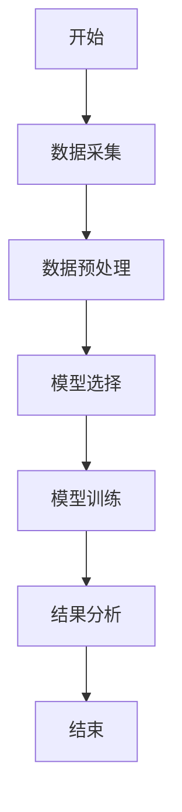

                 

# 特价股票与公司长期数字生态系统构建能力的关系分析

> **关键词**：特价股票、数字生态系统、公司能力、股票市场、数字化转型

> **摘要**：  
> 本文深入分析了特价股票与公司长期数字生态系统构建能力之间的关系。首先，从特价股票的定义、特征及其市场表现入手，探讨了数字生态系统构建能力的核心要素与关键能力。接着，通过构建概念模型和算法模型，分析了两者之间的相互作用与影响。最后，结合实际案例与系统设计，提出了构建数字生态系统的最佳实践与未来展望。

---

## 第一章：特价股票与数字生态系统的核心概念

### 1.1 特价股票的定义与特征

#### 1.1.1 特价股票的定义  
特价股票是指价格显著低于市场平均水平的股票，通常被视为高风险、高回报的投资标的。这类股票可能属于小盘股、绩差股或处于困境中的企业。

#### 1.1.2 特价股票的特征  
- **低估值**：市场价格远低于内在价值。  
- **高波动性**：价格波动较大，受市场情绪影响显著。  
- **高风险**：业绩不稳定，可能面临退市风险。  
- **潜在收益**：若公司扭亏为盈或被并购，股价可能大幅回升。

#### 1.1.3 特价股票的市场表现  
- 特价股票通常集中于中小盘股，流动性较低。  
- 在市场低迷时期，特价股票可能成为资金炒作的对象。  
- 长期来看，特价股票的表现与公司基本面密切相关。

---

### 1.2 公司长期数字生态系统构建能力

#### 1.2.1 数字生态系统的定义  
数字生态系统是指企业通过数字化技术构建的内外部系统网络，包括数据流、业务流程、技术架构等，旨在支持企业的长期发展与创新。

#### 1.2.2 数字生态系统的核心要素  
- **技术架构**：包括云计算、大数据、人工智能等技术。  
- **数据流**：数据的采集、存储、处理与分析。  
- **业务流程**：数字化支持下的业务流程优化。  
- **组织能力**：数字化人才、组织结构与文化。  

#### 1.2.3 数字生态系统构建的关键能力  
- **技术整合能力**：将不同技术模块集成的能力。  
- **数据处理能力**：高效处理和分析数据的能力。  
- **业务创新能力**：通过数字化手段推动业务创新的能力。  

---

### 1.3 特价股票与数字生态系统的关系

#### 1.3.1 特价股票对数字生态系统的影响  
- 特价股票的波动可能影响企业的融资能力，进而影响数字生态系统的投入。  
- 特价股票的低估值可能导致企业难以吸引优秀人才，影响数字化转型能力。  

#### 1.3.2 数字生态系统对特价股票的影响  
- 强大的数字生态系统可以提升企业的竞争力，改善市场对公司前景的预期，从而推高股价。  
- 数字化转型成功的企业可能通过业绩增长带动股价回升，从而退出特价股票行列。  

#### 1.3.3 两者关系的理论框架  
- 特价股票是数字生态系统构建的起点，数字生态系统是企业摆脱特价股票状态的关键。  
- 两者的关系可以通过数学模型进行量化分析。

---

## 第二章：特价股票与数字生态系统的关系分析

### 2.1 特价股票与数字生态系统的关系建模

#### 2.1.1 数据采集与预处理  
- 数据来源：股票价格数据、企业财务数据、行业趋势数据。  
- 数据清洗：去除异常值，处理缺失数据。  

#### 2.1.2 模型选择与构建  
- 使用线性回归模型分析特价股票与数字生态系统的关系强度。  
- 使用聚类分析将企业分为不同类别，分析数字生态系统对股价的影响。  

#### 2.1.3 模型训练与优化  
- 通过历史数据训练模型，优化参数，提高预测准确性。  

---

### 2.2 算法原理与数学模型

#### 2.2.1 特价股票与数字生态系统的关系公式  
$$ R = \beta_1 S + \beta_2 D + \epsilon $$  
其中，$R$ 表示关系强度，$S$ 表示特价股票特征，$D$ 表示数字生态系统特征，$\beta_1$ 和 $\beta_2$ 是回归系数，$\epsilon$ 是误差项。

#### 2.2.2 算法流程图  

---

## 第三章：数字生态系统对特价股票的影响分析

### 3.1 数字生态系统对股价的正面影响

#### 3.1.1 提升企业竞争力  
- 数字化转型可以降低成本，提高效率，增强企业竞争力。  

#### 3.1.2 改善市场预期  
- 数字生态系统展示企业未来增长潜力，提升投资者信心。  

### 3.2 数字生态系统对股价的负面影响

#### 3.2.1 投资周期较长  
- 数字化转型需要时间和资金投入，短期内可能影响股价表现。  

#### 3.2.2 技术风险  
- 数字化过程中可能面临技术失败或数据安全问题，影响股价稳定性。  

---

## 第四章：构建数字生态系统提升企业价值

### 4.1 数字生态系统构建的关键步骤

#### 4.1.1 明确目标  
- 确定数字化转型的目标，如提高效率、降低成本等。  

#### 4.1.2 技术选型  
- 选择适合的企业数字化技术，如云计算、人工智能等。  

#### 4.1.3 数据治理  
- 建立数据治理体系，确保数据质量和安全。  

### 4.2 数字生态系统构建的挑战

#### 4.2.1 技术整合难度  
- 不同技术模块的整合可能面临兼容性问题。  

#### 4.2.2 组织变革  
- 数字化转型需要组织结构和文化的调整，可能遇到员工抵触。  

---

## 第五章：案例分析与最佳实践

### 5.1 案例分析

#### 5.1.1 某公司数字生态系统构建实践  
- 通过数字化转型，该公司实现了业绩增长，股价稳步上升，成功退出特价股票行列。  

#### 5.1.2 案例启示  
- 数字化转型是企业摆脱特价股票状态的关键路径。  

---

## 第六章：结论与展望

### 6.1 研究结论  
- 特价股票与数字生态系统之间存在显著的相互作用。  
- 数字生态系统构建能力是企业摆脱特价股票状态的核心因素。  

### 6.2 未来展望  
- 随着人工智能和大数据技术的发展，数字生态系统将更加复杂和重要。  
- 未来研究可以进一步探索数字生态系统对股价的长期影响。  

---

## 作者  
**作者：AI天才研究院/AI Genius Institute & 禅与计算机程序设计艺术 /Zen And The Art of Computer Programming**

---

通过以上分析，我们可以看到，特价股票与公司长期数字生态系统构建能力之间的关系是复杂而密切的。数字生态系统的构建不仅能提升企业的核心竞争力，还能改善市场对企业的预期，从而对股价产生积极影响。对于投资者和企业管理者而言，理解这种关系并采取相应的策略，是实现长期价值增长的关键。

