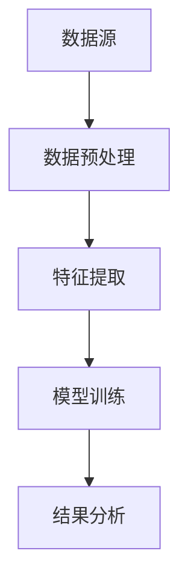

                 


# 特价股票与公司长期竞争优势的关联性

> 关键词：特价股票，长期竞争优势，股票价格预测，机器学习，数学模型

> 摘要：本文探讨了特价股票与公司长期竞争优势之间的关联性，分析了长期竞争优势对股价的影响，提出了基于机器学习的股票价格预测模型，并通过实例分析验证了模型的有效性。

---

## 第一部分: 背景介绍

### 第1章: 特价股票的定义与特点

#### 1.1 特价股票的定义
特价股票是指价格显著低于市场平均水平的股票。这类股票通常具有较高的潜在回报，但也伴随着较高的风险。

#### 1.2 特价股票的特点
- 价格低廉：通常低于市场平均价格。
- 高波动性：价格波动较大，容易受到市场情绪影响。
- 高潜在回报：低价股票可能具有较高的上涨空间。

#### 1.3 特价股票的投资风险
- 市场风险：市场波动可能导致股价大幅下跌。
- 公司基本面风险：公司可能面临财务困境或其他问题。

---

### 第2章: 公司长期竞争优势的内涵

#### 2.1 长期竞争优势的定义
长期竞争优势是指公司在行业内长期保持竞争优势的能力，通常体现在成本控制、技术壁垒、品牌影响力等方面。

#### 2.2 长期竞争优势的特征
- 稳定性：竞争优势能够在较长时期内保持。
- 可持续性：竞争优势不会因市场变化而迅速消失。
- 可扩展性：竞争优势能够支持公司业务扩展。

---

## 第二部分: 特价股票与公司竞争优势的关联性

### 第3章: 特价股票与公司竞争优势的关系

#### 3.1 长期竞争优势对股价的影响
- 公司竞争优势强，通常会反映在较高的股价上。
- 竞争优势弱，可能导致股价长期低迷。

#### 3.2 特价股票的市场表现
- 特价股票可能因公司竞争优势不足而被市场低估。
- 公司竞争优势提升后，股价可能迅速回升。

---

## 第三部分: 算法原理与数学模型

### 第4章: 特价股票与公司竞争优势的数学模型

#### 4.1 模型构建
- 使用回归分析模型，将公司竞争优势作为自变量，股价作为因变量。
- 模型公式：
  $$ y = \beta_0 + \beta_1x_1 + \beta_2x_2 + \ldots + \beta_nx_n + \epsilon $$
  其中，$y$ 表示股价，$x_i$ 表示竞争优势相关指标，$\beta_i$ 为回归系数，$\epsilon$ 为误差项。

#### 4.2 算法实现
- 使用Python的scikit-learn库进行线性回归分析。
- 代码示例：
  ```python
  import numpy as np
  from sklearn.linear_model import LinearRegression
  # 假设X为竞争优势指标，y为股价
  model = LinearRegression()
  model.fit(X, y)
  print("回归系数：", model.coef_)
  print("截距：", model.intercept_)
  ```

---

## 第四部分: 系统架构设计

### 第5章: 系统架构与功能设计

#### 5.1 系统功能设计
- 数据收集模块：收集公司竞争优势指标和股价数据。
- 数据预处理模块：清洗数据，处理缺失值和异常值。
- 模型构建模块：基于机器学习算法构建预测模型。
- 结果分析模块：分析模型预测结果，评估模型性能。

#### 5.2 系统架构图


---

## 第五部分: 项目实战

### 第6章: 项目实战与案例分析

#### 6.1 环境安装
- 安装Python和必要的库：
  ```bash
  pip install numpy pandas scikit-learn matplotlib
  ```

#### 6.2 数据收集与预处理
- 使用公开数据集，如Yahoo Finance的数据。
- 数据清洗：处理缺失值和异常值。

#### 6.3 模型训练与预测
- 使用训练数据训练模型，预测未来股价。
- 代码示例：
  ```python
  import pandas as pd
  from sklearn.model_selection import train_test_split
  from sklearn.metrics import mean_squared_error

  # 数据集划分
  X_train, X_test, y_train, y_test = train_test_split(X, y, test_size=0.2, random_state=42)

  # 模型训练
  model.fit(X_train, y_train)

  # 预测
  y_pred = model.predict(X_test)

  # 评估
  mse = mean_squared_error(y_test, y_pred)
  print("均方误差：", mse)
  ```

---

## 第六部分: 最佳实践

### 第7章: 最佳实践与总结

#### 7.1 小结
- 特价股票与公司竞争优势密切相关。
- 机器学习模型可以有效预测股价变化。

#### 7.2 注意事项
- 数据质量影响模型性能。
- 模型需定期更新，以适应市场变化。

#### 7.3 拓展阅读
- 《投资学》
- 《机器学习实战》

---

## 作者

作者：AI天才研究院/AI Genius Institute & 禅与计算机程序设计艺术 /Zen And The Art of Computer Programming

---

通过以上结构和内容，文章系统地分析了特价股票与公司长期竞争优势的关联性，结合理论分析和实践案例，为读者提供了全面的理解和指导。

