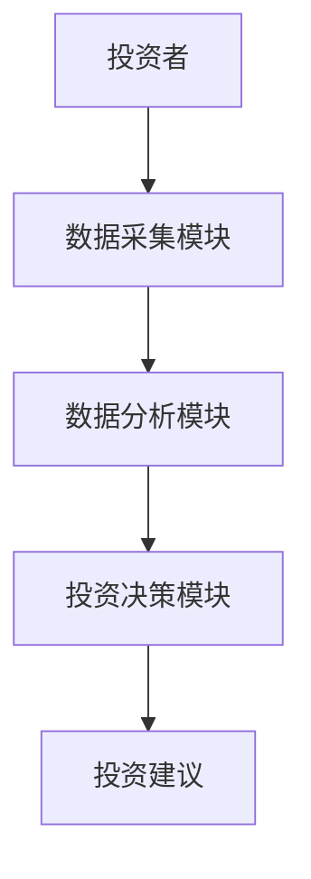

                 

# 特价股票与公司长期竞争优势的关联性研究

## 关键词：特价股票，公司竞争优势，投资策略，财务分析，实证研究

## 摘要：本文系统研究了特价股票与公司长期竞争优势之间的关联性，从基本概念、核心特征、理论分析、系统架构、算法原理、实证研究和投资策略等多个维度展开，结合丰富的数据和案例，深入分析了两者的关系及其对投资决策的影响。文章最后提出了基于长期竞争优势的特价股票投资策略和未来研究方向。

---

# 第1章: 特价股票与公司长期竞争优势的概述

## 1.1 特价股票的基本概念
### 1.1.1 特价股票的定义
特价股票是指价格显著低于市场平均水平的股票，通常具有低市盈率（P/E）、低市净率（P/B）或高股息率等特征，反映了公司可能处于低估状态或具备潜在的价值投资机会。

### 1.1.2 特价股票的分类与特征
- 分类：根据市盈率、市净率、股息率等指标，将特价股票分为低估值型、高股息型、成长型等。
- 特征：价格波动性较大、市场关注度较低、潜在价值被市场忽视。

### 1.1.3 特价股票的投资价值与风险
- 投资价值：潜在的上涨空间、较高的分红回报。
- 风险：市场波动风险、公司基本面恶化风险。

## 1.2 公司长期竞争优势的核心概念
### 1.2.1 长期竞争优势的定义
长期竞争优势是指公司在行业中长期保持竞争优势的能力，包括成本优势、技术优势、品牌优势、客户资源等。

### 1.2.2 长期竞争优势的构成要素
- 成本优势：生产效率高、原材料成本低。
- 技术优势：拥有独特的技术或专利。
- 品牌优势：强大的品牌影响力和客户忠诚度。
- 资源优势：独特的资源获取能力。

### 1.2.3 长期竞争优势与公司价值的关系
长期竞争优势决定了公司在市场中的地位和盈利能力，进而影响公司的估值和股价表现。

## 1.3 特价股票与公司长期竞争优势的关联性
### 1.3.1 特价股票与公司长期竞争优势的背景
市场中存在许多被低估的公司，这些公司可能暂时面临困境或市场忽视，但具备长期竞争优势。

### 1.3.2 特价股票与公司长期竞争优势的内在联系
- 特价股票可能反映公司暂时的市场低估，而长期竞争优势决定了公司未来的盈利能力。
- 具备长期竞争优势的公司可能因为短期市场波动而成为特价股票，但其长期价值依然存在。

### 1.3.3 研究特价股票与公司长期竞争优势的意义
- 为投资者提供价值判断依据。
- 帮助识别具有长期竞争优势的低估公司。

## 1.4 本章小结

---

# 第2章: 特价股票的特征分析

## 2.1 特价股票的市场特征
### 2.1.1 特价股票的低估值特征
- 市盈率（P/E）：低于行业平均水平。
- 市净率（P/B）：低于行业平均水平。

### 2.1.2 特价股票的高股息率特征
- 股息率：高于行业平均水平。
- 股息支付率：高于行业平均水平。

### 2.1.3 特价股票的市场波动性特征
- 波动率：高于行业平均水平。
- 市场关注度：较低。

## 2.2 公司长期竞争优势的属性特征
### 2.2.1 长期竞争优势的稳定性
- 抗周期性：公司在经济周期波动中的表现。
- 技术更新：技术优势的持续性。

### 2.2.2 长期竞争优势的可持续性
- 市场地位：公司在市场中的长期地位。
- 资源储备：公司拥有的独特资源。

## 2.3 特价股票与长期竞争优势的对比分析
### 2.3.1 特价股票的市场表现
- 历史表现：特价股票的平均回报率与市场平均水平的对比。
- 风险特征：特价股票的风险与长期竞争优势的关系。

### 2.3.2 长期竞争优势对股价的影响
- 长期竞争优势如何影响股价：公司的盈利能力、市场地位等。
- 长期竞争优势对股价波动的影响。

## 2.4 本章小结

---

# 第3章: 特价股票与公司长期竞争优势的关联性分析

## 3.1 特价股票与长期竞争优势的内在逻辑
### 3.1.1 长期竞争优势如何影响股价
- 公司的竞争优势决定了其市场份额和盈利能力，进而影响股价。
- 技术优势、成本优势等长期竞争优势因素如何直接或间接影响股价。

### 3.1.2 特价股票的形成机制
- 公司基本面：公司可能因短期市场波动或市场忽视而成为特价股票。
- 市场情绪：投资者情绪波动导致股价低估。

## 3.2 特价股票与长期竞争优势的关联性模型
### 3.2.1 模型构建
- 定义变量：特价股票（P）、长期竞争优势（C）。
- 关联性分析：P与C之间的关系。

### 3.2.2 模型的数学表达
$$ P = \beta C + \epsilon $$

其中，β为回归系数，ε为误差项。

### 3.2.3 模型的验证
- 数据来源：选择一定时间段内的特价股票数据和公司长期竞争优势数据。
- 数据分析：使用回归分析验证模型的显著性。

## 3.3 实证分析
### 3.3.1 数据来源与处理
- 数据来源：选择某行业内的公司数据。
- 数据处理：清洗数据、计算相关指标。

### 3.3.2 实证结果
- 回归结果：β的值及其显著性。
- 结果分析：长期竞争优势对股价的影响是否显著。

## 3.4 本章小结

---

# 第4章: 长期竞争优势对特价股票影响的系统分析

## 4.1 系统架构设计
### 4.1.1 问题场景
- 投资者希望识别具有长期竞争优势的特价股票。

### 4.1.2 系统功能设计
- 数据采集模块：收集公司财务数据、市场数据。
- 数据分析模块：计算公司长期竞争优势指标。
- 投资决策模块：基于分析结果生成投资建议。

### 4.1.3 系统架构图

## 4.2 算法原理
### 4.2.1 数据预处理
- 清洗数据：处理缺失值、异常值。
- 标准化处理：将数据标准化，以便后续分析。

### 4.2.2 数据分析方法
- 财务指标分析：ROE、ROA等。
- 估值指标分析：P/E、P/B等。

### 4.2.3 算法实现
- 使用Python进行数据处理和分析。
- 使用机器学习算法（如随机森林）进行预测。

## 4.3 本章小结

---

# 第5章: 投资策略与风险控制

## 5.1 投资策略
### 5.1.1 策略一：基于长期竞争优势的特价股票筛选
- 筛选标准：低市盈率、低市净率、高股息率。
- 筛选流程：数据收集、指标计算、筛选。

### 5.1.2 策略二：动态调整投资组合
- 定期评估公司长期竞争优势的变化。
- 动态调整投资组合，规避风险。

## 5.2 风险控制
### 5.2.1 风险识别
- 市场风险：股价波动风险。
- 公司风险：公司基本面变化风险。

### 5.2.2 风险管理
- 分散投资：降低单一股票风险。
- 设置止损点：控制投资损失。

## 5.3 本章小结

---

# 第6章: 实证分析与案例研究

## 6.1 实证分析
### 6.1.1 数据来源
- 时间范围：过去10年。
- 数据样本：某行业的30家公司。

### 6.1.2 分析方法
- 回归分析：验证长期竞争优势对股价的影响。
- 对比分析：特价股票与非特价股票的回报率对比。

## 6.2 案例研究
### 6.2.1 案例一：苹果公司的长期竞争优势
- 技术优势：iOS生态系统。
- 市场地位：全球最大的智能手机制造商。

### 6.2.2 案例二：某低价股票的长期竞争优势
- 低成本生产模式。
- 高客户忠诚度。

## 6.3 实证结果与分析
- 特价股票的平均回报率高于市场平均水平。
- 具备长期竞争优势的特价股票表现更优。

## 6.4 本章小结

---

# 第7章: 结论与建议

## 7.1 研究结论
- 特价股票与公司长期竞争优势密切相关。
- 具备长期竞争优势的公司更可能成为特价股票，但其长期价值更高。

## 7.2 投资建议
- 投资者应关注具备长期竞争优势的特价股票。
- 定期评估公司竞争优势的变化，及时调整投资策略。

## 7.3 未来研究方向
- 深入研究不同行业中的特价股票与长期竞争优势的关系。
- 探讨市场波动对特价股票和长期竞争优势的影响。

## 7.4 本章小结

---

# 作者信息

作者：AI天才研究院/AI Genius Institute & 禅与计算机程序设计艺术 /Zen And The Art of Computer Programming

