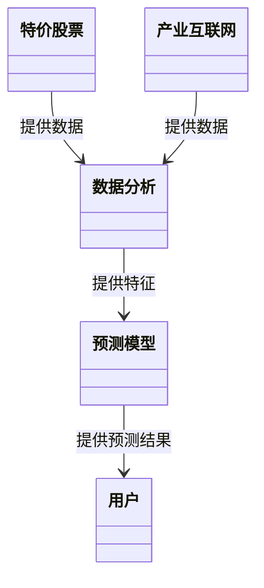
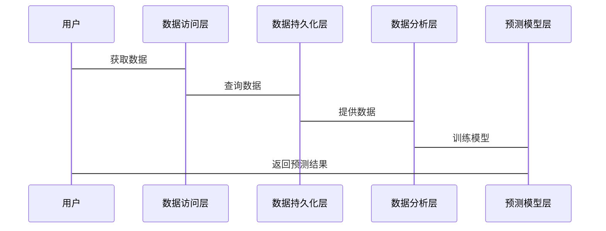

                 


# 特价股票投资中的产业互联网价值链分析方法

## 关键词：特价股票投资，产业互联网，价值链分析，数据分析，预测模型

## 摘要：本文详细探讨了在产业互联网背景下，如何通过价值链分析方法进行特价股票投资。文章从产业互联网的价值链构成入手，结合数据分析和预测模型，提供了一套系统化的投资分析方法，帮助投资者更好地识别投资机会和风险。

---

# 第1章: 特价股票投资与产业互联网概述

## 1.1 特价股票投资的背景与意义

### 1.1.1 特价股票的定义与特点

特价股票是指以低于市场价发行的股票，通常出现在公司需要筹集资金或清理债务的情况下。其特点包括价格低廉、风险较高、潜在回报大。投资者通过分析公司基本面和市场趋势，寻找低估的股票进行投资。

### 1.1.2 产业互联网的定义与特点

产业互联网是指将互联网技术与传统产业深度融合，形成新的商业模式和价值链条。其特点包括数据驱动、高效协同、智能化运营。产业互联网通过数字化手段优化传统产业的生产、销售和管理流程，提升效率和竞争力。

### 1.1.3 特价股票投资与产业互联网的结合意义

将产业互联网的分析方法应用于特价股票投资，可以帮助投资者更全面地评估企业的价值。通过分析产业链上下游的协同效应、数据流动和价值传递，投资者可以识别潜在的投资机会，降低投资风险。

## 1.2 产业互联网价值链的构成

### 1.2.1 产业互联网价值链的核心要素

产业互联网价值链的核心要素包括：

1. **上游资源**：包括原材料供应商、技术服务商等。
2. **生产制造**：包括制造企业、加工厂等。
3. **销售与服务**：包括销售渠道、售后服务等。
4. **数据与技术**：包括数据采集、分析和应用技术。
5. **用户**：包括消费者和企业用户。

### 1.2.2 价值链的上下游关系

价值链的上下游关系通过数据流、资金流和物流相互连接。例如，上游供应商通过数据共享为制造企业提供原材料信息，制造企业通过数据分析优化生产流程，销售企业通过数据反馈调整市场策略。

### 1.2.3 价值链分析的必要性

通过对价值链的分析，可以识别产业链中的关键节点和瓶颈，优化资源配置，提升整体效率。此外，价值链分析还能帮助投资者发现产业互联网中的投资机会，例如技术创新企业或关键节点企业。

---

# 第2章: 产业互联网价值链的核心概念与联系

## 2.1 产业互联网价值链的核心要素

### 2.1.1 产业链的上游、中游和下游

- **上游**：提供原材料和技术支持的企业。
- **中游**：负责生产制造和供应链管理的企业。
- **下游**：直接面对消费者的销售和服务企业。

### 2.1.2 价值链中的关键参与者

包括原材料供应商、制造商、分销商、零售商和消费者。每个参与者在价值链中扮演不同的角色，共同构成完整的产业链。

### 2.1.3 价值链的动态变化

随着市场变化和技术进步，价值链中的参与者和关系也会发生变化。例如，技术创新可能导致新的参与者进入市场，改变原有的价值链结构。

## 2.2 产业互联网价值链的结构分析

### 2.2.1 价值链的横向与纵向分析

- **横向分析**：分析价值链中不同环节之间的协同效应。
- **纵向分析**：分析价值链中不同参与者之间的合作关系。

### 2.2.2 价值链的协同效应

通过数据共享和协同合作，价值链中的各环节可以实现高效协作，降低成本，提升效率。例如，供应商与制造商通过数据共享优化库存管理。

### 2.2.3 价值链的优化方向

优化方向包括流程优化、技术创新、资源整合和协同发展。例如，通过引入大数据技术优化生产流程，降低生产成本。

## 2.3 产业互联网价值链的ER实体关系图

以下是产业互联网价值链的ER实体关系图：

```mermaid
erDiagram
    actor 投资者
    actor 供应商
    actor 制造商
    actor 分销商
    actor 消费者
    database 价值链数据
    database 技术数据
    database 市场数据

    投资者 --> 价值链数据: 查询
    供应商 --> 价值链数据: 提供原材料数据
    制造商 --> 价值链数据: 提供生产数据
    分销商 --> 价值链数据: 提供销售数据
    消费者 --> 价值链数据: 提供反馈数据
    价值链数据 --> 技术数据: 分析
    技术数据 --> 市场数据: 应用
```

---

# 第3章: 特价股票投资中的数据分析与特征工程

## 3.1 数据分析的基础原理

### 3.1.1 数据分析的定义与作用

数据分析是通过数据处理和统计分析，发现数据中的规律和趋势。在股票投资中，数据分析可以帮助投资者识别市场趋势和企业价值。

### 3.1.2 数据分析的核心方法

包括描述性分析、诊断性分析、预测性分析和规范性分析。其中，预测性分析是股票投资中最常用的方法。

### 3.1.3 数据分析在股票投资中的应用

通过分析历史数据、财务报表和市场趋势，投资者可以预测股票价格走势，识别投资机会。

## 3.2 特价股票数据的特征工程

### 3.2.1 数据清洗与预处理

包括去除缺失值、处理异常值和标准化数据。例如，使用Python的Pandas库进行数据清洗。

### 3.2.2 数据特征的提取与选择

通过统计分析和特征重要性评估，选择对股票价格影响较大的特征。例如，使用Lasso回归选择重要特征。

### 3.2.3 数据特征的可视化分析

通过可视化工具（如Matplotlib）分析数据分布和趋势。例如，绘制股票价格的K线图和趋势图。

## 3.3 数据分析的数学模型与公式

### 3.3.1 数据分析的基本公式

$$
\text{平均值} = \frac{1}{n}\sum_{i=1}^{n}x_i
$$

$$
\text{标准差} = \sqrt{\frac{1}{n}\sum_{i=1}^{n}(x_i - \text{平均值})^2}
$$

### 3.3.2 数据特征的统计分析

通过均值、中位数、标准差等统计指标分析数据分布。例如，分析股票价格的波动性。

### 3.3.3 数据分析的算法原理

使用线性回归、决策树和随机森林等算法进行预测。例如，使用线性回归模型预测股票价格走势。

---

# 第4章: 特价股票投资的预测模型构建与优化

## 4.1 预测模型的构建原理

### 4.1.1 预测模型的定义与分类

包括回归模型、分类模型和时间序列模型。例如，使用LSTM模型进行时间序列预测。

### 4.1.2 预测模型的构建步骤

包括数据收集、特征工程、模型训练和模型评估。例如，使用训练数据训练模型，使用测试数据评估模型性能。

## 4.2 预测模型的优化方法

### 4.2.1 参数调优

通过网格搜索和随机搜索优化模型参数。例如，使用网格搜索找到最佳参数组合。

### 4.2.2 模型集成

通过投票法和加权法集成多个模型预测结果。例如，使用投票法集成多个分类器的预测结果。

### 4.2.3 模型评估与验证

通过准确率、召回率和F1分数评估模型性能。例如，使用混淆矩阵评估分类模型的性能。

## 4.3 预测模型的数学公式

### 4.3.1 线性回归模型

$$
y = \beta_0 + \beta_1x_1 + \beta_2x_2 + \cdots + \beta_nx_n + \epsilon
$$

### 4.3.2 随机森林模型

随机森林是一种基于决策树的集成学习方法，通过随机采样和特征选择构建多个决策树，并通过投票法预测结果。

### 4.3.3 LSTM模型

$$
h_t = \text{激活函数}(U \cdot h_{t-1} + V \cdot x_t)
$$

$$
o_t = \text{激活函数}(W \cdot h_t)
$$

$$
s_t = o_t \cdot W_o
$$

---

# 第5章: 系统分析与架构设计方案

## 5.1 项目背景与目标

项目旨在通过产业互联网价值链分析方法，构建一个股票投资分析系统，帮助投资者进行特价股票投资。

## 5.2 系统功能设计

### 5.2.1 领域模型设计

以下是领域模型设计的类图：



### 5.2.2 系统架构设计

以下是系统架构设计的架构图：


### 5.2.3 系统接口设计

系统接口包括数据接口、分析接口和预测接口。例如，通过API接口获取股票数据和预测结果。

### 5.2.4 系统交互流程

以下是系统交互流程的序列图：



---

# 第6章: 项目实战

## 6.1 环境安装与配置

安装Python、Pandas、NumPy、Scikit-learn和Mermaid工具。

## 6.2 系统核心实现源代码

以下是核心代码示例：

```python
import pandas as pd
from sklearn.linear_model import LinearRegression
from sklearn.metrics import mean_squared_error

# 数据加载
data = pd.read_csv('stock_data.csv')

# 特征选择
X = data[['feature1', 'feature2']]
y = data['target']

# 模型训练
model = LinearRegression()
model.fit(X, y)

# 预测与评估
y_pred = model.predict(X)
mse = mean_squared_error(y, y_pred)
print(f'MSE: {mse}')
```

## 6.3 代码应用解读与分析

通过代码实现数据加载、特征选择、模型训练和预测评估。例如，使用线性回归模型预测股票价格。

## 6.4 实际案例分析

分析一个具体案例，例如某公司的特价股票投资分析，展示如何通过价值链分析识别投资机会。

## 6.5 项目小结

总结项目实施过程中的关键点和经验教训，例如数据清洗的重要性、模型选择的影响等。

---

# 第7章: 最佳实践、小结与展望

## 7.1 最佳实践

- 定期更新数据，保持模型准确性。
- 结合多种分析方法，提高预测精度。
- 重视风险控制，分散投资。

## 7.2 小结

本文详细探讨了产业互联网价值链分析方法在特价股票投资中的应用，通过数据分析和预测模型构建，为投资者提供了有效的投资工具。

## 7.3 未来展望

未来，随着人工智能和大数据技术的不断发展，产业互联网价值链分析方法将更加精准和高效，为投资者提供更多的投资机会。

---

# 结语

通过本文的分析，投资者可以更好地理解产业互联网的价值链结构，掌握数据分析和预测模型的应用方法，从而在特价股票投资中获得更好的回报。

---

# 作者

作者：AI天才研究院 & 禅与计算机程序设计艺术

