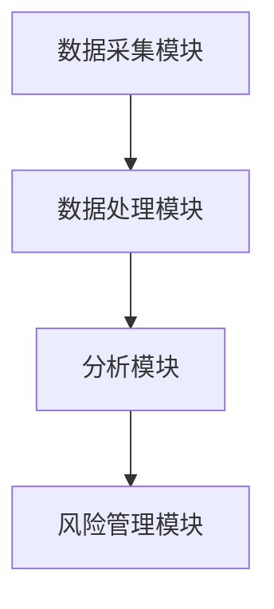

                 


```markdown
# 特价股票投资中的代际消费行为分析与风险管理

> 关键词：特价股票、代际消费行为、风险管理、股票投资、行为分析

> 摘要：本文系统地探讨了特价股票投资中的代际消费行为分析与风险管理，通过深入分析不同年龄段投资者的行为特征及其对股票投资的影响，结合风险管理的理论与实践，提出了有效的风险管理策略和系统设计方案。

---

## 第一部分: 特价股票投资与代际消费行为概述

### 第1章: 特价股票投资的背景与概念

#### 1.1 特价股票的定义与特点
- **1.1.1 特价股票的定义**  
  特价股票指的是价格相对较低的股票，通常具有较高的市净率（P/B）或市盈率（P/E），被投资者视为具有潜在增值空间的股票。

- **1.1.2 代际消费行为的定义**  
  代际消费行为指不同年龄段的消费者在消费或投资行为上的差异，反映了不同年龄段人群对市场、产品或服务的偏好和反应。

- **1.1.3 特价股票与代际消费行为的关联性**  
  特价股票的投资行为受到投资者年龄、经济状况和消费习惯的影响，不同年龄段的投资者对特价股票的偏好和风险承受能力存在显著差异。

#### 1.2 代际消费行为对股票投资的影响
- **1.2.1 不同年龄段投资者的行为差异**  
  年轻投资者倾向于高风险高回报，中年投资者注重稳健，老年投资者更倾向于保值。

- **1.2.2 代际消费偏好对投资决策的影响**  
  不同代际群体的消费偏好直接影响其在股票市场中的投资选择，例如，年轻群体可能更关注科技股，而中老年群体可能更关注传统行业。

- **1.2.3 特价股票在代际消费行为中的特殊地位**  
  特价股票因其低价特性，更容易吸引风险承受能力较低的投资者，尤其是中老年群体。

---

### 第2章: 代际消费行为的分析框架

#### 2.1 代际消费行为的核心要素
- **2.1.1 年龄段划分与消费习惯**  
  根据年龄将消费者划分为不同的代际群体，如婴儿潮一代（50岁以上）、X世代（35-49岁）、Y世代（18-34岁）等。

- **2.1.2 经济状况与消费能力**  
  不同年龄段的经济状况影响其消费能力和投资偏好，例如，年轻人可能因收入较低而更倾向于选择低价股票。

- **2.1.3 心理预期与投资决策**  
  不同代际群体对市场的心理预期不同，影响其对特价股票的投资决策。

#### 2.2 代际消费行为的分类与对比
- **2.2.1 不同代际群体的消费行为特征**  
  列表对比不同代际群体的消费习惯、投资偏好和风险承受能力。

- **2.2.2 代际消费行为的对比分析**  
  通过统计分析和图表展示不同代际群体在消费行为上的差异。

- **2.2.3 代际消费行为对投资决策的启示**  
  结合代际消费行为特征，提出针对性的投资策略。

---

## 第二部分: 特价股票投资中的风险管理

### 第3章: 风险管理的基本概念

#### 3.1 风险的定义与分类
- **3.1.1 风险的定义**  
  风险是投资活动中可能发生的损失或收益波动的不确定性。

- **3.1.2 风险的分类**  
  市场风险、流动性风险、信用风险、操作风险等。

#### 3.2 风险管理的目标与方法
- **3.2.1 风险管理的目标**  
  最大化收益的同时最小化风险。

- **3.2.2 风险管理的方法**  
  风险分散、风险对冲、风险转移、风险控制等。

#### 3.3 风险与收益的平衡
- **3.3.1 风险与收益的正相关关系**  
  高风险投资可能带来高收益，但也可能带来更大的损失。

- **3.3.2 风险收益比的计算**  
  使用数学公式计算不同投资组合的风险收益比。

### 第4章: 特价股票投资中的常见风险

#### 4.1 市场风险
- **4.1.1 市场波动对特价股票的影响**  
  市场整体波动可能对特价股票的价格产生较大影响。

- **4.1.2 宏观经济环境的影响**  
  经济周期、利率变化等因素对特价股票的投资风险的影响。

#### 4.2 流动性风险
- **4.2.1 特价股票的流动性特征**  
  部分特价股票可能流动性较差，难以快速变现。

- **4.2.2 流动性风险的评估方法**  
  使用流动比率、周转率等指标评估流动性风险。

#### 4.3 信息不对称风险
- **4.3.1 信息不对称的定义与影响**  
  信息不对称可能导致投资者在决策时处于不利地位。

- **4.3.2 特价股票的信息不对称风险**  
  特价股票通常属于小盘股，信息透明度较低，增加信息不对称风险。

### 第5章: 代际消费行为对风险管理的影响

#### 5.1 不同代际群体的风险偏好差异
- **5.1.1 年轻投资者的风险偏好**  
  年轻投资者通常风险承受能力强，愿意承担高风险以追求高回报。

- **5.1.2 中年投资者的风险偏好**  
  中年投资者更注重稳健，风险承受能力较低，倾向于选择风险较低的投资方式。

- **5.1.3 老年投资者的风险偏好**  
  老年投资者更注重保值，风险承受能力最低，倾向于选择低风险投资。

#### 5.2 代际消费行为对投资决策的影响
- **5.2.1 不同代际群体的投资决策模型**  
  根据代际消费行为特征，构建不同代际群体的投资决策模型。

- **5.2.2 代际消费行为对风险管理策略的影响**  
  针对不同代际群体的风险偏好，制定个性化的风险管理策略。

#### 5.3 如何通过代际消费行为优化风险管理
- **5.3.1 针对不同代际群体的风险管理策略**  
  根据代际消费行为特征，制定差异化的风险管理策略。

- **5.3.2 代际消费行为与风险管理的结合**  
  通过分析代际消费行为，优化风险管理模型，提高风险管理效率。

---

## 第三部分: 特价股票投资的系统分析与架构设计

### 第6章: 系统分析基础

#### 6.1 系统分析的概念与方法
- **6.1.1 系统分析的定义**  
  系统分析是一种通过对系统各组成部分的结构、功能和相互关系进行研究，以达到优化系统的目的的方法。

- **6.1.2 特价股票投资系统的组成要素**  
  包括投资者、市场、股票、交易机制等。

- **6.1.3 代际消费行为在系统分析中的应用**  
  通过分析不同代际群体的消费行为，优化系统设计。

### 第7章: 系统架构设计

#### 7.1 系统功能模块划分
- **7.1.1 数据采集模块**  
  负责采集投资者的年龄、消费习惯、投资偏好等数据。

- **7.1.2 数据处理模块**  
  对采集的数据进行清洗、转换和存储。

- **7.1.3 分析模块**  
  对数据进行统计分析和预测，生成投资建议。

- **7.1.4 风险管理模块**  
  根据分析结果，制定风险管理策略。

#### 7.2 系统架构的Mermaid图


### 第8章: 项目实战

#### 8.1 环境安装
- **8.1.1 Python安装与配置**  
  安装Python，配置Jupyter Notebook。

- **8.1.2 数据采集工具安装**  
  使用爬虫工具（如BeautifulSoup、Scrapy）采集数据。

- **8.1.3 数据分析工具安装**  
  安装Pandas、NumPy、Matplotlib等库。

#### 8.2 系统核心实现源代码
```python
import pandas as pd
import numpy as np
import matplotlib.pyplot as plt

# 示例数据：不同代际群体的投资行为
data = {
    '年龄': [25, 35, 45, 55, 65],
    '投资金额': [1000, 5000, 10000, 20000, 30000],
    '风险偏好': ['高', '中', '低', '低', '极低']
}
df = pd.DataFrame(data)

# 数据可视化
plt.figure(figsize=(10, 6))
plt.scatter(df['年龄'], df['投资金额'], c=df['风险偏好'].map({'高': 'red', '中': 'orange', '低': 'blue', '极低': 'green'}))
plt.title('代际群体的风险偏好与投资金额')
plt.xlabel('年龄')
plt.ylabel('投资金额')
plt.colorbar(label='风险偏好')
plt.show()
```

#### 8.3 案例分析
- **8.3.1 案例背景**  
  以某次市场波动为例，分析不同代际群体在特价股票投资中的表现。

- **8.3.2 数据分析**  
  使用Python代码对数据进行分析，生成投资建议和风险管理策略。

- **8.3.3 投资建议**  
  根据分析结果，提出针对不同代际群体的投资建议。

---

## 第四部分: 总结与展望

### 第9章: 总结与最佳实践

#### 9.1 小结
- 特价股票投资中的代际消费行为分析与风险管理是一个复杂但重要的课题，需要结合投资者的年龄、经济状况和消费习惯，制定个性化的风险管理策略。

#### 9.2 注意事项
- 在实际投资中，需注意市场波动、流动性风险和信息不对称风险的影响。

#### 9.3 拓展阅读
- 推荐阅读相关领域的经典文献和最新研究，进一步深入理解代际消费行为与风险管理的关系。

---

## 作者

作者：AI天才研究院/AI Genius Institute & 禅与计算机程序设计艺术 /Zen And The Art of Computer Programming
```

