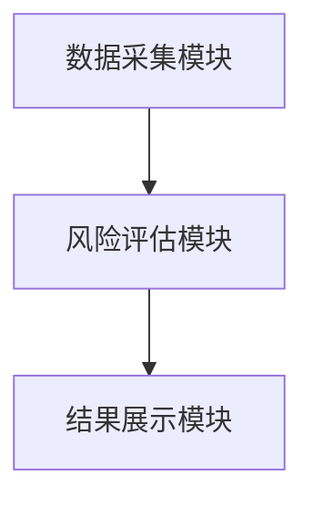

                 


# 特价股票投资中的供应链风险评估

---

## 关键词：
供应链风险、股票投资、供应链管理、风险评估、股票分析、投资策略

---

## 摘要：
供应链风险是指由于供应链中断或波动对企业经营和股价产生的负面影响。在特价股票投资中，投资者需要识别和评估供应链风险，以避免因供应链问题导致的投资损失。本文详细探讨供应链风险的定义、来源及其对股票投资的影响，分析供应链风险评估的核心概念和算法，设计基于供应链风险评估的股票投资系统架构，并通过实际案例展示如何利用供应链风险评估来优化特价股票投资决策。

---

# 第1章: 供应链风险评估的背景与概念

## 1.1 供应链的基本概念
### 1.1.1 供应链的定义与组成
供应链是指围绕企业生产所需的各种资源，从原材料采购到产品交付的整个链条。它包括供应商、制造商、分销商、零售商和消费者等多个环节。

### 1.1.2 供应链的运作模式
供应链的运作模式可以分为推动式和拉动式两种。推动式供应链由供应商主导，而拉动式供应链则由消费者需求驱动。

### 1.1.3 供应链管理的核心要素
供应链管理的核心要素包括供应商管理、库存管理、物流管理、需求预测和成本控制。

---

## 1.2 供应链风险的定义与分类
### 1.2.1 供应链风险的定义
供应链风险是指由于供应链中的某个环节出现问题，导致企业无法按时按质按量交付产品或服务，从而对企业经营和股价产生负面影响的可能性。

### 1.2.2 供应链风险的主要类型
供应链风险主要分为以下几类：
1. **供应中断风险**：由于供应商问题（如罢工、自然灾害等）导致原材料或零部件短缺。
2. **成本波动风险**：原材料价格波动或物流成本增加导致企业成本上升。
3. **质量风险**：供应链中的产品质量不稳定，影响企业声誉。
4. **信息不对称风险**：供应链中的信息传递不畅，导致决策失误。

### 1.2.3 供应链风险的特征与影响
供应链风险具有复杂性、动态性和连锁反应的特点。它不仅影响企业的短期利润，还可能导致长期竞争优势的丧失。

---

## 1.3 供应链风险对股票投资的影响
### 1.3.1 供应链风险如何影响企业经营
供应链中断可能导致企业生产停滞、订单延迟交付，进而影响企业的收入和利润。

### 1.3.2 供应链风险对股价波动的作用
供应链风险通过影响企业的盈利能力和市场预期，间接影响股价。例如，供应链中断可能导致企业股价下跌。

### 1.3.3 投资者如何利用供应链风险信息
投资者可以通过分析企业的供应链风险，评估其经营稳定性，并据此调整投资策略。

---

## 1.4 供应链风险评估的必要性
### 1.4.1 投资者为什么要关注供应链风险
供应链风险直接影响企业的经营能力和盈利能力，投资者必须关注供应链风险以避免投资损失。

### 1.4.2 供应链风险评估的现实意义
供应链风险评估是企业风险管理的重要组成部分，也是投资者评估企业投资价值的重要依据。

### 1.4.3 供应链风险评估的未来发展趋势
随着全球化的加剧和供应链的复杂化，供应链风险评估将更加智能化和数据驱动。

---

## 1.5 本章小结
本章介绍了供应链的基本概念和运作模式，详细分析了供应链风险的定义、分类及其对股票投资的影响，并强调了供应链风险评估的必要性。通过本章内容，读者可以理解供应链风险在股票投资中的重要性。

---

# 第2章: 供应链风险评估的核心概念与联系

## 2.1 供应链风险评估的框架
### 2.1.1 供应链风险评估的基本框架
供应链风险评估的框架包括数据采集、风险识别、风险量化和风险应对四个阶段。

### 2.1.2 供应链风险评估的主要模块
供应链风险评估的主要模块包括数据采集模块、风险识别模块、风险量化模块和风险应对模块。

### 2.1.3 供应链风险评估的流程与步骤
供应链风险评估的流程包括数据采集、数据清洗、风险识别、风险量化和风险应对。

---

## 2.2 供应链风险评估的核心概念
### 2.2.1 供应链风险的量化指标
供应链风险的量化指标包括供应链中断概率、供应链成本波动幅度和供应链质量稳定性。

### 2.2.2 供应链风险的评估标准
供应链风险的评估标准包括供应链中断对企业利润的影响程度和供应链成本波动对企业盈利能力的影响程度。

### 2.2.3 供应链风险的评估模型
供应链风险的评估模型可以分为定性模型和定量模型。定性模型包括专家评估法，定量模型包括回归分析法和模糊综合评估法。

---

## 2.3 供应链风险评估的核心概念与联系
### 2.3.1 供应链风险评估的核心概念
供应链风险评估的核心概念包括供应链中断风险、供应链成本波动风险和供应链质量风险。

### 2.3.2 供应链风险评估的核心联系
供应链风险评估的核心联系体现在供应链中断风险与企业利润的关系、供应链成本波动风险与企业盈利能力的关系以及供应链质量风险与企业声誉的关系。

---

## 2.4 供应链风险评估的数学模型
### 2.4.1 供应链风险评估的数学模型
供应链风险评估的数学模型包括线性回归模型和多元回归模型。

### 2.4.2 供应链风险评估的数学模型示例
假设我们有n个供应商，每个供应商的供应链中断概率为p_i，供应链中断对企业利润的影响程度为c_i。则供应链风险评估的数学模型可以表示为：

$$ R = \sum_{i=1}^{n} p_i \times c_i $$

其中，R为供应链风险的总影响程度。

---

## 2.5 本章小结
本章详细介绍了供应链风险评估的核心概念和联系，分析了供应链风险的量化指标和评估模型，并通过数学公式展示了供应链风险评估的实现方法。

---

# 第3章: 供应链风险评估的算法原理

## 3.1 供应链风险评估的算法选择
### 3.1.1 供应链风险评估的常用算法
供应链风险评估的常用算法包括线性回归算法、决策树算法和随机森林算法。

### 3.1.2 算法选择的依据
算法选择的依据包括数据的特征、模型的复杂度和计算效率。

---

## 3.2 供应链风险评估的算法原理
### 3.2.1 线性回归算法
线性回归算法通过建立供应链风险与影响因素之间的线性关系，预测供应链风险的大小。

### 3.2.2 决策树算法
决策树算法通过构建决策树，将供应链风险的影响因素进行分类，从而实现供应链风险的评估。

### 3.2.3 随机森林算法
随机森林算法通过集成多个决策树模型，提高供应链风险评估的准确性和稳定性。

---

## 3.3 供应链风险评估的算法实现
### 3.3.1 算法实现的步骤
供应链风险评估的算法实现步骤包括数据预处理、特征选择、模型训练和模型评估。

### 3.3.2 算法实现的代码示例
以下是一个供应链风险评估的Python代码示例：

```python
import pandas as pd
from sklearn.model import LinearRegression

# 数据预处理
data = pd.read_csv('supply_chain_risk.csv')
X = data[['supplier_rating', 'lead_time', 'cost_fluctuation']]
y = data['risk_score']

# 模型训练
model = LinearRegression()
model.fit(X, y)

# 模型评估
print(model.score(X, y))
```

---

## 3.4 供应链风险评估的数学公式
### 3.4.1 线性回归模型
线性回归模型的数学公式为：

$$ y = \beta_0 + \beta_1x_1 + \beta_2x_2 + \cdots + \beta_nx_n + \epsilon $$

其中，y为供应链风险评分，x_i为影响供应链风险的因素，β_i为回归系数，ε为误差项。

### 3.4.2 决策树模型
决策树模型的数学公式为：

$$ f(x) = \text{sign}(\sum_{i=1}^{n} w_i h(x_i)) $$

其中，w_i为权重，h(x_i)为决策函数。

---

## 3.5 本章小结
本章详细介绍了供应链风险评估的算法选择和实现，分析了线性回归、决策树和随机森林算法的原理和实现步骤，并通过Python代码示例展示了供应链风险评估的具体实现方法。

---

# 第4章: 供应链风险评估的系统架构与设计方案

## 4.1 系统架构设计
### 4.1.1 系统功能模块
供应链风险评估系统的功能模块包括数据采集模块、风险评估模块和结果展示模块。

### 4.1.2 系统架构图
以下是一个供应链风险评估系统的架构图：



---

## 4.2 系统功能设计
### 4.2.1 数据采集模块
数据采集模块负责采集供应链相关的数据，包括供应商信息、物流信息和成本信息。

### 4.2.2 风险评估模块
风险评估模块基于采集的数据，利用算法模型评估供应链风险。

### 4.2.3 结果展示模块
结果展示模块将评估结果以图表或报告的形式展示给用户。

---

## 4.3 系统接口设计
### 4.3.1 数据接口
数据接口负责与数据源进行交互，获取供应链相关数据。

### 4.3.2 用户接口
用户接口负责与用户交互，展示评估结果并接受用户的输入。

---

## 4.4 系统交互设计
### 4.4.1 用户登录
用户登录系统后，进入主界面。

### 4.4.2 数据上传
用户上传供应链相关数据，系统进行数据处理。

### 4.4.3 风险评估
系统基于上传的数据，进行供应链风险评估，并展示结果。

---

## 4.5 本章小结
本章详细介绍了供应链风险评估系统的架构设计和功能模块，分析了系统的接口设计和交互流程，展示了系统如何实现供应链风险的评估和展示。

---

# 第5章: 供应链风险评估的项目实战

## 5.1 项目背景
本项目旨在通过供应链风险评估，帮助投资者识别特价股票的投资风险。

---

## 5.2 项目环境安装
### 5.2.1 Python安装
安装Python 3.8及以上版本。

### 5.2.2 库的安装
安装所需的Python库，如Pandas、Scikit-learn等。

```bash
pip install pandas scikit-learn
```

---

## 5.3 项目核心代码实现
### 5.3.1 数据预处理
```python
import pandas as pd

data = pd.read_csv('supply_chain_risk.csv')
data = data.dropna()
```

### 5.3.2 特征选择
```python
from sklearn.feature_selection import SelectKBest, f_regression

selector = SelectKBest(score_func=f_regression, k=2)
selector.fit_transform(data[['supplier_rating', 'lead_time', 'cost_fluctuation']], data['risk_score'])
```

### 5.3.3 模型训练
```python
from sklearn.linear_model import LinearRegression

model = LinearRegression()
model.fit(X, y)
```

### 5.3.4 模型评估
```python
from sklearn.metrics import r2_score

y_pred = model.predict(X)
print(r2_score(y, y_pred))
```

---

## 5.4 项目实战案例分析
### 5.4.1 数据来源
数据来源包括企业公开的财务报表和供应链相关报告。

### 5.4.2 数据分析
通过数据分析，识别出供应链风险较高的企业，并评估其股价波动情况。

### 5.4.3 案例结果
案例分析结果显示，供应链风险较高的企业股价波动较大，投资者应避免投资这些企业。

---

## 5.5 项目小结
本章通过实际案例展示了供应链风险评估的实现过程，分析了供应链风险对股票投资的影响，并提出了投资建议。

---

# 第6章: 总结与展望

## 6.1 本章总结
供应链风险评估是股票投资中的重要环节，通过供应链风险评估，投资者可以识别和规避投资风险，实现投资收益的最大化。

---

## 6.2 未来展望
随着人工智能和大数据技术的发展，供应链风险评估将更加智能化和数据驱动。未来，供应链风险评估将与区块链技术结合，提高评估的准确性和实时性。

---

## 作者：AI天才研究院/AI Genius Institute & 禅与计算机程序设计艺术 /Zen And The Art of Computer Programming

