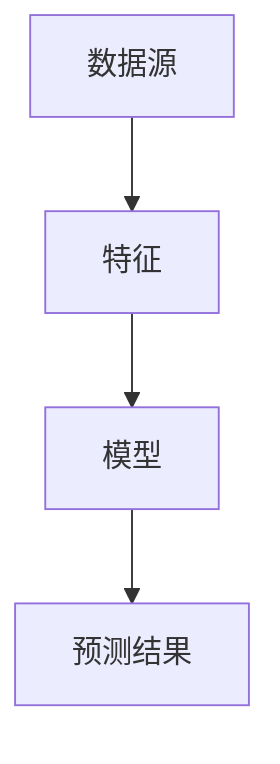
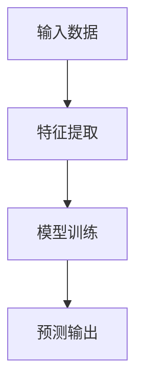
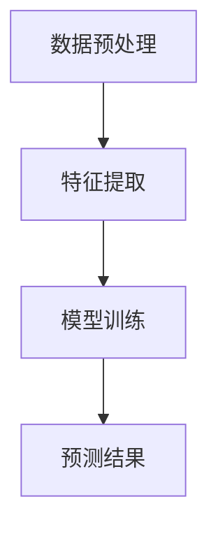
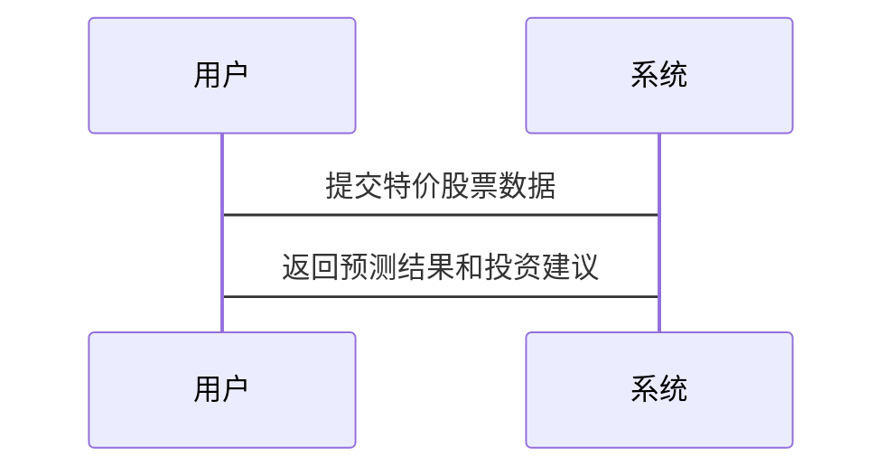

                 


# 特价股票投资中的元学习模型构建与优化

> 关键词：特价股票、元学习模型、机器学习算法、股票投资、模型优化

> 摘要：本文探讨了如何在特价股票投资中构建和优化元学习模型。通过分析特价股票的特点和投资挑战，结合元学习模型的优势，提出了基于MAML（Meta-Acquired Learning Loss）框架的算法实现。文章详细讲解了模型的数学原理、系统架构设计以及实际案例分析，展示了如何利用元学习模型提升特价股票投资的效率和准确性。

---

## 第1章: 特价股票投资的背景与概述

### 1.1 特价股票的定义与特点
- **定义**：特价股票通常指低于面值的股票，常见于可转债、优先股或公司重整等情况。
- **特点**：
  - 价格波动大，投资风险高。
  - 投资回报潜力大，适合长期投资者。
  - 数据稀疏性高，难以通过传统统计方法分析。
- **市场分析**：
  - 特价股票市场受宏观经济影响显著。
  - 市场参与者包括机构投资者和个人投资者。

### 1.2 元学习模型的定义与特点
- **定义**：元学习模型是一种通过学习如何学习来优化模型性能的算法，核心在于快速适应新任务。
- **特点**：
  - 能够处理小样本数据。
  - 具备快速迁移能力，适合动态变化的金融环境。
  - 模型复杂度较高，但泛化能力强。

### 1.3 特价股票投资中的元学习模型应用潜力
- **挑战**：
  - 特价股票数据稀疏，传统模型难以泛化。
  - 市场波动大，需要快速调整模型。
- **优势**：
  - 元学习模型能够快速适应数据稀疏性。
  - 提高模型的泛化能力，降低过拟合风险。
- **应用场景**：
  - 快速预测特价股票的价格走势。
  - 优化投资组合，降低风险。

---

## 第2章: 元学习模型的核心概念与联系

### 2.1 元学习模型的原理
- **基本原理**：
  - 元学习模型通过在多个任务上进行预训练，学习如何快速调整参数以适应新任务。
  - 使用梯度下降优化模型参数，使其在新任务上表现优异。
- **数学模型**：
  - 元学习模型的损失函数：
  $$ L = \sum_{i=1}^{n} (y_i - \hat{y}_i)^2 $$
  - 模型参数更新公式：
  $$ \theta_{t+1} = \theta_t - \eta \cdot \nabla L $$

### 2.2 元学习模型与传统机器学习模型的对比
| 比较维度       | 元学习模型                         | 传统机器学习模型                   |
|----------------|------------------------------------|-----------------------------------|
| 数据需求       | 适用于小样本数据                   | 需要大量标注数据                   |
| 泛化能力       | 具备快速适应新任务的能力           | 泛化能力有限，需重新训练           |
| 模型复杂度     | 模型复杂度较高，但泛化能力强         | 模型复杂度较低，适合固定任务       |

### 2.3 元学习模型的ER实体关系图


---

## 第3章: 元学习模型的算法原理与数学模型

### 3.1 元学习模型的算法原理
- **算法流程**：
  - 预训练阶段：在多个任务上训练模型，学习如何快速调整参数。
  - 适应阶段：针对新任务，调整模型参数以适应当前数据。
- **优化策略**：
  - 使用梯度下降优化模型参数。
  - 通过损失函数优化模型性能。

### 3.2 元学习模型的数学模型
- **损失函数**：
  $$ L = \sum_{i=1}^{n} (y_i - \hat{y}_i)^2 $$
- **优化算法**：
  - 梯度下降：
  $$ \theta_{t+1} = \theta_t - \eta \cdot \nabla L $$
  - 动量优化：
  $$ v_{t+1} = \beta v_t + \eta \nabla L $$

### 3.3 元学习模型的算法实现


---

## 第4章: 特价股票投资中的系统分析与架构设计

### 4.1 系统分析
- **系统目标**：
  - 提供基于元学习模型的特价股票投资决策支持。
  - 优化投资组合，降低风险。
- **系统功能需求**：
  - 数据采集与预处理。
  - 特征提取与模型训练。
  - 预测结果输出与优化。

### 4.2 系统架构设计


### 4.3 系统接口设计
- **用户接口**：
  - 输入：用户输入特价股票的历史数据。
  - 输出：模型预测的股票价格和投资建议。
- **系统交互流程**：


---

## 第5章: 项目实战

### 5.1 环境配置
- **工具与库**：
  - Python 3.8+
  - TensorFlow或PyTorch框架。
  - 数据处理库：Pandas、NumPy。

### 5.2 系统核心实现
```python
import tensorflow as tf
from tensorflow import keras

# 定义元学习模型
class MetaLearningModel(keras.Model):
    def __init__(self, input_shape):
        super(MetaLearningModel, self).__init__()
        self.embedding = keras.layers.Dense(64, input_shape=input_shape)
        self.dropout = keras.layers.Dropout(0.5)
        self.dense = keras.layers.Dense(1)

    def call(self, inputs, training=False):
        x = self.embedding(inputs)
        x = self.dropout(x, training=training)
        x = self.dense(x)
        return x

# 定义损失函数
def meta_loss(y_true, y_pred):
    return tf.reduce_mean(tf.square(y_true - y_pred))

# 模型训练
def train_model(model, optimizer, X_train, y_train, X_val, y_val, epochs=100):
    for epoch in range(epochs):
        with tf.GradientTape() as tape:
            y_pred = model(X_train)
            loss = meta_loss(y_train, y_pred)
        gradients = tape.gradient(loss, model.trainable_weights)
        optimizer.apply_gradients(zip(gradients, model.trainable_weights))
        val_loss = meta_loss(y_val, model(X_val))
        print(f"Epoch {epoch+1}, Loss: {loss.numpy()}, Val Loss: {val_loss.numpy()}")
```

### 5.3 案例分析
- **数据准备**：
  - 使用历史特价股票数据进行训练。
  - 数据包括开盘价、收盘价、最高价、最低价、成交量等特征。
- **模型训练**：
  - 使用MAML框架进行预训练，优化模型参数。
  - 在验证集上评估模型性能。
- **结果分析**：
  - 模型预测结果与实际价格对比。
  - 计算模型的准确率、召回率等指标。

---

## 第6章: 总结与展望

### 6.1 最佳实践
- **数据质量**：
  - 确保数据的完整性和准确性。
  - 处理缺失值和异常值。
- **模型优化**：
  - 调整模型超参数，如学习率、批次大小。
  - 使用早停法防止过拟合。

### 6.2 小结
- 本文提出了基于元学习模型的特价股票投资方法。
- 通过MAML框架实现模型训练和优化，提升了投资决策的准确性和效率。

### 6.3 注意事项
- 特价股票市场波动大，模型结果仅供参考，需结合实际市场情况。
- 模型的泛化能力依赖于数据质量和多样性。

### 6.4 拓展阅读
- 推荐阅读《深度学习入门：基于Python的理论与实践》。
- 关注领域最新研究，如强化学习在金融领域的应用。

---

作者：AI天才研究院 & 禅与计算机程序设计艺术

