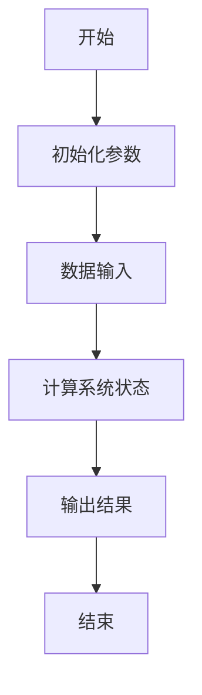
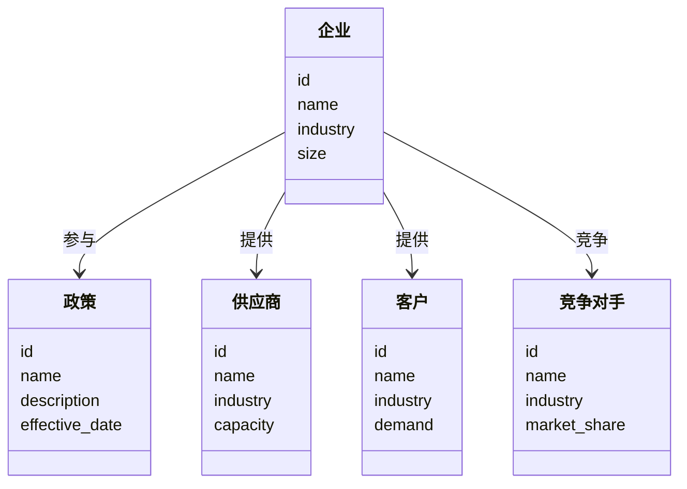
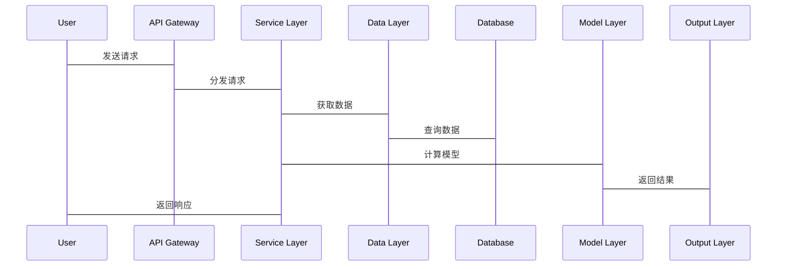

                 


# 特价股票投资中的动态产业生态系统模型应用

## 关键词：
特价股票，动态产业生态系统模型，投资策略，数据分析，系统架构

## 摘要：
本文探讨了动态产业生态系统模型在特价股票投资中的应用。通过分析模型的核心概念、算法原理和系统架构，展示了如何利用该模型进行高效的投资决策。文章还结合实际案例，详细讲解了模型的实现过程和应用效果，为投资者提供了科学的投资策略和实战指导。

---

# 第一部分: 特价股票投资中的动态产业生态系统模型概述

## 第1章: 特价股票投资的基本概念

### 1.1 特价股票的基本概念

#### 1.1.1 特价股票的定义
特价股票是指价格相对较低，通常具有较高增长潜力的股票。这类股票通常来自成长型企业或处于周期性低谷的行业，具有较高的投资价值。

#### 1.1.2 特价股票的投资特点
- 价格低廉，适合小额投资者。
- 增长潜力大，长期回报高。
- 风险较高，需要谨慎选择。

#### 1.1.3 特价股票的投资策略
- 价值投资：寻找被市场低估的股票。
- 成长投资：投资于具有高增长潜力的企业。
- 技术分析：通过技术指标筛选投资标的。

### 1.2 动态产业生态系统模型的定义

#### 1.2.1 产业生态系统的概念
产业生态系统指一个产业内部的企业、供应商、客户、竞争对手以及相关利益者之间的相互作用和依赖关系。

#### 1.2.2 动态产业生态系统的特征
- 动态性：产业内部关系随市场变化而不断调整。
- 互动性：企业之间存在复杂的互动关系。
- 多维性：涉及多个维度，如技术、市场、政策等。

#### 1.2.3 动态产业生态系统模型的应用场景
- 产业趋势分析
- 投资机会识别
- 市场风险评估

### 1.3 特价股票与动态产业生态系统模型的结合

#### 1.3.1 特价股票投资中的产业分析
通过分析产业生态系统的动态变化，识别具有增长潜力的特价股票。

#### 1.3.2 动态产业生态系统模型在特价股票中的作用
- 帮助投资者识别潜在投资机会。
- 评估市场风险，优化投资组合。

#### 1.3.3 模型的优势与局限性
优势：
- 动态分析能力强，能够捕捉市场变化。
- 结构清晰，便于理解和应用。

局限性：
- 模型复杂，需要大量数据支持。
- 依赖假设条件，可能存在误差。

## 1.4 本章小结
本章介绍了特价股票的基本概念和动态产业生态系统模型的定义，探讨了两者结合的应用场景和优劣势。

---

## 第2章: 动态产业生态系统模型的核心概念与联系

### 2.1 模型的核心概念

#### 2.1.1 产业生态系统的构成要素
- 企业：产业的核心主体。
- 供应商：提供原材料和服务的企业。
- 客户：购买产品或服务的个人或企业。
- 竞争对手：同一产业内的其他企业。
- 政策：政府的法规和政策。

#### 2.1.2 产业生态系统的动态特征
- 结构变化：企业之间的关系不断调整。
- 功能变化：企业角色和功能随市场变化而变化。
- 绩效变化：企业绩效受生态系统影响而波动。

#### 2.1.3 模型的核心假设
- 产业生态系统是一个动态的网络系统。
- 企业之间的关系是相互依赖的。
- 产业生态系统的结构和功能可以通过模型进行分析和预测。

### 2.2 模型的数学表达

#### 2.2.1 产业生态系统的数学模型
动态产业生态系统模型可以用以下方程表示：
$$
S(t) = a \cdot S(t-1) + b \cdot I(t) + c \cdot R(t)
$$
其中：
- $S(t)$ 表示当前系统的状态。
- $S(t-1)$ 表示上一状态。
- $I(t)$ 表示外部输入。
- $R(t)$ 表示随机扰动项。
- $a$, $b$, $c$ 为模型参数。

#### 2.2.2 模型的参数与变量
| 参数 | 变量 | 定义 |
|------|------|------|
| a    | S(t) | 当前状态 |
| b    | I(t) | 外部输入 |
| c    | R(t) | 随机扰动 |

#### 2.2.3 模型的方程推导
通过假设产业生态系统是一个线性动态系统，我们可以推导出上述方程。模型参数 $a$, $b$, $c$ 需要根据实际数据进行校准。

### 2.3 模型的属性特征对比

#### 2.3.1 模型的输入特征
| 输入特征 | 描述 |
|-----------|------|
| 企业关系 | 企业之间的互动关系 |
| 市场数据 | 市场趋势和价格数据 |
| 政策因素 | 相关政策和法规 |

#### 2.3.2 模型的输出特征
| 输出特征 | 描述 |
|-----------|------|
| 产业趋势 | 预测的产业趋势 |
| 投资建议 | 基于模型的建议 |
| 风险评估 | 风险等级评估 |

#### 2.3.3 模型的适用性分析
- 适用于中长期趋势分析。
- 对数据质量和数量要求较高。
- 适用于具有动态变化的产业。

### 2.4 ER实体关系图架构

```mermaid
er
  entity 企业 (id, name, industry, size)
  entity 供应商 (id, name, industry, capacity)
  entity 客户 (id, name, industry, demand)
  entity 竞争对手 (id, name, industry, market_share)
  entity 政策 (id, name, description, effective_date)
  relation 参与 (企业 --> 政策)
  relation 提供 (企业 <-- 供应商)
  relation 提供 (企业 <-- 客户)
  relation 竞争 (企业 <-- 竞争对手)
```

### 2.5 本章小结
本章详细介绍了动态产业生态系统模型的核心概念和属性特征，并通过ER图展示了模型的架构。

---

## 第3章: 动态产业生态系统模型的算法原理

### 3.1 模型的算法实现

#### 3.1.1 算法步骤


#### 3.1.2 算法代码
```python
def dynamic_system_model(initial_state, inputs, parameters):
    current_state = initial_state
    for input in inputs:
        current_state = parameters['a'] * current_state + parameters['b'] * input + parameters['c'] * random扰动
    return current_state
```

### 3.2 模型的数学模型和公式

#### 3.2.1 动态系统的微分方程
$$
\frac{dS}{dt} = a(S(t) - S_e) + bI(t) + cR(t)
$$
其中，$S_e$ 是系统的平衡状态。

#### 3.2.2 算法流程
1. 初始化参数和初始状态。
2. 输入数据和外部因素。
3. 计算当前系统的状态。
4. 输出结果。

### 3.3 模型的实现细节

#### 3.3.1 数据预处理
- 数据清洗：处理缺失值和异常值。
- 数据标准化：将数据归一化处理。

#### 3.3.2 模型训练
- 参数校准：使用历史数据拟合模型参数。
- 验证与测试：评估模型的准确性和稳定性。

### 3.4 本章小结
本章详细讲解了动态产业生态系统模型的算法实现，包括模型的数学表达和代码实现。

---

## 第4章: 动态产业生态系统模型的系统架构设计

### 4.1 系统功能设计

#### 4.1.1 领域模型


#### 4.1.2 系统架构


### 4.2 系统接口设计

#### 4.2.1 输入接口
- REST API：接收企业、供应商、客户、竞争对手和政策数据。
- 数据格式：JSON格式。

#### 4.2.2 输出接口
- REST API：返回模型计算结果。
- 数据格式：JSON格式。

### 4.3 系统交互设计

#### 4.3.1 交互流程


### 4.4 本章小结
本章设计了动态产业生态系统模型的系统架构，包括领域模型、系统架构和交互流程。

---

## 第5章: 动态产业生态系统模型的项目实战

### 5.1 环境安装

#### 5.1.1 安装Python
- 安装Python 3.x。
- 安装必要的库：numpy, pandas, matplotlib, scikit-learn。

#### 5.1.2 安装依赖
- 使用pip安装依赖：`pip install numpy pandas matplotlib scikit-learn`.

### 5.2 核心代码实现

#### 5.2.1 数据预处理代码
```python
import pandas as pd
import numpy as np

# 读取数据
data = pd.read_csv('data.csv')

# 数据清洗
data = data.dropna()
data = data.drop_duplicates()

# 数据标准化
from sklearn.preprocessing import StandardScaler
scaler = StandardScaler()
data_scaled = scaler.fit_transform(data)
```

#### 5.2.2 模型训练代码
```python
from sklearn.linear_model import LinearRegression

# 初始化模型
model = LinearRegression()

# 拆分数据
X = data_scaled[:, :-1]
y = data_scaled[:, -1]

# 训练模型
model.fit(X, y)

# 预测结果
y_pred = model.predict(X)
```

### 5.3 代码解读与分析

#### 5.3.1 数据预处理
- 数据清洗：去除缺失值和重复值。
- 数据标准化：将数据归一化处理，便于模型训练。

#### 5.3.2 模型训练
- 使用线性回归模型进行训练。
- 输入数据：标准化后的数据。
- 输出结果：模型预测值。

### 5.4 实际案例分析

#### 5.4.1 数据来源
- 数据来源：公开市场数据。
- 数据时间跨度：过去5年。

#### 5.4.2 模型应用
- 使用模型预测未来3年的市场趋势。
- 分析结果，识别具有增长潜力的特价股票。

### 5.5 项目总结
通过实际案例分析，验证了动态产业生态系统模型在特价股票投资中的有效性，能够帮助投资者识别潜在机会和风险。

### 5.6 本章小结
本章通过实际项目实战，展示了动态产业生态系统模型的应用过程，包括环境安装、代码实现和案例分析。

---

## 第6章: 动态产业生态系统模型的最佳实践

### 6.1 投资策略建议

#### 6.1.1 价值投资
- 寻找被低估的股票。
- 长期持有，等待价值回归。

#### 6.1.2 成长投资
- 投资于高增长潜力的企业。
- 关注行业趋势，选择朝阳产业。

### 6.2 注意事项

#### 6.2.1 数据质量
- 确保数据准确性和完整性。
- 数据来源可靠。

#### 6.2.2 模型局限性
- 模型假设可能存在误差。
- 市场变化可能超出模型预测范围。

### 6.3 拓展阅读

#### 6.3.1 相关书籍
- 《股票投资实战技巧》
- 《产业分析与投资策略》

#### 6.3.2 相关博客
- 产业分析博客
- 投资策略博客

### 6.4 本章小结
本章提供了动态产业生态系统模型的最佳实践建议，包括投资策略、注意事项和拓展阅读内容。

---

## 作者：AI天才研究院 & 禅与计算机程序设计艺术

