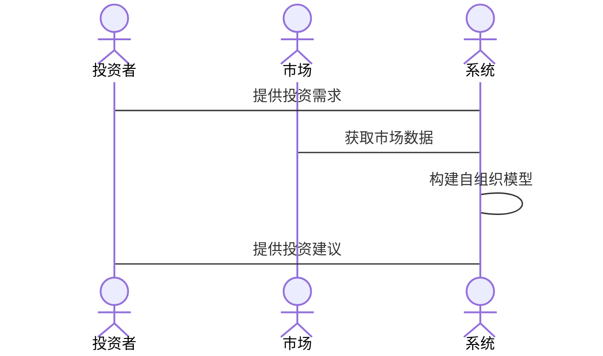

                 

# 特价股票投资中的动态数字产业生态系统自组织模型应用

> 关键词：特价股票投资，动态数字产业生态系统，自组织模型，算法原理，系统架构设计，股票分析，投资策略

> 摘要：本文深入探讨了特价股票投资中的动态数字产业生态系统自组织模型的应用。通过分析模型的核心概念、算法原理、系统架构设计以及实际案例，展示了如何利用自组织模型优化特价股票投资策略。文章内容丰富，逻辑清晰，为投资者提供了新的视角和方法。

---

## 第一章: 特价股票投资的背景与现状

### 1.1 特价股票投资的定义与特点
特价股票投资是指投资者在股票价格处于历史低位时进行的投资行为。其核心特点是价格低廉、风险较低、潜在收益较高。与传统股票投资相比，特价股票投资更注重价格波动和市场周期性。

#### 1.1.1 特价股票的定义
特价股票通常指市盈率、市净率等估值指标低于行业平均水平的股票。这些股票可能因市场波动或公司短期问题被低估。

#### 1.1.2 特价股票投资的核心特点
- 价格低廉：通常处于历史低位。
- 风险较低：估值低，下行空间有限。
- 潜在收益高：价格回升时收益显著。

#### 1.1.3 特价股票投资与传统股票投资的区别
- 投资策略：传统投资注重长期价值，特价投资注重短期价格。
- 风险偏好：传统投资风险较高，特价投资风险较低。
- 时间周期：传统投资注重长期持有，特价投资注重短期波动。

### 1.2 动态数字产业生态系统的概念
动态数字产业生态系统是一个由数字技术驱动、不断变化的产业网络。其核心要素包括企业、技术、数据和用户。

#### 1.2.1 动态数字产业的定义
动态数字产业指依赖数字技术，且随市场需求和技术进步不断变化的产业。

#### 1.2.2 数字产业生态系统的构成
- 企业：产业中的各个参与者。
- 技术：支撑产业发展的技术基础。
- 数据：连接各要素的核心资源。
- 用户：产业的服务对象。

#### 1.2.3 动态数字产业生态系统的特点
- 动态性：产业结构和关系随市场变化而调整。
- 数字化：依赖数字技术实现高效连接。
- 复杂性：涉及多个参与者和利益关系。

### 1.3 自组织模型的基本概念
自组织模型是一种通过局部规则实现全局有序的系统模型。

#### 1.3.1 自组织系统的定义
自组织系统指无需外部干预，通过内部规则实现有序的系统。

#### 1.3.2 自组织模型在股票投资中的应用
自组织模型可以用于分析股票价格波动、预测市场趋势。

#### 1.3.3 自组织模型与传统股票分析方法的对比
- 分析方法：传统分析依赖专家经验，自组织模型依赖算法。
- 数据处理：传统分析依赖历史数据，自组织模型依赖实时数据。
- 预测能力：自组织模型具有更强的适应性和实时性。

## 第二章: 动态数字产业生态系统自组织模型的核心概念与联系

### 2.1 模型的核心要素
自组织模型的核心要素包括动态网络、自组织机制和稳定性分析。

#### 2.1.1 产业动态性的核心要素
- 产业结构：产业内部的企业关系。
- 产业趋势：产业发展的方向和速度。
- 产业周期：产业的兴衰周期。

#### 2.1.2 数字生态系统的核心要素
- 数字技术：支撑生态系统的核心技术。
- 数字平台：连接各要素的基础设施。
- 数字数据：系统运行的核心资源。

#### 2.1.3 自组织模型的核心要素
- 局部规则：系统运行的基本规则。
- 全局秩序：系统运行的结果。
- 调节机制：系统自我调整的机制。

### 2.2 模型的概念属性对比
通过对比分析，明确了动态数字产业生态系统自组织模型的核心特征。

#### 2.2.1 模型属性对比表格
| 属性       | 传统股票分析模型 | 自组织模型 |
|------------|------------------|------------|
| 分析方法   | 依赖专家经验     | 依赖算法   |
| 数据处理   | 依赖历史数据     | 依赖实时数据 |
| 预测能力   | 适应性较弱       | 适应性较强 |

#### 2.2.2 模型与传统股票分析模型的对比
通过对比分析，明确了动态数字产业生态系统自组织模型的核心特征。

### 2.3 模型的ER实体关系图
通过ER图展示了模型的核心实体及其关系。

#### 2.3.1 实体关系图的构建
- 实体：股票、投资者、市场。
- 关系：投资者影响市场，市场影响股票价格。

#### 2.3.2 实体关系图的分析
通过ER图可以清晰地看到各实体之间的关系。

## 第三章: 动态数字产业生态系统自组织模型的算法原理

### 3.1 动态网络构建算法
动态网络构建算法是自组织模型的核心算法之一。

#### 3.1.1 动态网络的构建步骤
1. 数据采集：收集股票价格、市场数据。
2. 数据预处理：清洗数据，提取特征。
3. 网络构建：基于特征构建动态网络。

#### 3.1.2 网络权重的计算方法
- 权重计算：基于相关性计算权重。
- 权重更新：实时更新权重。

#### 3.1.3 网络更新的机制
- 网络更新：定期更新网络结构。
- 权重调整：动态调整权重。

### 3.2 自组织机制的实现
自组织机制是实现自组织模型的核心机制。

#### 3.2.1 自组织机制的基本原理
- 局部规则：基于局部信息调整网络。
- 全局秩序：通过局部调整实现全局有序。

#### 3.2.2 自组织机制的实现步骤
1. 初始网络构建：基于初始数据构建网络。
2. 局部规则应用：根据局部信息调整网络。
3. 全局秩序实现：通过局部调整实现全局有序。

#### 3.2.3 自组织机制的优化方法
- 参数优化：调整算法参数。
- 结构优化：优化网络结构。

### 3.3 算法的稳定性分析
算法稳定性是自组织模型的重要特性。

#### 3.3.1 算法稳定性的定义
算法稳定性指算法在面对数据波动时保持稳定的能力。

#### 3.3.2 算法稳定性的分析方法
- 稳定性测试：通过实验测试算法稳定性。
- 稳定性评估：评估算法在不同情况下的稳定性。

#### 3.3.3 算法稳定性的优化策略
- 参数调节：通过调节参数提高稳定性。
- 结构优化：优化网络结构提高稳定性。

### 3.4 算法的数学模型
算法的数学模型是自组织模型的核心内容。

#### 3.4.1 动态网络模型
动态网络模型是自组织模型的基础模型。

#### 3.4.2 自组织机制的数学表达
- 局部规则：基于局部信息的规则。
- 全局秩序：基于局部规则的全局秩序。

#### 3.4.3 算法的稳定性数学分析
- 稳定性分析：通过数学方法分析算法稳定性。
- 稳定性评估：评估算法在不同情况下的稳定性。

## 第四章: 动态数字产业生态系统自组织模型的系统架构设计

### 4.1 系统分析与设计
系统分析与设计是实现自组织模型的重要步骤。

#### 4.1.1 系统分析
- 需求分析：明确系统需求。
- 功能分析：分析系统功能。

#### 4.1.2 系统设计
- 功能设计：设计系统功能模块。
- 结构设计：设计系统结构。

### 4.2 系统功能设计
系统功能设计是实现自组织模型的重要内容。

#### 4.2.1 系统功能模块
- 数据采集模块：采集股票数据。
- 数据处理模块：处理股票数据。
- 模型构建模块：构建自组织模型。

#### 4.2.2 系统功能设计的领域模型
- 领域模型：系统功能模块之间的关系。

### 4.3 系统架构设计
系统架构设计是实现自组织模型的重要内容。

#### 4.3.1 系统架构
- 分层架构：系统分为数据层、业务层、表现层。
- 模块架构：系统分为数据采集模块、数据处理模块、模型构建模块。

#### 4.3.2 系统架构设计的Mermaid图

### 4.4 系统接口设计
系统接口设计是实现自组织模型的重要步骤。

#### 4.4.1 系统接口
- 数据接口：数据采集模块接口。
- 模型接口：模型构建模块接口。

#### 4.4.2 系统接口设计的Mermaid图

### 4.5 系统交互设计
系统交互设计是实现自组织模型的重要内容。

#### 4.5.1 系统交互流程
- 投资者提出需求。
- 系统获取市场数据。
- 系统构建自组织模型。
- 系统提供投资建议。

#### 4.5.2 系统交互设计的Mermaid图

## 第五章: 动态数字产业生态系统自组织模型的应用与案例分析

### 5.1 项目实战
项目实战是实现自组织模型的重要步骤。

#### 5.1.1 环境安装
- 系统环境：安装Python、相关库。
- 数据环境：获取股票数据。

#### 5.1.2 核心代码实现
- 数据处理：数据清洗、特征提取。
- 模型构建：构建自组织模型。
- 模型应用：应用模型进行股票分析。

#### 5.1.3 代码应用解读与分析
- 代码解读：解释代码的功能。
- 代码分析：分析代码的运行过程。

### 5.2 案例分析
案例分析是验证自组织模型的重要步骤。

#### 5.2.1 案例背景
- 案例选择：选择一个特价股票投资案例。
- 案例分析：分析案例的背景。

#### 5.2.2 案例分析与详细解读
- 数据分析：分析数据。
- 模型应用：应用自组织模型进行分析。
- 结果解读：解读分析结果。

### 5.3 项目小结
项目小结是总结自组织模型应用的重要步骤。

#### 5.3.1 项目总结
- 项目成果：总结项目的成果。
- 项目经验：总结项目的经验。

#### 5.3.2 项目优化建议
- 优化建议：提出优化建议。
- 未来展望：展望未来的发展方向。

## 第六章: 总结与展望

### 6.1 总结
总结本文的主要内容和研究成果。

#### 6.1.1 本文的核心内容
- 动态数字产业生态系统自组织模型的应用。
- 自组织模型在股票投资中的应用。

#### 6.1.2 本文的研究成果
- 提出了自组织模型在股票投资中的应用方法。
- 通过案例分析验证了模型的有效性。

### 6.2 展望
展望未来的研究方向和应用前景。

#### 6.2.1 未来研究方向
- 自组织模型的优化。
- 自组织模型在其他领域的应用。

#### 6.2.2 未来应用前景
- 自组织模型在股票投资中的广泛应用。
- 自组织模型在金融领域的深入应用。

## 第七章: 最佳实践 Tips

### 7.1 小结
总结全文的主要内容和研究成果。

### 7.2 注意事项
注意事项是实现自组织模型的重要内容。

#### 7.2.1 数据处理注意事项
- 数据清洗：确保数据质量。
- 数据预处理：确保数据适合模型。

#### 7.2.2 模型构建注意事项
- 参数选择：选择合适的参数。
- 模型验证：验证模型的有效性。

### 7.3 拓展阅读
拓展阅读是深入理解自组织模型的重要步骤。

#### 7.3.1 相关文献
- 推荐阅读的文献。
- 推荐阅读的书籍。

#### 7.3.2 拓展知识
- 自组织模型的其他应用。
- 动态数字产业生态系统的研究进展。

---

## 作者：AI天才研究院/AI Genius Institute & 禅与计算机程序设计艺术 /Zen And The Art of Computer Programming

