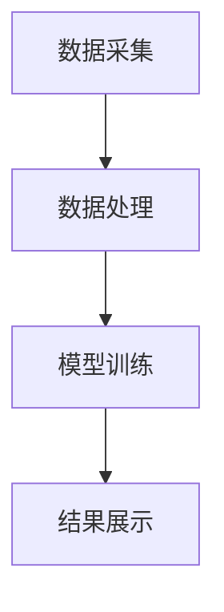

                 


# 特价股票投资中的卫星大数据分析与应用

> 关键词：卫星大数据、股票投资、特价股票、数据分析、机器学习、系统架构

> 摘要：本文深入探讨了卫星大数据在特价股票投资中的应用，从背景介绍到算法原理，再到系统架构和项目实战，全面分析了卫星大数据如何助力投资者在股票市场中获取超额收益。通过详细的技术分析和案例研究，本文为读者提供了从理论到实践的完整指南。

---

## 第1章: 特价股票投资概述

### 1.1 特价股票的定义与特点

#### 1.1.1 特价股票的定义
特价股票是指在股票市场中，由于某种原因，其价格被市场低估，具有较大的上涨潜力的股票。这类股票通常具有较高的安全边际，吸引价值投资者的关注。

#### 1.1.2 特价股票的特点
- **低估值**：市盈率、市净率等估值指标显著低于行业平均水平。
- **高潜力**：公司基本面良好，行业前景广阔，具备较大的增长空间。
- **市场关注度低**：通常被市场忽视，交易量较小。

#### 1.1.3 特价股票的投资价值
- **潜在收益高**：低估的股票价格上涨空间较大。
- **风险较低**：相对于高估值股票，特价股票的投资风险较小。
- **长期收益稳定**：适合长期价值投资。

### 1.2 特价股票投资的基本原理

#### 1.2.1 股票市场的基本运作机制
股票市场是企业融资和投资者投资的重要场所，股票价格受市场供需、公司基本面、宏观经济环境等多种因素影响。

#### 1.2.2 特价股票的市场定位
特价股票通常处于市场低估状态，投资者需要通过基本面分析和市场研究来识别这类股票。

#### 1.2.3 特价股票投资的策略选择
- **价值投资**：寻找被市场低估的股票，长期持有，等待价值回归。
- **技术分析**：通过技术指标筛选潜在的低估股票。
- **组合投资**：分散投资，降低风险。

### 1.3 特价股票投资的现状与挑战

#### 1.3.1 特价股票投资的现状
- **市场波动大**：股票价格受多种因素影响，投资风险较高。
- **信息不对称**：投资者获取信息的能力有限，影响投资决策。
- **竞争激烈**：市场参与者众多，优质特价股票稀缺。

#### 1.3.2 特价股票投资的主要挑战
- **市场波动**：股票价格短期波动可能掩盖长期价值。
- **信息处理**：海量数据中筛选有用信息的难度较大。
- **模型优化**：投资模型需要不断优化以适应市场变化。

#### 1.3.3 卫星大数据在特价股票投资中的应用前景
卫星大数据通过提供地理、气象、经济等多维度数据，为投资者提供了新的分析工具，帮助识别潜在的特价股票。

---

## 第2章: 卫星大数据的基本概念与技术

### 2.1 卫星大数据的定义与特点

#### 2.1.1 卫星大数据的定义
卫星大数据是指通过卫星遥感技术获取的海量地理、气象、环境等数据，具有数据量大、覆盖范围广、更新频率高的特点。

#### 2.1.2 卫星大数据的核心特征
- **数据量大**：卫星每天获取的地球表面数据量巨大。
- **数据类型多样**：包括图像数据、气象数据、地理信息等。
- **实时性高**：卫星数据能够实时反映地球表面的变化。

#### 2.1.3 卫星大数据与其他数据类型的区别
| 数据类型 | 数据来源 | 数据特点 | 应用领域 |
|----------|----------|----------|----------|
| 卫星数据 | 卫星遥感 | 实时性强、覆盖广 | 气象、地理、环境监测 |
| 金融数据 | 交易系统 | 实时性高、高频 | 金融分析、投资决策 |
| 文本数据 | 新闻、社交媒体 | 非结构化、信息丰富 | 情感分析、市场情绪监测 |

### 2.2 卫星大数据的主要来源

#### 2.2.1 卫星遥感数据
卫星遥感数据包括光学图像、雷达图像等，用于监测地球表面的变化，如土地利用、自然灾害等。

#### 2.2.2 地面传感器数据
地面传感器数据包括气温、湿度、风速等气象数据，为卫星数据分析提供补充信息。

#### 2.2.3 其他相关数据源
包括社交媒体数据、新闻数据、经济指标等，为投资决策提供多维度支持。

### 2.3 卫星大数据的处理与分析技术

#### 2.3.1 数据预处理技术
- **数据清洗**：去除噪声数据，确保数据质量。
- **数据标准化**：统一数据格式，便于后续分析。
- **数据融合**：将多源数据进行整合，提取有价值的信息。

#### 2.3.2 数据清洗与标准化
数据清洗是卫星大数据处理的重要步骤，包括去除重复数据、填补缺失值、异常值处理等。

#### 2.3.3 数据融合与集成
通过数据融合技术，将多源数据进行整合，提取更高层次的信息，如将卫星图像与经济指标相结合，分析区域经济发展对股票市场的影响。

---

## 第3章: 卫星大数据分析的算法原理

### 3.1 数据预处理与特征提取

#### 3.1.1 数据清洗流程
1. **去除噪声数据**：利用滤波算法去除图像中的噪声。
2. **填补缺失值**：使用插值方法填补缺失数据。
3. **标准化处理**：将数据标准化到统一的范围。

#### 3.1.2 特征提取方法
- **主成分分析（PCA）**：通过线性变换提取数据的主要特征。
- **图像特征提取**：利用卷积神经网络（CNN）提取图像特征。

#### 3.1.3 数据降维技术
- **主成分分析（PCA）**：降低数据维度，减少计算复杂度。
- **t-SNE**：用于数据可视化，帮助识别数据分布。

### 3.2 机器学习模型的构建与训练

#### 3.2.1 线性回归模型
线性回归模型用于预测股票价格，假设股票价格与某些特征变量呈线性关系。

公式：
$$ y = \beta_0 + \beta_1 x_1 + \beta_2 x_2 + ... + \beta_n x_n + \epsilon $$

其中，$y$ 是目标变量（股票价格），$x_i$ 是特征变量，$\beta_i$ 是回归系数，$\epsilon$ 是误差项。

#### 3.2.2 支持向量机（SVM）
SVM 用于分类问题，可以将股票分为高价和低价两类。

#### 3.2.3 神经网络模型
神经网络模型用于复杂非线性关系的建模，适合处理高维数据。

### 3.3 模型评估与优化

#### 3.3.1 模型评估指标
| 指标名称 | 定义 | 适用场景 |
|----------|------|----------|
| 准确率 | 正确预测的比例 | 分类问题 |
| 没有贝叶斯 | 预测值与真实值的差异 | 回归问题 |
| F1分数 | 调和平均数，平衡精确率和召回率 | 分类问题 |

#### 3.3.2 超参数优化
通过网格搜索（Grid Search）或随机搜索（Random Search）优化模型参数，提高模型性能。

#### 3.3.3 模型部署与应用
将训练好的模型部署到生产环境，实时处理卫星数据，提供投资建议。

---

## 第4章: 卫星大数据在股票投资中的应用

### 4.1 卫星大数据与股票市场的关联性

#### 4.1.1 卫星数据对市场情绪的影响
卫星图像可以反映经济活动的变化，如交通流量、工业区活动等，间接影响市场情绪。

#### 4.1.2 卫星数据对行业趋势的预测
通过分析卫星图像，可以预测某些行业的景气周期，如房地产、制造业等。

#### 4.1.3 卫星数据对个股表现的影响
卫星数据可以帮助分析公司所在区域的经济活动，预测公司业绩，进而影响股票价格。

### 4.2 卫星大数据在特价股票投资中的具体应用

#### 4.2.1 特价股票筛选与识别
利用卫星大数据分析，筛选出那些被市场低估的公司，识别潜在的特价股票。

#### 4.2.2 特价股票价格预测
通过卫星大数据和机器学习模型，预测股票价格走势，帮助投资者制定交易策略。

#### 4.2.3 特价股票风险评估
利用卫星大数据分析，评估投资风险，制定风险管理策略。

### 4.3 卫星大数据分析的案例研究

#### 4.3.1 某行业特价股票的分析案例
以某行业为例，分析卫星大数据如何帮助识别特价股票，预测其价格走势。

#### 4.3.2 某个股的卫星大数据分析案例
具体分析某只个股，展示卫星大数据在投资决策中的应用。

#### 4.3.3 案例分析总结与启示
总结案例经验，提出改进建议，为未来研究提供参考。

---

## 第5章: 系统架构与设计方案

### 5.1 系统架构设计

#### 5.1.1 系统功能模块划分
- **数据采集模块**：负责采集卫星数据和其他相关数据。
- **数据处理模块**：对数据进行清洗、融合和特征提取。
- **模型训练模块**：训练机器学习模型，进行预测和评估。
- **结果展示模块**：将分析结果以可视化形式展示给用户。

#### 5.1.2 系统数据流设计
数据从卫星传感器传送到数据库，经过处理模块清洗和融合后，输入模型训练模块，生成预测结果，最后通过展示模块呈现给用户。

#### 5.1.3 系统架构图（Mermaid）


### 5.2 系统接口设计

#### 5.2.1 数据接口设计
- **数据获取接口**：从数据库中获取处理后的数据。
- **数据上传接口**：将新采集的数据上传到数据库。

#### 5.2.2 模型接口设计
- **模型训练接口**：接收特征数据，训练模型。
- **模型预测接口**：输入新数据，返回预测结果。

#### 5.2.3 用户接口设计
- **数据查询接口**：用户查询历史数据。
- **结果展示接口**：展示分析结果，如图表、报告等。

### 5.3 系统交互流程设计

#### 5.3.1 数据采集与处理流程
1. 采集卫星数据。
2. 对数据进行清洗和融合。
3. 提取特征，准备训练数据。

#### 5.3.2 模型训练与部署流程
1. 选择合适的算法，训练模型。
2. 验证模型性能，优化参数。
3. 部署模型，实时处理数据。

#### 5.3.3 用户查询与结果展示流程
1. 用户提交查询请求。
2. 系统返回分析结果。
3. 用户查看结果，做出投资决策。

---

## 第6章: 项目实战与代码实现

### 6.1 环境搭建与数据获取

#### 6.1.1 开发环境安装
- 安装Python、Jupyter Notebook、Pandas、Scikit-learn等工具。

#### 6.1.2 数据获取
- 使用卫星API获取卫星数据。
- 下载历史股票数据，包括价格、成交量等。

### 6.2 系统核心实现源代码

#### 6.2.1 数据预处理代码
```python
import pandas as pd

# 读取数据
data = pd.read_csv('satellite_data.csv')

# 去除缺失值
data.dropna(inplace=True)

# 标准化处理
from sklearn.preprocessing import StandardScaler
scaler = StandardScaler()
scaled_data = scaler.fit_transform(data)
```

#### 6.2.2 模型训练代码
```python
from sklearn.svm import SVC
from sklearn.metrics import accuracy_score

# 训练SVM模型
model = SVC()
model.fit(scaled_data, labels)

# 模型评估
预测 = model.predict(test_data)
准确率 = accuracy_score(真实标签, 预测)
print('准确率:', 准确率)
```

### 6.3 代码应用解读与分析

#### 6.3.1 数据预处理
- 使用标准化方法处理卫星数据，确保模型训练效果。

#### 6.3.2 模型训练
- 使用SVM模型进行分类，预测股票价格走势。

### 6.4 实际案例分析

#### 6.4.1 数据获取与处理
以某行业为例，获取卫星数据和股票数据，进行数据清洗和特征提取。

#### 6.4.2 模型训练与评估
训练模型，评估准确率，优化参数。

#### 6.4.3 结果展示与解读
展示模型预测结果，分析其对投资决策的影响。

### 6.5 项目小结

#### 6.5.1 项目总结
总结项目实施过程，分析取得的成果和存在的问题。

#### 6.5.2 经验与教训
分享项目中的经验教训，为未来研究提供参考。

#### 6.5.3 未来展望
展望卫星大数据在股票投资中的未来发展，提出改进建议。

---

## 第7章: 最佳实践与小结

### 7.1 最佳实践 tips

#### 7.1.1 数据处理建议
- 数据清洗是关键，确保数据质量。
- 数据融合需谨慎，避免信息丢失。

#### 7.1.2 模型选择建议
- 根据数据特点选择合适的算法。
- 定期优化模型，适应市场变化。

#### 7.1.3 系统设计建议
- 模块化设计便于维护和扩展。
- 系统架构需考虑可扩展性和可维护性。

### 7.2 小结

#### 7.2.1 核心内容回顾
回顾全文，总结卫星大数据在特价股票投资中的应用。

#### 7.2.2 未来研究方向
提出未来研究方向，如更复杂的算法、多模态数据融合等。

### 7.3 注意事项

#### 7.3.1 数据隐私与安全
注意数据隐私，确保数据处理符合相关法律法规。

#### 7.3.2 模型风险控制
建立风险控制机制，避免模型过度拟合。

#### 7.3.3 技术更新与创新
关注技术发展，及时更新分析工具和方法。

### 7.4 拓展阅读

#### 7.4.1 推荐书籍
- 《大数据时代》
- 《股票技术分析》

#### 7.4.2 推荐博客与网站
- 国内外技术博客
- 数据分析论坛

---

## 作者：AI天才研究院/AI Genius Institute & 禅与计算机程序设计艺术 /Zen And The Art of Computer Programming

