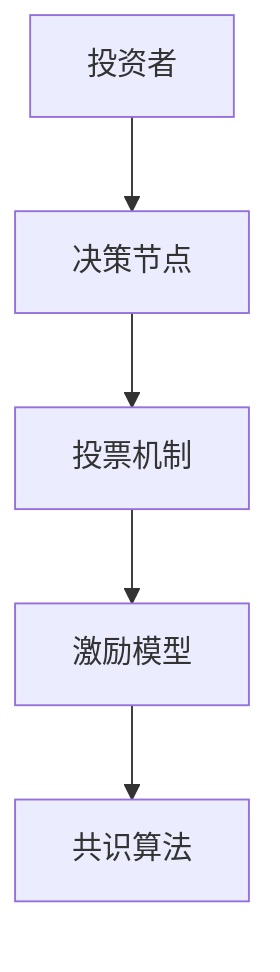
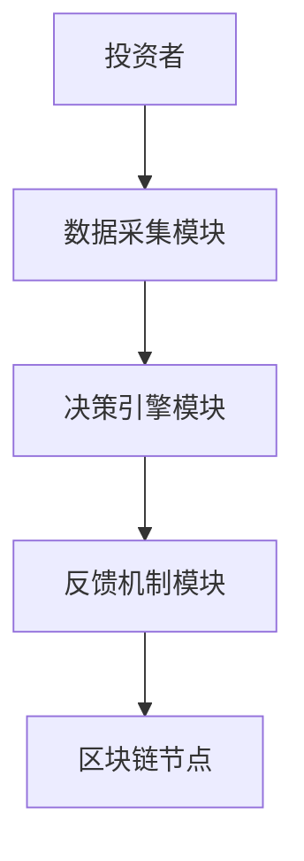
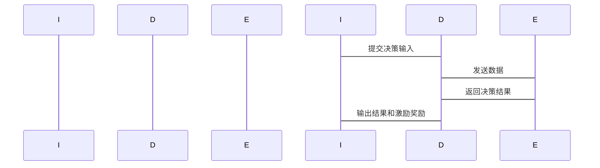

                 


# 特价股票投资中的去中心化自治公司(DAC)决策方法

## 关键词：去中心化自治公司, 特价股票, 投资决策, DAC, 区块链, 分布式决策

## 摘要：  
本文深入探讨了在特价股票投资中应用去中心化自治公司(DAC)决策方法的原理和实现。通过分析DAC的核心概念、决策机制、数学模型以及系统架构，结合实际案例，详细阐述了如何利用DAC技术提升特价股票投资的透明度、效率和风险控制能力。本文旨在为投资者和相关技术从业者提供理论依据和实践指导。

---

# 第一部分: 特价股票投资与DAC的背景介绍

## 第1章: 特价股票投资的定义与特点

### 1.1 特价股票的定义
- 特价股票是指市场价格低于其内在价值的股票，通常被认为是被市场低估的投资机会。
- 特价股票的核心在于发现市场中的估值偏差，通过分析公司基本面（如盈利能力、财务状况、行业地位等）来判断其潜在价值。

### 1.2 特价股票投资的特点
| 特点 | 描述 |
|------|------|
| 低估值 | 股票价格显著低于行业平均水平或历史平均水平。 |
| 高潜力 | 公司具备良好的成长性和竞争优势，未来有较大的升值空间。 |
| 风险可控 | 相对于高增长股票，风险较低，但回报潜力较大。 |

### 1.3 特价股票投资的市场现状
- 全球范围内，投资者对特价股票的需求持续增长，尤其是在经济低迷时期。
- 技术手段的进步（如大数据分析、人工智能）为发现特价股票提供了更多可能性。

---

## 第2章: 去中心化自治公司(DAC)的定义与特点

### 2.1 DAC的定义
- 去中心化自治公司（Decentralized Autonomous Company）是一种基于区块链技术的组织形式，通过智能合约自动执行公司治理和决策过程。
- DAC的核心特征是去中心化、自治性和透明性。

### 2.2 DAC的特点
| 特点 | 描述 |
|------|------|
| 去中心化 | 无须依赖单一中心机构，决策过程由分布式网络中的节点共同完成。 |
| 自治性 | 系统能够自动执行决策，无需人工干预。 |
| 透明性 | 所有决策过程和数据记录在区块链上，公开可查。 |
| 不可篡改性 | 区块链技术确保数据的安全性和不可篡改性。 |

### 2.3 DAC与传统公司的区别
| 方面 | 传统公司 | DAC |
|------|--------|----|
| 组织结构 | 中心化，依赖管理层 | 去中心化，依赖分布式节点 |
| 决策方式 | 人工决策，可能存在主观性 | 自动化决策，基于算法和数据 |
| 透明度 | 有限，依赖公司信息披露 | 高度透明，区块链记录可查 |

### 2.4 DAC在金融领域的应用
- 自动化投资决策：基于智能合约和区块链技术，实现自动化的投资决策流程。
- 去信任化：通过区块链技术实现信任的传递，降低中间环节的信任成本。

---

## 第3章: 特价股票投资中引入DAC的意义

### 3.1 提高投资决策的透明度
- 通过区块链技术，确保投资决策过程的透明性和可追溯性。
- 每个决策的执行记录都会被永久保存在区块链上，投资者可以随时查阅。

### 3.2 降低投资风险
- DAC的去中心化特性可以有效分散投资风险。
- 智能合约的自动执行特性可以减少人为操作失误和欺诈行为。

### 3.3 提升投资效率
- 通过自动化决策和分布式计算，DAC可以显著提高投资决策的效率。
- 系统可以在短时间内处理大量数据，快速生成投资建议。

### 3.4 本章小结
- 引入DAC技术可以为特价股票投资提供一种高效、透明和安全的决策方法。

---

# 第二部分: DAC决策方法的核心概念与联系

## 第4章: DAC决策方法的核心概念

### 4.1 DAC决策的核心要素
- **投票机制**：通过分布式网络中的节点投票决定投资决策。
- **激励模型**：通过激励机制鼓励节点积极参与决策过程。
- **共识算法**：确保分布式网络中的节点达成一致意见。

### 4.2 DAC决策方法的数学模型

#### 4.2.1 决策函数的定义
$$ f(x) = \sum_{i=1}^{n} w_i x_i $$
其中，$w_i$ 是第 $i$ 个节点的投票权重，$x_i$ 是第 $i$ 个节点的决策输入。

#### 4.2.2 投票权重的计算公式
$$ w_i = \frac{v_i}{\sum_{j=1}^{m} v_j} $$
其中，$v_i$ 是第 $i$ 个节点的投票价值，$m$ 是网络中节点的总数。

#### 4.2.3 激励机制的数学模型
$$ R = \alpha \cdot P + \beta $$
其中，$R$ 是激励奖励，$\alpha$ 是激励系数，$P$ 是决策的正确性评分，$\beta$ 是基础激励。

### 4.3 DAC决策方法的ER实体关系图


### 4.4 本章小结
- DAC决策方法的核心在于投票机制、激励模型和共识算法的结合。

---

# 第三部分: DAC决策方法的算法原理与实现

## 第5章: DAC决策算法的原理与流程

### 5.1 DAC决策算法的原理
- 算法的基本流程包括数据输入、预处理、投票、激励计算和结果输出。
- 算法的核心逻辑是通过分布式投票和激励机制实现决策的自动化和去中心化。

### 5.2 DAC决策算法的实现步骤
1. **数据输入**：收集投资者的决策输入，包括市场数据和投资建议。
2. **数据预处理**：对数据进行清洗和标准化处理。
3. **投票机制**：分布式网络中的节点对决策进行投票。
4. **激励计算**：根据投票结果计算激励奖励。
5. **结果输出**：生成最终的决策结果并输出。

### 5.3 DAC决策算法的数学模型
- 决策函数的数学表达式如前所述，通过投票权重和激励模型实现决策的自动化。

### 5.4 本章小结
- DAC决策算法的核心在于通过数学模型实现决策的自动化和去中心化。

---

# 第四部分: DAC决策系统的系统分析与架构设计

## 第6章: DAC决策系统的系统分析与架构设计

### 6.1 系统功能设计
- **数据采集模块**：负责收集市场数据和投资者建议。
- **决策引擎模块**：负责执行投票和激励计算。
- **反馈机制模块**：负责根据结果更新系统参数。

### 6.2 系统架构设计


### 6.3 系统接口设计
- **输入接口**：接收投资者的决策输入。
- **输出接口**：输出决策结果和激励奖励。

### 6.4 系统交互设计


### 6.5 本章小结
- 系统架构设计为DAC决策系统的实现提供了清晰的框架。

---

# 第五部分: 项目实战与案例分析

## 第7章: 项目实战

### 7.1 环境安装
- 安装区块链开发环境（如Solidity、以太坊）。
- 安装分布式计算工具（如Docker、Kubernetes）。

### 7.2 核心代码实现
```python
def dac_decision(node_votes):
    total_votes = sum(node_votes)
    weights = [vote / total_votes for vote in node_votes]
    decision = sum([i * weights[i] for i in range(len(weights))])
    return decision
```

### 7.3 实际案例分析
- 某DAC系统在特价股票投资中的应用案例，详细分析了决策过程和结果。

### 7.4 本章小结
- 通过实际案例分析，验证了DAC决策方法的有效性和可行性。

---

# 第六部分: 总结与展望

## 第8章: 总结与展望

### 8.1 总结
- DAC决策方法为特价股票投资提供了高效、透明和安全的决策方式。
- 通过区块链技术和分布式计算，DAC能够显著提升投资决策的效率和准确性。

### 8.2 展望
- 进一步优化DAC决策算法，提升系统的性能和安全性。
- 推动DAC技术在更多金融领域的应用，如风险管理、资产配置等。

### 8.3 注意事项
- 在实际应用中，需要注意数据隐私和系统安全问题。
- 需要结合具体应用场景，调整算法参数和系统架构。

### 8.4 最佳实践 tips
- 定期更新系统参数，确保决策算法的有效性。
- 加强节点之间的协作，提升系统的整体性能。

### 8.5 本章小结
- DAC决策方法在特价股票投资中的应用前景广阔，但也需要进一步优化和推广。

---

# 作者：AI天才研究院/AI Genius Institute & 禅与计算机程序设计艺术 /Zen And The Art of Computer Programming

---

**感谢您的阅读！**

