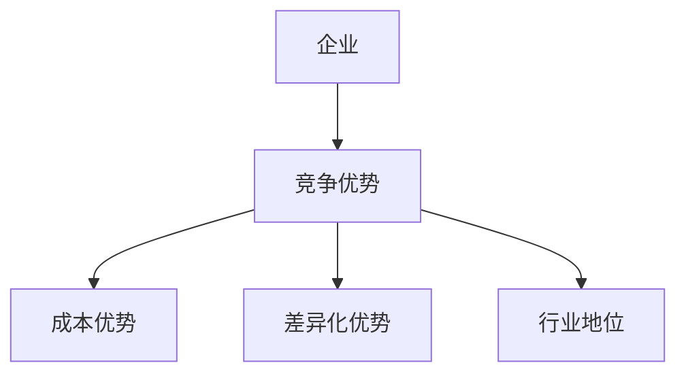
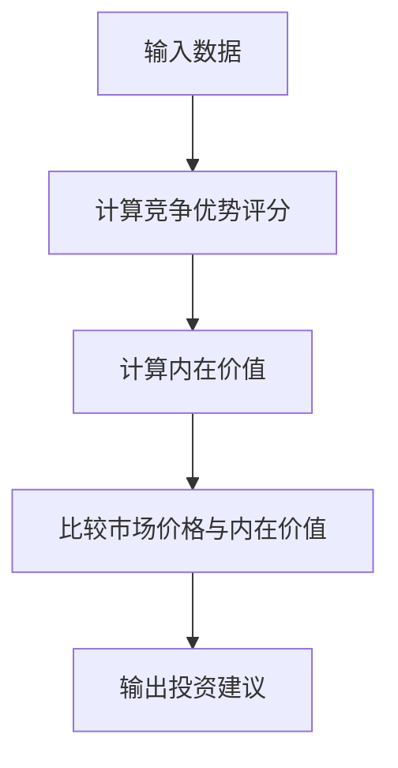
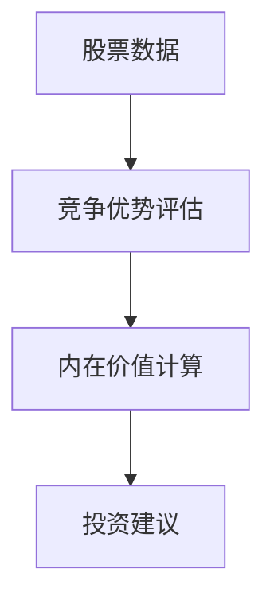
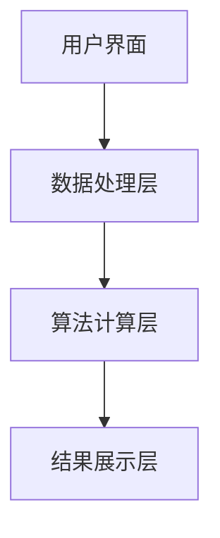
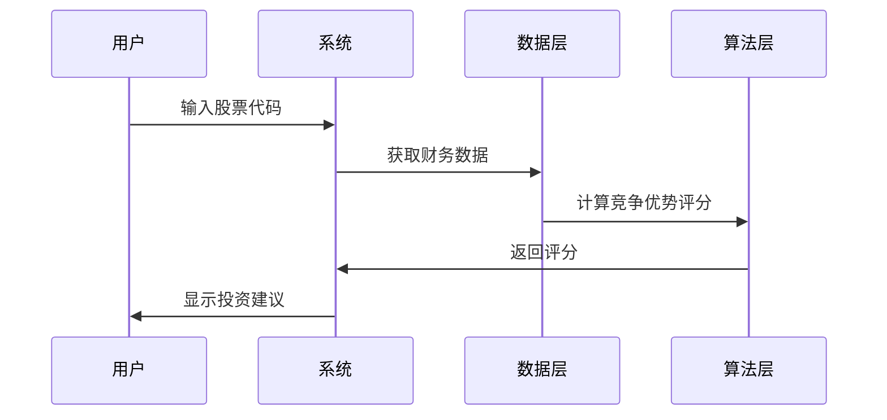

                 


# 特价股票投资中的可持续竞争优势模型应用

> **关键词**：特价股票，可持续竞争优势，投资模型，算法设计，系统架构，项目实战

> **摘要**：本文深入探讨了可持续竞争优势模型在特价股票投资中的应用。通过分析特价股票的特点，结合可持续竞争优势模型的核心要素，详细讲解了该模型的算法原理、系统设计及实际项目中的应用。文章从理论到实践，层层递进，为投资者提供了一套科学的投资决策工具。

---

## 第1章: 特价股票与可持续竞争优势模型的背景

### 1.1 特价股票的基本概念

#### 1.1.1 特价股票的定义
特价股票是指市场价格低于其内在价值的股票。这种股票通常因为市场短期波动或公司暂时困境而被低估，但具备长期增长潜力。

#### 1.1.2 特价股票的投资价值
- 特价股票通常具有较高的安全边际，即市场价格远低于内在价值。
- 投资者可以通过长期持有分享企业成长的成果。

#### 1.1.3 特价股票与普通股票的区别
| 特性 | 特价股票 | 普通股票 |
|------|----------|----------|
| 价格 | 低于内在价值 | 接近或高于内在价值 |
| 投资风险 | 较低（安全边际高） | 较高（市场波动大） |
| 投资回报 | 长期回报潜力大 | 取决于市场波动 |

---

### 1.2 可持续竞争优势模型的定义

#### 1.2.1 可持续竞争优势的定义
可持续竞争优势是指企业在长期的竞争中，能够持续保持的成本优势或差异化优势。

#### 1.2.2 可持续竞争优势的核心要素
- 成本优势：企业能够以低于竞争对手的成本提供产品或服务。
- 差异化优势：企业通过独特的品牌、技术或服务吸引客户。
- 行业地位：企业在行业中的领先地位和影响力。

#### 1.2.3 可持续竞争优势与企业长期价值的关系
可持续竞争优势是企业长期价值的核心驱动因素。企业通过保持竞争优势，能够在市场中获得更高的市场份额和利润率。

---

### 1.3 特价股票与可持续竞争优势模型的结合

#### 1.3.1 特价股票投资的核心问题
- 如何识别具有可持续竞争优势的公司？
- 如何评估公司的竞争优势是否可持续？

#### 1.3.2 可持续竞争优势模型在特价股票投资中的作用
- 通过模型筛选出具有可持续竞争优势的公司。
- 评估公司竞争优势的强弱，帮助投资者做出决策。

---

## 第2章: 可持续竞争优势模型的核心概念与联系

### 2.1 可持续竞争优势模型的原理

#### 2.1.1 模型的基本原理
模型通过分析企业的财务指标、市场地位、竞争优势等因素，评估企业的可持续竞争优势。

#### 2.1.2 模型的核心假设
- 企业的竞争优势是其长期价值的核心驱动因素。
- 市场价格与内在价值之间的差异为投资机会。

#### 2.1.3 模型的适用范围
适用于对具有可持续竞争优势的企业进行投资决策。

---

### 2.2 模型的核心要素与属性特征对比

#### 2.2.1 核心要素的定义与属性
| 要素 | 定义 | 属性 |
|------|------|------|
| 成本优势 | 以更低的成本提供产品或服务 | 成本低、效率高 |
| 差异化优势 | 提供独特的产品或服务 | 独特、难以模仿 |
| 行业地位 | 在行业中的领先地位 | 市场份额高、品牌强 |

#### 2.2.2 模型要素的对比分析
- 成本优势：适用于价格敏感的市场。
- 差异化优势：适用于高端市场。
- 行业地位：适用于龙头企业。

#### 2.2.3 模型要素的ER实体关系图



---

## 第3章: 可持续竞争优势模型的算法原理

### 3.1 算法原理概述

#### 3.1.1 算法的基本思路
- 收集企业的财务数据和市场数据。
- 评估企业的竞争优势要素。
- 计算企业的内在价值。
- 比较市场价格与内在价值，识别特价股票。

#### 3.1.2 算法的输入与输出
- 输入：企业财务数据、市场数据。
- 输出：竞争优势评分、内在价值、投资建议。

#### 3.1.3 算法的流程图



---

### 3.2 算法实现

#### 3.2.1 算法的Python源代码

```python
def calculate_intrinsic_value(company_data):
    # 计算竞争优势评分
    competitive_score = company_data['ROE'] * 0.4 + company_data['Market Share'] * 0.6
    # 计算内在价值
    intrinsic_value = competitive_score * 10 + company_data['Net Profit Margin'] * 5
    return intrinsic_value

# 示例数据
company_data = {
    'ROE': 0.2,
    'Market Share': 0.3,
    'Net Profit Margin': 0.15
}

intrinsic_value = calculate_intrinsic_value(company_data)
print(f"内在价值：{intrinsic_value}")
```

---

### 3.3 算法的数学模型与公式

#### 3.3.1 数学模型的构建
$$
\text{竞争优势评分} = \beta_1 \times \text{ROE} + \beta_2 \times \text{Market Share}
$$

#### 3.3.2 公式的详细推导
$$
\text{内在价值} = \text{竞争优势评分} \times k + \text{净利润率} \times m
$$

#### 3.3.3 公式的实际应用案例
$$
\text{竞争优势评分} = 0.4 \times 0.2 + 0.6 \times 0.3 = 0.22
$$
$$
\text{内在价值} = 0.22 \times 10 + 0.15 \times 5 = 2.75
$$

---

## 第4章: 可持续竞争优势模型的系统分析与架构设计

### 4.1 系统分析

#### 4.1.1 问题场景介绍
投资者需要一个工具，通过分析企业的财务和市场数据，识别具有可持续竞争优势的特价股票。

#### 4.1.2 项目介绍
开发一个基于可持续竞争优势模型的股票筛选系统。

#### 4.1.3 系统功能设计（领域模型类图）



---

### 4.2 系统架构设计

#### 4.2.1 系统架构图



#### 4.2.2 系统接口设计
- 输入接口：股票代码、财务数据。
- 输出接口：竞争优势评分、内在价值、投资建议。

#### 4.2.3 系统交互序列图



---

## 第5章: 可持续竞争优势模型的项目实战

### 5.1 环境安装与配置

#### 5.1.1 开发环境的选择
推荐使用Python 3.8及以上版本，安装Jupyter Notebook进行数据分析。

#### 5.1.2 依赖库的安装
```bash
pip install pandas numpy matplotlib
```

#### 5.1.3 环境配置步骤
- 安装必要的库。
- 下载股票数据。
- 配置数据处理脚本。

---

### 5.2 系统核心实现

#### 5.2.1 核心算法的实现
```python
def calculate_competitive_advantage(roe, market_share):
    return roe * 0.4 + market_share * 0.6

# 示例数据
roe = 0.2
market_share = 0.3
advantage_score = calculate_competitive_advantage(roe, market_share)
print(f"竞争优势评分：{advantage_score}")
```

#### 5.2.2 数据处理与分析
使用pandas进行数据清洗和分析，绘制市场趋势图。

#### 5.2.3 系统功能的实现
实现用户界面，展示投资建议。

---

### 5.3 实际案例分析

#### 5.3.1 案例背景介绍
某公司ROE为20%，市场份额为30%，净利润率为15%。

#### 5.3.2 案例数据的处理
计算竞争优势评分为0.22，内在价值为2.75。

#### 5.3.3 模型的应用与结果分析
市场价格低于内在价值，建议买入。

---

### 5.4 项目小结

#### 5.4.1 项目总结
通过模型识别具有可持续竞争优势的公司，实现有效的投资决策。

#### 5.4.2 项目中的关键点
- 数据的准确性。
- 模型的适用性。
- 系统的易用性。

---

## 第6章: 可持续竞争优势模型的最佳实践与注意事项

### 6.1 最

---

作者：AI天才研究院/AI Genius Institute & 禅与计算机程序设计艺术 /Zen And The Art of Computer Programming

