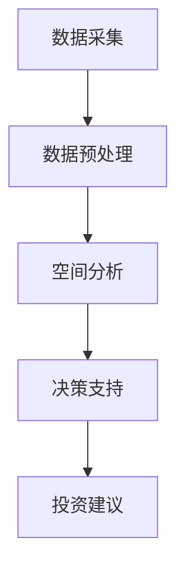
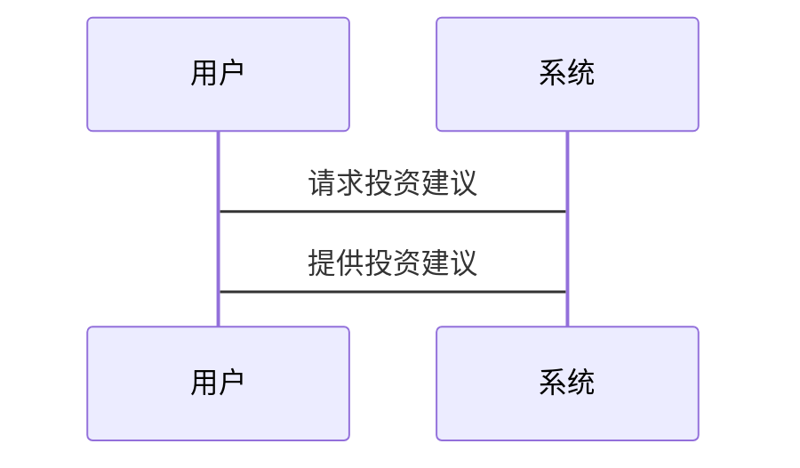

                 


# 特价股票投资中的地理信息系统分析与应用

> 关键词：特价股票、地理信息系统、空间分析、股票投资、数据可视化

> 摘要：本文探讨了地理信息系统（GIS）在特价股票投资中的应用，通过分析地理空间数据，揭示股票投资中的地理分布特征和空间关系。文章从地理信息系统的原理、算法、系统架构设计到项目实战，详细阐述了如何利用GIS技术提升股票投资的决策效率和准确性。

---

# 第一部分: 特价股票投资与地理信息系统基础

## 第1章: 特价股票投资概述

### 1.1 特价股票的定义与特点
#### 1.1.1 特价股票的定义
特价股票是指那些市场价格低于其内在价值的股票。这种股票通常被认为具有较高的投资潜力，因为它们可能被市场低估，未来有较大的上涨空间。

#### 1.1.2 特价股票的核心特点
- **低估值**：市盈率、市净率等指标低于行业平均水平。
- **高潜力**：具有较高的成长性和盈利能力。
- **市场关注度低**：通常被市场忽视，交易量较小。

#### 1.1.3 特价股票投资的潜在价值
通过发现被市场低估的股票，投资者可以在低价时买入，待其价值回归时卖出，获得超额收益。

### 1.2 地理信息系统的定义与特点
#### 1.2.1 地理信息系统的定义
地理信息系统（GIS）是一种以空间数据库为基础，利用计算机技术对地理数据进行采集、管理、分析、表达的系统。

#### 1.2.2 地理信息系统的核心功能
- **数据采集与管理**：对地理数据进行采集、存储和管理。
- **空间分析**：通过空间分析技术，揭示地理数据中的空间关系。
- **数据可视化**：将地理数据以图形化的方式展示。

#### 1.2.3 地理信息系统与股票投资的结合点
- **地理位置对股票价值的影响**：地理位置可能影响企业的供应链、市场需求、政策支持等因素。
- **区域经济分析**：通过地理信息系统分析不同区域的经济指标，为股票投资提供参考。

### 1.3 特价股票投资中的地理信息系统应用背景
#### 1.3.1 特价股票投资的现状与挑战
- **信息不对称**：投资者难以全面获取股票相关的地理信息。
- **数据复杂性**：地理数据具有多维性，处理难度较大。

#### 1.3.2 地理信息系统在金融领域的潜力
- **空间数据分析**：通过地理信息系统，可以发现地理空间中的投资机会。
- **风险评估**：通过地理信息系统分析区域风险，优化投资组合。

#### 1.3.3 特价股票投资与地理信息系统结合的必要性
- **提升投资效率**：通过地理信息系统分析，快速发现被低估的股票。
- **降低投资风险**：通过地理空间分析，识别区域风险，优化投资决策。

### 1.4 本章小结
本章介绍了特价股票和地理信息系统的定义与特点，并分析了地理信息系统在特价股票投资中的应用背景和潜力。

---

## 第2章: 地理信息系统的核心概念与原理

### 2.1 地理信息系统的数据模型
#### 2.1.1 空间数据模型的分类
- **矢量模型**：用于表示点、线、面等空间对象。
- **栅格模型**：用于表示连续的地理数据，如遥感影像。

#### 2.1.2 空间数据模型的构建方法
- **数据采集**：通过传感器、数据库等方式获取地理数据。
- **数据预处理**：对数据进行清洗、转换、标准化等处理。
- **数据存储**：将数据存储在数据库中，便于后续分析。

#### 2.1.3 空间数据模型的属性特征对比表格
| 特性 | 矢量模型 | 栅格模型 |
|------|----------|----------|
| 数据类型 | 点、线、面 | 栅格单元 |
| 数据精度 | 高 | 低 |
| 数据处理 | 适合空间分析 | 适合图像处理 |

### 2.2 地理信息系统中的空间分析方法
#### 2.2.1 空间插值方法
- **克里金插值**：一种基于统计学的空间插值方法，常用于预测地理数据中的缺失值。
- **样方法**：通过已知点的分布，预测未知点的值。

#### 2.2.2 空间聚类分析
- **K-means聚类**：将空间数据划分为若干簇，每个簇内的数据具有相似性。
- **密度聚类**：基于数据点的密度，自动识别数据簇。

#### 2.2.3 空间回归分析
- **线性回归**：通过地理数据中的自变量，预测因变量。
- **空间回归模型**：考虑空间依赖性，提高回归分析的准确性。

### 2.3 地理信息系统中的数据处理与空间分析
#### 2.3.1 数据清洗与预处理
- **数据清洗**：去除重复数据、缺失数据和异常值。
- **数据转换**：将数据转换为适合分析的形式，如标准化、归一化。

#### 2.3.2 空间数据的可视化方法
- **地图可视化**：将地理数据以地图形式展示。
- **图表可视化**：通过柱状图、折线图等展示地理数据的特征。

#### 2.3.3 空间分析的流程与工具
- **流程**：数据采集→数据处理→空间分析→结果可视化。
- **工具**：ArcGIS、QGIS、Google Earth等。

### 2.4 本章小结
本章介绍了地理信息系统的核心概念与原理，包括空间数据模型、空间分析方法和数据处理流程。

---

## 第3章: 特价股票投资中的地理信息系统应用

### 3.1 特价股票数据的地理信息系统分析
#### 3.1.1 特价股票数据的采集与整理
- **数据来源**：股票市场数据、公司财报、行业报告等。
- **数据整理**：将数据整理为适合地理信息系统分析的形式。

#### 3.1.2 特价股票数据的地理编码与空间化
- **地理编码**：将股票数据与地理位置关联，形成空间数据。
- **空间化**：将数据投影到地图上，进行空间分析。

#### 3.1.3 特价股票数据的空间分布特征分析
- **空间分布**：分析股票分布的空间特征，如聚集性、扩散性。
- **空间统计**：计算股票数据的空间统计指标，如均值、方差。

### 3.2 地理信息系统在股票投资中的空间分析方法
#### 3.2.1 空间聚类分析在股票投资中的应用
- **区域划分**：通过聚类分析，将股票市场划分为不同的区域。
- **区域特征分析**：分析每个区域的股票特征，发现投资机会。

#### 3.2.2 空间回归分析在股票投资中的应用
- **回归模型构建**：通过地理数据中的自变量，预测股票价格。
- **空间依赖性分析**：分析股票价格的空间依赖性，优化回归模型。

#### 3.2.3 空间插值在股票投资中的应用
- **数据预测**：通过插值方法，预测股票市场的未来趋势。
- **风险评估**：通过插值分析，评估股票投资的风险。

### 3.3 特价股票投资中的地理信息系统决策支持
#### 3.3.1 空间决策支持的定义与特点
- **定义**：通过地理信息系统，提供基于空间数据的决策支持。
- **特点**：直观、高效、准确。

#### 3.3.2 地理信息系统在股票投资中的决策支持流程
- **数据采集**：获取股票市场数据。
- **空间分析**：分析股票数据的空间特征。
- **决策支持**：根据分析结果，提供投资建议。

#### 3.3.3 空间决策支持在特价股票投资中的具体应用
- **发现投资机会**：通过空间分析，发现被低估的股票。
- **优化投资组合**：根据空间分布，优化股票组合。

### 3.4 本章小结
本章介绍了地理信息系统在特价股票投资中的应用，包括数据空间化、空间分析方法和决策支持流程。

---

## 第4章: 特价股票投资中的地理信息系统算法与数学模型

### 4.1 空间插值算法
#### 4.1.1 空间插值算法的分类
- **点插值**：用于预测未知点的值。
- **区域插值**：用于预测区域内的整体趋势。

#### 4.1.2 空间插值算法的数学模型
- **克里金插值**：
  $$ Z(x) = \beta^T X(x) + \epsilon $$
  其中，$\beta$ 是回归系数，$X(x)$ 是自变量矩阵，$\epsilon$ 是误差项。

#### 4.1.3 空间插值算法的实现与应用
- **实现步骤**：
  1. 收集数据。
  2. 构建回归模型。
  3. 进行插值预测。

### 4.2 空间聚类分析算法
#### 4.2.1 空间聚类算法的分类
- **密度聚类**：基于数据点的密度，自动识别数据簇。
- **K-means聚类**：将数据划分为K个簇。

#### 4.2.2 空间聚类算法的数学模型
- **密度聚类**：
  $$ D(x_i) = \sum_{j=1}^{n} \exp(-d(x_i, x_j)/h) $$
  其中，$d(x_i, x_j)$ 是点 $i$ 和点 $j$ 之间的距离，$h$ 是带宽参数。

#### 4.2.3 空间聚类算法的实现与应用
- **实现步骤**：
  1. 数据预处理。
  2. 选择聚类算法。
  3. 进行聚类分析。

### 4.3 空间回归分析模型
#### 4.3.1 空间回归模型的分类
- **线性回归模型**：用于预测股票价格。
- **空间回归模型**：考虑空间依赖性，提高回归精度。

#### 4.3.2 空间回归模型的数学公式
- **空间回归模型**：
  $$ Y = \beta_0 + \beta_1 X + \rho W Y + \epsilon $$
  其中，$\rho$ 是空间自相关系数，$W$ 是空间权重矩阵。

#### 4.3.3 空间回归模型的实现与应用
- **实现步骤**：
  1. 数据采集与预处理。
  2. 构建回归模型。
  3. 进行空间回归分析。

### 4.4 本章小结
本章介绍了特价股票投资中常用的地理信息系统算法，包括空间插值、聚类和回归分析，并给出了相应的数学模型。

---

## 第5章: 特价股票投资中的地理信息系统系统架构设计

### 5.1 系统功能设计
#### 5.1.1 系统功能模块划分
- **数据采集模块**：负责采集股票市场数据。
- **空间分析模块**：负责进行空间分析。
- **决策支持模块**：负责提供投资建议。

#### 5.1.2 系统功能流程图


### 5.2 系统架构设计
#### 5.2.1 系统架构设计图


### 5.3 系统接口设计
#### 5.3.1 系统接口设计
- **数据接口**：与股票数据源对接，获取实时数据。
- **分析接口**：调用空间分析工具，进行数据处理。

#### 5.3.2 系统交互设计


### 5.4 本章小结
本章介绍了地理信息系统在特价股票投资中的系统架构设计，包括功能模块划分、系统架构图和接口设计。

---

## 第6章: 特价股票投资中的地理信息系统项目实战

### 6.1 项目环境配置
#### 6.1.1 系统环境要求
- **操作系统**：Windows、Linux、MacOS。
- **开发工具**：Python、R、GIS软件（如ArcGIS）。

#### 6.1.2 数据来源
- **股票数据**：从股票市场获取。
- **地理数据**：从地理数据库获取。

### 6.2 系统核心实现源代码
#### 6.2.1 数据预处理代码
```python
import pandas as pd

# 读取股票数据
data = pd.read_csv('stock.csv')

# 删除缺失值
data.dropna(inplace=True)

# 标准化处理
from sklearn.preprocessing import StandardScaler
scaler = StandardScaler()
data[['price', 'volume']] = scaler.fit_transform(data[['price', 'volume']])
```

#### 6.2.2 空间分析代码
```python
import geopandas as gpd

# 加载地理数据
gdf = gpd.read_file('geo_data.shp')

# 进行空间分析
from sklearn.cluster import KMeans
clusters = KMeans(n_clusters=3).fit(gdf[['longitude', 'latitude']])
gdf['cluster'] = clusters.labels_
```

#### 6.2.3 决策支持代码
```python
import numpy as np

# 构建回归模型
X = gdf[['cluster', 'volume']]
y = gdf['price']

from sklearn.linear_model import LinearRegression
model = LinearRegression().fit(X, y)

# 进行预测
predictions = model.predict(X)
```

### 6.3 代码应用解读与分析
- **数据预处理**：通过标准化处理，提高空间分析的准确性。
- **空间分析**：通过K-means聚类，将股票市场划分为不同的区域。
- **决策支持**：通过回归模型，预测股票价格，提供投资建议。

### 6.4 实际案例分析和详细讲解剖析
- **案例分析**：通过某地区的股票数据，分析其空间分布特征。
- **详细讲解**：从数据预处理到空间分析，再到决策支持，详细解读整个过程。

### 6.5 项目小结
本章通过项目实战，详细讲解了地理信息系统在特价股票投资中的应用，包括环境配置、代码实现和案例分析。

---

## 第7章: 总结与展望

### 7.1 本章总结
本文详细探讨了地理信息系统在特价股票投资中的应用，从数据空间化、空间分析到决策支持，全面介绍了地理信息系统在股票投资中的潜力和价值。

### 7.2 未来展望
随着地理信息系统技术的不断发展，未来可以在以下方面进行进一步研究：
- **实时分析**：实现股票市场的实时空间分析。
- **多维分析**：结合时间维度，进行多维空间分析。
- **智能决策**：结合人工智能技术，提升地理信息系统在股票投资中的智能性。

---

## 作者：AI天才研究院/AI Genius Institute & 禅与计算机程序设计艺术/Zen And The Art of Computer Programming

