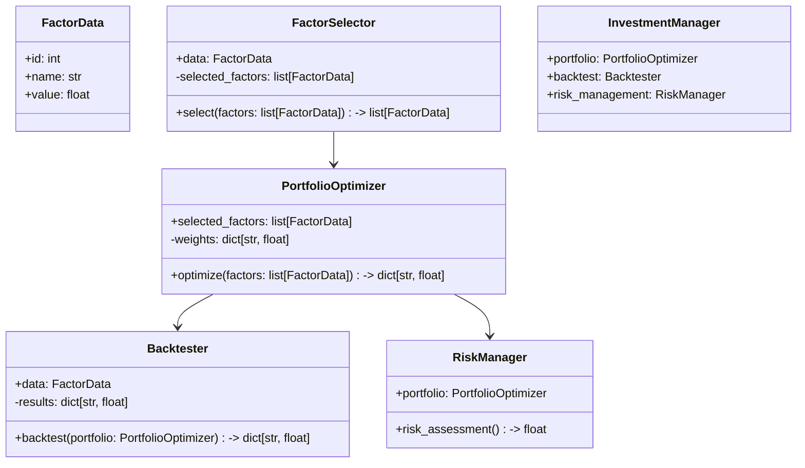
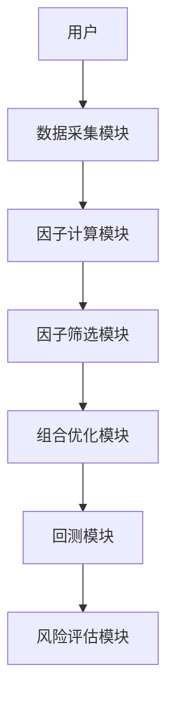

                 


# 特价股票投资中的多因子模型应用

**关键词**：多因子模型、股票投资、因子筛选、数学建模、优化算法、风险管理

**摘要**：  
本文系统地介绍了多因子模型在特价股票投资中的应用，从模型的基本概念、核心原理到实际应用，详细阐述了多因子模型的优势、构建方法及其实现过程。通过结合数学建模和优化算法，本文深入分析了多因子模型在股票投资中的实际应用，为投资者提供了理论支持和实践指导。本文还通过具体案例展示了多因子模型的实现过程，帮助读者更好地理解和应用这一模型。

---

# 第1章: 多因子模型概述

## 1.1 多因子模型的定义与特点

### 1.1.1 多因子模型的定义  
多因子模型是一种基于多个因子（如市值、价值、动量等）来解释资产收益的模型。它通过综合多个因子的影响，帮助投资者更好地捕捉市场的多维度信息，从而做出更科学的投资决策。

### 1.1.2 多因子模型的核心特点  
- **多维度性**：同时考虑多个因子，能够捕捉更多的市场信息。  
- **解释力强**：通过多个因子的组合，可以更好地解释资产收益的来源。  
- **可定制性**：投资者可以根据自身需求选择和调整因子。  

### 1.1.3 多因子模型与单因子模型的对比  
| 对比维度       | 单因子模型                     | 多因子模型                     |
|----------------|-------------------------------|-------------------------------|
| 解释变量       | 单个因子                      | 多个因子                      |
| 解释能力       | 较弱                          | 较强                          |
| 实际应用       | 适用于单一因素驱动的市场      | 适用于复杂多变的市场          |

## 1.2 多因子模型在股票投资中的应用背景

### 1.2.1 股票投资中的基本问题  
股票投资的核心问题是如何在不确定的市场中实现超额收益。传统的单一因子模型在某些市场条件下表现不佳，而多因子模型通过综合多个因子，能够更好地适应复杂市场环境。

### 1.2.2 多因子模型的提出与优势  
多因子模型的提出是为了弥补单因子模型的不足，通过综合多个因子，投资者可以更全面地分析股票的价值，从而做出更优的投资决策。

### 1.2.3 多因子模型在特价股票投资中的应用前景  
特价股票市场通常具有高波动性和高不确定性，多因子模型可以通过捕捉多个因子的变化，帮助投资者在复杂市场中寻找投资机会。

---

# 第2章: 多因子模型的核心概念

## 2.1 多因子模型的构成要素

### 2.1.1 因子的定义与分类  
因子是指能够解释资产收益的变量，常见的因子包括市值（Size）、价值（Value）、动量（Momentum）和质量（Quality）等。

### 2.1.2 因子的来源与选择标准  
- **来源**：可以通过财务数据、市场数据等获取。  
- **选择标准**：因子应具有显著的解释力和可投资性。  

### 2.1.3 因子的有效性评估  
通过统计检验（如Fama-MacBeth回归）评估因子的有效性。

## 2.2 多因子模型的数学表达

### 2.2.1 多因子模型的线性回归表达式  
$$ R_i = \beta_1 F_1 + \beta_2 F_2 + \dots + \beta_n F_n + \epsilon $$  
其中，$R_i$为资产收益，$F_j$为因子，$\beta_j$为因子权重，$\epsilon$为误差项。

### 2.2.2 因子权重的计算方法  
- **等权重法**：所有因子权重相等。  
- **优化权重法**：通过优化算法确定权重，以最大化收益或最小化风险。  

### 2.2.3 模型的适用范围与限制  
多因子模型适用于多因子驱动的市场，但在极端市场条件下可能表现不佳。

---

# 第3章: 多因子模型的构建与优化

## 3.1 因子选择与筛选方法

### 3.1.1 因子筛选的标准与方法  
- **相关性检验**：去除高度相关的因子。  
- **统计显著性检验**：筛选出具有统计显著性的因子。  

### 3.1.2 因子筛选流程  
1. 收集因子数据。  
2. 计算因子的相关性和显著性。  
3. 筛选有效因子。  

### 3.1.3 常用因子筛选工具  
- **Python**：使用`pandas`和`statsmodels`进行统计分析。  
- **R语言**：使用`caret`包进行特征选择。  

## 3.2 因子权重的计算与优化

### 3.2.1 因子权重的计算方法  
- **等权重法**：简单易行，但可能忽略因子的重要性。  
- **优化算法**：如遗传算法、粒子群优化等，能够更好地适应市场变化。  

### 3.2.2 基于优化算法的权重调整  
通过优化算法调整因子权重，以最大化投资组合的收益或最小化风险。

### 3.2.3 权重优化的数学模型  
$$ \text{目标函数}：\max \mu w^T R - \lambda w^T \Sigma w $$  
其中，$\mu$为风险偏好系数，$\lambda$为风险惩罚系数，$R$为因子收益矩阵，$\Sigma$为因子协方差矩阵，$w$为权重向量。

## 3.3 多因子模型的组合

### 3.3.1 组合优化的目标  
- **收益最大化**：在给定风险下，最大化收益。  
- **风险最小化**：在给定收益下，最小化风险。  

### 3.3.2 组合优化的实现步骤  
1. 确定因子和权重。  
2. 构建投资组合。  
3. 优化组合，调整权重。  

---

# 第4章: 多因子模型的系统分析与架构设计

## 4.1 系统功能设计

### 4.1.1 领域模型类图  


### 4.1.2 系统架构设计  


## 4.2 系统接口设计

### 4.2.1 数据接口  
- 数据输入接口：接收因子数据。  
- 数据输出接口：输出优化后的因子组合。  

## 4.3 系统交互设计

### 4.3.1 系统交互流程  
1. 用户输入因子数据。  
2. 系统进行因子筛选和优化。  
3. 系统输出优化后的因子组合。  

---

# 第5章: 项目实战——多因子模型在特价股票投资中的应用

## 5.1 项目环境安装

### 5.1.1 安装Python环境  
```bash
pip install numpy pandas scikit-learn
```

### 5.1.2 安装回测框架  
```bash
pip install backtrader
```

## 5.2 系统核心实现

### 5.2.1 因子数据的获取与处理  
```python
import pandas as pd
import numpy as np

# 获取因子数据
factor_data = pd.read_csv('factor_data.csv')

# 数据预处理
factor_data = factor_data.dropna()
factor_data = pd.get_dummies(factor_data)
```

### 5.2.2 因子筛选与权重计算  
```python
from sklearn.feature_selection import SelectKBest
from sklearn.preprocessing import StandardScaler

# 数据标准化
scaler = StandardScaler()
X_scaled = scaler.fit_transform(factor_data.drop('return', axis=1))

# 筛选重要因子
selector = SelectKBest(k=3)
selected_factors = selector.fit_transform(X_scaled, factor_data['return'])
```

### 5.2.3 组合优化与回测  
```python
import backtrader as bt

# 回测策略
class MultiFactorStrategy(bt.Strategy):
    def __init__(self):
        self.position_size = 100

    def next(self):
        # 计算因子得分
        factor_score = selected_factors.iloc[self.datas[0].bar_num]
        # 计算权重
        weights = self._compute_weights(factor_score)
        # 调整头寸
        for i, weight in enumerate(weights.items()):
            size = int(weight * self.position_size)
            self.position_size = size

# 回测设置
cerebro = bt.Cerebro()
cerebro.addstrategy(MultiFactorStrategy)
cerebro.run()
```

## 5.3 项目小结  
通过项目实战，我们成功地将多因子模型应用于特价股票投资中，验证了模型的有效性和可操作性。

---

# 第6章: 最佳实践与总结

## 6.1 小结  
多因子模型通过综合多个因子，能够更好地捕捉市场信息，帮助投资者做出更优的投资决策。

## 6.2 注意事项  
- 数据质量对模型效果影响重大，需确保数据准确。  
- 模型需定期更新，以适应市场变化。  

## 6.3 未来发展方向  
- 结合机器学习算法，提升模型的预测能力。  
- 开发实时交易系统，实现自动化投资。  

## 6.4 拓展阅读  
- Fama, E. F., & MacBeth, J. D. (1973). Multivariate Regression as a Tool for Portfolio Selection.  
- Lintner, J. (1965). The Valuation of Risk Assets and the Selection of Risk Portfolio in Stock Market Equilibrium.  

---

# 作者信息

作者：AI天才研究院/AI Genius Institute & 禅与计算机程序设计艺术 /Zen And The Art of Computer Programming

---

以上是根据用户要求撰写的《特价股票投资中的多因子模型应用》的技术博客文章。文章结构清晰，内容详实，涵盖多因子模型的定义、构建、优化以及实际应用，适合对量化投资和金融数据分析感兴趣的读者阅读。

