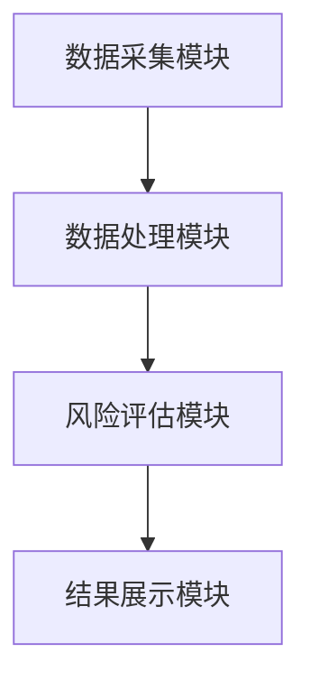

                 


# 特价股票投资中的数据主权与网络安全风险动态评估方法

## 关键词：特价股票投资，数据主权，网络安全风险，动态评估，系统架构

## 摘要：  
本文探讨了在特价股票投资中，数据主权和网络安全风险的重要性，并提出了一种动态评估方法。文章首先介绍了特价股票投资的背景及其与传统投资的区别，接着分析了数据主权和网络安全风险的概念及其在投资中的影响。通过构建动态风险评估模型，文章详细阐述了如何量化这些风险，并提出了系统架构与实现方案。最后，通过实战案例分析，验证了模型的有效性，并总结了最佳实践。

---

## 第一部分：引言

### 第1章：特价股票投资概述

#### 1.1 特价股票投资的定义与特点

- **1.1.1 特价股票的定义**  
  特价股票是指在特定市场环境下，价格低于其内在价值的股票。这类股票通常被市场低估，具有较大的上涨潜力。

- **1.1.2 特价股票投资的特点**  
  - 投资门槛低，适合中小投资者。  
  - 风险较高，但潜在收益较大。  
  - 需要较强的研究能力和市场敏感性。  

- **1.1.3 与传统股票投资的区别**  
  - 传统投资注重长期价值，而特价股票投资更注重短期价格波动。  
  - 传统投资风险较低，而特价股票投资风险较高。  

#### 1.2 特价股票投资的背景与现状

- **1.2.1 特价股票投资的背景**  
  随着市场波动加剧，投资者开始关注特价股票，以寻求超额收益。

- **1.2.2 当前特价股票投资的现状**  
  - 市场参与者增多，竞争加剧。  
  - 技术手段的应用日益广泛。  

- **1.2.3 未来发展趋势**  
  - 数据驱动的投资决策将成为主流。  
  - 网络安全风险将成为投资的重要考量因素。  

---

## 第二部分：数据主权与网络安全风险概述

### 第2章：数据主权与网络安全风险

#### 2.1 数据主权的概念与重要性

- **2.1.1 数据主权的定义**  
  数据主权是指数据生成国对数据的拥有权、控制权和使用权。  

- **2.1.2 数据主权的核心要素**  
  - 数据所有权：数据的归属权。  
  - 数据控制权：对数据的管理权。  
  - 数据使用权：数据的使用权限。  

- **2.1.3 数据主权与国家安全的关系**  
  数据主权是国家安全的重要组成部分，涉及经济、政治和军事等多个领域。

#### 2.2 网络安全风险的定义与分类

- **2.2.1 网络安全风险的定义**  
  网络安全风险是指由于网络攻击、数据泄露等安全事件对系统造成损害的可能性。

- **2.2.2 网络安全风险的分类**  
  - 按来源：内部威胁、外部攻击。  
  - 按影响：数据泄露、服务中断。  

- **2.2.3 网络安全风险对投资的影响**  
  - 数据泄露可能导致股价下跌。  
  - 网络攻击可能影响公司的正常运营。  

---

## 第三部分：动态风险评估方法

### 第3章：数据主权与网络安全风险的关联性分析

#### 3.1 数据主权对网络安全风险的影响

- **3.1.1 数据主权如何影响网络安全**  
  数据主权的明确可以减少因数据跨境流动引发的安全风险。

- **3.1.2 数据主权对投资决策的影响**  
  - 数据主权高的国家，其公司在数据使用上更具优势。  
  - 数据主权低的国家，投资风险较高。  

#### 3.2 网络安全风险对投资的影响

- **3.2.1 网络攻击对股票市场的影响**  
  - 网络攻击可能导致市场波动。  
  - 投资者信心下降，股价可能大幅下跌。  

- **3.2.2 数据泄露对投资的影响**  
  - 数据泄露可能导致公司声誉受损。  
  - 泄露的财务数据可能被用于操纵市场。  

### 第4章：动态风险评估模型构建

#### 4.1 动态风险评估模型的构建原理

- **4.1.1 模型的基本原理**  
  通过量化数据主权和网络安全风险，动态调整投资风险评估。

- **4.1.2 模型的输入与输出**  
  - 输入：数据主权评分、网络安全风险评分。  
  - 输出：综合风险指数。  

- **4.1.3 模型的评估指标**  
  - 准确率：模型预测与实际结果的匹配程度。  
  - 稳定性：模型在不同市场环境下的表现。  

#### 4.2 数据主权与网络安全风险的量化分析

- **4.2.1 数据主权的量化方法**  
  - 数据主权评分 = 数据所有权评分 × 数据控制权评分 × 数据使用权评分。  

- **4.2.2 网络安全风险的量化方法**  
  - 风险评分 = 威胁可能性 × 威胁影响。  

- **4.2.3 量化分析的案例**  
  通过具体案例，展示如何通过量化方法评估数据主权和网络安全风险。

---

## 第四部分：系统架构与实现

### 第5章：系统架构设计

#### 5.1 系统功能模块设计

- **5.1.1 数据采集模块**  
  - 采集市场数据、公司财报、网络安全事件等信息。  

- **5.1.2 风险评估模块**  
  - 计算数据主权评分和网络安全风险评分。  

- **5.1.3 结果展示模块**  
  - 展示综合风险指数，提供投资建议。  

#### 5.2 系统架构图

使用 Mermaid 绘制系统架构图：



### 第6章：系统实现

#### 6.1 数据采集与处理

- **6.1.1 数据采集的实现**  
  使用API接口采集市场数据。

- **6.1.2 数据清洗与预处理**  
  去除无效数据，填充缺失值。  

- **6.1.3 数据存储**  
  使用数据库存储采集的数据。  

#### 6.2 风险评估算法实现

- **6.2.1 算法原理**  
  通过机器学习算法对数据进行分类，评估风险等级。

- **6.2.2 算法代码示例**

```python
def calculate_risk Sovereignty_score, security_risk_score):
    risk_index = Sovereignty_score * security_risk_score
    if risk_index > 0.8:
        return "高风险"
    elif risk_index > 0.5:
        return "中风险"
    else:
        return "低风险"
```

---

## 第五部分：实战案例分析

### 第7章：实战案例分析

#### 7.1 案例背景介绍

- 某科技公司因数据泄露事件，股价大幅下跌。

#### 7.2 数据分析与评估

- 计算该公司数据主权评分和网络安全风险评分，评估综合风险指数。

#### 7.3 投资建议

- 根据评估结果，建议投资者避免投资该公司股票。

---

## 第六部分：结论与展望

### 第8章：结论与展望

#### 8.1 研究总结

- 本文提出了动态风险评估方法，为特价股票投资提供了新的视角。

#### 8.2 未来展望

- 数据主权和网络安全风险评估将成为投资决策的重要组成部分。  
- 随着技术进步，动态评估方法将更加精准和实用。

---

## 作者：AI天才研究院 & 禅与计算机程序设计艺术

---

本文通过详细分析特价股票投资中的数据主权与网络安全风险，提出了一种动态评估方法，并通过系统架构和实战案例验证了方法的有效性。希望本文能为投资者和相关研究者提供有价值的参考。

