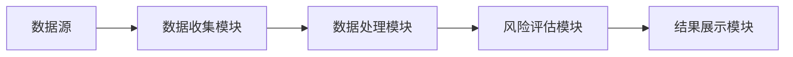
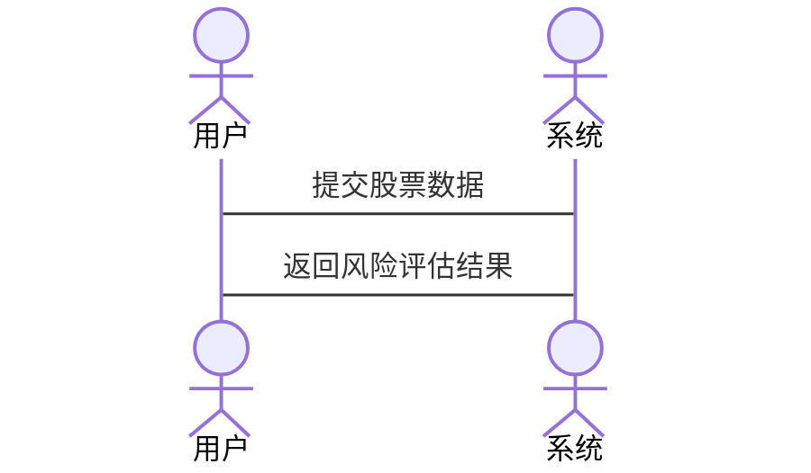

                 


# 特价股票投资中的数据隐私风险评估方法

## 关键词
- 特价股票投资
- 数据隐私风险
- 风险评估方法
- 数据分类
- 风险评分模型

## 摘要
在当前的金融投资领域，特价股票投资因其高收益潜力吸引了大量投资者，但随之而来的是数据隐私风险的增加。本文系统地探讨了特价股票投资中的数据隐私风险，分析了其评估的核心方法，并通过实际案例展示了如何构建风险评估模型，为投资者和相关机构提供有效的风险管理策略。

---

## 第1章: 特价股票投资与数据隐私风险概述

### 1.1 特价股票投资的基本概念
#### 1.1.1 特价股票的定义
特价股票是指价格低于市场公允价值的股票，通常被视为被低估的投资标的。投资者通过分析公司基本面、市场趋势和技术指标来寻找投资机会。

#### 1.1.2 特价股票投资的背景与现状
随着金融市场的发展，投资者对高收益低风险投资的需求增加，特价股票因其潜在的高回报受到广泛关注。然而，随之而来的是对数据隐私的需求增加。

#### 1.1.3 特价股票投资的核心要素
- **公司基本面**：包括财务状况、盈利能力等。
- **市场趋势**：宏观经济指标、行业趋势等。
- **技术分析**：K线图、均线等技术指标。

### 1.2 数据隐私风险的基本概念
#### 1.2.1 数据隐私的定义
数据隐私是指在收集、存储、处理和使用数据时，保护个人或机构的隐私信息不被未经授权的访问或泄露。

#### 1.2.2 数据隐私风险的来源
- **数据泄露**：黑客攻击、内部人员泄露。
- **数据滥用**：未经授权的数据使用。
- **技术漏洞**：系统漏洞导致的数据泄露。

#### 1.2.3 数据隐私风险的影响
- **经济损失**：数据泄露可能导致财务损失。
- **声誉损失**：泄露事件可能损害机构声誉。
- **法律责任**：违反数据保护法规可能导致法律处罚。

### 1.3 特价股票投资与数据隐私风险的关系
#### 1.3.1 特价股票投资中的数据使用场景
- **数据收集**：收集公司财务数据、市场数据等。
- **数据处理**：分析数据以评估投资价值。
- **数据共享**：与其他投资者或机构共享数据。

#### 1.3.2 数据隐私风险对投资决策的影响
- **信息不对称**：数据泄露可能导致信息不对称，影响投资决策。
- **信任问题**：隐私风险可能影响投资者对机构的信任。

#### 1.3.3 特价股票投资中的数据隐私风险特征
- **敏感性高**：涉及公司财务数据和投资策略。
- **传播速度快**：数据泄露可能迅速扩散。
- **影响范围广**：可能影响多个利益相关者。

---

## 第2章: 数据隐私风险评估的核心概念与联系

### 2.1 数据隐私风险评估的基本原理
#### 2.1.1 数据隐私风险评估的定义
数据隐私风险评估是指通过分析数据的敏感性、使用场景和潜在威胁，量化数据隐私风险的过程。

#### 2.1.2 数据隐私风险评估的核心要素
- **数据分类**：根据数据的敏感性和重要性进行分类。
- **风险模型**：基于数据分类和威胁分析构建风险模型。
- **风险评分**：根据模型计算出风险评分，确定风险等级。

#### 2.1.3 数据隐私风险评估的流程
1. 数据收集与分类
2. 威胁分析与风险建模
3. 风险评分与等级划分
4. 风险控制与优化

### 2.2 数据隐私风险评估的核心概念对比
#### 2.2.1 数据分类与隐私风险的关系
- **数据分类**：将数据分为公开、内部、机密等类别。
- **隐私风险**：数据分类越高，隐私风险越大。

| 数据分类 | 隐私风险 |
|----------|----------|
| 公开数据 | 低       |
| 内部数据 | 中       |
| 机密数据 | 高       |

#### 2.2.2 数据敏感性与隐私风险的关联
- **数据敏感性**：数据对机构的重要性和敏感程度。
- **隐私风险**：敏感性越高，隐私风险越大。

| 数据敏感性 | 隐私风险 |
|------------|----------|
| 低         | 低       |
| 中         | 中       |
| 高         | 高       |

#### 2.2.3 数据使用场景与隐私风险的匹配
- **使用场景**：数据在不同场景下的使用方式。
- **隐私风险**：根据场景调整隐私保护措施。

| 使用场景       | 隐私风险 |
|----------------|----------|
| 内部分析       | 中       |
| 数据共享       | 高       |
| 公开发布       | 低       |

### 2.3 数据隐私风险评估的ER实体关系图
```mermaid
erDiagram
    actor 投资者 {
        <to> stock_data : 持有
    }
    actor 数据提供方 {
        <to> stock_data : 提供
    }
    actor 数据处理方 {
        <to> stock_data : 处理
    }
    actor 监管机构 {
        <to> stock_data : 监管
    }
    stock_data {
        id : 整数
        data_type : 类型
        sensitivity_level : 整数
        usage_scenario : 文本
    }
```

---

## 第3章: 数据隐私风险评估的算法原理

### 3.1 数据隐私风险评估的算法概述
#### 3.1.1 数据分类算法
- **层次分类法**：根据数据的层次结构进行分类。
- **聚类算法**：根据数据特征进行聚类。

#### 3.1.2 数据敏感性评估算法
- **基于规则的评估**：根据预定义规则评估敏感性。
- **基于机器学习的评估**：使用机器学习模型预测敏感性。

#### 3.1.3 数据隐私风险评分算法
- **线性评分法**：根据多个因素线性加权评分。
- **非线性评分法**：使用复杂模型进行评分。

### 3.2 数据隐私风险评估的数学模型
#### 3.2.1 数据分类模型
$$P(class | data) = \frac{P(data | class) \cdot P(class)}{P(data)}$$

#### 3.2.2 数据敏感性评估模型
$$Sensitivity = \sum_{i=1}^{n} w_i \cdot f_i$$
其中，$w_i$是特征权重，$f_i$是特征值。

#### 3.2.3 数据隐私风险评分模型
$$Risk\_score = \alpha \cdot Sensitivity + \beta \cdot Threat$$
其中，$\alpha$和$\beta$是权重系数，$Sensitivity$是敏感性评分，$Threat$是威胁评分。

### 3.3 数据隐私风险评估的mermaid流程图
```mermaid
graph TD
    A[开始] -> B[数据收集]
    B -> C[数据分类]
    C -> D[威胁分析]
    D -> E[风险建模]
    E -> F[风险评分]
    F -> G[风险控制]
    G -> H[结束]
```

### 3.4 数据隐私风险评估的Python代码实现
```python
import pandas as pd
from sklearn.metrics import pairwise_distances

# 数据收集
data = pd.DataFrame({
    'stock_id': [1, 2, 3],
    'price': [100, 200, 300],
    'volume': [1000, 2000, 3000]
})

# 数据分类
def classify_data(row):
    if row['price'] < 100:
        return '低价'
    elif row['price'] < 200:
        return '中价'
    else:
        return '高价'

data['category'] = data.apply(classify_data, axis=1)

# 威胁分析
# 假设威胁评分基于数据分类
threat_scores = {
    '低价': 1,
    '中价': 2,
    '高价': 3
}

data['threat_score'] = data['category'].map(threat_scores)

# 风险评分
# 假设风险评分基于威胁评分和数据敏感性
data['risk_score'] = data['threat_score'] * data['volume'] / 1000
```

---

## 第4章: 数据隐私风险评估的系统架构设计

### 4.1 系统功能设计
- **数据收集模块**：收集股票数据和相关元数据。
- **数据处理模块**：对数据进行清洗、分类和特征提取。
- **风险评估模块**：基于模型计算风险评分。
- **结果展示模块**：可视化风险评估结果。

### 4.2 系统架构设计


### 4.3 系统接口设计
- **输入接口**：接收股票数据和元数据。
- **输出接口**：输出风险评估结果和建议。

### 4.4 系统交互流程


---

## 第5章: 项目实战

### 5.1 环境安装
- **Python**：安装Python 3.x。
- **库依赖**：安装pandas、scikit-learn等库。

### 5.2 核心代码实现
```python
import pandas as pd
from sklearn.cluster import KMeans

# 数据加载
data = pd.read_csv('stocks.csv')

# 数据预处理
data = data.dropna()

# 数据分类
kmeans = KMeans(n_clusters=3, random_state=42)
data['cluster'] = kmeans.fit_predict(data[['price', 'volume']])

# 风险评估
# 假设每个簇的风险评分不同
data['risk_score'] = data['cluster'].map({0: 1, 1: 2, 2: 3})
```

### 5.3 案例分析
假设我们有一个股票数据集，包括股票ID、价格和成交量。通过上述代码，我们可以将股票分为三个类别，并计算每个类别的风险评分。

---

## 第6章: 最佳实践与总结

### 6.1 最佳实践
- 定期进行数据隐私风险评估。
- 加强数据安全措施，如加密和访问控制。
- 培训员工提高数据隐私意识。

### 6.2 小结
本文详细探讨了特价股票投资中的数据隐私风险评估方法，从理论到实践，为投资者和机构提供了有效的风险管理策略。

### 6.3 注意事项
- 数据隐私风险评估是一个动态过程，需要定期更新。
- 在实际应用中，需要结合具体场景调整评估模型。

### 6.4 拓展阅读
- 《数据隐私保护技术》
- 《金融投资风险管理》

---

## 作者：AI天才研究院/AI Genius Institute & 禅与计算机程序设计艺术 /Zen And The Art of Computer Programming

