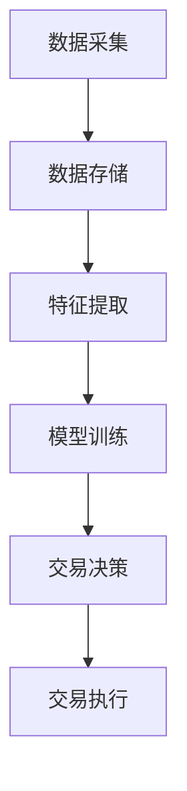
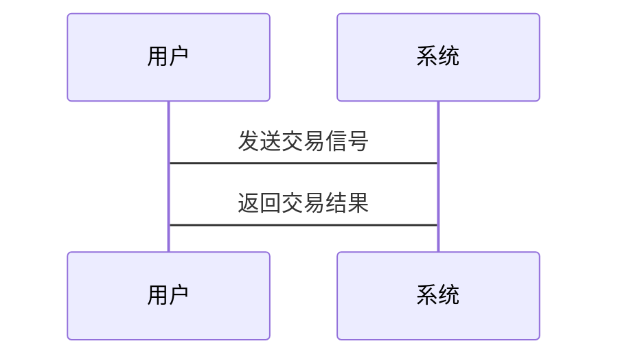

                 


# 特价股票投资中的深度强化学习模型构建与优化

> 关键词：特价股票投资，深度强化学习，模型构建，算法优化，股票交易系统

> 摘要：本文详细探讨了深度强化学习在特价股票投资中的应用，从基本概念、算法原理到系统架构设计，再到项目实战，全面解析如何利用深度强化学习构建高效的投资模型，优化投资策略，并实现稳健的收益。

---

# 第一部分: 背景介绍

## 第1章: 特价股票投资与深度强化学习概述

### 1.1 特价股票投资的定义与特点
- 1.1.1 特价股票的定义
  - 特价股票是指价格低于其内在价值的股票，通常具有较大的上涨潜力。
- 1.1.2 特价股票投资的核心要素
  - 市场分析、基本面分析、技术分析、风险管理。
- 1.1.3 特价股票投资的市场定位
  - 主要关注低估股票，适合长期投资策略。

### 1.2 深度强化学习的定义与特点
- 1.2.1 深度学习与强化学习的结合
  - 深度学习擅长处理非结构化数据，强化学习擅长决策优化。
- 1.2.2 深度强化学习的核心原理
  - 使用深度神经网络作为价值函数或策略函数，结合强化学习的奖励机制。
- 1.2.3 深度强化学习与传统机器学习的区别
  - 强化学习通过与环境互动获得奖励，而传统机器学习通过监督学习。

### 1.3 特价股票投资与深度强化学习的联系
- 1.3.1 特价股票投资中的数据特征
  - 历史价格、成交量、财务指标等。
- 1.3.2 深度强化学习在股票投资中的优势
  - 处理高维数据、动态决策、适应市场变化。
- 1.3.3 深度强化学习在股票投资中的应用场景
  - 股票筛选、交易策略优化、风险控制。

## 1.4 本章小结
- 本章介绍了特价股票投资的基本概念和深度强化学习的核心原理，为后续章节打下基础。

---

# 第二部分: 核心概念与算法原理

## 第2章: 深度强化学习的核心概念与原理

### 2.1 深度强化学习的基本原理
- 2.1.1 状态、动作、奖励的定义
  - 状态：市场环境（如价格、成交量）。
  - 动作：买入、卖出或持有。
  - 奖励：投资收益或损失。
- 2.1.2 Q-learning算法的基本原理
  - 使用Q表记录状态-动作对的期望奖励，通过经验更新Q值。

### 2.2 深度强化学习的核心算法
- 2.2.1 DQN算法的原理与实现
  - 使用两个神经网络，一个作为主网络，一个作为目标网络，通过经验回放和折扣因子优化。
- 2.2.2 A3C算法的原理与实现
  - 异步优势Actor-Critic算法，分布式训练，适用于多线程环境。
- 2.2.3 PPO算法的原理与实现
  - 基于策略梯度，通过限制策略更新幅度，保证收敛性。

### 2.3 深度强化学习与股票投资的结合
- 2.3.1 股票市场中的状态表示
  - 使用K线图、技术指标（如MACD、RSI）等。
- 2.3.2 动作空间的设计
  - 买入、卖出或持有三种动作。
- 2.3.3 奖励函数的定义
  - 基于收益、风险、交易成本等多因素设计。

## 2.4 本章小结
- 本章详细介绍了深度强化学习的核心算法及其在股票投资中的应用，为后续模型构建奠定基础。

---

# 第三部分: 数学模型与算法实现

## 第3章: 深度强化学习模型的数学模型与算法实现

### 3.1 Q-learning算法的数学模型
- 更新公式：
$$ Q(s, a) = (1-\alpha)Q(s, a) + \alpha(r + \gamma \max Q(s', a')) $$

### 3.2 DQN算法的数学模型
- 网络结构：
  - 输入层（市场数据）→ 隐藏层（神经网络）→ 输出层（Q值）。
- 损失函数：
$$ \mathcal{L} = \mathbb{E}[(r + \gamma Q(s', a') - Q(s, a))^2] $$

### 3.3 PPO算法的数学模型
- 损失函数：
$$ \mathcal{L} = -\mathbb{E}[\text{CLIP}(r_t - \hat{r}_t) \cdot \text{log} \pi_\theta(a_t|s_t)] $$

### 3.4 深度强化学习算法的实现步骤
- 环境与状态空间的定义。
- 动作空间与奖励函数的设计。
- 神经网络的构建与训练。

## 3.5 本章小结
- 本章通过数学模型和算法实现，详细解释了深度强化学习的核心机制。

---

# 第四部分: 系统架构设计

## 第4章: 深度强化学习模型的系统架构设计

### 4.1 股票交易系统的功能设计
- 数据采集模块：获取历史数据、实时数据。
- 模型训练模块：训练深度强化学习模型。
- 交易执行模块：根据模型决策执行交易。

### 4.2 系统架构图（Mermaid）


### 4.3 系统接口设计
- 数据接口：数据获取、数据预处理。
- 模型接口：接收状态，输出动作。
- 交易接口：执行买入、卖出或持有。

### 4.4 系统交互流程（Mermaid）


## 4.5 本章小结
- 本章通过系统架构设计，展示了如何将深度强化学习模型应用于股票交易系统。

---

# 第五部分: 项目实战

## 第5章: 深度强化学习模型的项目实战

### 5.1 环境安装与配置
- 安装Python、TensorFlow、Keras、numpy等库。

### 5.2 核心代码实现
```python
import numpy as np
import tensorflow as tf

# 定义DQN网络
class DQNetwork:
    def __init__(self, state_space, action_space):
        self.model = tf.keras.Sequential([
            tf.keras.layers.Dense(64, activation='relu'),
            tf.keras.layers.Dense(64, activation='relu'),
            tf.keras.layers.Dense(action_space)
        ])
        
    def call(self, state):
        return self.model(state)
    
# DQN算法实现
class DQN:
    def __init__(self, state_space, action_space):
        self.state_space = state_space
        self.action_space = action_space
        self.gamma = 0.99
        self.epsilon = 1.0
        self.epsilon_min = 0.01
        self.memory = []
        self.model = DQNetwork(state_space, action_space)
        self.target_model = DQNetwork(state_space, action_space)
    
    def remember(self, state, action, reward, next_state):
        self.memory.append((state, action, reward, next_state))
    
    def act(self, state):
        if np.random.random() < self.epsilon:
            return np.random.randint(self.action_space)
        q_values = self.model.call(state).numpy()[0]
        return np.argmax(q_values)
    
    def replay(self, batch_size):
        if len(self.memory) < batch_size:
            return
        minibatch = random.sample(self.memory, batch_size)
        states = np.array([t[0] for t in minibatch])
        actions = np.array([t[1] for t in minibatch])
        rewards = np.array([t[2] for t in minibatch])
        next_states = np.array([t[3] for t in minibatch])
        
        # 预测当前Q值和目标Q值
        current_q = self.model.call(states).numpy()
        target_q = self.target_model.call(next_states).numpy()
        
        # 更新Q值
        y = rewards + self.gamma * np.max(target_q, axis=1)
        indices = np.arange(batch_size)
        current_q[indices, actions] = y
        
        # 更新主网络
        self.model.model.fit(states, current_q, epochs=1, verbose=0)
        
        # 更新目标网络
        weights = self.model.model.get_weights()
        self.target_model.model.set_weights(weights)
```

### 5.3 代码应用解读与分析
- DQNetwork类：构建深度神经网络模型。
- DQN类：实现DQN算法，包括记忆库、动作选择、经验回放。

### 5.4 实际案例分析
- 使用实际股票数据训练模型。
- 分析模型在不同市场环境下的表现。

### 5.5 项目小结
- 本章通过实战项目，展示了如何将深度强化学习模型应用于股票交易系统。

---

# 第六部分: 总结与展望

## 第6章: 总结与展望

### 6.1 本章总结
- 深度强化学习在特价股票投资中的应用前景广阔。
- 需要结合市场环境、数据特征和算法优化。

### 6.2 未来展望
- 更复杂的市场环境建模。
- 结合其他技术（如NLP）进行多维度分析。
- 实时交易系统优化。

### 6.3 最佳实践 Tips
- 数据预处理是关键。
- 模型调参需要耐心。
- 风险控制是投资的核心。

## 6.4 注意事项
- 避免过拟合。
- 注意交易成本和滑点。
- 定期回测模型表现。

## 6.5 拓展阅读
- 推荐阅读相关书籍和论文。
- 关注深度强化学习领域的最新研究。

## 6.6 本章小结
- 本章总结了全文内容，并展望了未来的研究方向。

---

# 作者：AI天才研究院 & 禅与计算机程序设计艺术

