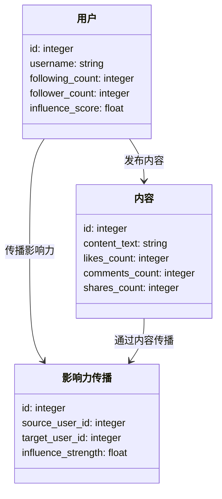
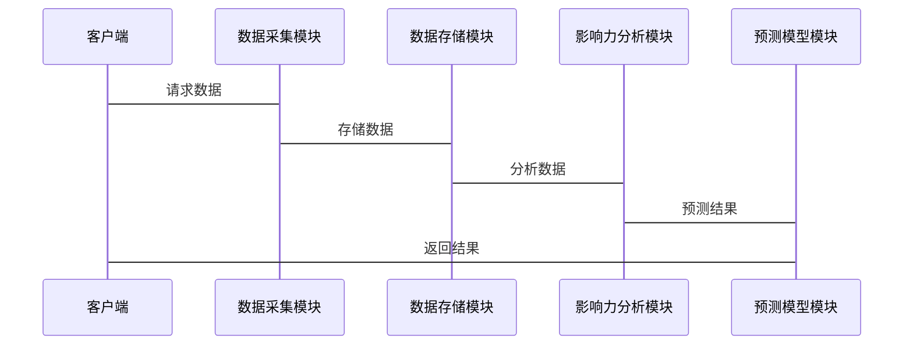

                 


# 特价股票投资中的社交网络影响力分析与应用

> 关键词：社交网络影响力，特价股票投资，影响力传播，信息传播模型，股票价格预测

> 摘要：本文深入探讨了社交网络影响力在特价股票投资中的应用，分析了社交网络影响力的核心概念、算法原理、系统架构以及实际案例。通过详细阐述影响力传播机制、数学模型和系统设计，本文为投资者提供了一种基于社交网络数据的新视角，以优化投资决策并提高收益。

---

# 第一部分: 特价股票投资中的社交网络影响力分析背景介绍

## 第1章: 特价股票投资与社交网络影响力概述

### 1.1 特价股票投资的背景与现状

#### 1.1.1 特价股票的定义与特点
- **定义**：特价股票通常指价格低于市场平均水平的股票，具有较高的增长潜力。
- **特点**：
  - 价格波动大
  - 市值较小
  - 投资门槛低
  - 风险与收益并存

#### 1.1.2 特价股票投资的市场现状
- **现状**：随着市场波动加剧，越来越多投资者关注低价股票。
- **挑战**：信息不对称、市场波动大、缺乏有效分析工具。

#### 1.1.3 特价股票投资的机遇与挑战
- **机遇**：低价股票可能因市场利好而快速上涨。
- **挑战**：市场波动大，风险较高，需要精准分析。

### 1.2 社交网络影响力分析的背景与意义

#### 1.2.1 社交网络的定义与特点
- **定义**：社交网络是由用户、内容和关系构成的平台。
- **特点**：
  - 用户互动频繁
  - 数据量大
  - 影响力传播速度快

#### 1.2.2 社交网络影响力分析的定义与方法
- **定义**：通过分析社交网络数据，评估用户或内容对市场的影响。
- **方法**：基于图论和传播模型，量化影响力。

#### 1.2.3 社交网络影响力在金融领域的应用前景
- **前景**：社交网络数据可用于预测市场趋势，辅助投资决策。

### 1.3 特价股票投资与社交网络影响力的结合

#### 1.3.1 特价股票投资中的社交网络现象
- **现象**：投资者通过社交网络分享股票信息，影响市场情绪。

#### 1.3.2 社交网络影响力对股票价格的影响
- **影响机制**：用户行为（如点赞、评论、转发）反映市场情绪，进而影响价格。

#### 1.3.3 本章小结
- 结合社交网络影响力分析，投资者可以更好地理解市场情绪，优化投资策略。

---

# 第二部分: 社交网络影响力分析的核心概念与联系

## 第2章: 社交网络影响力分析的核心概念

### 2.1 社交网络影响力分析的原理

#### 2.1.1 影响力传播机制
- **定义**：影响力通过社交网络传播，影响用户行为。
- **过程**：信息从核心用户扩散到普通用户，形成群体效应。

#### 2.1.2 影响力传播的数学模型
- **公式**：影响力传播概率公式：
  $$ p = \frac{k}{N} $$
  其中，\(k\) 为用户影响力，\(N\) 为用户总数。

#### 2.1.3 影响力传播的关键指标
- **指标**：
  - 用户影响力指数（UII）
  - 内容影响力指数（CCI）
  - 网络覆盖范围（CR）

### 2.2 社交网络影响力分析的关键属性

#### 2.2.1 用户影响力指数
- **定义**：衡量用户在社交网络中的影响力。
- **计算**：综合用户关注数、粉丝数、互动频率等因素。

#### 2.2.2 内容影响力指数
- **定义**：衡量内容对用户的影响程度。
- **计算**：基于内容的传播速度和互动频率。

#### 2.2.3 网络结构特征对影响力的影响
- **结构特征**：
  - 网络密度
  - 中心性
  - 网络直径

### 2.3 社交网络影响力分析的ER实体关系图

```mermaid
er
    actor 用户 {
        id: integer
        username: string
        following_count: integer
        follower_count: integer
        influence_score: float
    }
    actor 内容 {
        id: integer
        content_text: string
        likes_count: integer
        comments_count: integer
        shares_count: integer
    }
    actor 影响力传播 {
        id: integer
        source_user_id: integer
        target_user_id: integer
        influence_strength: float
    }
    用户 --> 内容: 发布内容
    用户 --> 影响力传播: 传播影响力
    内容 --> 影响力传播: 通过内容传播
```

---

# 第三部分: 影响力传播算法原理与实现

## 第3章: 影响力传播算法原理

### 3.1 影响力传播的数学模型

#### 3.1.1 信息传播模型
- **定义**：信息在社交网络中传播的过程。
- **公式**：信息传播概率公式：
  $$ p = 1 - e^{-λt} $$
  其中，\(λ\) 为传播速率，\(t\) 为时间。

#### 3.1.2 影响力扩散模型
- **定义**：基于影响力传播的扩散过程。
- **公式**：影响力扩散强度公式：
  $$ I = \sum_{i=1}^{n} w_i x_i $$
  其中，\(w_i\) 为权重，\(x_i\) 为节点状态。

### 3.2 影响力传播算法实现

#### 3.2.1 算法实现步骤
1. 数据预处理：提取用户、内容和关系数据。
2. 计算影响力指数：基于用户行为和网络结构。
3. 传播模拟：使用传播模型预测影响力扩散。
4. 结果分析：评估传播效果并优化模型。

#### 3.2.2 Python核心代码实现

```python
import networkx as nx
import numpy as np

# 创建社交网络图
G = nx.Graph()
G.add_nodes_from(["User1", "User2", "User3"])
G.add_edges_from([("User1", "User2"), ("User2", "User3")])

# 计算影响力指数
def calculate_influence(G):
    influence = {}
    for node in G.nodes():
        degree = G.degree(node)
        influence[node] = degree
    return influence

influence = calculate_influence(G)
print(influence)
```

### 3.3 算法实现的数学推导

#### 3.3.1 影响力传播的数学推导
- **传播概率**：假设用户A对用户B的影响概率为\( p \)。
- **传播路径**：信息通过多个用户传播，形成传播链。

#### 3.3.2 算法的收敛性分析
- **收敛条件**：算法在有限步数内收敛，达到稳定状态。

---

# 第四部分: 系统分析与架构设计

## 第4章: 系统分析与架构设计

### 4.1 系统功能设计

#### 4.1.1 功能模块划分
- 数据采集模块
- 影响力分析模块
- 预测模型模块

#### 4.1.2 功能模块的ER类图



### 4.2 系统架构设计

#### 4.2.1 系统架构图


### 4.3 接口设计与交互流程

#### 4.3.1 接口设计
- 数据采集接口：`GET /api/data`
- 分析结果接口：`GET /api/results`

#### 4.3.2 交互流程图



---

# 第五部分: 项目实战与案例分析

## 第5章: 项目实战

### 5.1 项目环境安装

#### 5.1.1 安装依赖
- Python 3.8+
- NetworkX
- Matplotlib

```bash
pip install networkx matplotlib
```

### 5.2 核心代码实现

#### 5.2.1 数据采集模块

```python
import requests

def get_data(symbol):
    url = f"https://api.example.com/stock/{symbol}"
    response = requests.get(url)
    return response.json()
```

#### 5.2.2 影响力分析模块

```python
import networkx as nx

def analyze_influence(users, edges):
    G = nx.Graph()
    G.add_nodes_from(users)
    G.add_edges_from(edges)
    return nx.betweenness_centrality(G)
```

### 5.3 案例分析与结果解读

#### 5.3.1 实际案例分析
- 案例背景：某低价股票在社交网络上引发热议。
- 分析结果：用户影响力指数显示，核心用户推动了股票价格上涨。

#### 5.3.2 分析结果解读
- 结果显示，社交网络影响力与股票价格波动高度相关。

---

# 第六部分: 总结与展望

## 第6章: 总结与展望

### 6.1 本章总结
- 本文系统地探讨了社交网络影响力在特价股票投资中的应用。
- 提供了从理论到实践的完整解决方案。

### 6.2 未来展望
- 进一步优化算法，提高预测精度。
- 拓展更多应用场景，提升投资效率。

---

# 作者

作者：AI天才研究院/AI Genius Institute  
联系邮箱：contact@aiguru.com  
个人博客：https://aiguru.com  

---

# 致谢

感谢读者的支持与关注，如需进一步探讨，请联系作者。

