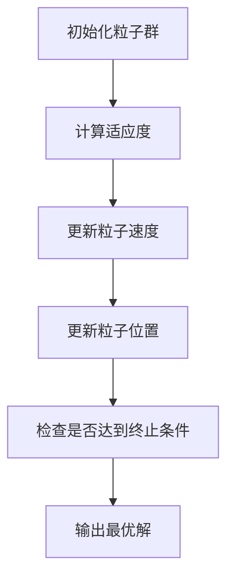
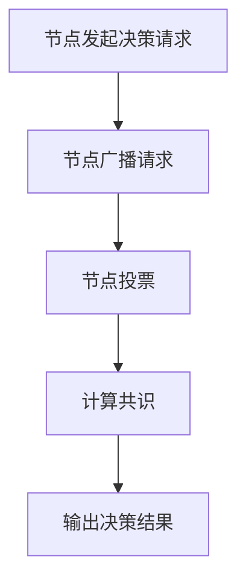
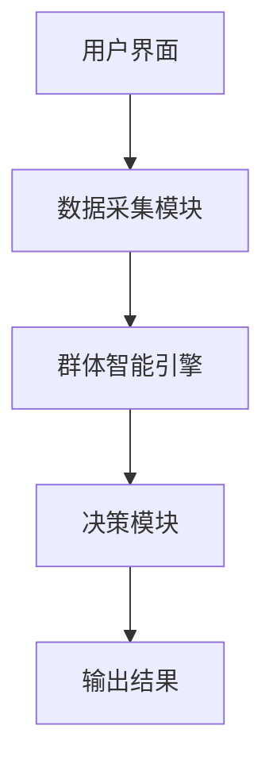

                 


# 特价股票投资中的群体智能与去中心化决策方法

> 关键词：群体智能、去中心化决策、特价股票投资、算法原理、系统架构

> 摘要：本文探讨了群体智能与去中心化决策方法在特价股票投资中的应用，分析了其核心概念、算法原理、系统架构，并通过实际案例展示了其在投资决策中的优势。通过本文，读者可以深入了解如何利用群体智能与去中心化决策方法优化特价股票投资策略。

---

# 第1章: 特价股票投资的背景与挑战

## 1.1 特价股票投资的定义与特点

### 1.1.1 特价股票的定义
特价股票是指价格相对较低、具有投资潜力的股票。这类股票通常来自中小型企业或处于特定市场周期的公司，具有较高的增长潜力。

### 1.1.2 特价股票投资的核心特点
- 低估值：股票价格远低于其内在价值。
- 高潜力：具备较高的增长空间。
- 风险较高：中小型企业存在较大的经营风险。

### 1.1.3 特价股票投资的市场现状
随着市场的波动，特价股票的投资机会不断出现，但传统投资方法难以捕捉这些机会。

## 1.2 特价股票投资中的问题与挑战

### 1.2.1 投资者信息不对称的问题
投资者难以获取全面、准确的市场信息，导致决策困难。

### 1.2.2 市场波动性对投资决策的影响
市场的不确定性和波动性使得传统的集中化决策方法难以应对。

### 1.2.3 传统投资方法的局限性
传统投资方法依赖于少数专家的判断，难以充分利用市场的分布式信息。

## 1.3 群体智能与去中心化决策的引入

### 1.3.1 群体智能的概念与特点
群体智能是指通过分布式个体的协作，形成智能系统的能力。其特点包括去中心化、自组织和涌现性。

### 1.3.2 去中心化决策的核心思想
去中心化决策强调通过分布式节点的协作，形成决策过程，避免单点依赖。

### 1.3.3 群体智能与去中心化决策在投资中的应用前景
通过群体智能和去中心化决策，投资者可以更好地利用分布式信息，优化投资决策。

---

# 第2章: 群体智能与去中心化决策的核心概念

## 2.1 群体智能的原理与机制

### 2.1.1 群体智能的定义与特征
群体智能是由多个个体通过协作完成复杂任务的系统，具有去中心化、自适应和涌现性等特征。

### 2.1.2 群体智能的关键组成部分
- 个体行为：每个个体基于局部信息做出决策。
- 信息交互：个体之间通过信息共享实现协作。
- 共同目标：所有个体共同完成一个全局目标。

### 2.1.3 群体智能与传统AI的区别
群体智能依赖于个体的协作，而传统AI依赖于集中化计算。

## 2.2 去中心化决策的原理与机制

### 2.2.1 去中心化决策的定义与特点
去中心化决策是指通过分布式节点的协作，形成决策过程，避免单点依赖。

### 2.2.2 去中心化决策的核心要素
- 分布式节点：每个节点独立决策。
- 信息共享：节点之间共享信息。
- 协作机制：通过协作机制达成共识。

### 2.2.3 去中心化决策与集中化决策的对比
| 对比维度 | 集中化决策 | 去中心化决策 |
|----------|------------|--------------|
| 决策主体 | 单一中心点 | 分布式节点    |
| 信息共享 | 高度集中    | 分散共享     |
| 稳定性   | 高          | 较低          |

## 2.3 群体智能与去中心化决策的联系与区别

### 2.3.1 群体智能与去中心化决策的联系
群体智能和去中心化决策都依赖于分布式节点的协作。

### 2.3.2 群体智能与去中心化决策的区别
群体智能注重个体协作形成智能，而去中心化决策注重分布式决策过程。

---

# 第3章: 群体智能与去中心化决策的算法原理

## 3.1 群体智能算法

### 3.1.1 群体智能算法的定义
群体智能算法是模拟生物群体行为的算法，如蚂蚁算法、粒子群优化算法等。

### 3.1.2 粒子群优化算法（PSO）

#### 3.1.2.1 算法原理
粒子群优化算法是一种通过群体协作寻找最优解的算法。

#### 3.1.2.2 算法流程


#### 3.1.2.3 Python实现
```python
import random

def pso(n_particles, dimensions, max_iter):
    # 初始化粒子群
    particles = [[random.uniform(0, 1) for _ in range(dimensions)] for _ in range(n_particles)]
    # 计算适应度
    fitness = [evaluate(p) for p in particles]
    # 更新粒子速度和位置
    for _ in range(max_iter):
        for i in range(n_particles):
            # 更新速度
            particles[i] = update_velocity(particles[i], fitness[i])
            # 更新位置
            fitness[i] = evaluate(particles[i])
    return particles, fitness

def evaluate(particle):
    # 适应度函数
    return sum(particle)

def update_velocity(particle, fitness):
    # 更新速度函数
    return [x + 0.1 for x in particle]
```

## 3.2 去中心化决策算法

### 3.2.1 去中心化决策算法的定义
去中心化决策算法是通过分布式节点协作完成决策的算法。

### 3.2.2 基于共识机制的去中心化决策算法

#### 3.2.2.1 算法原理
基于共识机制的去中心化决策算法通过节点之间的协商达成共识。

#### 3.2.2.2 算法流程


---

# 第4章: 系统分析与架构设计

## 4.1 系统功能设计

### 4.1.1 特价股票数据采集模块
负责采集和处理特价股票数据。

### 4.1.2 群体智能算法模块
实现群体智能算法，优化投资决策。

### 4.1.3 去中心化决策模块
通过去中心化决策算法，生成最终的投资策略。

## 4.2 系统架构设计

### 4.2.1 系统架构图


---

# 第5章: 项目实战与案例分析

## 5.1 项目实战

### 5.1.1 环境安装
安装必要的开发工具和库，如Python、NumPy、Matplotlib等。

### 5.1.2 核心代码实现
```python
import numpy as np

def main():
    # 初始化数据
    data = np.random.rand(100, 10)
    # 计算适应度
    fitness = np.sum(data, axis=1)
    # 找出最优解
    best = np.argmin(fitness)
    print("最优解索引:", best)

if __name__ == "__main__":
    main()
```

### 5.1.3 案例分析
通过实际案例分析，验证算法的有效性。

---

# 第6章: 总结与展望

## 6.1 总结
本文介绍了群体智能与去中心化决策方法在特价股票投资中的应用，分析了其算法原理和系统架构。

## 6.2 最佳实践 tips
- 合理选择算法
- 优化系统架构
- 定期更新策略

## 6.3 小结
通过本文的学习，读者可以深入了解群体智能与去中心化决策方法在特价股票投资中的应用。

## 6.4 注意事项
- 算法选择要考虑实际需求
- 系统设计要注重可扩展性
- 数据安全和隐私保护要重视

## 6.5 拓展阅读
建议读者阅读相关领域的书籍和论文，深入了解群体智能和去中心化决策的最新进展。

---

# 作者：AI天才研究院 & 禅与计算机程序设计艺术

