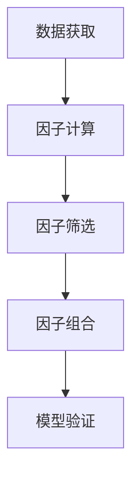
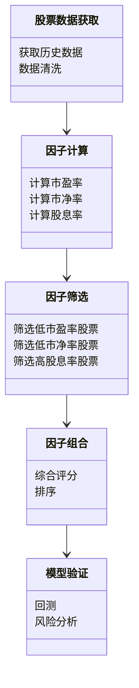

                 


# 特价股票投资中的质量因子分析

## 关键词：股票投资，质量因子，因子分析，数学模型，系统架构

## 摘要：本文探讨了特价股票投资中质量因子分析的重要性及其应用。通过分析质量因子的定义、分类、数学模型，结合实际案例，揭示质量因子在投资决策中的关键作用，并提供系统的解决方案和实战指导。

---

## 第一部分：质量因子分析的背景与概念

### 第1章：质量因子分析的背景与概念

#### 1.1 股票投资中的质量因子概述

##### 1.1.1 股票投资的核心问题

股票投资的核心问题在于如何在市场中找到具有超额收益的股票。投资者通过分析各种因素，如基本面、技术面和市场情绪等，来选择合适的股票。然而，市场中存在大量的不确定性和波动性，使得投资决策变得复杂。

##### 1.1.2 质量因子的概念与定义

质量因子是描述股票质量的关键指标，通常包括市盈率（P/E）、市净率（P/B）、股息率（Dividend Yield）等。这些因子通过量化股票的估值、盈利能力和成长性，帮助投资者识别具有投资价值的股票。

##### 1.1.3 质量因子在特价股票投资中的作用

特价股票通常指价格低于市场平均水平的股票，这类股票可能隐藏着投资机会。质量因子分析帮助投资者筛选出具有较高投资价值的特价股票，降低投资风险。

#### 1.2 质量因子分析的理论基础

##### 1.2.1 投资学中的CAPM模型

CAPM（资本资产定价模型）是股票定价的基本模型，公式如下：
$$ E(R_i) = R_f + \beta_i (E(R_m) - R_f) $$
其中，$R_f$是无风险利率，$\beta_i$是股票的贝塔系数，反映股票的系统性风险。

##### 1.2.2 Fama-French三因子模型

Fama-French模型扩展了CAPM，加入了规模因子（Size）和价值因子（Value）。模型公式为：
$$ E(R_i) = R_f + \beta_i (E(R_m) - R_f) + SMB + HML $$
其中，SMB是小盘股溢价，HML是价值因子溢价。

##### 1.2.3 质量因子与股票收益的关系

质量因子通过影响股票的估值和盈利能力，进而影响其收益。例如，低市盈率的股票可能具有更高的未来收益。

---

### 第2章：质量因子的分类与特征

#### 2.1 质量因子的主要分类

##### 2.1.1 市盈率（P/E）

市盈率是股票价格与每股收益的比值，公式为：
$$ PE = \frac{Stock Price}{Earnings Per Share} $$
低市盈率的股票可能具有较高的投资价值。

##### 2.1.2 市净率（P/B）

市净率是股票价格与每股净资产的比值，公式为：
$$ PB = \frac{Stock Price}{Book Value Per Share} $$
低市净率的股票通常被认为是低估的股票。

##### 2.1.3 股息率（Dividend Yield）

股息率是股票每年派发的股息与股票价格的比值，公式为：
$$ Dividend Yield = \frac{Annual Dividends Per Share}{Stock Price} $$
高股息率的股票通常被视为稳定的收益来源。

##### 2.1.4 资产负债率（Debt/Equity）

资产负债率是公司负债与股东权益的比值，公式为：
$$ Debt/Equity = \frac{Total Liabilities}{Total Equity} $$
低资产负债率的公司通常财务状况更健康。

#### 2.2 质量因子的特征分析

##### 2.2.1 质量因子的数值范围

每个质量因子都有其合理的数值范围，例如，市盈率通常在10到30之间被视为合理。

##### 2.2.2 质量因子的时间序列特性

质量因子在不同时间段的表现可能不同，需要结合市场周期进行分析。

##### 2.2.3 质量因子与市场周期的关系

在熊市中，价值因子（如低市盈率）通常表现较好，而在牛市中，成长因子可能更受青睐。

---

### 第3章：质量因子分析的数学模型

#### 3.1 质量因子的量化指标

##### 3.1.1 市盈率的计算公式

$$ PE = \frac{Stock Price}{Earnings Per Share} $$

##### 3.1.2 市净率的计算公式

$$ PB = \frac{Stock Price}{Book Value Per Share} $$

##### 3.1.3 股息率的计算公式

$$ Dividend Yield = \frac{Annual Dividends Per Share}{Stock Price} $$

#### 3.2 质量因子的组合模型

##### 3.2.1 单一因子模型

例如，仅基于市盈率进行股票筛选。

##### 3.2.2 多因子模型

综合考虑市盈率、市净率和股息率等多个因子。

##### 3.2.3 因子权重的分配方法

根据因子的重要性分配权重，例如，市盈率和市净率各占40%，股息率占20%。

---

### 第4章：质量因子分析的算法原理

#### 4.1 因子分析的基本流程



#### 4.2 因子计算与筛选算法

##### 4.2.1 基于统计的因子筛选方法

例如，使用z-score方法筛选异常值。

##### 4.2.2 基于机器学习的因子筛选方法

例如，使用主成分分析（PCA）提取关键因子。

##### 4.2.3 因子重要性排序

通过回归分析确定因子的重要性。

---

### 第5章：质量因子分析的系统架构

#### 5.1 系统功能设计

##### 5.1.1 功能模块

- 数据获取模块：从数据库获取历史数据。
- 因子计算模块：计算各项质量因子。
- 因子筛选模块：筛选出符合条件的股票。
- 因子组合模块：根据权重组合因子。
- 模型验证模块：验证模型的有效性。

##### 5.1.2 系统架构图



---

## 第六部分：项目实战

### 第6章：质量因子分析的实战应用

#### 6.1 实战环境安装

- 数据库：MySQL
- 编程语言：Python
- 库：pandas、numpy、scikit-learn

#### 6.2 核心代码实现

##### 数据获取与预处理

```python
import pandas as pd
import numpy as np

# 获取数据
data = pd.read_csv('stock_data.csv')

# 数据清洗
data.dropna(inplace=True)
data = data[~data['PE'].isinf()]
```

##### 因子计算与筛选

```python
# 计算市盈率
data['PE'] = data['Price'] / data['Earnings']

# 筛选低市盈率股票
low_pe_stocks = data[data['PE'] < data['PE'].mean()]
```

##### 因子组合与排序

```python
# 综合评分
data['Score'] = 0.4 * data['PE'] + 0.4 * data['PB'] + 0.2 * data['Dividend Yield']

# 排序
data = data.sort_values('Score', ascending=False)
```

#### 6.3 实战案例分析

以某段时间内的股票数据为例，计算各质量因子，筛选出具有较高投资价值的股票，并进行回测分析。

#### 6.4 实战结果解读

通过回测结果，验证质量因子分析的有效性，并根据结果调整因子权重。

---

## 第七部分：总结与最佳实践

### 第7章：总结与最佳实践

#### 7.1 总结

质量因子分析是股票投资中的重要工具，通过合理选择和组合因子，可以提高投资决策的科学性和准确性。

#### 7.2 最佳实践 tips

- 定期更新数据，及时调整因子权重。
- 结合市场环境和周期进行分析。
- 多因子模型通常表现优于单一因子模型。

#### 7.3 小结

质量因子分析不仅提供了理论支持，还在实际操作中展现了其价值。投资者应结合市场环境和个人策略，灵活运用质量因子分析。

---

## 作者：AI天才研究院/AI Genius Institute & 禅与计算机程序设计艺术 /Zen And The Art of Computer Programming

---

通过以上详细的内容，我们可以看到质量因子分析在特价股票投资中的重要性及其具体应用。希望本文能为投资者提供有价值的参考和指导。

