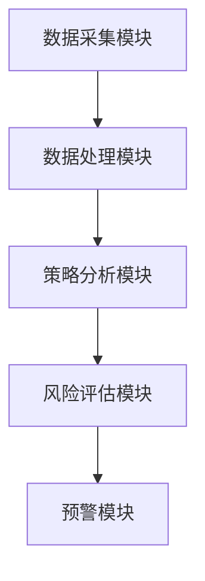
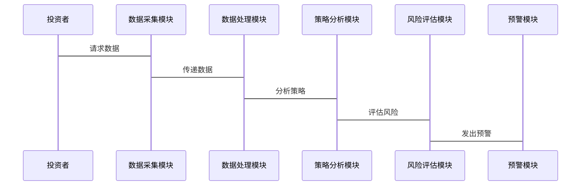

                 


# 特价股票投资中的跨境投资策略

## 关键词：特价股票，跨境投资，投资策略，风险评估，量化分析

## 摘要：本文深入探讨了特价股票投资中的跨境投资策略，分析了其背景、核心概念、算法原理、系统架构设计，并通过项目实战展示了策略的实现，最后提出了最佳实践和注意事项。

---

# 第一部分: 特价股票投资中的跨境投资策略概述

## 第1章: 特价股票投资的背景与现状

### 1.1 特价股票投资的定义与特点
#### 1.1.1 特价股票的定义
特价股票是指那些价格低于其内在价值，或者价格相对市场平均水平大幅折价的股票。这些股票通常具有较高的安全边际，吸引追求价值投资的投资者。

#### 1.1.2 特价股票投资的核心特点
- 价格折扣：特价股票的价格通常低于其基本面所反映的价值。
- 风险较低：相对于高价股，特价股票的风险可能更可控。
- 投机与投资并存：特价股票可能同时吸引投机者和长期投资者。

#### 1.1.3 特价股票投资的市场定位
特价股票通常出现在市场低迷或公司遇到短期困难时，投资者需要识别这些股票的潜在价值。

### 1.2 跨境投资的背景与趋势
#### 1.2.1 跨境投资的定义
跨境投资是指投资者在不同国家或地区的金融市场进行投资，以分散风险和追求更高的收益。

#### 1.2.2 跨境投资的现状与发展趋势
随着全球化的推进，投资者通过跨境投资可以接触到更多市场和资产类别，降低投资组合的波动性。

#### 1.2.3 跨境投资与特价股票投资的结合
将跨境投资与特价股票相结合，投资者可以在全球范围内寻找被低估的资产，扩大投资机会。

### 1.3 特价股票投资中的跨境策略
#### 1.3.1 跨境投资对特价股票的影响
- 全球市场波动：不同市场的波动性可能为投资者提供套利机会。
- 货币风险：汇率波动可能影响投资收益。

#### 1.3.2 跨境策略的核心优势
- 分散风险：通过投资不同市场的特价股票，降低单一市场风险。
- 市场套利：利用不同市场之间的价格差异进行套利。

#### 1.3.3 跨境策略的风险与挑战
- 汇率风险：汇率波动可能影响投资收益。
- 法律和监管风险：不同国家的法律法规可能增加投资复杂性。

### 1.4 本章小结
本章介绍了特价股票投资和跨境投资的基本概念，分析了它们的结合以及相关的优势和挑战。

---

## 第2章: 特价股票投资的核心概念与联系

### 2.1 特价股票投资的核心概念
#### 2.1.1 特价股票的市场定位
特价股票通常出现在市场低估或公司基本面出现问题时。

#### 2.1.2 特价股票的投资逻辑
- 价值发现：寻找市场价格低于内在价值的股票。
- 风险控制：通过分散投资降低市场风险。

#### 2.1.3 特价股票的定价模型
- 市盈率模型：P/E比率低于行业平均水平。
- 市净率模型：P/B比率低于行业平均水平。

### 2.2 跨境投资的核心概念
#### 2.2.1 跨境投资的基本原理
- 资本流动：投资者在全球范围内配置资产。
- 市场多样性：不同市场的经济周期不同，提供投资机会。

#### 2.2.2 跨境投资的市场分析
- 经济指标：GDP增长率、通胀率、利率等。
- 市场波动性：不同市场的波动性差异。

#### 2.2.3 跨境投资的风险管理
- 多元化投资：分散投资于不同市场和资产类别。
- 风险对冲：使用金融工具对冲汇率和市场风险。

### 2.3 特价股票与跨境投资的联系
#### 2.3.1 跨境因素对特价股票的影响
- 全球市场波动：不同市场的特价股票可能受同一事件影响。
- 货币政策差异：不同国家的货币政策影响股票价格。

#### 2.3.2 特价股票在跨境投资中的地位
- 全球价值发现：投资者可以在全球范围内寻找被低估的股票。
- 市场套利机会：利用不同市场的价格差异进行投资。

#### 2.3.3 跨境策略对特价股票投资的优化作用
- 分散风险：通过投资不同市场的特价股票降低风险。
- 增加收益：利用全球市场的机会获取更高收益。

### 2.4 本章小结
本章详细讲解了特价股票和跨境投资的核心概念，并分析了它们的联系和相互作用。

---

## 第3章: 特价股票投资中的算法原理

### 3.1 特价股票投资的量化分析
#### 3.1.1 量化分析的基本原理
量化分析通过数学模型和算法对股票进行分析，寻找投资机会。

#### 3.1.2 量化分析的核心算法
- 市场中性策略：通过多空头寸对冲市场风险。
- 因子分析：基于多个因子（如市值、价值、动量等）筛选股票。

#### 3.1.3 量化分析的实现步骤
1. 数据收集：收集目标市场的历史数据。
2. 因子筛选：选择影响股票价格的因子。
3. 模型构建：构建量化模型，筛选出符合条件的股票。
4. 风险控制：对冲模型中的市场风险。

### 3.2 跨境投资中的风险评估算法
#### 3.2.1 风险评估的定义与目标
风险评估旨在量化投资组合可能面临的风险。

#### 3.2.2 风险评估的数学模型
- 威险价值（VaR）：$$ \text{VaR} = \mu + z \cdot \sigma $$
- 预期短缺（ES）：$$ \text{ES} = \int_{-\infty}^{\mu + z \cdot \sigma} f(x) dx $$

#### 3.2.3 风险评估的实现流程
1. 数据收集：收集投资组合的历史收益数据。
2. 计算统计指标：计算均值、标准差等。
3. 计算VaR和ES：根据统计指标计算风险值。

### 3.3 算法原理的数学模型与公式
#### 3.3.1 量化分析的数学模型
- 市场中性策略：$$ E(R_i) = \beta_i (E(R_m) - R_f) + R_f $$
- 因子分析：$$ R_i = \alpha + \beta_1 F_1 + \beta_2 F_2 + \cdots + \beta_n F_n + \epsilon $$

#### 3.3.2 风险评估的数学公式
- VaR：$$ \text{VaR} = \mu + z \cdot \sigma $$
- ES：$$ \text{ES} = \int_{-\infty}^{\mu + z \cdot \sigma} f(x) dx $$

#### 3.3.3 算法流程的详细说明
1. 数据预处理：清洗数据，处理缺失值。
2. 因子筛选：基于统计或机器学习方法筛选因子。
3. 模型构建：使用回归或分类模型进行预测。
4. 风险评估：计算投资组合的VaR和ES。

### 3.4 本章小结
本章详细讲解了量化分析和风险评估的算法原理，并通过数学公式和流程图展示了实现步骤。

---

## 第4章: 特价股票投资的系统分析与架构设计

### 4.1 系统功能设计
#### 4.1.1 特价股票数据采集模块
- 数据源：全球主要股票市场。
- 数据类型：股价、成交量、财务指标等。

#### 4.1.2 跨境投资策略分析模块
- 策略选择：市场中性策略、因子分析等。
- 策略实现：基于量化模型筛选股票。

#### 4.1.3 风险评估与预警模块
- 风险指标：VaR、ES。
- 预警机制：当风险超过阈值时触发预警。

### 4.2 系统架构设计
#### 4.2.1 系统架构图


#### 4.2.2 系统交互流程图


### 4.3 本章小结
本章通过系统架构设计，展示了如何将量化分析和风险评估整合到一个系统中，并通过图表展示了系统的交互流程。

---

## 第5章: 特价股票投资的项目实战

### 5.1 环境安装与配置
- 数据源：全球主要股票市场数据。
- 工具：Python、Pandas、NumPy、Scikit-learn。

### 5.2 核心代码实现
#### 5.2.1 数据采集模块
```python
import pandas as pd
import requests

def get_data(symbol):
    url = f"https://api.example.com/stock/{symbol}"
    response = requests.get(url)
    data = response.json()
    return pd.DataFrame(data)
```

#### 5.2.2 量化分析模块
```python
from sklearn.linear_model import LinearRegression

def quantify_analysis(data):
    model = LinearRegression()
    model.fit(data[['factor1', 'factor2']], data['target'])
    return model.predict(data[['factor1', 'factor2']])
```

#### 5.2.3 风险评估模块
```python
import numpy as np

def calculate VaR(data):
    mu = np.mean(data)
    sigma = np.std(data)
    z = 1.96  # 95% confidence interval
    VaR = mu + z * sigma
    return VaR
```

### 5.3 案例分析与解读
- 数据收集：收集某市场的历史数据。
- 量化分析：筛选出符合条件的特价股票。
- 风险评估：计算投资组合的风险值。

### 5.4 本章小结
本章通过实际案例展示了如何在项目中应用跨境投资策略，并通过代码实现量化分析和风险评估。

---

## 第6章: 最佳实践与注意事项

### 6.1 最佳实践
- 风险管理：始终将风险控制放在首位。
- 持续学习：关注全球经济和市场变化。
- 技术工具：利用先进的技术工具进行分析。

### 6.2 注意事项
- 汇率风险：投资时需考虑汇率波动。
- 法律风险：遵守不同国家的法律法规。

### 6.3 小结
本章总结了跨境投资策略的最佳实践，并提醒投资者注意相关风险。

---

## 作者：AI天才研究院/AI Genius Institute & 禅与计算机程序设计艺术 /Zen And The Art of Computer Programming

---

# 结语
本文通过详细分析特价股票投资中的跨境投资策略，为投资者提供了理论和实践上的指导。通过量化分析和系统设计，投资者可以更好地在全球市场中寻找投资机会，实现财富增长。

