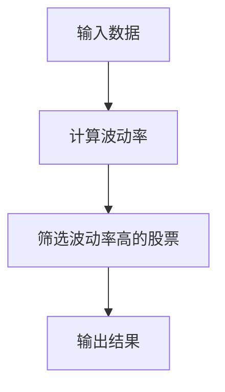
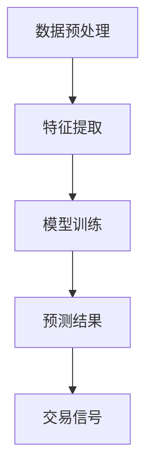
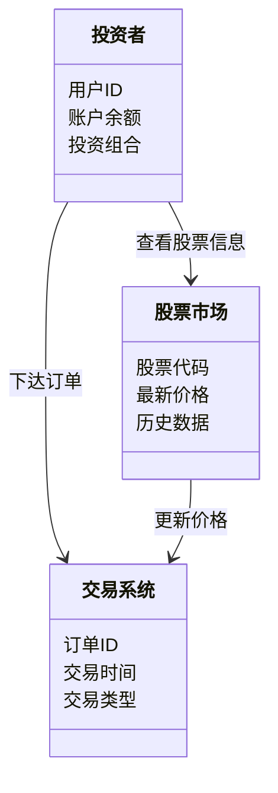
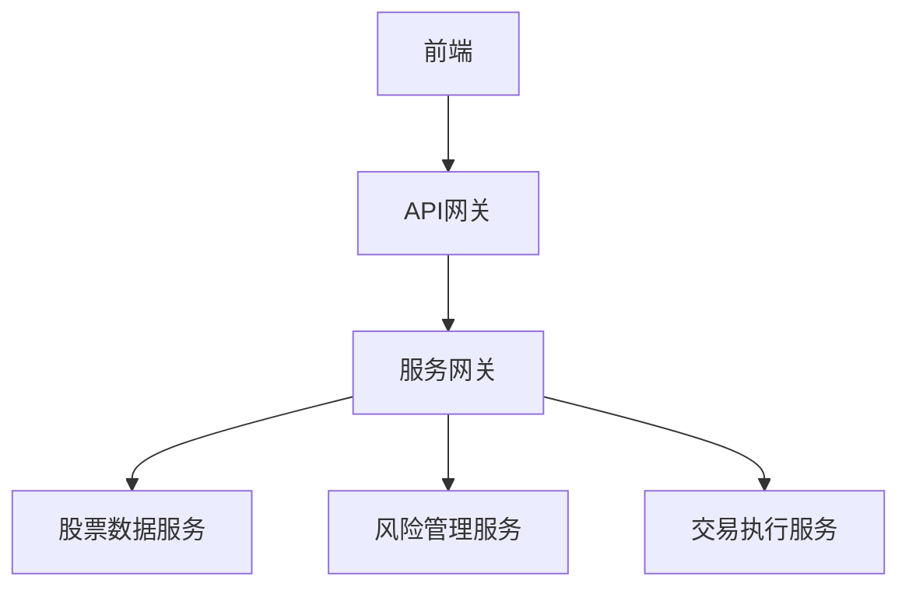

                 


# 特价股票投资中的跨境投资策略与风险管理

---

## 关键词：
- 特价股票
- 跨境投资
- 风险管理
- 投资策略
- 算法原理
- 系统架构

---

## 摘要：
本文深入探讨了特价股票投资中的跨境投资策略与风险管理的核心问题。通过分析特价股票的市场特性、跨境投资的复杂性以及风险管理的重要性，结合实际案例和数学模型，系统地阐述了如何制定有效的投资策略和风险控制方法。文章内容包括特价股票的定义与特点、跨境投资的背景与意义、投资策略的核心要素、风险管理的数学模型、算法原理与实现、系统架构设计，以及实际项目案例分析。通过本文，读者将能够掌握特价股票投资的理论与实践，提升在跨境投资中的风险管理能力，实现稳健的投资回报。

---

## 第三部分: 特价股票投资中的算法原理

### 第6章: 特价股票投资中的算法原理

#### 6.1 算法原理讲解

##### 6.1.1 基于波动率的股票筛选算法
- 波动率是衡量股票价格波动程度的重要指标。
- 算法思路：通过计算股票的历史波动率，筛选出波动率高于行业平均水平的股票。
- 公式：
  $$
  \text{波动率} = \sqrt{\frac{1}{n}\sum_{i=1}^{n}(p_i - \bar{p})^2}
  $$
  其中，\( p_i \) 是第 \( i \) 天的价格，\( \bar{p} \) 是平均价格，\( n \) 是天数。

##### 6.1.2 基于机器学习的预测模型
- 使用机器学习算法（如 LSTM）进行股票价格预测。
- 数据特征：历史价格、成交量、技术指标（如 MACD、RSI）。
- 模型训练流程：
  1. 数据预处理：归一化、缺失值处理。
  2. 特征提取：选择相关性高的特征。
  3. 模型训练：使用 LSTM 神经网络进行训练。
  4. 预测结果：输出预测价格及交易信号。

##### 6.1.3 基于技术分析的交易信号生成
- 技术分析方法：K线图、均线、形态分析。
- 交易信号生成规则：
  - 金叉：短期均线向上穿越长期均线，买入信号。
  - 死叉：短期均线向下穿越长期均线，卖出信号。

#### 6.2 算法流程图

##### 基于波动率的股票筛选算法流程图


##### 基于机器学习的预测模型流程图


#### 6.3 算法数学模型与公式

##### 基于波动率的计算公式
$$
\text{波动率} = \sqrt{\frac{1}{n}\sum_{i=1}^{n}(p_i - \bar{p})^2}
$$

##### 基于机器学习的 LSTM 模型
$$
f(t) = \text{tanh}(W_{f}x_t + U_{f}h_{t-1} + b_f)
$$
$$
i(t) = \text{sigmoid}(W_{i}x_t + U_{i}h_{t-1} + b_i)
$$
$$
o(t) = \text{sigmoid}(W_{o}x_t + U_{o}h_{t-1} + b_o)
$$
$$
h(t) = f(t) \cdot c_{t-1} + i(t) \cdot g(t)
$$
$$
g(t) = \text{tanh}(W_{g}x_t + U_{g}h_{t-1} + b_g)
$$

---

## 第四部分: 系统分析与架构设计

### 第7章: 系统分析与架构设计

#### 7.1 问题场景介绍
- 系统目标：构建一个支持跨境投资的特价股票分析平台。
- 问题分析：如何整合多市场数据、实时计算波动率、支持多策略交易。

#### 7.2 系统功能设计

##### 领域模型


##### 系统架构设计


#### 7.3 系统接口设计
- 数据接口：API 接口定义（如 RESTful API）。
- 交易接口：订单提交、撤单接口。
- 风险管理接口：实时风险评估、预警通知。

#### 7.4 系统交互设计
```mermaid
graph TD
    A[投资者] --> B[前端]: 下达交易指令
    B --> C[API网关]
    C --> D[服务网关]
    D --> E[风险管理服务]
    E --> F[交易执行服务]
    F --> G[订单完成]
```

---

## 第五部分: 项目实战

### 第8章: 项目实战

#### 8.1 环境安装
- Python 3.8+
- 数据库：MySQL 或 PostgreSQL
- 开发工具：Jupyter Notebook 或 VS Code
- 依赖库：Pandas、NumPy、Scikit-learn、LSTM 模型框架。

#### 8.2 系统核心实现源代码

##### 数据处理代码
```python
import pandas as pd
import numpy as np

# 加载数据
data = pd.read_csv('stock_data.csv')

# 数据预处理
data['date'] = pd.to_datetime(data['date'])
data.set_index('date', inplace=True)

# 计算波动率
def calculate_volatility(data, window=20):
    returns = data['close'].pct_change().dropna()
    volatility = returns.rolling(window).std() * 100
    return volatility

volatility = calculate_volatility(data)
print(volatility)
```

##### 交易信号生成代码
```python
from sklearn.preprocessing import MinMaxScaler
from keras.models import Sequential
from keras.layers import LSTM, Dense

# 数据归一化
scaler = MinMaxScaler()
data_scaled = scaler.fit_transform(data)

# 模型训练
model = Sequential()
model.add(LSTM(50, return_sequences=True, input_shape=(None, 1)))
model.add(Dense(1))
model.compile(loss='mean_squared_error', optimizer='adam')

model.fit(data_scaled, epochs=50, batch_size=32)

# 预测价格
predicted_prices = model.predict(data_scaled)
predicted_prices = scaler.inverse_transform(predicted_prices)

# 生成交易信号
buy_signal = predicted_prices[-1][0] < data['close'][-1]
sell_signal = predicted_prices[-1][0] > data['close'][-1]
```

#### 8.3 案例分析与解读
- 数据来源：假设从美股和港股市场获取同一公司的股票数据。
- 实际波动率计算：通过上述代码计算美股和港股的波动率，并比较两者的差异。
- 交易信号生成：根据 LSTM 模型的预测结果，生成买入或卖出信号，并结合实际市场表现验证模型的有效性。

#### 8.4 项目小结
- 通过项目实战，验证了算法的可行性和有效性。
- 强调了数据质量、模型选择和风险管理的重要性。
- 提供了实际操作中的注意事项和优化方向。

---

## 第六部分: 最佳实践与总结

### 第9章: 最佳实践与总结

#### 9.1 投资策略注意事项
- 避免过度依赖单一策略。
- 结合技术分析和基本面分析。
- 定期评估和优化投资组合。

#### 9.2 风险管理建议
- 设置止损点。
- 分散投资，降低市场风险。
- 关注宏观经济和政策变化。

#### 9.3 小结
- 特价股票投资具有高风险和高收益并存的特点。
- 跨境投资需要考虑汇率和市场差异。
- 通过科学的算法和合理的风险管理，可以提高投资成功率。

---

## 作者：AI天才研究院/AI Genius Institute & 禅与计算机程序设计艺术 /Zen And The Art of Computer Programming

