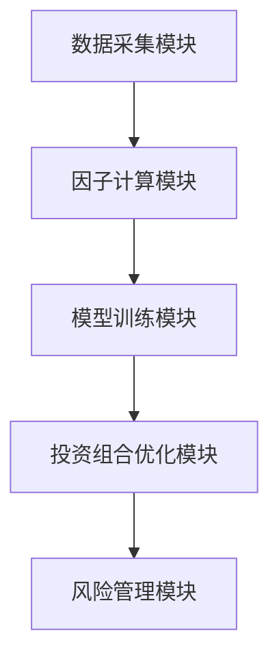
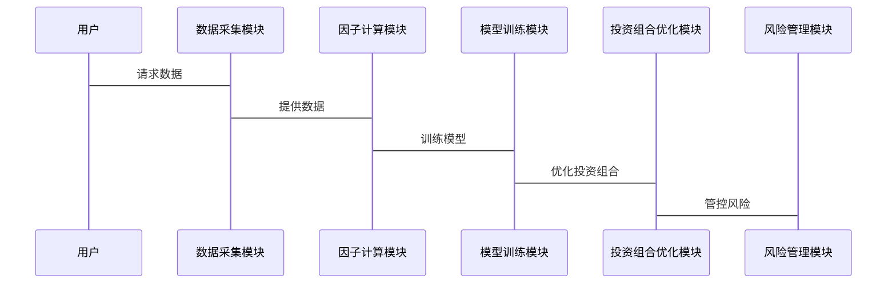

                 


# 特价股票投资中的跨资产类别系统性创新机会识别

> 关键词：特价股票投资、跨资产类别、系统性创新、机会识别、金融算法、风险管理

> 摘要：本文深入探讨了在特价股票投资中，如何通过跨资产类别系统性创新机会的识别来优化投资策略。通过分析多因子模型、机器学习算法和系统架构设计，结合实际案例，提供了一套从理论到实践的完整解决方案。文章最后总结了最佳实践和未来研究方向。

---

# 第一部分: 特价股票投资中的跨资产类别系统性创新机会识别概述

## 第1章: 特价股票投资与跨资产类别投资概述

### 1.1 特价股票投资的基本概念

#### 1.1.1 特价股票的定义

特价股票是指那些市场价格低于其内在价值的股票。这种股票通常因为市场波动、公司短期问题或市场参与者情绪影响而被低估。识别和投资于这类股票，是价值投资策略的核心。

#### 1.1.2 特价股票投资的基本原理

价值投资的基本原理是购买低于其内在价值的资产。投资者通过分析公司的基本面（如盈利能力、成长性、财务状况等），寻找那些市场价格低于其真实价值的股票。这种策略要求投资者具备长期视角，能够承受短期市场的波动。

#### 1.1.3 特价股票投资的市场背景

近年来，全球金融市场波动加剧，尤其是在2020年新冠疫情的影响下，许多股票价格出现了大幅波动。这种市场环境为投资者提供了寻找特价股票的机会。此外，随着技术进步和数据分析能力的提升，投资者能够更精准地识别被低估的股票。

### 1.2 跨资产类别投资的基本概念

#### 1.2.1 跨资产类别投资的定义

跨资产类别投资是指将资金分散投资于股票、债券、基金、期货等多种金融资产，以降低风险并提高收益。这种投资策略能够充分利用不同资产类别之间的相关性较低的特点，优化投资组合的风险收益比。

#### 1.2.2 跨资产类别投资的优势

1. **风险分散**：通过投资不同资产类别，投资者可以降低单一资产类别带来的风险。
2. **收益增强**：不同资产类别在不同市场环境下的表现不同，跨资产投资可以通过多元化实现更高的收益。
3. **灵活性**：跨资产类别投资能够根据市场变化动态调整投资组合。

#### 1.2.3 跨资产类别投资的分类

1. **股票与债券**：股票风险较高，收益潜力大；债券风险较低，收益稳定。
2. **基金与ETF**：通过投资基金或交易所交易基金（ETF），投资者可以间接持有多个资产。
3. **期货与衍生品**：利用期货、期权等衍生品进行对冲或投机。

### 1.3 系统性创新机会识别的基本概念

#### 1.3.1 系统性创新的定义

系统性创新是指通过系统化的方法和创新工具，系统地识别、分析和利用市场机会。与非系统性创新相比，系统性创新更注重方法和流程的规范性。

#### 1.3.2 系统性创新与非系统性创新的区别

| 属性 | 系统性创新 | 非系统性创新 |
|------|------------|--------------|
| 方法 | 基于系统化方法 | 基于灵感或经验 |
| 可重复性 | 高 | 低 |
| 风险控制 | 强调风险可控 | 风险不可控 |
| 应用领域 | 广泛应用于多个领域 | 更多应用于特定领域 |

#### 1.3.3 系统性创新机会识别的重要性

在金融投资领域，系统性创新机会识别能够帮助投资者更高效地发现市场机会，降低投资风险，提高投资收益。特别是在跨资产类别投资中，系统性创新方法能够帮助投资者更好地理解不同资产之间的关系，制定更科学的投资策略。

## 第2章: 特价股票投资中的跨资产类别系统性创新机会识别的背景与意义

### 2.1 当前金融市场环境对跨资产类别投资的影响

#### 2.1.1 全球化与金融市场的互联互通

随着全球化进程的加速，金融市场之间的联系日益紧密。投资者可以通过投资海外市场或国际化资产来分散风险，寻找新的投资机会。

#### 2.1.2 数字化与金融创新的推动

数字化技术的发展推动了金融创新，投资者可以通过大数据分析、人工智能等技术手段，更精准地识别投资机会。

#### 2.1.3 金融市场的波动性与不确定性

近年来，金融市场波动性加剧，传统的单一资产投资策略难以应对市场的不确定性。跨资产类别投资能够帮助投资者更好地应对市场波动。

### 2.2 系统性创新在跨资产类别投资中的作用

#### 2.2.1 系统性创新对投资收益的提升作用

通过系统性创新方法，投资者可以更科学地分析市场机会，制定更优的投资策略，从而提高投资收益。

#### 2.2.2 系统性创新对投资风险的降低作用

系统性创新方法可以帮助投资者识别潜在风险，并通过多元化投资策略降低整体投资风险。

#### 2.2.3 系统性创新对投资策略的优化作用

系统性创新方法能够帮助投资者不断优化投资策略，适应市场变化，提高投资效率。

### 2.3 特价股票投资中的跨资产类别系统性创新机会识别的必要性

#### 2.3.1 特价股票投资中的机会识别需求

在特价股票投资中，投资者需要识别那些被市场低估的股票，这需要系统化的方法和工具支持。

#### 2.3.2 跨资产类别投资中的系统性创新需求

跨资产类别投资需要投资者能够系统地分析不同资产类别的风险收益比，识别系统性创新机会，优化投资组合。

#### 2.3.3 系统性创新机会识别在特价股票投资中的应用价值

系统性创新机会识别能够帮助投资者更高效地发现跨资产类别中的特价股票投资机会，优化投资组合，提高投资收益。

---

# 第二部分: 跨资产类别系统性创新机会识别的核心概念与联系

## 第3章: 跨资产类别系统性创新机会

### 3.1 跨资产类别系统性创新机会的核心概念

#### 3.1.1 跨资产类别系统性创新机会的定义

跨资产类别系统性创新机会是指在不同资产类别中，通过系统化的方法识别和利用市场机会，实现投资收益最大化。

#### 3.1.2 跨资产类别系统性创新机会的特征

| 特征 | 描述 |
|------|------|
| 系统性 | 基于系统化方法 |
| 多样性 | 跨多个资产类别 |
| 可量化 | 可以通过量化模型进行分析 |
| 可持续性 | 具有长期投资价值 |

### 3.2 跨资产类别系统性创新机会的联系

#### 3.2.1 跨资产类别与系统性创新机会的联系

跨资产类别投资为系统性创新机会识别提供了多样化的选择，而系统性创新方法则为跨资产类别投资提供了科学的方法论支持。

#### 3.2.2 跨资产类别系统性创新机会与其他投资机会的对比

| 投资策略 | 跨资产类别系统性创新 | 单一资产类别非系统性创新 |
|----------|----------------------|---------------------------|
| 方法 | 基于系统化方法，跨多个资产类别 | 基于经验或灵感，单一资产 |
| 风险 | 风险分散，整体风险较低 | 风险集中，整体风险较高 |
| 收益 | 收益多样化，收益潜力大 | 收益依赖单一资产表现 |

---

# 第三部分: 跨资产类别系统性创新机会识别的算法原理与系统架构设计

## 第4章: 跨资产类别系统性创新机会识别的算法原理

### 4.1 多因子模型

#### 4.1.1 多因子模型的基本原理

多因子模型通过多个因子（如市值、价值、动量等）来解释资产的收益。投资者可以通过分析不同因子的表现，识别那些被低估的资产。

#### 4.1.2 多因子模型的实现步骤

1. 选择因子：如市值因子、价值因子、动量因子等。
2. 数据收集：收集相关资产的历史数据。
3. 因子计算：计算每个资产在各个因子上的得分。
4. 因子组合：通过回归分析确定因子的重要性。
5. 投资组合优化：根据因子得分构建投资组合。

#### 4.1.3 多因子模型的数学公式

$$ R_i = \alpha + \beta_1 F_1 + \beta_2 F_2 + \dots + \beta_n F_n + \epsilon $$

其中，$R_i$ 是资产 $i$ 的收益，$F_j$ 是因子 $j$，$\beta_j$ 是因子的系数，$\epsilon$ 是误差项。

### 4.2 机器学习算法

#### 4.2.1 机器学习在跨资产类别投资中的应用

机器学习算法可以通过分析历史数据，识别资产之间的关系，预测未来的价格走势。

#### 4.2.2 常用的机器学习算法

1. 线性回归
2. 支持向量机（SVM）
3. 随机森林
4. 神经网络

#### 4.2.3 机器学习算法的实现步骤

1. 数据预处理：清洗数据，处理缺失值等。
2. 特征提取：提取有用的特征。
3. 模型训练：使用训练数据训练模型。
4. 模型验证：使用测试数据验证模型的准确性。
5. 模型部署：将模型应用于实际投资决策。

#### 4.2.4 机器学习算法的数学公式

以线性回归为例：

$$ y = \beta_0 + \beta_1 x_1 + \beta_2 x_2 + \dots + \beta_n x_n + \epsilon $$

---

## 第5章: 跨资产类别系统性创新机会识别的系统架构设计

### 5.1 系统功能设计

#### 5.1.1 系统功能模块

1. 数据采集模块：收集不同资产类别的历史数据。
2. 因子计算模块：计算资产在不同因子上的得分。
3. 模型训练模块：训练机器学习模型。
4. 投资组合优化模块：构建最优投资组合。
5. 风险管理模块：监控和管理投资风险。

### 5.2 系统架构设计

#### 5.2.1 系统架构图



#### 5.2.2 系统接口设计

1. 数据接口：与数据源对接，获取实时数据。
2. 模型接口：与机器学习模型对接，获取预测结果。
3. 投资组合接口：与投资组合管理模块对接，优化投资组合。

### 5.3 系统交互流程

#### 5.3.1 系统交互流程图



---

# 第四部分: 跨资产类别系统性创新机会识别的项目实战

## 第6章: 跨资产类别系统性创新机会识别的项目实战

### 6.1 环境安装与配置

#### 6.1.1 系统环境

- 操作系统：Windows 10 或更高版本
- Python 版本：3.8 或更高版本
- 依赖库：pandas, numpy, scikit-learn, matplotlib

### 6.2 系统核心实现源代码

#### 6.2.1 数据采集模块

```python
import pandas as pd
import numpy as np
import requests
from bs4 import BeautifulSoup

def fetch_data(ticker):
    url = f'https://finance.yahoo.com/quote/{ticker}'
    response = requests.get(url)
    soup = BeautifulSoup(response.text, 'html.parser')
    data = {
        'Ticker': ticker,
        'Price': float(soup.find('div', {'class': 'price'}).text),
        'Volume': float(soup.find('div', {'class': 'volume'}).text)
    }
    return data

# 示例代码：获取多个股票的数据
tickers = ['AAPL', 'GOOGL', 'MSFT']
data = [fetch_data(ticker) for ticker in tickers]
df = pd.DataFrame(data)
print(df)
```

#### 6.2.2 因子计算模块

```python
import pandas as pd
import numpy as np

def calculate_factor(df, factor):
    if factor == 'value':
        df['P/E'] = df['Price'] / df['Earnings']
        return df['P/E']
    elif factor == 'momentum':
        df['10-day momentum'] = df['Price'].pct_change().rolling(10).mean()
        return df['10-day momentum']
    else:
        return None

# 示例代码：计算价值因子和动量因子
df = pd.DataFrame({'Price': [100, 110, 120], 'Earnings': [10, 15, 20])
value_factor = calculate_factor(df, 'value')
momentum_factor = calculate_factor(df, 'momentum')
print(value_factor, momentum_factor)
```

#### 6.2.3 机器学习模型训练模块

```python
from sklearn.linear_model import LinearRegression
import pandas as pd

# 示例代码：训练线性回归模型
X = df[['value_factor', 'momentum_factor']]
y = df['Price']
model = LinearRegression()
model.fit(X, y)
print('Coefficients:', model.coef_)
print('Intercept:', model.intercept_)
```

#### 6.2.4 投资组合优化模块

```python
import numpy as np
from scipy.optimize import minimize

# 示例代码：优化投资组合
def portfolio_optimization(returns, weights):
    # 定义目标函数：最小化风险
    def objective(weights):
        return np.dot(weights.T, np.dot(returns, weights))
    # 定义约束条件：权重之和为1
    constraints = [{'type': 'eq', 'fun': lambda w: sum(w) - 1}]
    # 优化
    result = minimize(objective, weights, method='SLSQP', constraints=constraints)
    return result.x

# 示例数据：收益矩阵和初始权重
returns = np.array([[0.1, 0.15, 0.2], 
                    [0.15, 0.2, 0.25], 
                    [0.2, 0.25, 0.3]])
weights = np.array([1/3, 1/3, 1/3])
optimal_weights = portfolio_optimization(returns, weights)
print('Optimal weights:', optimal_weights)
```

#### 6.2.5 风险管理模块

```python
import pandas as pd
import numpy as np
from sklearn.metrics import mean_squared_error

# 示例代码：计算风险价值（VaR）
def calculate VaR(portfolio_value, confidence_level=0.95):
    # 假设收益率服从正态分布
    mu = np.mean(portfolio_value)
    sigma = np.std(portfolio_value)
    VaR = mu + sigma * np.norm.sloc(1 - confidence_level)
    return VaR

# 示例数据：投资组合价值
portfolio_value = np.array([100, 110, 120])
VaR_95 = calculate VaR(portfolio_value, 0.95)
print('95% VaR:', VaR_95)
```

### 6.3 项目实战案例分析

#### 6.3.1 数据分析与可视化

使用数据可视化工具（如Matplotlib或Seaborn）对资产价格、因子表现等进行分析。

#### 6.3.2 模型训练与验证

对机器学习模型进行训练，并使用测试数据进行验证，评估模型的准确性。

#### 6.3.3 投资组合优化与风险管理

根据模型结果优化投资组合，并利用风险管理模块监控和管理投资风险。

### 6.4 项目总结

通过本次项目实战，我们成功实现了跨资产类别系统性创新机会识别的系统，验证了算法的有效性，并展示了其在实际投资中的应用价值。

---

# 第五部分: 跨资产类别系统性创新机会识别的最佳实践

## 第7章: 最佳实践

### 7.1 小结

通过本文的系统性创新方法，投资者可以在跨资产类别投资中更高效地识别和利用市场机会，优化投资组合，提高投资收益。

### 7.2 注意事项

1. **数据质量**：确保数据的准确性和完整性。
2. **模型选择**：根据实际情况选择合适的模型。
3. **风险管理**：定期监控和调整投资组合，控制风险。

### 7.3 拓展阅读

1. 《Python机器学习实战》
2. 《投资学基础》
3. 《系统性创新方法论》

---

# 作者信息

作者：AI天才研究院/AI Genius Institute & 禅与计算机程序设计艺术/Zen And The Art of Computer Programming

---

以上是《特价股票投资中的跨资产类别系统性创新机会识别》的技术博客文章的完整目录和内容概述。如需进一步展开或调整，请随时告知！

