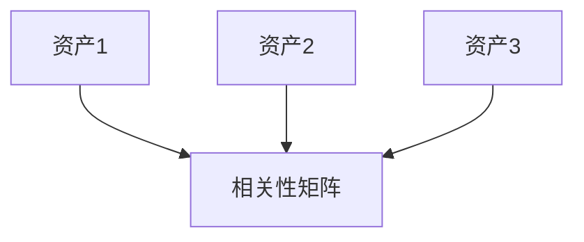
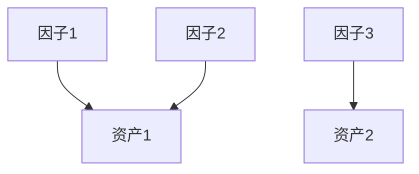

                 


# 特价股票投资中的跨资产类别系统性风险管理

## 关键词：系统性风险管理，跨资产类别，特价股票，VaR，CVaR，因子模型

## 摘要：本文深入探讨了在跨资产类别投资中，如何有效管理和控制系统性风险，尤其是在特价股票投资中。通过理论分析、数学建模、系统架构设计和实际案例，展示了如何利用协方差矩阵、VaR、CVaR等工具进行风险量化和预警，帮助投资者在多变的市场中保持稳健的投资策略。

---

## 第一部分：系统性风险管理概述

### 第1章：系统性风险管理的重要性

#### 1.1 系统性风险的定义与特征
系统性风险是指影响整个金融体系的广泛风险，具有不可分散性和传染性的特点。它来源于市场、经济和政策等多个方面，能够在不同资产类别间传播，导致整体市场的波动。

#### 1.2 跨资产类别投资的基本概念
跨资产类别投资涉及股票、债券、商品等多种资产。每类资产具有不同的风险和回报特征，如股票的高波动性和债券的稳定性。特价股票作为价格较低的股票，通常具有较高的波动性和潜在回报。

#### 1.3 系统性风险管理的核心要素
- **风险识别**：识别影响多个资产的共同风险因素。
- **风险测量**：通过数学模型量化系统性风险。
- **风险控制**：制定策略以降低系统性风险的影响。

---

## 第二部分：数学模型与量化方法

### 第2章：系统性风险的数学模型

#### 2.1 协方差矩阵与相关性分析
协方差矩阵用于衡量不同资产之间的相关性。通过相关性分析，可以识别资产之间的相互影响，进而评估系统性风险。



#### 2.2 因子模型
因子模型将系统性风险分解为几个共同因子，如市场因子、利率因子等。这些因子影响多个资产，帮助识别系统性风险的来源。



#### 2.3 VaR与CVaR的定义与计算
- **VaR**：在特定置信水平下，资产的最大可能损失。
- **CVaR**：VaR水平下的平均损失，用于更全面的风险度量。

公式：
$$ VaR = \alpha \text{分位数} \times \text{标准差} $$
$$ CVaR = E[X | X \geq VaR] $$

---

## 第三部分：系统架构设计

### 第3章：跨资产类别风险管理的系统架构设计

#### 3.1 系统架构目标与功能需求
- **目标**：实时监控和管理跨资产类别的系统性风险。
- **功能需求**：数据采集、风险分析、预警和控制。

#### 3.2 模块划分
- **数据采集与处理模块**：收集各资产类别的实时数据。
- **风险分析与评估模块**：计算相关性、VaR和CVaR等指标。
- **风险预警与控制模块**：设定阈值，触发预警并采取控制措施。

#### 3.3 系统架构实现
- **分层设计**：数据层、业务逻辑层、用户界面层。
- **接口设计**：模块之间的接口定义，确保数据流畅通。
- **交互流程**：用户操作流程，从数据输入到风险控制的全过程。

---

## 第四部分：算法实现

### 第4章：跨资产类别风险管理的算法实现

#### 4.1 算法选择与实现
- 使用因子模型和VaR/CVaR模型进行系统性风险量化。
- 通过协方差矩阵计算相关性，进行风险分解和控制。

#### 4.2 数学模型与公式
$$ \text{协方差矩阵} = E[(X - E[X])(Y - E[Y])] $$
$$ VaR = \alpha \text{分位数} \times \text{标准差} $$
$$ CVaR = E[X | X \geq VaR] $$

#### 4.3 代码实现
```python
import numpy as np

def calculate_var(returns, confidence_level=0.05):
    sorted_returns = np.sort(returns)
    index = np.searchsorted(sorted_returns, (1 - confidence_level) * sorted_returns[-1] + confidence_level * sorted_returns[0])
    var = sorted_returns[index]
    return var

# 示例数据
returns = np.array([0.02, 0.03, -0.01, 0.05, -0.02])
var = calculate_var(returns)
print(f"VaR at {confidence_level} level: {var}")
```

---

## 第五部分：项目实战

### 第5章：跨资产类别风险管理的项目实战

#### 5.1 项目背景与目标
目标：构建一个跨资产类别的系统性风险管理模型，应用于特价股票投资。

#### 5.2 环境安装与配置
安装必要的库：numpy、pandas、scipy等。

#### 5.3 核心代码实现
```python
import numpy as np
import pandas as pd
from scipy.stats import norm

def calculate_varendoscope(returns, confidence_level=0.05):
    sorted_returns = np.sort(returns)
    index = np.searchsorted(sorted_returns, (1 - confidence_level) * sorted_returns[-1] + confidence_level * sorted_returns[0])
    var = sorted_returns[index]
    return var

# 示例数据
returns = np.array([0.02, 0.03, -0.01, 0.05, -0.02])
var = calculate_varendoscope(returns)
print(f"VaR at {confidence_level} level: {var}")
```

#### 5.4 案例分析与解读
通过具体案例，展示系统性风险的识别和控制过程，说明如何利用模型进行风险预警和调整投资组合。

---

## 第六部分：总结与最佳实践

### 第6章：总结与最佳实践

#### 6.1 总结
跨资产类别系统性风险管理的重要性，以及各种数学模型和系统架构在实际中的应用。

#### 6.2 最佳实践
- 数据的准确性和及时性对风险管理至关重要。
- 定期更新模型参数，适应市场变化。
- 结合实际市场情况，灵活调整风险管理策略。

---

## 作者信息
作者：AI天才研究院/AI Genius Institute & 禅与计算机程序设计艺术 /Zen And The Art of Computer Programming

