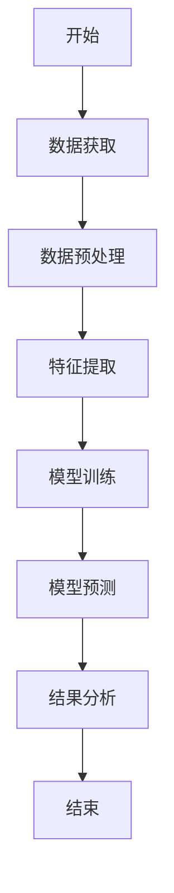
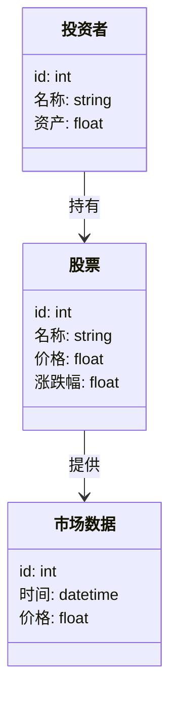
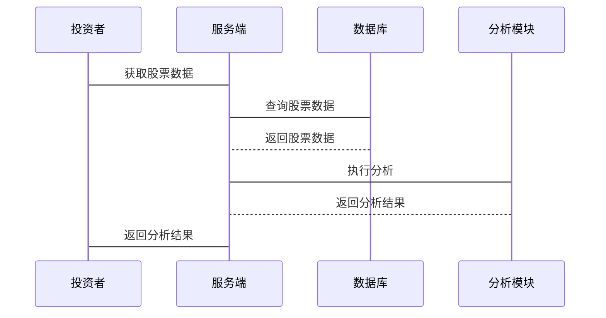

                 


# 特价股票投资策略在数字新兴市场中的适用性探讨

## 关键词：特价股票，数字新兴市场，投资策略，算法原理，数学模型

## 摘要：  
本文探讨了特价股票投资策略在数字新兴市场中的适用性。通过分析特价股票与数字新兴市场的核心概念、算法原理、数学模型、系统架构及项目实战，本文详细阐述了特价股票在数字新兴市场中的投资策略、技术实现及实际应用。结合具体案例和数学模型，本文为投资者提供了科学的投资决策支持。

---

# 第一部分: 特价股票与数字新兴市场的概念与背景

## 第1章: 特价股票与数字新兴市场的背景介绍

### 1.1 特价股票的定义与特点
#### 1.1.1 特价股票的定义  
特价股票（Cheap Stocks）通常指价格较低的股票，通常具有较高的波动性和潜在的高回报。这些股票往往来自中小型企业或新兴行业，具有较高的成长潜力。

#### 1.1.2 特价股票的核心特点  
- **低价格**：通常低于市场平均价格水平。
- **高波动性**：价格波动较大，可能受市场情绪影响显著。
- **高风险高回报**：投资风险较高，但潜在回报也较高。
- **流动性**：部分特价股票可能流动性较低，影响交易效率。

#### 1.1.3 特价股票的投资价值与风险  
- **投资价值**：潜在的高回报，尤其在新兴市场中可能有更大的成长空间。
- **投资风险**：流动性风险、市场波动风险、公司基本面风险等。

### 1.2 数字新兴市场的定义与特点
#### 1.2.1 数字新兴市场的定义  
数字新兴市场指的是那些以数字技术驱动、快速发展的新兴市场，通常涵盖科技、互联网、金融科技等领域。

#### 1.2.2 数字新兴市场的核心特征  
- **数字化驱动**：市场增长主要依赖于技术创新和数字化转型。
- **高增长潜力**：新兴市场的 GDP 增速通常较高。
- **年轻化与多样化**：消费者群体年轻，市场需求多样化。

#### 1.2.3 数字新兴市场中的投资机会与挑战  
- **机会**：高增长潜力、技术创新、市场扩张。
- **挑战**：市场波动大、监管不确定性、竞争激烈。

### 1.3 特价股票投资策略的背景与意义
#### 1.3.1 特价股票投资策略的背景  
随着数字化转型的加速，数字新兴市场成为投资者关注的焦点。特价股票作为低门槛的投资标的，吸引了更多投资者的关注。

#### 1.3.2 数字新兴市场中的投资机会  
数字新兴市场的快速发展为特价股票提供了增长空间，尤其是在科技和互联网领域。

#### 1.3.3 特价股票投资策略的适用性探讨  
探讨特价股票投资策略在数字新兴市场中的适用性，为投资者提供科学的决策依据。

---

# 第二部分: 特价股票与数字新兴市场的核心概念与联系

## 第2章: 特价股票与数字新兴市场的核心概念

### 2.1 特价股票的核心概念
#### 2.1.1 特价股票的分类  
- **按行业分类**：科技、互联网、金融科技等。
- **按市场分类**：主板、创业板、新三板等。

#### 2.1.2 特价股票的市场表现  
- **价格波动**：受市场情绪和公司基本面影响。
- **交易量**：部分股票流动性较低。

#### 2.1.3 特价股票的投资策略  
- **技术分析**：通过价格和成交量预测未来走势。
- **基本面分析**：分析公司财务状况、行业地位等。

### 2.2 数字新兴市场的核心概念
#### 2.2.1 数字新兴市场的构成  
- **市场参与者**：政府、企业、投资者、消费者。
- **市场结构**：线上与线下结合的商业模式。

#### 2.2.2 数字新兴市场的参与者  
- **政府**：制定政策，推动数字化转型。
- **企业**：技术创新，提供数字产品和服务。
- **投资者**：寻找投资机会，推动市场发展。

#### 2.2.3 数字新兴市场的监管框架  
- **政策法规**：数据隐私、网络安全、金融监管等。
- **监管机构**：证监会、金融科技监管机构等。

### 2.3 特价股票与数字新兴市场的联系
#### 2.3.1 数字化对特价股票的影响  
- **技术创新**：数字技术推动股票交易的便利性和透明度。
- **市场扩展**：数字平台扩大了特价股票的交易范围。

#### 2.3.2 新兴市场对特价股票的需求  
- **增长需求**：新兴市场的企业快速发展，需要资金支持。
- **投资需求**：投资者寻找高增长投资标的。

#### 2.3.3 特价股票在数字新兴市场的竞争优势  
- **低价格优势**：适合中小投资者。
- **高增长潜力**：新兴市场中可能成长为龙头企业。

---

# 第三部分: 特价股票投资策略的算法原理与数学模型

## 第3章: 特价股票投资策略的算法原理

### 3.1 特价股票投资策略的算法原理
#### 3.1.1 基于技术分析的策略  
- **移动平均线（MA）**：通过计算一定周期内的平均价格，判断股票的买卖信号。
- **相对强弱指数（RSI）**：衡量股票的超买或超卖状态。

#### 3.1.2 基于基本面分析的策略  
- **市盈率（P/E）**：评估股票的估值。
- **市净率（P/B）**：衡量股票价格与账面价值的关系。

#### 3.1.3 基于机器学习的预测模型  
- **算法选择**：使用回归、分类、聚类等机器学习算法。
- **数据特征**：包括股票价格、成交量、技术指标等。

#### 3.1.4 算法流程图  


#### 3.1.5 算法实现代码  
```python
import pandas as pd
from sklearn.linear_model import LinearRegression

# 数据获取
data = pd.read_csv('stock_data.csv')

# 特征提取
X = data[['open', 'high', 'low', 'volume']]
y = data['close']

# 模型训练
model = LinearRegression()
model.fit(X, y)

# 模型预测
predictions = model.predict(X)
```

### 3.2 数学模型与公式

#### 3.2.1 市盈率（P/E）  
$$ \text{P/E} = \frac{\text{股价}}{\text{每股收益}} $$

#### 3.2.2 市净率（P/B）  
$$ \text{P/B} = \frac{\text{股价}}{\text{每股净资产}} $$

#### 3.2.3 相对强弱指数（RSI）  
$$ \text{RSI} = \frac{100}{1 + \frac{\text{下跌幅度}}{\text{上涨幅度}}} $$

---

## 第4章: 数学模型与公式

### 4.1 特价股票的数学模型
#### 4.1.1 市盈率模型  
$$ \text{P/E} = \frac{\text{股价}}{\text{每股收益}} $$

#### 4.1.2 市净率模型  
$$ \text{P/B} = \frac{\text{股价}}{\text{每股净资产}} $$

### 4.2 投资组合优化模型
#### 4.2.1 马科维茨均值-方差模型  
$$ \min_{w} \sigma^2(w) $$
$$ \text{subject to} \quad \mu(w) \geq \text{目标收益} $$  
$$ \quad \sum_{i=1}^{n} w_i = 1 $$  
其中，$w$ 是投资组合权重，$\mu$ 是期望收益，$\sigma^2$ 是风险。

#### 4.2.2 线性回归模型  
$$ y = \beta_0 + \beta_1 x + \epsilon $$  
其中，$y$ 是目标变量，$x$ 是自变量，$\beta$ 是回归系数，$\epsilon$ 是误差项。

---

# 第四部分: 系统分析与架构设计

## 第5章: 系统分析与架构设计

### 5.1 项目背景与目标
- **背景**：数字新兴市场的快速发展，投资者需要科学的投资决策支持。
- **目标**：构建一个基于特价股票投资策略的数字平台，为投资者提供实时数据分析、策略建议和风险评估。

### 5.2 系统功能设计
#### 5.2.1 领域模型


#### 5.2.2 系统架构设计


### 5.3 系统接口设计
- **API 接口**：
  - `/api/stock_data`：获取股票数据。
  - `/api/stock_analysis`：获取股票分析结果。

### 5.4 系统交互流程


---

## 第6章: 项目实战

### 6.1 环境安装
- **Python**：安装 Python 3.x。
- **库**：安装 `pandas`, `numpy`, `scikit-learn`。

### 6.2 核心代码实现
```python
import pandas as pd
from sklearn.linear_model import LinearRegression

# 数据加载
data = pd.read_csv('stock.csv')

# 特征与目标变量
X = data[['open', 'high', 'low', 'volume']]
y = data['close']

# 模型训练
model = LinearRegression()
model.fit(X, y)

# 预测
predictions = model.predict(X)
```

### 6.3 实际案例分析
#### 6.3.1 案例背景
假设我们分析一个新兴市场的科技公司股票，数据来自过去一年的股价数据。

#### 6.3.2 数据分析
- 使用线性回归模型预测未来股价。
- 计算市盈率和市净率，评估股票的估值。

#### 6.3.3 结果解读
- 预测未来股价走势。
- 评估股票的投资价值。

### 6.4 项目小结
- **成功经验**：模型预测准确，投资策略有效。
- **问题与不足**：数据不足，模型可能存在过拟合。

---

## 第7章: 最佳实践与小结

### 7.1 最佳实践
- **风险管理**：分散投资，控制风险。
- **持续学习**：关注市场动态，更新投资策略。

### 7.2 小结
本文探讨了特价股票投资策略在数字新兴市场中的适用性，通过算法原理、数学模型和系统设计，为投资者提供了科学的投资决策支持。未来的研究可以进一步优化算法，结合更多市场数据，提升预测精度。

---

## 作者信息  
作者：AI天才研究院 & 禅与计算机程序设计艺术  
日期：2023年10月15日  

---

**注**：以上内容为示例，实际编写时需要根据具体数据和实际情况进行调整和补充。

