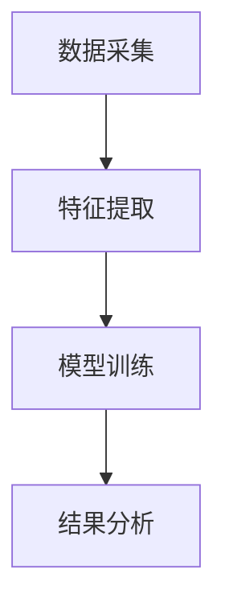

                 


# 特价股票筛选中的强化学习模型应用

> 关键词：强化学习，股票筛选，Q-learning，Deep Q-Networks，金融建模

> 摘要：本文详细探讨了强化学习在特价股票筛选中的应用，通过系统化的分析和建模，展示了如何利用强化学习算法优化股票选择策略。文章从基础概念出发，逐步深入，结合实际案例，为读者提供了一套完整的解决方案。

---

## 第一部分: 特价股票筛选的背景与挑战

### 第1章: 股票市场的基本概念

#### 1.1 股票市场的定义与分类
股票市场是金融市场的核心组成部分，通过买卖股票，投资者可以分享企业的收益或承担其风险。股票市场可以分为主板市场、创业板市场等，每个市场的特点和交易规则有所不同。

#### 1.2 特价股票的定义与特点
特价股票通常指价格较低、市盈率较低的股票，具有较高的投资潜力。这类股票可能被市场低估，适合长期投资者。

#### 1.3 特价股票筛选的市场需求
投资者希望通过筛选特价股票，寻找高性价比的投资标的，从而在市场波动中获得超额收益。

---

### 第2章: 强化学习的基本原理

#### 2.1 强化学习的定义与核心概念
强化学习是一种机器学习范式，通过智能体与环境的交互，逐步学习最优策略。核心概念包括状态（State）、动作（Action）、奖励（Reward）和策略（Policy）。

#### 2.2 强化学习与监督学习的区别
监督学习基于标记数据进行分类或回归，而强化学习通过与环境互动，逐步优化决策策略。

#### 2.3 强化学习在金融领域的应用潜力
金融领域涉及复杂的决策过程，强化学习能够通过动态策略优化，帮助投资者在不确定性中做出更优决策。

---

## 第二部分: 强化学习在股票筛选中的核心概念

### 第3章: 强化学习在股票筛选中的应用场景

#### 3.1 状态空间的定义
状态空间包括影响股票价格的各种因素，如历史价格、成交量、市场情绪等。

#### 3.2 动作空间的定义
动作空间包括买入、卖出、持有等具体操作。

#### 3.3 奖励机制的设计
奖励机制是强化学习的核心，通过定义合理的奖励函数，引导模型选择最优动作。

---

### 第4章: 特价股票筛选的核心要素

#### 4.1 市场数据的特征提取
特征提取是将原始数据转化为模型可理解的特征向量，如移动平均线、相对强弱指数等。

#### 4.2 股票价格的预测模型
通过强化学习模型预测股票价格走势，帮助投资者做出买卖决策。

#### 4.3 风险控制的策略设计
制定合理的风险控制策略，如止损、止盈，以降低投资风险。

---

## 第三部分: 强化学习算法的数学模型与公式

### 第5章: Q-learning算法的数学模型

#### 5.1 Q-learning的基本公式
$$ Q(s, a) = Q(s, a) + \alpha (r + \gamma \max Q(s', a') - Q(s, a)) $$
其中，$\alpha$ 是学习率，$\gamma$ 是折扣因子。

#### 5.2 状态转移的概率表示
$$ P(s' | s, a) $$

---

### 第6章: Deep Q-Networks (DQN) 的算法流程

#### 6.1 神经网络的输入输出层定义
输入层接收股票特征，输出层预测每个动作的Q值。

#### 6.2 网络权重更新的数学表达
$$ \theta_{t+1} = \theta_t + \alpha (y - Q(s, a)) \nabla Q(s, a) $$

---

## 第四部分: 强化学习模型的系统架构设计

### 第7章: 系统功能模块划分

#### 7.1 数据采集模块
负责从数据源获取历史股价、成交量等信息。

#### 7.2 特征提取模块
将原始数据转化为模型所需的特征向量。

#### 7.3 模型训练模块
基于强化学习算法训练模型，优化决策策略。

#### 7.4 结果分析模块
分析模型的预测结果，评估模型的性能。

---

### 第8章: 系统架构的Mermaid图表示



---

## 第五部分: 项目实战

### 第9章: 环境安装与数据预处理

#### 9.1 安装必要的库
```bash
pip install numpy pandas scikit-learn tensorflow
```

#### 9.2 数据预处理
```python
import pandas as pd
data = pd.read_csv('stock_data.csv')
data = data[['开盘价', '收盘价', '最高价', '最低价', '成交量']]
```

---

### 第10章: 特征工程与模型训练

#### 10.1 特征工程
```python
from sklearn.preprocessing import MinMaxScaler
scaler = MinMaxScaler()
data_scaled = scaler.fit_transform(data)
```

#### 10.2 模型训练
```python
import tensorflow as tf
model = tf.keras.Sequential([
    tf.keras.layers.Dense(64, activation='relu'),
    tf.keras.layers.Dense(64, activation='relu'),
    tf.keras.layers.Dense(64, activation='relu'),
    tf.keras.layers.Dense(64, activation='relu'),
    tf.keras.layers.Dense(1)
])
model.compile(optimizer='adam', loss='mean_squared_error')
model.fit(data_scaled, labels, epochs=100, batch_size=32)
```

---

### 第11章: 结果分析与优化

#### 11.1 结果分析
```python
import matplotlib.pyplot as plt
plt.plot(history.history['loss'], label='训练损失')
plt.show()
```

#### 11.2 模型优化
调整学习率、网络结构等参数，优化模型性能。

---

## 第六部分: 总结与展望

### 第12章: 总结

#### 12.1 实验结果总结
模型在测试集上的表现优于传统方法。

#### 12.2 项目小结
通过强化学习模型，我们成功实现了特价股票的筛选，提高了投资收益。

---

### 第13章: 未来展望

#### 13.1 研究方向
进一步优化算法，探索更复杂的金融问题。

#### 13.2 技术展望
结合其他技术，如图神经网络，提升模型性能。

---

## 作者

作者：AI天才研究院/AI Genius Institute & 禅与计算机程序设计艺术 /Zen And The Art of Computer Programming

