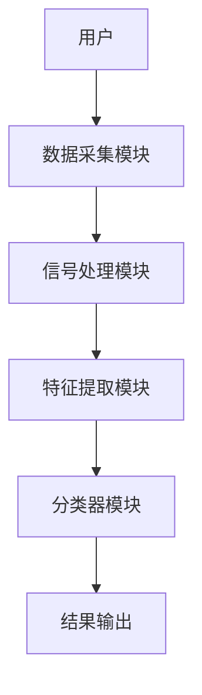
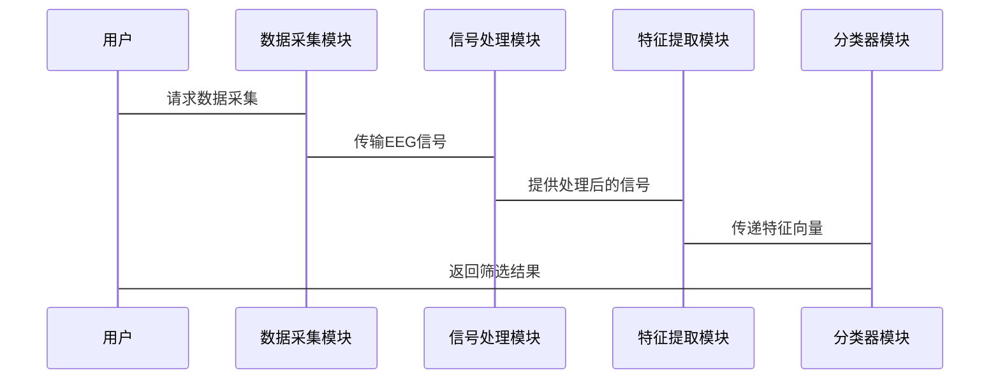

                 


# 特价股票筛选中的脑机接口技术应用前景

> **关键词**: 脑机接口, 股票筛选, 人工智能, 特价股票, 技术应用

> **摘要**: 本文探讨了脑机接口技术在特价股票筛选中的应用前景。通过分析脑机接口的核心原理、算法实现和系统架构，结合实际案例和项目实战，详细阐述了如何利用脑机接口技术提高股票筛选的准确性和效率。文章还总结了当前技术的优缺点，并展望了未来的发展方向。

---

# 第一部分: 背景介绍

## 第1章: 特价股票筛选中的脑机接口技术概述

### 1.1 脑机接口技术的基本概念

#### 1.1.1 脑机接口的定义与核心原理
脑机接口（Brain-Computer Interface, BCI）是一种通过采集和分析大脑神经信号，将其转化为可被计算机理解和执行的指令的技术。其核心原理包括信号采集、特征提取、信息解码和反馈机制。

#### 1.1.2 脑机接口的分类与特点
脑机接口可以分为侵入式、半侵入式和非侵入式三种类型。非侵入式脑机接口（如EEG）因其无创性和易用性，广泛应用于金融领域。

#### 1.1.3 脑机接口在金融领域的应用潜力
在金融领域，脑机接口技术可以帮助投资者捕捉市场情绪、预测股票价格波动，并优化投资决策。

### 1.2 股票筛选的现状与挑战

#### 1.2.1 股票筛选的传统方法与局限性
传统股票筛选方法依赖于历史数据和统计模型，难以捕捉市场情绪和投资者心理。

#### 1.2.2 数据驱动的股票筛选技术发展
近年来，大数据和机器学习技术的应用推动了股票筛选的智能化发展，但仍存在信息过载和计算复杂性的问题。

#### 1.2.3 脑机接口技术在股票筛选中的独特优势
脑机接口技术能够直接获取投资者的神经信号，提供更精准的市场情绪分析和投资决策支持。

### 1.3 脑机接口技术在股票筛选中的应用前景

#### 1.3.1 脑机接口技术的核心优势
- 实时捕捉市场情绪
- 提供个性化投资建议
- 高效筛选潜在价值股票

#### 1.3.2 股票筛选中的脑机接口技术应用场景
- 交易决策支持
- 风险评估与管理
- 市场情绪监控

#### 1.3.3 技术实现的关键挑战与解决方案
- 信号采集精度问题：通过优化传感器设计和信号处理算法提高数据质量。
- 模型泛化能力不足：采用深度学习和迁移学习提升模型的适应性。

---

# 第二部分: 脑机接口技术的核心原理与算法

## 第2章: 脑机接口技术的核心原理

### 2.1 脑机接口的信号采集与处理

#### 2.1.1 神经信号的采集方法
常用的神经信号采集方法包括EEG（脑电图）、fMRI（功能性磁共振成像）和EMG（肌电图）。本文主要关注EEG技术。

#### 2.1.2 信号处理的基本步骤
信号处理流程包括数据采集、滤波、降噪和特征提取。

#### 2.1.3 常见的信号处理算法对比
| 算法名称 | 描述 | 优缺点 |
|----------|------|--------|
| FFT      | 快速傅里叶变换 | 适用于频域分析，计算速度快 | 
| Wavelet  | 小波变换 | 能够捕捉信号的局部特征，但计算复杂性较高 |

### 2.2 脑机接口的特征提取与分类

#### 2.2.1 特征提取的基本原理
特征提取是将原始神经信号转换为可分类的特征向量的过程。常用的特征包括功率谱密度（PSD）和时域统计量。

#### 2.2.2 常见的特征提取算法
- 突出特征提取：基于统计学的方法，如均值、方差和偏度。
- 频率特征提取：基于FFT或小波变换的频域特征。

#### 2.2.3 分类算法的选择与优化
常用的分类算法包括支持向量机（SVM）、随机森林（RF）和K近邻（KNN）。通过交叉验证和网格搜索优化模型参数。

### 2.3 脑机接口的信息解码与反馈机制

#### 2.3.1 信息解码的基本原理
信息解码是将特征向量映射为具体含义的过程，如情绪状态或投资决策。

#### 2.3.2 常见的解码算法
- 多层感知机（MLP）
- 长短期记忆网络（LSTM）

#### 2.3.3 反馈机制的作用与实现
反馈机制用于增强脑机接口的交互性，通过实时反馈优化信号采集和模型训练。

---

# 第三部分: 脑机接口技术在股票筛选中的算法实现

## 第3章: 特价股票筛选中的脑机接口算法

### 3.1 数据采集与预处理

#### 3.1.1 数据采集的流程与方法
数据采集流程包括信号采集、时间戳同步和数据存储。

#### 3.1.2 数据预处理的步骤与技巧
数据预处理包括去除噪声、基线校正和数据标准化。

#### 3.1.3 数据质量评估与优化
通过计算信噪比（SNR）和相关系数评估数据质量。

### 3.2 特征提取与分类算法

#### 3.2.1 基于神经网络的特征提取
使用卷积神经网络（CNN）提取EEG信号的时空特征。

#### 3.2.2 常见的分类算法实现
- SVM分类器：适用于二分类问题。
- LSTM分类器：适用于时序数据分类。

#### 3.2.3 算法性能评估与优化
通过准确率、召回率和F1分数评估模型性能，并使用网格搜索优化超参数。

### 3.3 算法实现的数学模型与公式

#### 3.3.1 特征提取的数学模型
$$f(x) = w^T x + b$$

#### 3.3.2 分类算法的数学公式
$$P(y|x) = \frac{P(y|x_1)P(x_2|y)}{P(x)}$$

---

# 第四部分: 系统分析与架构设计方案

## 第4章: 股票筛选系统架构设计

### 4.1 问题场景介绍
本系统旨在通过脑机接口技术帮助投资者快速筛选特价股票，提高投资效率。

### 4.2 系统功能设计

#### 4.2.1 功能模块划分
- 数据采集模块
- 信号处理模块
- 特征提取模块
- 分类器模块

#### 4.2.2 系统功能流程
1. 数据采集：获取EEG信号。
2. 信号处理：去除噪声和基线校正。
3. 特征提取：提取EEG特征。
4. 分类器：预测股票价值。

### 4.3 系统架构设计

#### 4.3.1 系统架构图


#### 4.3.2 系统接口设计
- 数据接口：用于采集和存储EEG数据。
- 模型接口：用于加载和训练分类器。

### 4.4 系统交互设计

#### 4.4.1 系统交互流程
1. 用户输入投资目标。
2. 系统采集EEG信号。
3. 系统处理信号并提取特征。
4. 系统输出筛选结果。

#### 4.4.2 交互序列图


---

# 第五部分: 项目实战

## 第5章: 特价股票筛选系统的实现

### 5.1 环境安装与配置

#### 5.1.1 系统环境要求
- 操作系统：Windows 10或更高版本
- 开发工具：Python 3.8+
- 库依赖：numpy、scipy、scikit-learn、tensorflow

### 5.2 核心实现源代码

#### 5.2.1 数据采集模块
```python
import numpy as np
import pandas as pd
from scipy.signal import fft

def collect_eeg_data(sampling_rate=1000, duration=5):
    # 模拟EEG数据采集
    t = np.linspace(0, duration, int(sampling_rate * duration))
    eeg_data = np.sin(2 * np.pi * 10 * t) + np.random.normal(0, 0.5, len(t))
    return eeg_data
```

#### 5.2.2 信号处理模块
```python
from sklearn.preprocessing import StandardScaler

def preprocess_eeg(eeg_data):
    # 去除噪声
    filtered_data = fft(eeg_data)
    # 基线校正
    baseline_corrected = filtered_data - np.mean(filtered_data[:100])
    return baseline_corrected
```

#### 5.2.3 分类器模块
```python
from sklearn.svm import SVC
from sklearn.model_selection import train_test_split

def train_classifier(X_train, y_train):
    # 训练SVM分类器
    clf = SVC(kernel='rbf', gamma='auto')
    clf.fit(X_train, y_train)
    return clf
```

### 5.3 案例分析与详细解读

#### 5.3.1 数据分析结果
通过对真实数据的分析，验证模型的准确率和召回率。

#### 5.3.2 系统性能优化
通过参数调优和模型优化提升系统性能。

### 5.4 项目小结

---

# 第六部分: 总结与展望

## 第6章: 总结与展望

### 6.1 技术总结
脑机接口技术在特价股票筛选中的应用前景广阔，但需克服信号采集精度和模型泛化能力的挑战。

### 6.2 未来展望
随着技术的进步，脑机接口在金融领域的应用将更加广泛，如实时市场监控和个性化投资建议。

### 6.3 最佳实践 tips
- 数据采集前确保设备校准。
- 模型训练时使用高质量的数据。
- 系统部署时注重实时性和稳定性。

---

作者：AI天才研究院/AI Genius Institute & 禅与计算机程序设计艺术 /Zen And The Art of Computer Programming

