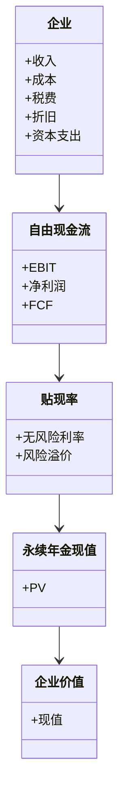
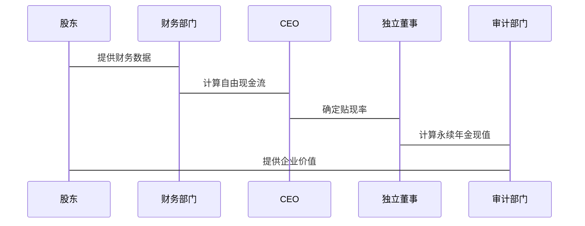

                 


# 现金流折现模型：企业内在价值的科学估算方法

> 关键词：现金流折现模型，企业内在价值，自由现金流，贴现率，永续年金，投资评估，金融建模

> 摘要：现金流折现模型（DCF）是一种广泛应用的估值方法，通过将未来现金流折现到现值来估算企业的内在价值。本文详细探讨了DCF模型的核心概念、数学原理、系统架构以及实际应用，帮助读者理解如何科学地估算企业价值。

---

## 第1章: 现金流折现模型概述

### 1.1 现金流折现模型的定义与背景

#### 1.1.1 什么是现金流折现模型
现金流折现模型（Discounted Cash Flow，简称DCF）是一种用于估算企业或项目内在价值的金融建模方法。其核心思想是将企业未来产生的所有现金流折现到当前时点的现值，以此作为企业或项目的估值依据。

#### 1.1.2 DCF模型的起源与发展
DCF模型的理论基础可以追溯到18世纪的利息计算方法，但在现代金融学中，它的发展与威廉·戈登（William Gordon）提出的股息折现模型（Gordon Growth Model）密切相关。20世纪中叶，DCF模型逐渐成为企业估值的核心工具之一。

#### 1.1.3 DCF模型的应用领域
DCF模型广泛应用于企业并购、投资决策、股权定价等领域。它不仅适用于成熟企业，也适用于新兴企业，但需要基于合理的假设和数据支持。

---

### 1.2 企业内在价值的定义与特点

#### 1.2.1 企业内在价值的定义
企业内在价值是指企业在持续经营条件下，能够为股东创造的现金流量的现值。它是企业未来现金流的贴现值之和，反映了企业的真实价值。

#### 1.2.2 内在价值与市场价值的区别
- 内在价值是理论上的估值，不受市场波动影响。
- 市场价值是实际交易价格，可能高于或低于内在价值。

#### 1.2.3 DCF模型在内在价值估算中的作用
DCF模型通过预测未来现金流并折现，为估算企业内在价值提供了科学的方法。

---

### 1.3 DCF模型的核心假设

#### 1.3.1 现金流的可预测性
现金流预测需要基于合理的假设，如收入增长率、利润率和资本支出等。

#### 1.3.2 贴现率的合理性
贴现率反映了资金的时间价值，通常由无风险利率和风险溢价组成。

#### 1.3.3 永续年金假设
DCF模型假设企业在永续经营，未来现金流可以视为永续年金。

---

### 1.4 DCF模型的优缺点

#### 1.4.1 DCF模型的优点
- 提供了科学的估值方法。
- 能够反映企业的未来盈利能力。

#### 1.4.2 DCF模型的局限性
- 现金流预测存在不确定性。
- 贴现率的选择影响估值结果。

#### 1.4.3 DCF模型的适用场景
适用于企业并购、长期投资决策等领域。

---

## 第2章: 现金流折现模型的核心概念

### 2.1 自由现金流的定义与计算

#### 2.1.1 自由现金流的定义
自由现金流（Free Cash Flow，FCF）是指企业在扣除所有支出后，可用于偿还债务、分红或再投资的现金流量。

#### 2.1.2 自由现金流的计算公式
$$ \text{FCF} = \text{EBIT} \times (1 - \text{税率}) + \text{折旧} - \text{资本支出} $$

#### 2.1.3 自由现金流与净利润的区别
- 净利润考虑了非现金支出，如折旧和摊销。
- 自由现金流更关注企业的实际现金流情况。

---

### 2.2 贴现率的定义与计算

#### 2.2.1 贴现率的定义
贴现率是将未来现金流折现到现值的利率，反映了资金的时间价值和风险溢价。

#### 2.2.2 贴现率的计算方法
贴现率通常由无风险利率和企业特定风险溢价组成。

#### 2.2.3 贴现率的影响因素
- 无风险利率
- 通货膨胀率
- 企业风险水平

---

### 2.3 永续年金公式与应用

#### 2.3.1 永续年金的定义
永续年金是指无限期按固定金额支付的年金。

#### 2.3.2 永续年金的计算公式
$$ PV = \frac{C}{r} $$
其中，$C$ 是每期现金流，$r$ 是贴现率。

#### 2.3.3 永续年金在DCF模型中的应用
用于估算企业永续经营下的现金流现值。

---

### 2.4 核心概念对比表格

| 概念       | 自由现金流 | 净利润 |
|------------|------------|--------|
| 定义       | 可用于再投资的现金流 | 企业盈利的会计指标 |
| 计算公式   | $$ FCF = EBIT \times (1 - \text{税率}) + \text{折旧} - \text{资本支出} $$ | $$ \text{净利润} = \text{收入} - \text{成本} - \text{税费} $$ |
| 区别       | 更关注现金流 | 更关注利润 |

---

## 第3章: 现金流折现模型的数学模型与公式

### 3.1 自由现金流的数学模型

#### 3.1.1 自由现金流的计算公式
$$ FCF = \text{EBIT} \times (1 - \text{税率}) + \text{折旧} - \text{资本支出} $$

#### 3.1.2 自由现金流的假设条件
- 稳定的收入增长率
- 稳定的利润率

#### 3.1.3 自由现金流的验证方法
通过历史数据对比和趋势分析验证预测的合理性。

---

### 3.2 贴现率的数学模型

#### 3.2.1 贴现率的计算公式
$$ r = r_f + \text{风险溢价} $$
其中，$r_f$ 是无风险利率。

#### 3.2.2 贴现率的敏感性分析
通过改变贴现率，观察对企业价值的影响。

#### 3.2.3 贴现率的验证方法
参考市场平均收益率或行业平均水平。

---

### 3.3 永续年金的数学模型

#### 3.3.1 永续年金的计算公式
$$ PV = \frac{C}{r} $$

#### 3.3.2 永续年金的假设条件
- 现金流恒定
- 贴现率恒定

#### 3.3.3 永续年金的验证方法
通过历史数据分析现金流的稳定性。

---

## 第4章: 现金流折现模型的系统分析与架构设计

### 4.1 问题场景介绍
假设我们是一家科技公司，需要评估其未来现金流。

### 4.2 系统功能设计

#### 4.2.1 领域模型（Mermaid 类图）


---

### 4.3 系统架构设计

#### 4.3.1 系统架构（Mermaid 架构图）
```mermaid
archi
    股东 <--> 财务部门
    财务部门 <--> CEO
    CEO <--> 独立董事
    独立董事 <--> 审计部门
```

---

### 4.4 系统接口设计

#### 4.4.1 接口描述
- 输入：财务数据、市场数据
- 输出：企业价值估算结果

---

### 4.5 系统交互（Mermaid 序列图）



---

## 第5章: 现金流折现模型的项目实战

### 5.1 环境安装

#### 5.1.1 安装工具
- 使用Excel或Python（如Pandas、NumPy）进行计算。

#### 5.1.2 数据准备
- 收入数据
- 成本数据
- 税费数据
- 折旧数据
- 资本支出数据

---

### 5.2 核心代码实现

#### 5.2.1 Python代码示例
```python
def calculate_fcf(revenue, cost, tax, depreciation, capital_expenditure):
    ebit = revenue - cost
    fcf = ebit * (1 - tax) + depreciation - capital_expenditure
    return fcf

def calculate_discount_rate(risk_free_rate, risk_premium):
    return risk_free_rate + risk_premium

def calculate_pv(cash_flow, discount_rate):
    return cash_flow / discount_rate
```

#### 5.2.2 代码解读与分析
- `calculate_fcf`：计算自由现金流。
- `calculate_discount_rate`：计算贴现率。
- `calculate_pv`：计算永续年金的现值。

---

### 5.3 实际案例分析

#### 5.3.1 案例背景
假设某科技公司未来每年的自由现金流为 $100万，贴现率为10%。

#### 5.3.2 案例计算
$$ PV = \frac{100}{0.10} = 1000万 $$

#### 5.3.3 案例结论
企业的内在价值为1000万元。

---

## 第6章: 现金流折现模型的最佳实践与注意事项

### 6.1 最佳实践

#### 6.1.1 数据来源
- 使用可靠的财务数据
- 考虑行业趋势

#### 6.1.2 模型假设
- 合理假设收入增长率
- 考虑企业风险

### 6.2 小结

#### 6.2.1 核心要点
- 现金流预测的准确性
- 贴现率的合理性

#### 6.2.2 模型局限性
- 预测误差
- 假设条件的敏感性

---

## 第7章: 现金流折现模型的扩展阅读

### 7.1 高级应用

#### 7.1.1 并购重组中的DCF模型
用于评估企业并购的价值。

#### 7.1.2 国际业务的DCF模型
考虑汇率和国际市场的差异。

### 7.2 替代估值方法

#### 7.2.1 相对估值法
基于可比公司的市盈率或市净率进行估值。

#### 7.2.2 股权资本定价模型（CAPM）
用于估算贴现率。

---

## 作者信息

作者：AI天才研究院/AI Genius Institute & 禅与计算机程序设计艺术 /Zen And The Art of Computer Programming

---

通过本文，读者可以系统地了解现金流折现模型的核心概念、数学原理和实际应用，掌握如何科学地估算企业内在价值。希望本文能为读者在金融建模和投资决策中提供有价值的参考。

