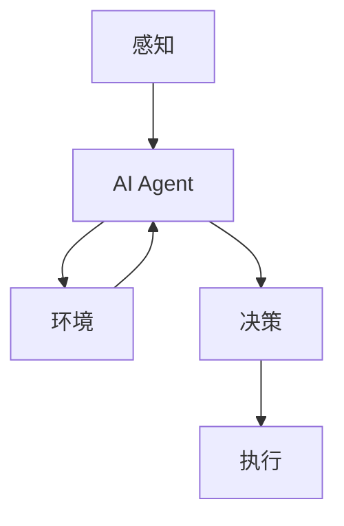
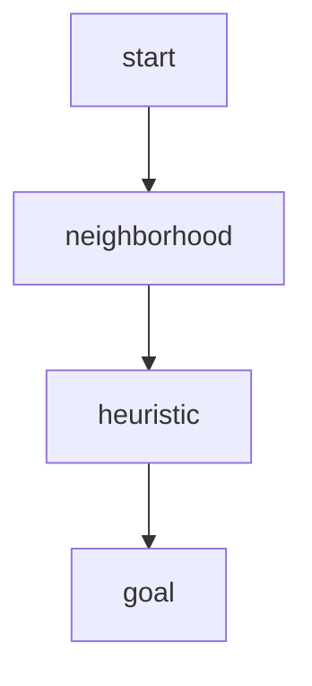
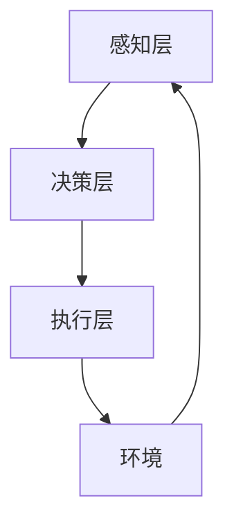
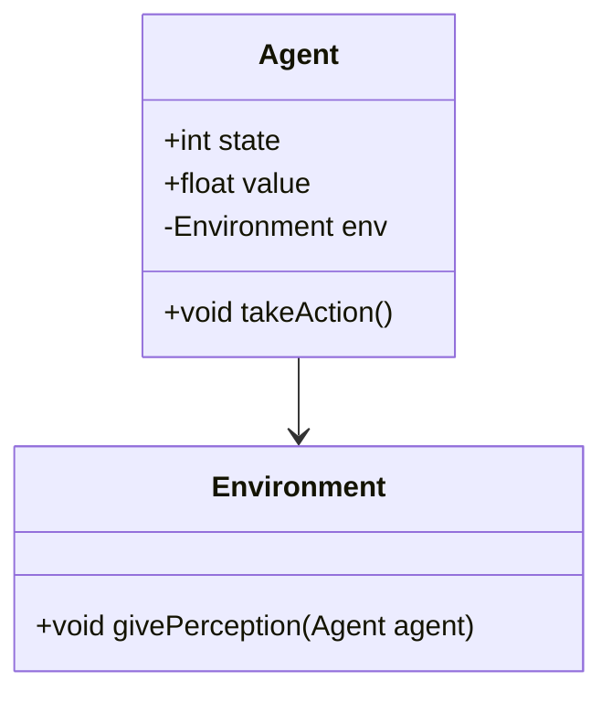

                 


# 理解AI Agent：核心概念与基本原理

**关键词**：AI Agent, 智能体, 人工智能, 算法原理, 系统架构, 项目实战

**摘要**：  
本文深入探讨AI Agent的核心概念、基本原理及其在实际应用中的实现。通过逐步分析，我们从背景介绍、核心概念、算法原理到系统架构和项目实战，全面解析AI Agent的内在逻辑和应用场景。文章结合理论与实践，帮助读者理解AI Agent的本质，并掌握其在复杂系统中的设计与实现方法。

---

## 第一部分：AI Agent 背景介绍

### 第1章：AI Agent 的核心概念

#### 1.1 问题背景与描述
AI Agent（人工智能智能体）的概念起源于人工智能领域的研究，旨在构建能够在复杂环境中自主决策、执行任务的智能实体。随着人工智能技术的快速发展，AI Agent的应用场景日益广泛，涵盖自动驾驶、智能助手、机器人控制、游戏AI等领域。理解AI Agent的核心概念和基本原理，对于开发高效、智能的系统具有重要意义。

#### 1.2 AI Agent的定义与特点
AI Agent是指能够感知环境、自主决策并执行任务的智能实体。它具备以下特点：
- **自主性**：能够在没有外部干预的情况下独立运作。
- **反应性**：能够根据环境的变化实时调整行为。
- **目标导向性**：通过设定目标，驱动智能体的行为。
- **社会性**：能够与其他智能体或人类进行交互与协作。

#### 1.3 AI Agent的边界与外延
AI Agent的边界在于其智能性和自主性。与其他相关概念（如智能系统、专家系统）的区别在于，AI Agent强调与环境的动态交互，而非单纯的静态知识处理。外延上，AI Agent可以是软件程序、机器人或其他具备智能行为的实体。

#### 1.4 AI Agent的概念结构与核心要素
AI Agent的概念结构可以分为感知层、决策层和执行层。核心要素包括：
- **感知**：通过传感器或数据输入获取环境信息。
- **决策**：基于感知信息，通过算法做出决策。
- **执行**：根据决策结果，执行实际操作。

---

## 第二部分：AI Agent的核心概念与基本原理

### 第2章：AI Agent的核心概念与联系

#### 2.1 核心概念原理
AI Agent的核心在于其感知、决策和执行能力。感知层通过传感器获取环境信息，决策层基于这些信息做出最优选择，执行层将决策转化为具体行动。

#### 2.2 概念属性特征对比
以下是AI Agent与相关概念的对比表格：

| 概念      | 自主性 | 反应性 | 目标导向性 | 社会性 |
|-----------|--------|--------|------------|--------|
| AI Agent  | 高     | 高     | 高          | 高     |
| 专家系统  | 低     | 低     | 高          | 低     |
| 知识库    | 无     | 无     | 无          | 无     |

#### 2.3 实体关系图（Mermaid）



---

### 第3章：AI Agent的算法原理

#### 3.1 经典算法解析

##### 3.1.1 A*搜索算法
A*是一种常用的路径规划算法，结合了贪心算法和Dijkstra算法的优点。其流程如下：



Python实现示例：
```python
def a_star_search(graph, start, goal):
    open_set = {start}
    came_from = {}
    g_score = {start: 0}
    f_score = {start: heuristic(start, goal)}
    
    while open_set:
        current = pop(open_set, f_score)
        if current == goal:
            break
        for neighbor in graph.neighbors(current):
            tentative_g_score = g_score[current] + graph.weight(current, neighbor)
            if neighbor not in g_score or tentative_g_score < g_score[neighbor]:
                came_from[neighbor] = current
                g_score[neighbor] = tentative_g_score
                f_score[neighbor] = g_score[neighbor] + heuristic(neighbor, goal)
    return came_from, g_score
```

##### 3.1.2 Q-learning算法
Q-learning是一种基于强化学习的算法，用于在未知环境中寻找最优策略。其更新公式为：

$$ Q(s, a) = (1-\alpha)Q(s,a) + \alpha[r + \max_{a'} Q(s', a')] $$

Python实现示例：
```python
import numpy as np

class QLearning:
    def __init__(self, state_space, action_space, alpha=0.1, gamma=0.9):
        self.Q = np.zeros((state_space, action_space))
        self.alpha = alpha
        self.gamma = gamma

    def update(self, state, action, reward, next_state):
        self.Q[state, action] = self.Q[state, action] + self.alpha * (reward + self.gamma * np.max(self.Q[next_state, :]) - self.Q[state, action])
```

---

### 第4章：数学模型与公式

#### 4.1 Q-learning的数学模型
Q-learning的核心在于更新智能体在状态-动作对上的价值函数。公式推导如下：

$$ Q_{t+1}(s, a) = Q_t(s, a) + \alpha [r + \gamma \max_a Q_t(s', a) - Q_t(s, a)] $$

其中：
- $\alpha$ 是学习率
- $\gamma$ 是折扣因子
- $r$ 是奖励值

#### 4.2 DQN的网络结构
DQN（Deep Q-Network）通过深度神经网络近似Q值函数。网络结构包括输入层、隐藏层和输出层。损失函数为：

$$ L = \frac{1}{N}\sum_{i=1}^{N}(y_i - Q(s_i,a_i))^2 $$

其中：
- $y_i = r_i + \gamma \max Q(s_i', a')$
- $Q(s_i,a_i)$ 是预测值

---

## 第三部分：系统分析与架构设计

### 第5章：AI Agent的系统架构

#### 5.1 系统架构设计
AI Agent的系统架构通常包括感知层、决策层和执行层。系统架构图如下：



#### 5.2 领域模型设计
领域模型是系统设计的重要部分，通常使用类图表示：



---

## 第四部分：项目实战

### 第6章：AI Agent的项目实战

#### 6.1 项目介绍
以智能助手为例，设计一个基于NLU（自然语言理解）和对话系统的AI Agent。

#### 6.2 核心代码实现
实现一个简单的智能助手：

```python
class AIAssistant:
    def __init__(self):
        self.nlu = NLUProcessor()
        self.dialogue = DialogueManager()

    def process_query(self, user_input):
        intent = self.nlu.intent_detection(user_input)
        response = self.dialogue.generate_response(intent)
        return response
```

---

## 第五部分：总结与展望

### 第7章：总结与展望

#### 7.1 总结
本文全面介绍了AI Agent的核心概念、算法原理和系统架构。通过理论与实践的结合，帮助读者理解AI Agent的本质。

#### 7.2 最佳实践
- 理解AI Agent的核心概念和数学模型是基础。
- 实际应用中，需结合具体场景选择合适的算法。
- 系统设计时，注重模块化和可扩展性。

#### 7.3 展望
未来，AI Agent将在更多领域发挥重要作用，如边缘计算、智能城市等。深度学习和强化学习的结合将推动AI Agent技术的进一步发展。

---

**作者：AI天才研究院/AI Genius Institute & 禅与计算机程序设计艺术 /Zen And The Art of Computer Programming**

