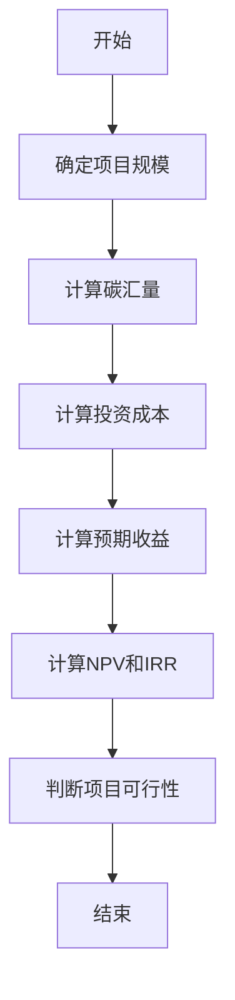
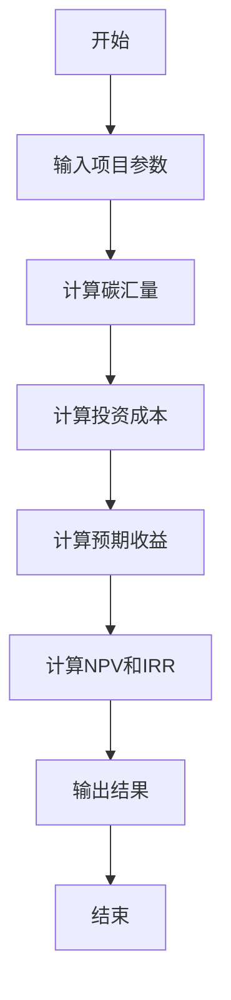
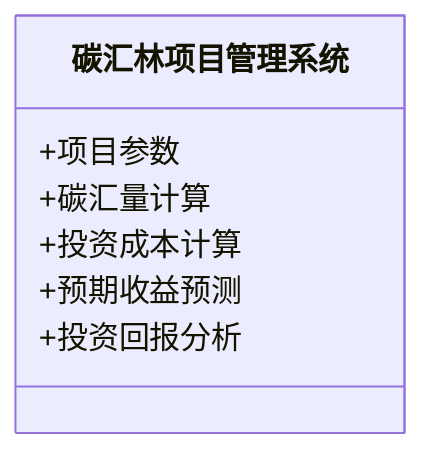
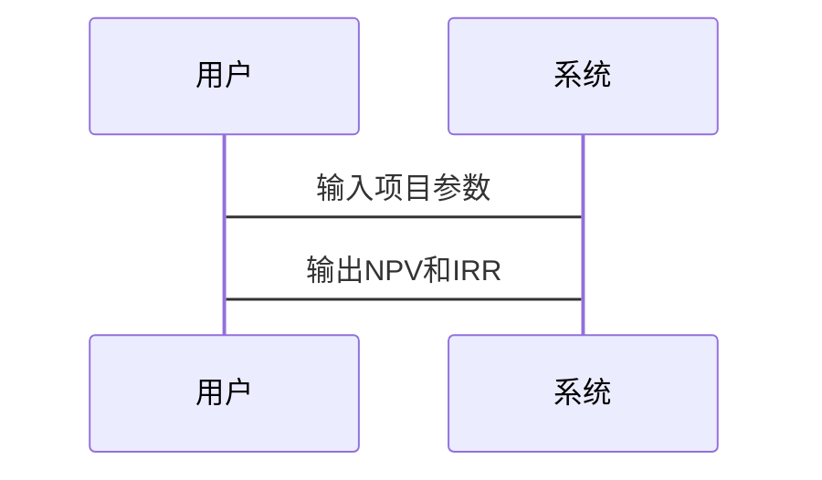

                 

# 生态修复与碳汇林项目的投资回报分析

> 关键词：生态修复，碳汇林，投资回报，碳汇量，净现值（NPV），内部收益率（IRR）

> 摘要：本文详细探讨了生态修复与碳汇林项目的投资回报分析，从生态修复和碳汇林的基本概念出发，结合数学模型与算法，分析了碳汇林项目的投资回报影响因素，提出了生态修复与碳汇林项目结合的最佳实践方案。文章通过实际案例分析，深入探讨了碳汇林项目的实施过程、系统架构设计以及投资回报的计算方法，为投资者提供了实用的决策支持。

---

# 第一部分: 生态修复与碳汇林项目概述

## 第1章: 生态修复与碳汇林的基本概念

### 1.1 生态修复的背景与意义

#### 1.1.1 生态修复的定义与内涵
生态修复是指通过人为干预和自然恢复相结合的方式，修复因人类活动或自然因素导致的生态系统退化，恢复其生态功能和生产力的过程。生态修复的核心目标是恢复生态系统的健康和稳定性，同时实现经济效益与环境效益的双赢。

#### 1.1.2 生态修复的必要性与目标
随着工业化和城市化的快速发展，全球范围内生态系统遭受了严重的破坏，包括森林减少、水土流失、生物多样性降低等问题。生态修复不仅是环境保护的需要，也是实现可持续发展的必然要求。生态修复的目标包括：
- 恢复生态系统的结构和功能；
- 提高生态系统的碳汇能力；
- 促进区域经济的可持续发展。

#### 1.1.3 生态修复的国内外发展现状
国内外在生态修复领域已经取得了显著的进展。例如，中国的“退耕还林”政策有效恢复了部分地区的森林资源；国际上，联合国粮农组织（FAO）和世界自然保护联盟（IUCN）等机构积极推动全球生态修复项目。生态修复已经成为全球关注的热点问题。

### 1.2 碳汇林的定义与特点

#### 1.2.1 碳汇与碳汇林的定义
碳汇是指通过植物的光合作用吸收和固定二氧化碳的过程。碳汇林则是指以碳汇为目的，通过种植和管理森林来实现碳汇功能的林地。碳汇林的核心作用是通过吸收二氧化碳，减缓全球气候变化。

#### 1.2.2 碳汇林的生态功能与经济价值
碳汇林不仅具有重要的生态功能，如固碳、释氧、调节气候等，还具有经济价值。碳汇林可以通过碳交易市场获得经济收益，同时还能提供木材、非木质林产品等经济收入。

#### 1.2.3 碳汇林与传统林业的区别
碳汇林与传统林业的主要区别在于目标和管理方式。传统林业主要以木材生产为目标，而碳汇林则以碳汇功能为核心目标，强调生态效益和经济效益的结合。

### 1.3 生态修复与碳汇林的关系

#### 1.3.1 生态修复对碳汇林的促进作用
生态修复通过恢复生态系统结构和功能，为碳汇林的生长提供了良好的环境条件，如改善土壤质量、增加生物多样性等。

#### 1.3.2 碳汇林在生态修复中的地位
碳汇林是生态修复的重要组成部分，通过碳汇功能的实现，可以有效提高生态修复的效益，同时减少碳排放，缓解气候变化。

#### 1.3.3 两者结合的协同效应
生态修复与碳汇林的结合不仅可以实现生态效益的最大化，还可以通过碳汇收益为生态修复项目提供经济支持，形成良性循环。

---

## 第2章: 碳汇林项目的投资回报分析框架

### 2.1 投资回报分析的基本原理

#### 2.1.1 投资回报分析的定义
投资回报分析是指通过对项目的投资成本和预期收益进行评估，判断项目的可行性和盈利能力的过程。

#### 2.1.2 投资回报分析的步骤与方法
1. 确定项目的投资成本。
2. 预测项目的预期收益。
3. 计算投资回报指标，如净现值（NPV）、内部收益率（IRR）等。
4. 分析项目的可行性和风险。

#### 2.1.3 碳汇林项目的特殊性与挑战
碳汇林项目具有投资周期长、收益不确定性强等特点，同时受到政策和市场环境的影响较大。

### 2.2 碳汇林项目投资回报的核心指标

#### 2.2.1 净现值（NPV）的定义与计算
净现值是指项目未来现金流的现值减去初始投资的差值。如果NPV为正，项目具有可行性。

公式：
$$ NPV = \sum_{t=0}^{n} \frac{C_t}{(1+r)^t} $$
其中，$C_t$为第t年的现金流，$r$为折现率。

#### 2.2.2 内部收益率（IRR）的定义与计算
内部收益率是指使净现值为零的折现率。

公式：
$$ IRR = r \text{ 使得 } NPV = 0 $$

#### 2.2.3 投资回收期的定义与计算
投资回收期是指项目投资的总成本能够通过项目收益回收的时间。

公式：
$$ 投资回收期 = \frac{\text{初始投资}}{\text{年均净收益}} $$

### 2.3 碳汇林项目投资回报的影响因素

#### 2.3.1 项目规模与碳汇能力的关系
项目规模越大，碳汇能力越强，但投资成本也越高。

#### 2.3.2 项目成本与收益的平衡
碳汇林项目的成本包括造林、维护和管理等费用，收益主要来自碳交易和林产品销售。

#### 2.3.3 政策与市场环境的影响
政策支持和市场需求是影响碳汇林项目投资回报的重要因素。

---

## 第3章: 生态修复与碳汇林项目的数学模型与算法

### 3.1 生态修复与碳汇林项目的基本数学模型

#### 3.1.1 碳汇量的计算公式
碳汇量的计算公式为：
$$ \text{碳汇量} = \text{造林面积} \times \text{单位面积碳汇量} $$

#### 3.1.2 生态修复成本的计算公式
生态修复成本的计算公式为：
$$ \text{总成本} = \text{造林成本} + \text{维护成本} + \text{其他费用} $$

### 3.2 碳汇林项目投资回报的数学模型

#### 3.2.1 净现值（NPV）的计算公式
净现值的计算公式为：
$$ NPV = \sum_{t=0}^{n} \frac{C_t}{(1+r)^t} $$

#### 3.2.2 内部收益率（IRR）的计算公式
内部收益率的计算公式为：
$$ IRR = r \text{ 使得 } NPV = 0 $$

### 3.3 碳汇林项目投资回报的算法流程

---

## 第4章: 生态修复与碳汇林项目的系统架构设计

### 4.1 系统功能设计

#### 4.1.1 系统功能模块
1. 碳汇量计算模块
2. 投资成本计算模块
3. 预期收益预测模块
4. 投资回报分析模块

#### 4.1.2 系统功能流程

### 4.2 系统架构设计

#### 4.2.1 系统架构图

#### 4.2.2 系统接口设计
1. 输入接口：项目参数输入
2. 输出接口：NPV、IRR、投资回收期等指标

### 4.3 系统交互设计

#### 4.3.1 系统交互流程

---

## 第5章: 生态修复与碳汇林项目的项目实战

### 5.1 项目背景与目标
本项目旨在通过生态修复与碳汇林相结合的方式，实现区域生态系统的恢复和碳汇能力的提升，同时评估项目的投资回报。

### 5.2 项目实施过程

#### 5.2.1 项目规划
1. 确定造林面积和位置
2. 制定造林和维护计划
3. 确定碳汇交易渠道

#### 5.2.2 系统开发
1. 开发碳汇量计算模块
2. 开发投资回报分析模块
3. 测试和优化系统

### 5.3 实际案例分析

#### 5.3.1 案例背景
假设项目造林面积为100公顷，单位面积碳汇量为5吨/年，造林成本为100元/平方米，维护成本为20元/平方米/年，碳交易价格为20元/吨。

#### 5.3.2 计算过程
1. 碳汇量：100公顷 × 5吨/公顷/年 = 500吨/年
2. 投资成本：100公顷 × 100元/平方米 + 100公顷 × 20元/平方米/年 × 10年 = 10,000,000元 + 2,000,000元 = 12,000,000元
3. 预期收益：500吨/年 × 20元/吨 = 10,000元/年
4. 净现值（NPV）计算：
$$ NPV = \sum_{t=0}^{10} \frac{-12,000,000 + 10,000}{(1+0.1)^t} $$

### 5.4 项目小结
通过实际案例分析，可以看出碳汇林项目的投资回报周期较长，但具有稳定的收益潜力。通过合理的规划和管理，可以实现生态效益和经济效益的双赢。

---

## 第6章: 生态修复与碳汇林项目投资回报分析的最佳实践

### 6.1 最佳实践 tips
1. 合理规划项目规模和结构
2. 优化成本控制
3. 加强政策支持和市场推广
4. 定期监测和评估项目效益

### 6.2 小结
通过本文的分析，可以得出生态修复与碳汇林项目具有重要的生态和经济价值，同时需要综合考虑多方面的因素，以实现投资回报的最大化。

### 6.3 注意事项
1. 项目实施过程中需要注意生态风险和市场风险
2. 确保数据的准确性和计算的科学性
3. 加强与政策和市场的联动

### 6.4 拓展阅读
1. 《碳汇与可持续发展》
2. 《生态修复技术与应用》
3. 《投资回报分析方法论》

---

# 结语

生态修复与碳汇林项目是实现可持续发展的重要手段，通过科学的投资回报分析，可以为项目的实施提供有力的决策支持。本文从理论到实践，详细探讨了生态修复与碳汇林项目的投资回报分析，为投资者和相关决策者提供了有益的参考。

---

# 作者：AI天才研究院 & 禅与计算机程序设计艺术

