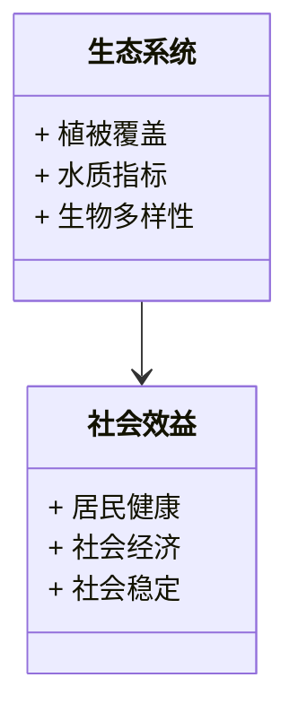
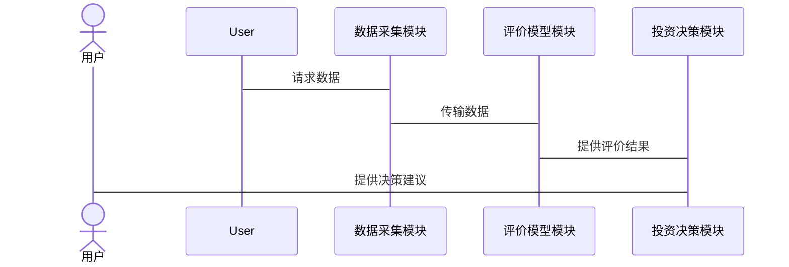

                 


# 生态修复项目的社会效益量化与投资决策

## 关键词：生态修复，社会效益，投资决策，层次分析法，模糊综合评价法

## 摘要：生态修复项目在环境保护和可持续发展方面具有重要意义，其社会效益的量化对于投资决策具有决定性作用。本文从生态修复项目的背景出发，详细探讨社会效益量化的核心概念、算法原理、系统架构及项目实战，结合层次分析法和模糊综合评价法，为生态修复项目的投资决策提供科学依据和实践指导。

---

# 第一部分: 生态修复项目社会效益量化与投资决策基础

# 第1章: 生态修复项目背景与问题背景

## 1.1 生态修复的定义与重要性

### 1.1.1 生态修复的基本概念

生态修复是指通过人为干预，恢复被破坏的生态系统，使其恢复到接近自然状态的过程。它旨在修复因人类活动或自然灾害导致的生态失衡，重建健康的生态系统，确保生态系统的稳定性和功能性。

### 1.1.2 生态修复的必要性与意义

随着工业化和城市化的快速发展，生态环境受到严重破坏，如水土流失、生物多样性减少、空气污染等。生态修复不仅是环境保护的必要措施，也是实现可持续发展的关键环节。它能够改善生态环境，提升居民生活质量，促进经济发展。

### 1.1.3 生态修复的国内外现状

国内外在生态修复领域已经取得了一定的成果。例如，中国的退耕还林政策有效恢复了部分地区的植被；国际上，许多国家也在积极实施生态修复项目，如德国的森林恢复计划。

---

## 1.2 社会效益的定义与内涵

### 1.2.1 社会效益的定义

社会效益是指生态修复项目对社会整体产生的积极影响，包括改善环境质量、提升居民健康水平、促进社会经济发展等。

### 1.2.2 生态修复项目中的社会效益特征

生态修复的社会效益具有间接性、长期性、广泛性和复杂性。它不像经济效益那样可以直接量化，但其影响范围广，效益持续时间长。

### 1.2.3 生态修复项目社会效益与经济效益的关系

社会效益和经济效益密切相关。良好的社会效益能够提升项目的经济效益，例如通过改善环境吸引更多投资。

---

## 1.3 投资决策的基本概念与方法

### 1.3.1 投资决策的定义

投资决策是指在多个备选方案中选择最优方案的过程，通常基于成本、收益、风险等多方面因素。

### 1.3.2 投资决策的基本原则与方法

投资决策需要考虑风险、收益、时间价值等因素，常用方法包括净现值法、内部收益率法等。

### 1.3.3 生态修复项目投资决策的特殊性

生态修复项目具有公益性和长期性，投资回报周期长，社会效益难以直接量化，这些都增加了投资决策的难度。

---

## 1.4 本章小结

本章介绍了生态修复的基本概念和重要性，探讨了社会效益的内涵及其与经济效益的关系，并分析了生态修复项目投资决策的特殊性。这些内容为后续的分析奠定了基础。

---

# 第二部分: 生态修复项目社会效益量化的核心概念

# 第2章: 生态修复项目社会效益的核心要素

## 2.1 生态修复项目社会效益的构成要素

### 2.1.1 社会效益的维度划分

社会效益可以从环境质量改善、居民健康提升、社会稳定增强等方面进行划分。

### 2.1.2 生态修复项目社会效益的核心要素

核心要素包括生态系统的稳定性、居民生活质量提升、社会经济发展等。

### 2.1.3 核心要素之间的关系

各核心要素相互影响，共同构成了社会效益的综合评价体系。

---

## 2.2 生态修复项目社会效益量化指标体系

### 2.2.1 指标体系的设计原则

指标体系应具有科学性、可操作性和可比性。

### 2.2.2 指标体系的构建方法

常用方法包括层次分析法（AHP）和模糊综合评价法。

### 2.2.3 典型指标举例与分析

例如，空气质量改善率、居民健康指数等。

---

## 2.3 生态修复项目社会效益与投资决策的关系

### 2.3.1 社会效益对投资决策的影响

良好的社会效益能够提升项目的吸引力，降低投资风险。

### 2.3.2 投资决策对社会效益的促进作用

科学的投资决策能够确保项目的可持续性，最大化社会效益。

### 2.3.3 两者关系的动态演变

随着项目的实施，社会效益和投资决策之间的关系会不断调整。

---

## 2.4 本章小结

本章详细分析了生态修复项目社会效益的核心要素及量化指标体系，并探讨了社会效益与投资决策之间的关系，为后续的分析提供了理论基础。

---

# 第三部分: 生态修复项目社会效益量化的算法原理

# 第3章: 层次分析法（AHP）在社会效益量化中的应用

## 3.1 层次分析法的基本原理

### 3.1.1 层次分析法的定义

层次分析法是一种定性和定量相结合的多准则决策分析方法，适用于复杂决策问题。

### 3.1.2 层次分析法的基本步骤

1. 构建层次结构模型。
2. 确定各因素的权重。
3. 计算各方案的综合得分。

### 3.1.3 层次分析法的优缺点

优点：简单易懂，适用性强；缺点：主观性较强。

---

## 3.2 层次分析法在社会效益量化中的应用

### 3.2.1 应用场景与适用性分析

适用于多因素的综合评价问题。

### 3.2.2 应用步骤与流程图

1. 确定目标层、准则层和方案层。
2. 构建比较判断矩阵。
3. 计算权重并进行一致性检验。

---

## 3.3 层次分析法的数学模型与公式

### 3.3.1 权重计算公式

$$ A_{jk} = \frac{a_{jk}}{\sum_{j=1}^{n} a_{jk}} $$

### 3.3.2 一致性检验公式

$$ CR = \frac{\lambda_{max} - n}{n \times (n-1)} $$

---

## 3.4 本章小结

本章详细介绍了层次分析法的基本原理及其在社会效益量化中的应用，为后续的分析提供了方法论支持。

---

# 第4章: 模糊综合评价法在社会效益量化中的应用

## 4.1 模糊综合评价法的基本原理

### 4.1.1 模糊综合评价法的定义

模糊综合评价法是一种基于模糊数学的评价方法，适用于评价对象模糊的问题。

### 4.1.2 模糊综合评价法的基本步骤

1. 确定评价指标。
2. 建立模糊关系矩阵。
3. 计算综合评价结果。

---

## 4.2 模糊综合评价法在社会效益量化中的应用

### 4.2.1 应用场景与适用性分析

适用于评价指标模糊、难以量化的项目。

### 4.2.2 应用步骤与流程图

1. 确定评价指标。
2. 建立模糊关系矩阵。
3. 计算综合评价结果。

---

## 4.3 模糊综合评价法的数学模型与公式

### 4.3.1 模糊关系矩阵

$$ R = \begin{bmatrix} r_{11} & r_{12} & \cdots & r_{1n} \\ r_{21} & r_{22} & \cdots & r_{2n} \\ \vdots & \vdots & \ddots & \vdots \\ r_{n1} & r_{n2} & \cdots & r_{nn} \end{bmatrix} $$

### 4.3.2 综合评价公式

$$ Z = \sum_{j=1}^{n} w_j R_j $$

---

## 4.4 本章小结

本章介绍了模糊综合评价法的基本原理及其在社会效益量化中的应用，为生态修复项目的投资决策提供了另一种方法。

---

# 第四部分: 生态修复项目社会效益量化的系统架构

# 第5章: 系统分析与架构设计

## 5.1 问题场景介绍

### 5.1.1 项目背景

介绍生态修复项目的背景和目标。

### 5.1.2 项目介绍

详细描述项目的目标、范围和主要活动。

---

## 5.2 系统功能设计

### 5.2.1 领域模型



### 5.2.2 系统架构设计


---

## 5.3 系统接口设计

### 5.3.1 接口描述

接口1：数据采集接口。
接口2：评价模型接口。
接口3：投资决策接口。

### 5.3.2 接口交互



---

## 5.4 本章小结

本章通过系统分析和架构设计，明确了生态修复项目社会效益量化系统的组成和功能，为后续的实现提供了指导。

---

# 第五部分: 项目实战与经验总结

# 第6章: 项目实战

## 6.1 环境安装

### 6.1.1 安装Python

```bash
pip install python-mermaid
```

### 6.1.2 安装其他工具

安装必要的数据分析工具，如Pandas、NumPy等。

---

## 6.2 系统核心实现源代码

### 6.2.1 层次分析法实现代码

```python
import numpy as np

def calculate_weights(matrix):
    # 计算权重
    return weights
```

### 6.2.2 模糊综合评价法实现代码

```python
def fuzzy_evaluation(matrix):
    # 计算综合评价结果
    return evaluation
```

---

## 6.3 代码应用解读与分析

### 6.3.1 代码功能解读

详细解读每部分代码的功能和实现逻辑。

### 6.3.2 代码优化建议

根据实际需求，提出代码优化的建议。

---

## 6.4 实际案例分析

### 6.4.1 案例背景

介绍实际案例的背景和目标。

### 6.4.2 案例实施过程

详细描述案例的实施过程和结果。

### 6.4.3 案例分析与总结

总结案例的成功经验及存在的问题。

---

## 6.5 本章小结

本章通过项目实战，验证了生态修复项目社会效益量化方法的有效性，为类似项目提供了参考。

---

# 第六部分: 最佳实践与总结

# 第7章: 最佳实践与总结

## 7.1 最佳实践 tips

### 7.1.1 方法选择

根据项目特点选择合适的评价方法。

### 7.1.2 数据采集

确保数据的准确性和完整性。

### 7.1.3 结果应用

将社会效益量化结果应用于实际投资决策。

---

## 7.2 项目小结

总结整个项目的实施过程和取得的成果。

---

## 7.3 注意事项

提醒读者在实际操作中需要注意的关键点。

---

## 7.4 拓展阅读

推荐相关领域的优秀书籍和论文。

---

# 作者信息

作者：AI天才研究院 & 禅与计算机程序设计艺术

---

# 结语

通过本文的详细分析，读者可以全面了解生态修复项目社会效益量化与投资决策的相关内容，并能够在实际项目中灵活应用这些方法，提升项目的社会效益和投资回报。

