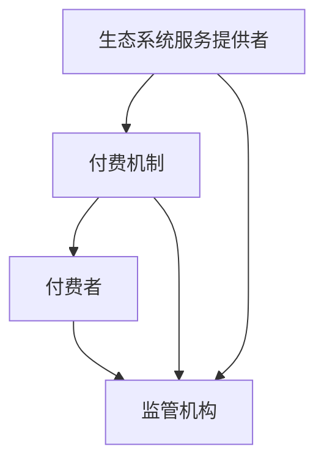
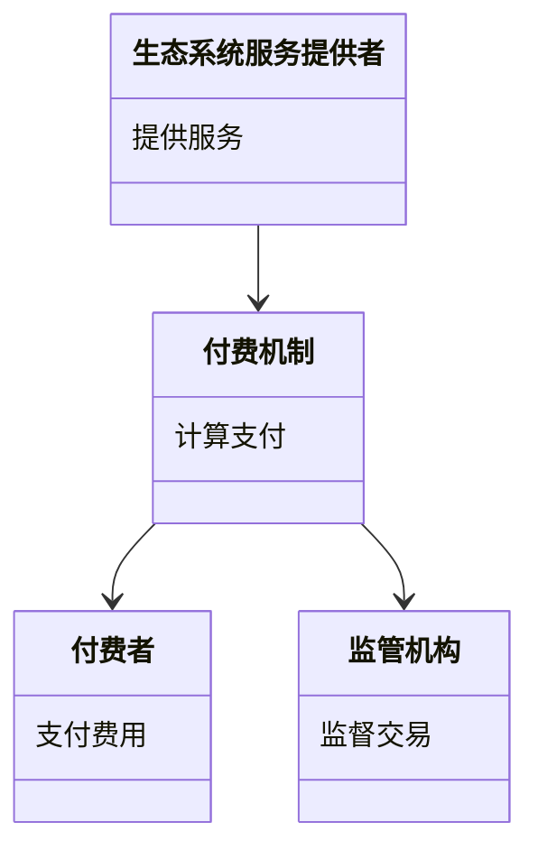
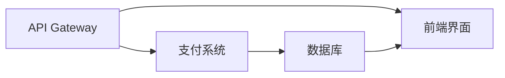

                 


# 生态系统服务付费机制的投资模式探讨

## 关键词：生态系统服务，付费机制，投资模式，生态经济学，可持续发展，政策设计，技术实现

## 摘要：本文探讨了生态系统服务付费机制的投资模式，通过分析其核心概念、算法原理和系统架构，提出了实现该机制的技术方案，并通过案例分析验证其可行性。文章旨在为投资者和政策制定者提供科学依据，推动生态系统的可持续发展。

---

## 第一部分：生态系统服务与付费机制的背景

### 第1章：生态系统服务的定义与现状

#### 1.1 生态系统服务的定义

- **生态系统服务**：指自然生态系统提供的各种服务，包括供给服务（如水、食物）、调节服务（如气候调节）、支持服务（如养分循环）和文化服务（如旅游价值）。
- **分类与特征**：可分为 provisioning, regulating, supporting, cultural 四类，具有公共品属性，难以用市场定价。
- **与人类福祉的关系**：生态系统服务对人类生存和发展至关重要，其退化会影响人类福祉。

#### 1.2 生态系统服务的现状分析

- **现状**：全球生态系统面临退化，如森林减少、生物多样性丧失，导致生态服务减少。
- **挑战**：生态系统服务的市场失灵和外部性问题，导致过度开发和破坏。
- **影响**：生态系统退化影响经济发展，如农业减产、洪水频发，威胁社会稳定。

#### 1.3 生态系统服务付费机制的必要性

- **市场失灵与外部性**：生态系统服务的提供者无法获得相应回报，导致市场失灵。
- **可持续发展视角**：通过付费机制，激励保护和可持续利用生态系统。
- **案例**：某些地区已开始实施付费机制，如购买碳汇服务。

#### 1.4 投资模式的背景

- **生态系统的经济价值**：生态系统服务的经济价值难以量化，但其对经济活动的重要性不容忽视。
- **投资作用**：通过投资模式，可以引导资金进入生态保护领域，实现经济效益和生态效益的双赢。
- **全球实践**：部分国家和地区已建立生态系统付费机制，如生态补偿、绿色金融等。

---

## 第二部分：生态系统服务付费机制的核心概念

### 第2章：生态系统服务付费机制的定义与属性

#### 2.1 付费机制的核心概念

- **定义**：付费机制是通过经济手段，将生态系统服务的价值转化为可量化的支付，确保服务提供者得到合理补偿。
- **基本原理**：基于“受益者付费”原则，构建支付体系，确保生态服务的可持续提供。

#### 2.2 核心概念的属性特征对比

| 特性       | 传统补偿方式 | 付费机制 |
|------------|--------------|----------|
| 补偿对象   | 单一主体     | 多主体   |
| 补偿依据   | 简单指标     | 综合评估 |
| 补偿方式   | 一次性支付   | 持续支付  |
| 效率性     | 较低         | 较高     |

#### 2.3 实体关系图（ER图）



---

## 第三部分：生态系统服务付费机制的算法原理

### 第3章：付费机制的数学模型与算法

#### 3.1 数学模型的构建

公式用于计算支付金额：

$$
P = \sum_{i=1}^{n} (v_i \times q_i)
$$

其中：
- \( P \)：支付总额
- \( v_i \)：第 \( i \) 项生态服务的单位价值
- \( q_i \)：第 \( i \) 项生态服务的数量

#### 3.2 算法流程图


#### 3.3 案例分析

假设提供清洁水的生态服务：
- 每立方米水价值 $0.5，付费者购买1000立方米：
  $$
  P = 0.5 \times 1000 = 500
  $$

---

## 第四部分：系统分析与架构设计

### 第4章：系统架构设计

#### 4.1 项目介绍

- **目标**：建立一个支持生态系统服务付费的数字化平台。
- **用户角色**：提供者、付费者、监管机构。

#### 4.2 领域模型设计



#### 4.3 系统架构设计



---

## 第五部分：项目实战

### 第5章：环境安装与核心代码实现

#### 5.1 环境安装

- **技术选型**：使用Python和Django框架。
- **依赖安装**：安装Django、Pandas、NumPy等库。

#### 5.2 核心代码实现

```python
def calculate_payment(quantities, values):
    total = 0
    for q, v in zip(quantities, values):
        total += q * v
    return total

# 示例数据
quantities = [1000, 500]
values = [0.5, 0.3]
print(calculate_payment(quantities, values))  # 输出：500 + 150 = 650
```

#### 5.3 案例分析

- **项目背景**：政府计划购买森林碳汇服务，支付金额基于碳汇量。
- **实现步骤**：数据采集、价值评估、计算支付、监管审核。
- **结果**：政府支付总金额，确保碳汇服务可持续。

---

## 第六部分：最佳实践与总结

### 第6章：最佳实践

#### 6.1 政策建议

- 制定明确的付费标准，建立监管机制。
- 鼓励多方参与，形成多元化投资模式。

#### 6.2 技术实施注意事项

- 数据采集的准确性，确保评估结果的科学性。
- 系统设计的可扩展性，适应不同类型的生态系统服务。

#### 6.3 未来研究方向

- 探索区块链技术在付费机制中的应用，确保透明性和不可篡改性。
- 研究人工智能在生态价值评估中的应用，提高计算效率。

---

## 结论

生态系统服务付费机制的投资模式是实现可持续发展的重要手段。通过科学的算法设计和系统实现，可以有效激励生态保护，促进经济与环境的协调发展。

## 参考文献

- [1] Costanza R, et al. The value of the world's ecosystem services and natural capital.
- [2] 财政部, 环保部. 绿色产业发展研究报告.

---

## 作者：AI天才研究院 & 禅与计算机程序设计艺术

作者简介：我们是专注于人工智能与生态经济学交叉研究的团队，致力于通过技术手段推动可持续发展。

