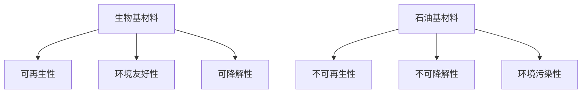

                 

# 生物基材料产业的发展趋势与投资策略

> 关键词：生物基材料，可持续发展，投资策略，技术进步，市场分析

> 摘要：生物基材料作为一种新兴的绿色材料，正逐渐成为替代传统石油基材料的重要选择。本文将深入分析生物基材料的定义、分类及其在各个领域的应用现状，探讨其技术进步和市场发展趋势，结合实际案例，为投资者提供科学的投资策略和建议。通过详细的技术分析和市场研究，本文旨在为读者提供一份全面的生物基材料产业发展指南。

---

# 第一部分: 生物基材料产业的发展背景与现状

## 第1章: 生物基材料的定义与背景

### 1.1 生物基材料的定义与分类

#### 1.1.1 生物基材料的定义
生物基材料是以可再生生物质为原料，通过生物、化学或物理方法加工而成的材料。与传统的石油基材料相比，生物基材料具有可再生性、可降解性和环境友好性等优势。

#### 1.1.2 生物基材料的主要分类
生物基材料可以根据来源、用途和性能分为以下几类：
- **生物降解材料**：如聚乳酸（PLA）、聚乙醇酸（PGA）等，能够在自然环境中分解。
- **生物基纤维材料**：如再生纤维素纤维、聚羟基脂肪酸酯（PHA）纤维等。
- **生物基塑料**：如聚乳酸（PLA）、聚碳酸酯（PC）等。
- **生物基涂料与胶粘剂**：以生物基树脂为基础的涂料和胶粘剂。

#### 1.1.3 生物基材料与传统材料的对比
以下是生物基材料与传统石油基材料的对比分析：

从上图可以看出，生物基材料在环保性和可持续性方面具有明显优势。

### 1.2 生物基材料的发展背景

#### 1.2.1 环境问题与可持续发展需求
随着全球人口的增长和工业化进程的加快，环境问题日益严重。传统石油基材料的大量使用导致了白色污染、资源枯竭等问题。生物基材料的出现为解决这些问题提供了新的可能。

#### 1.2.2 石油基材料的局限性
石油基材料的生产和使用过程中会释放大量温室气体，且其不可再生性和不可降解性对环境造成了严重威胁。

#### 1.2.3 生物基材料的技术进步
近年来，生物技术的进步推动了生物基材料的快速发展。例如，基因工程技术的应用提高了生物基材料的生产效率，而新型催化剂的开发则降低了生产成本。

### 1.3 生物基材料的市场现状

#### 1.3.1 全球生物基材料市场规模
根据市场研究机构的数据，2022年全球生物基材料市场规模约为500亿美元，预计到2030年将增长至1500亿美元。

#### 1.3.2 主要应用领域分析
生物基材料的主要应用领域包括包装、纺织、汽车、建筑和电子设备等。

#### 1.3.3 区域市场分布与竞争格局
目前，欧洲和北美是生物基材料的主要市场，而亚洲地区（如中国、印度）的市场需求增长最快。

---

## 第2章: 生物基材料的技术创新与突破

### 2.1 生物基材料的技术创新方向

#### 2.1.1 可再生资源的高效利用技术
通过基因工程技术优化微生物的代谢路径，提高原料利用率。

#### 2.1.2 微生物发酵技术的优化
开发新型发酵工艺，降低生产成本。

#### 2.1.3 生物基高分子材料的合成技术
研究新型合成方法，提高材料性能。

### 2.2 关键技术的突破与应用

#### 2.2.1 生物降解材料的技术进展
聚乳酸（PLA）和聚乙醇酸（PGA）的生产技术逐渐成熟。

#### 2.2.2 生物基纤维材料的创新
再生纤维素纤维和聚羟基脂肪酸酯（PHA）纤维的应用范围不断扩大。

#### 2.2.3 生物基塑料的工业化生产
生物基聚酯（如PET-G）的工业化生产取得显著进展。

### 2.3 技术创新对产业的推动作用

#### 2.3.1 技术创新对企业竞争力的影响
技术创新使得企业能够生产出性能更优、成本更低的生物基材料。

#### 2.3.2 技术创新对市场需求的满足
技术创新推动了生物基材料的多样化应用，满足了不同领域的需求。

#### 2.3.3 技术创新对可持续发展的贡献
技术创新减少了对化石能源的依赖，促进了绿色经济发展。

---

## 第3章: 生物基材料的投资机会分析

### 3.1 行业投资机会的总体分析

#### 3.1.1 市场需求的增长潜力
随着环保意识的增强，生物基材料的市场需求将持续增长。

#### 3.1.2 政策支持的力度分析
各国政府纷纷出台政策支持生物基材料的发展，例如税收优惠、研发补贴等。

#### 3.1.3 技术进步带来的投资机会
技术创新使得生物基材料的生产成本逐步降低，投资回报率提高。

### 3.2 主要细分领域的投资潜力

#### 3.2.1 生物降解塑料的投资前景
随着各国政府对一次性塑料制品的禁令，生物降解塑料的需求将大幅增加。

#### 3.2.2 生物基纤维材料的投资机会
生物基纤维材料在纺织和包装领域的应用前景广阔。

#### 3.2.3 生物基涂料与胶粘剂的市场潜力
环保涂料和胶粘剂的市场需求将持续增长。

### 3.3 投资风险与挑战

#### 3.3.1 技术风险
技术不成熟可能导致生产成本过高。

#### 3.3.2 市场风险
市场竞争加剧可能导致价格压力。

#### 3.3.3 政策风险
政策变化可能对行业产生重大影响。

---

## 第4章: 生物基材料产业的投资策略与实践

### 4.1 投资策略的制定原则

#### 4.1.1 市场导向原则
根据市场需求选择投资方向。

#### 4.1.2 技术驱动原则
优先选择技术领先的企业进行投资。

#### 4.1.3 风险控制原则
建立完善的风险评估和控制机制。

### 4.2 投资策略的具体实施

#### 4.2.1 产业链整合策略
通过上下游整合降低生产成本。

#### 4.2.2 技术合作与创新策略
与科研机构合作，推动技术创新。

#### 4.2.3 市场开拓与品牌建设策略
加强市场推广，提升品牌形象。

### 4.3 投资案例分析

#### 4.3.1 国内外成功投资案例
例如，某公司投资于生物降解塑料生产企业的案例。

#### 4.3.2 投资失败的教训与启示
分析失败案例的原因，总结经验教训。

---

## 第5章: 生物基材料产业的未来发展趋势

### 5.1 未来技术发展的主要方向

#### 5.1.1 新型生物基材料的研发趋势
研究新型材料结构，提高材料性能。

#### 5.1.2 绿色制造技术的突破
开发更加环保的生产技术。

#### 5.1.3 循环经济模式的应用
推广循环经济模式，实现资源的高效利用。

### 5.2 未来市场需求的变化

#### 5.2.1 消费者环保意识的提升
消费者对环保产品的接受度不断提高。

#### 5.2.2 政策法规的进一步完善
各国政府将出台更加严格的环保法规。

#### 5.2.3 全球化与本地化市场的平衡
全球化与本地化相结合的市场策略将成为主流。

### 5.3 未来投资机会的展望

#### 5.3.1 技术创新领域的投资机会
投资于技术创新型企业。

#### 5.3.2 市场扩张领域的投资机会
投资于新兴市场。

#### 5.3.3 可持续发展领域的投资机会
投资于循环经济和绿色制造项目。

---

## 第6章: 总结与投资建议

### 6.1 总结
生物基材料产业正处于快速发展阶段，技术创新和市场需求是推动行业增长的主要动力。

### 6.2 投资建议
- 优先考虑技术创新型企业。
- 关注政策支持的领域。
- 采用多元化投资策略，分散风险。

### 6.3 最佳实践 tips
- 定期进行市场调研和风险评估。
- 与行业专家和机构保持密切合作。
- 关注行业动态和技术进步。

---

作者：AI天才研究院 & 禅与计算机程序设计艺术

