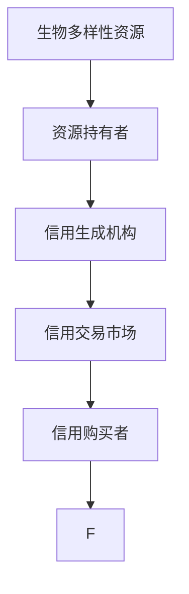
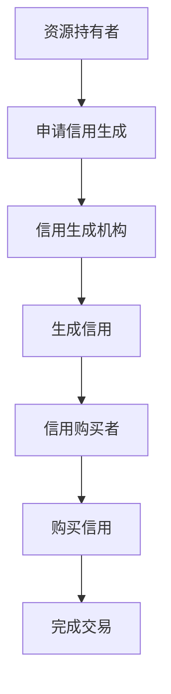
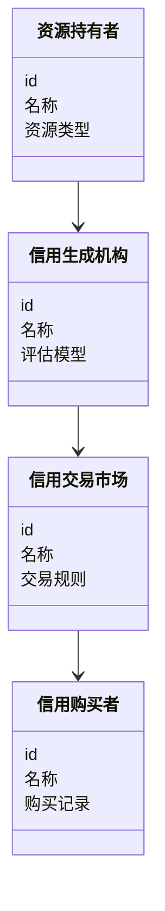
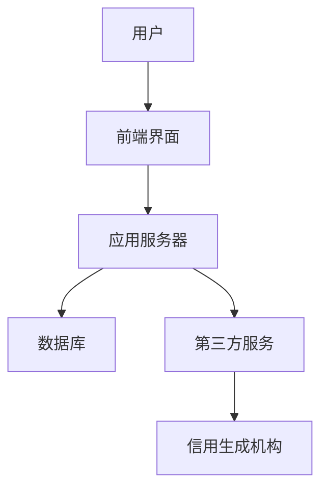

                 

# 生物多样性信用交易机制的可行性研究

> 关键词：生物多样性、信用交易机制、环境保护、可持续发展、经济模型、技术实现

> 摘要：生物多样性是地球生态系统的重要组成部分，其保护和可持续利用对于人类社会的生存和发展至关重要。然而，传统的环境保护模式往往难以平衡生态保护与经济发展之间的矛盾。生物多样性信用交易机制作为一种创新的环境保护工具，通过市场化的手段，将生物多样性资源的价值转化为可交易的信用，从而实现生态保护与经济发展的双赢。本文从技术角度出发，详细探讨生物多样性信用交易机制的可行性，包括其核心概念、算法原理、系统设计、项目实战以及最佳实践等内容。

---

# 第1章: 生物多样性信用交易机制的背景介绍

## 1.1 生物多样性的概念与重要性

### 1.1.1 生物多样性的定义
生物多样性是指在一定区域内，生物物种的丰富程度、基因多样性和生态系统多样性的一种综合表现。它是地球生态系统的重要组成部分，直接关系到生态系统的稳定性和功能。

$$\text{生物多样性} = \text{物种多样性} + \text{基因多样性} + \text{生态系统多样性}$$

生物多样性不仅为人类提供了丰富的资源（如食物、药物、工业原料等），还为地球的碳循环、水循环等生态过程提供了基础支持。

### 1.1.2 生物多样性的重要性与价值
生物多样性是维持地球生态平衡的关键因素。它不仅为人类提供了基本的生存条件，还为经济发展、科技进步和文化多样性提供了重要基础。然而，由于人类活动的干扰，全球生物多样性正面临前所未有的威胁，许多物种濒临灭绝。

### 1.1.3 全球生物多样性面临的挑战
- **栖息地破坏**：森林砍伐、城市化等人类活动导致野生动物栖息地减少。
- **气候变化**：气候变化对生物栖息地和迁徙路线造成重大影响。
- **过度开发**：过度捕捞、采伐等行为破坏了生态系统的平衡。
- **污染**：水污染、空气污染等对生物多样性造成严重威胁。

## 1.2 生物多样性信用交易机制的提出背景

### 1.2.1 环境保护与经济发展的矛盾
传统的环境保护模式往往依赖政府补贴或公益捐赠，这种模式难以持续，且缺乏有效的激励机制。企业和个人在追求经济效益的同时，往往忽视了环境保护的重要性。

### 1.2.2 国际社会对生物多样性保护的呼吁
国际社会（如《生物多样性公约》）呼吁各国采取行动保护生物多样性，但缺乏有效的市场化工具来实现这一目标。

### 1.2.3 信用交易机制在环境保护中的应用
信用交易机制是一种将环境资源（如碳汇、水量等）转化为可交易的信用的市场化工具。通过这种方式，企业可以将环境保护行为转化为经济收益，从而形成正向激励。

## 1.3 生物多样性信用交易机制的定义与目标

### 1.3.1 生物多样性信用交易机制的定义
生物多样性信用交易机制是一种通过市场化手段，将生物多样性资源的价值转化为可交易信用的机制。它允许企业、组织或个人通过购买信用来抵消其对生物多样性的影响，从而实现生态保护与经济发展的双赢。

### 1.3.2 机制的目标与核心价值
- **目标**：通过市场化手段，激励各方参与生物多样性保护。
- **核心价值**：将生物多样性资源的价值量化，使其成为一种可交易的资产，从而实现资源的最优配置。

### 1.3.3 机制的边界与外延
- **边界**：仅限于生物多样性资源的保护与利用，不涉及其他类型的环境资源。
- **外延**：可以与其他环境信用机制（如碳信用）结合，形成综合性的环境信用体系。

## 1.4 生物多样性信用交易机制的核心要素

### 1.4.1 生物多样性资源的量化方法
- **物种多样性指数（SDI）**：用于衡量一定区域内物种的丰富程度。
- **生态系统服务价值（ESV）**：用于量化生物多样性对生态系统服务的贡献。

### 1.4.2 信用的生成与分配规则
- **信用生成**：通过量化生物多样性资源的价值，生成相应的信用。
- **信用分配**：根据资源持有者的贡献，分配信用。

### 1.4.3 交易的市场机制与监管框架
- **市场机制**：信用可以在市场上自由交易，价格由市场供需决定。
- **监管框架**：政府或国际组织对信用的生成、交易和使用进行监管，确保机制的有效性。

---

# 第2章: 生物多样性信用交易机制的核心概念与联系

## 2.1 生物多样性信用交易机制的原理

### 2.1.1 信用生成的原理
信用生成是通过量化生物多样性资源的价值，将其转化为可交易的信用。例如，假设一片森林中有100种植物，每种植物的保护价值为10元，则这片森林的信用价值为1000元。

### 2.1.2 信用交易的基本流程
1. **资源持有者**（如企业或个人）申请生成信用。
2. **信用生成机构**对资源进行评估，生成信用。
3. **信用购买者**在市场上购买信用，抵消其对生物多样性的影响。

### 2.1.3 信用价值的评估方法
- **物种多样性指数（SDI）**：衡量物种的丰富程度。
- **生态系统服务价值（ESV）**：衡量生物多样性对生态系统服务的贡献。

## 2.2 核心概念的属性特征对比

| 概念       | 属性特征                       |
|------------|--------------------------------|
| 生物多样性资源 | 物种多样性、生态功能、不可再生性 |
| 信用       | 可交易性、可量化性、可累积性   |
| 交易机制   | 市场化、透明性、可监管性       |

### 2.2.1 实体关系图

## 2.3 生物多样性信用交易机制的核心流程图

---

# 第3章: 生物多样性信用交易机制的算法原理

## 3.1 生物多样性信用交易机制的数学模型

### 3.1.1 信用生成模型
$$ \text{信用价值} = \alpha \times \text{物种多样性} + \beta \times \text{生态系统服务价值} $$

其中，$\alpha$ 和 $\beta$ 是权重系数，表示物种多样性和生态系统服务价值在信用生成中的重要性。

### 3.1.2 信用交易模型
$$ \text{信用价格} = \gamma \times \text{市场供需} + \delta \times \text{政策影响} $$

其中，$\gamma$ 是市场供需的权重，$\delta$ 是政策影响的权重。

---

# 第4章: 生物多样性信用交易机制的系统设计与实现

## 4.1 系统功能设计

### 4.1.1 领域模型

### 4.1.2 系统架构设计

### 4.1.3 接口设计
- **信用生成接口**：`POST /api/generate-credit`
- **信用购买接口**：`POST /api/buy-credit`

---

# 第5章: 生物多样性信用交易机制的项目实战

## 5.1 项目背景

### 5.1.1 项目目标
通过实施生物多样性信用交易机制，保护一片热带雨林，同时为企业提供可持续发展的经济模式。

## 5.1.2 项目实施步骤

1. **环境安装**：搭建信用生成机构、交易市场和用户界面。
2. **核心代码实现**：实现信用生成、交易和监管功能。
3. **案例分析**：分析信用交易对生物多样性保护的实际效果。

---

# 第6章: 生物多样性信用交易机制的最佳实践与未来展望

## 6.1 小结

生物多样性信用交易机制是一种创新的环境保护工具，通过市场化手段，将生物多样性资源的价值转化为可交易的信用，从而实现生态保护与经济发展的双赢。

## 6.2 注意事项

- 信用生成机构需要具备专业的评估能力。
- 交易市场需要透明化，确保信用的公平交易。
- 政府需要制定相关政策，规范信用交易行为。

## 6.3 未来展望

随着技术的进步和市场的成熟，生物多样性信用交易机制将在全球范围内得到更广泛的应用，成为环境保护的重要工具。

---

# 附录

## 术语表

- **生物多样性**：地球上生物物种的丰富程度、基因多样性和生态系统多样性的总和。
- **信用交易机制**：通过市场化手段，将环境资源的价值转化为可交易信用的机制。

## 工具推荐

- **信用生成工具**：用于量化生物多样性资源价值的工具。
- **信用交易平台**：用于信用交易的在线平台。

---

# 参考文献

（此处列出相关的参考文献，如《生物多样性公约》、相关学术论文等。）

---

**作者：AI天才研究院/AI Genius Institute & 禅与计算机程序设计艺术 /Zen And The Art of Computer Programming**

