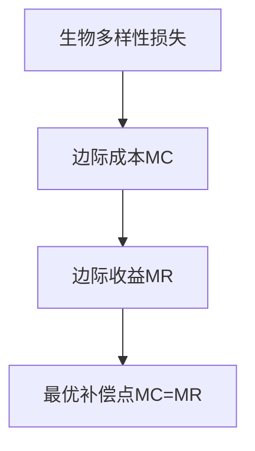
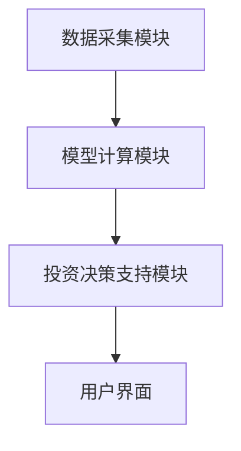

                 

# 生物多样性补偿机制的经济模型与投资

## 关键词：生物多样性，经济模型，投资，补偿机制，环境保护，可持续发展

## 摘要：生物多样性补偿机制是一种通过经济手段保护生物多样性的创新方法，它结合了经济学、生态学和投资学的原理，旨在通过市场机制实现环境保护与经济发展的双赢。本文将详细探讨生物多样性补偿机制的核心概念、经济模型的设计与实现、投资策略的制定与优化，以及实际案例分析。通过系统化的分析和深入的理论探讨，本文为读者提供一个全面了解和应用生物多样性补偿机制的框架。

---

## 第一部分: 生物多样性补偿机制的背景与概念

### 第1章: 生物多样性补偿机制概述

#### 1.1 生物多样性补偿机制的定义与背景

生物多样性是指地球上所有生物的多样性，包括遗传多样性、物种多样性和生态系统多样性。生物多样性是生态系统正常运作的基础，对人类的生存和发展至关重要。然而，随着人类活动的加剧，生物多样性面临严重威胁，如栖息地破坏、气候变化、过度捕捞等。为了应对这一挑战，生物多样性补偿机制应运而生。

**生物多样性补偿机制**是一种通过经济手段对生物多样性损失进行补偿的机制。它通过建立市场化的交易平台，将生物多样性的保护和利用与经济利益相结合，激励个人、企业和政府共同参与生物多样性的保护。

#### 1.2 生物多样性补偿机制的核心概念

生物多样性补偿机制的核心概念包括以下几个方面：

1. **补偿原则**：基于“污染者付费”或“受益者补偿”的原则，对生物多样性损失进行经济补偿。
2. **市场机制**：通过建立市场化的交易平台，将生物多样性的保护转化为可量化的经济价值。
3. **多方参与**：政府、企业和个人共同参与，形成多方利益相关者的合作机制。

#### 1.3 生物多样性补偿机制的重要性和作用

生物多样性补偿机制在环境保护和经济发展中具有重要作用：

1. **激励保护**：通过经济补偿，激励企业和个人主动保护生物多样性。
2. **促进可持续发展**：将生物多样性保护与经济发展相结合，实现可持续发展目标。
3. **推动国际合作**：通过市场化手段，促进国际间在生物多样性保护领域的合作。

---

## 第二部分: 生物多样性补偿机制的经济模型

### 第2章: 经济模型的构建与分析

#### 2.1 经济模型的基本原理

生物多样性补偿机制的经济模型是基于经济学的基本原理构建的。模型的核心是将生物多样性的价值量化，并通过市场机制实现资源的优化配置。

#### 2.2 生物多样性补偿机制的TSS模型

**TSS模型**（Triple Sustainability System Model）是一种专门用于生物多样性补偿机制的经济模型。它将社会、经济和环境三者之间的关系纳入模型，以实现可持续发展的目标。

**模型公式**：
$$
C = \alpha \cdot S + \beta \cdot E + \gamma \cdot T
$$

其中：
- $C$ 表示补偿金额
- $S$ 表示社会价值
- $E$ 表示环境价值
- $T$ 表示时间因素
- $\alpha, \beta, \gamma$ 是系数，表示各因素对补偿金额的影响程度

#### 2.3 经济模型的数学推导

通过数学推导，我们可以得出生物多样性补偿机制的最优解。假设生物多样性损失的边际成本为 $MC$，边际收益为 $MR$，则最优补偿点为 $MC = MR$。

**图形表示**：

---

## 第三部分: 生物多样性补偿机制的投资策略

### 第3章: 投资策略与风险管理

#### 3.1 投资策略的制定与实施

在生物多样性补偿机制下，投资者需要制定合理的投资策略，以实现经济利益和环境效益的双重目标。

1. **投资目标**：明确投资目标，例如追求短期收益或长期可持续发展。
2. **风险评估**：评估生物多样性补偿项目的风险，包括政策风险、市场风险和技术风险。
3. **投资组合优化**：通过优化投资组合，分散风险，提高投资回报率。

#### 3.2 投资与补偿机制的协同效应

生物多样性补偿机制与投资具有协同效应。通过补偿机制，投资者可以将资金投入生物多样性保护项目，同时获得经济回报。

---

## 第四部分: 生物多样性补偿机制的系统架构与实现

### 第4章: 系统架构与功能设计

#### 4.1 系统功能模块划分

生物多样性补偿机制的系统架构主要包括以下几个模块：

1. **数据采集与处理模块**：收集生物多样性数据，包括物种分布、生态系统状况等。
2. **模型计算与分析模块**：利用TSS模型计算补偿金额。
3. **投资决策支持模块**：为投资者提供决策支持，包括投资建议和风险评估。

**系统架构图**：

---

## 第五部分: 实际案例分析与项目实战

### 第5章: 案例分析与项目实现

#### 5.1 案例分析

以某地区为例，分析生物多样性补偿机制的实际应用。

1. **案例背景**：该地区面临森林砍伐严重的问题，通过补偿机制激励企业保护森林资源。
2. **模型应用**：利用TSS模型计算补偿金额，确定补偿对象和金额。
3. **实际效果**：评估补偿机制对该地区生物多样性保护的效果。

#### 5.2 项目实战

1. **环境与工具安装**：安装必要的软件和工具，例如Python、数据分析工具等。
2. **核心代码实现**：编写TSS模型的代码，实现补偿金额的计算。
3. **代码解读与分析**：分析代码的功能，解释每一步的操作。

---

## 第六部分: 政策与监管对生物多样性补偿机制的影响

### 第6章: 政策与监管分析

#### 6.1 相关政策与法规

生物多样性补偿机制的有效实施离不开政策和法规的支持。政府需要制定相关政策，规范市场行为，确保补偿机制的公平性和可持续性。

---

## 作者：AI天才研究院/AI Genius Institute & 禅与计算机程序设计艺术 /Zen And The Art of Computer Programming

---

**文章小结**：通过本文的详细阐述，读者可以全面了解生物多样性补偿机制的核心概念、经济模型的设计与实现、投资策略的制定与优化，以及实际案例分析。本文为读者提供了一个系统化的框架，帮助他们在环境保护与经济发展之间找到平衡点，实现可持续发展的目标。

