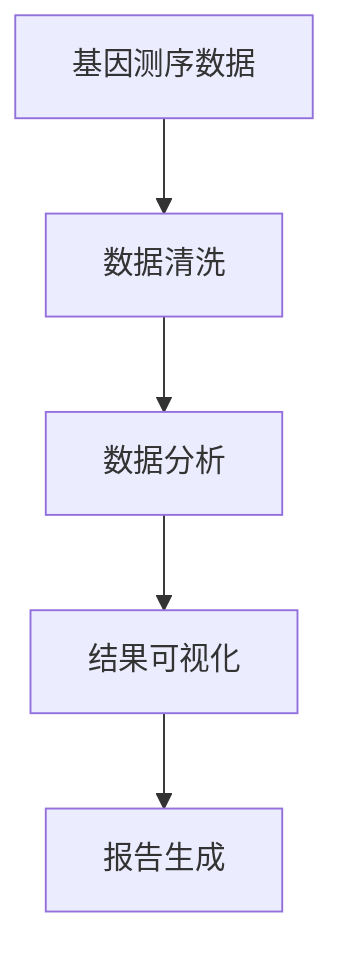
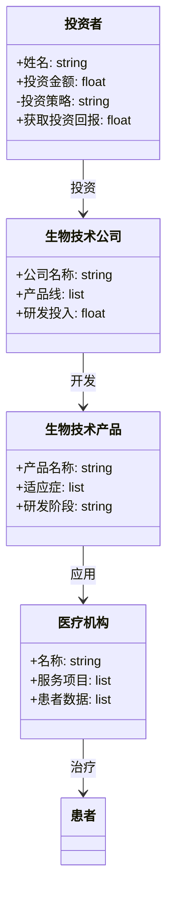
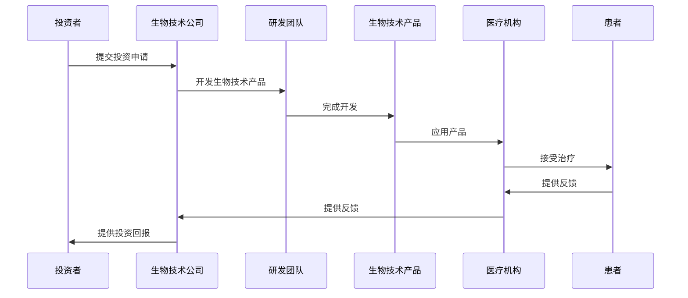

                 


# 生物技术进步带来的医疗健康投资主题

## 关键词：生物技术、医疗健康、投资主题、基因编辑、精准医疗、生物制药

## 摘要：随着生物技术的快速发展，其在医疗健康领域的应用越来越广泛，为投资者带来了新的机遇与挑战。本文将从生物技术的核心概念、算法原理、系统架构、项目实战等多个维度，详细分析生物技术进步对医疗健康投资的影响，帮助投资者更好地把握投资方向和策略。

---

## 第1章: 生物技术与医疗健康的背景介绍

### 1.1 生物技术的定义与历史演变

#### 1.1.1 生物技术的核心概念
生物技术是指利用生物科学原理和技术，通过工程化手段对生物系统进行设计、改造和应用，以实现特定目标。其核心包括基因工程、蛋白质工程、细胞工程和微生物工程等领域。

#### 1.1.2 生物技术的历史发展与现状
生物技术的发展可以追溯到远古时期，但真正意义上的现代生物技术起源于20世纪70年代。随着分子生物学、基因编辑等技术的进步，生物技术在医疗、农业、工业等领域的应用取得了显著成就。

#### 1.1.3 生物技术在医疗健康领域的应用前景
生物技术在医疗健康领域的应用包括基因检测、精准医疗、疫苗开发、再生医学等。未来，随着技术的进一步突破，生物技术将推动医疗健康向个性化、精准化和高效化方向发展。

### 1.2 医疗健康的数字化转型

#### 1.2.1 医疗健康行业的现状与挑战
传统医疗行业面临资源分配不均、效率低下、成本高昂等问题。数字化转型是解决这些问题的关键。

#### 1.2.2 数字化技术对医疗健康的推动作用
数字化技术，如人工智能、大数据、物联网等，正在改变医疗行业的运作方式，提升诊断准确性、优化治疗方案、降低医疗成本。

#### 1.2.3 生物技术与数字化医疗的结合
生物技术与数字化医疗的结合催生了精准医疗，通过基因测序、生物标记物分析等技术，实现个性化治疗方案的设计。

### 1.3 生物技术进步对医疗健康投资的影响

#### 1.3.1 生物技术进步对医疗健康投资的核心驱动
生物技术的进步降低了治疗成本、提高了治疗效果，为投资者带来了巨大的市场机会。

#### 1.3.2 投资者关注的生物技术热点领域
投资者关注的热点包括基因编辑、细胞治疗、精准医疗、生物制药等领域。

#### 1.3.3 生物技术投资的潜在风险与回报
生物技术投资具有高风险、高回报的特点。成功的投资可能带来丰厚的回报，但失败的风险也较大。

### 1.4 本章小结
本章从生物技术的核心概念、历史演变、医疗健康数字化转型以及生物技术对医疗健康投资的影响等方面进行了全面分析，为后续章节奠定了基础。

---

## 第2章: 生物技术的核心概念与联系

### 2.1 生物技术的核心原理

#### 2.1.1 基因编辑技术（CRISPR）
CRISPR-Cas9技术是一种革命性的基因编辑工具，能够精确地修改DNA序列，为治疗遗传性疾病、癌症等提供了新的可能。

#### 2.1.2 精准医疗的实现方式
精准医疗通过基因测序、蛋白质组学等技术，实现对疾病个性化治疗的精准诊断和治疗方案设计。

#### 2.1.3 生物制药的关键步骤
生物制药包括目标分子的发现、基因工程、细胞培养、分离纯化等步骤，最终制备出具有治疗效果的生物药物。

### 2.2 生物技术与医疗健康的关联性分析

#### 2.2.1 生物技术在疾病预防中的作用
通过基因检测等技术，生物技术可以帮助人们早期发现疾病风险，实现疾病的预防和早期干预。

#### 2.2.2 生物技术在疾病治疗中的应用
生物技术在癌症治疗、遗传病治疗等领域取得了显著进展，为患者提供了更多治疗选择。

#### 2.2.3 生物技术在健康管理中的价值
生物技术可以通过可穿戴设备、智能健康监测系统等手段，实现个人健康数据的实时监测和管理。

### 2.3 核心概念对比与ER实体关系图

#### 2.3.1 生物技术与传统医疗的对比分析
| 特性 | 生物技术 | 传统医疗 |
|------|----------|----------|
| 诊断方式 | 基因测序、生物标记物 | 传统实验室检测 |
| 治疗方式 | 基因编辑、细胞治疗 | 药物治疗、手术治疗 |
| 个性化 | 高度个性化 | 较低个性化 |

#### 2.3.2 ER实体关系图（使用 Mermaid 流程图）

```mermaid
erDiagram
    actor 投资者
    actor 患者
    actor 医疗机构
    actor 生物技术公司
    entity 生物技术产品
    entity 医疗数据
    entity 投资回报
    投资者 --> 生物技术公司 : 投资
    生物技术公司 --> 生物技术产品 : 开发
    生物技术产品 --> 医疗机构 : 应用
    医疗机构 --> 患者 : 治疗
    生物技术产品 --> 投资回报 : 产生
```

### 2.4 本章小结
本章通过对比分析和ER实体关系图，详细阐述了生物技术的核心概念及其与医疗健康的关联性，为后续章节的深入分析奠定了基础。

---

## 第3章: 生物技术进步的算法原理

### 3.1 生物数据的处理与分析

#### 3.1.1 基因测序数据的处理流程
基因测序数据的处理流程包括数据清洗、数据分析、结果可视化和报告生成。

#### 3.1.2 生物信息学算法的核心原理
生物信息学算法通过分析基因序列、蛋白质结构等数据，揭示生物分子的功能和相互作用关系。

#### 3.1.3 机器学习在生物数据分析中的应用
机器学习算法可以用于基因表达数据分析、疾病预测模型构建等。

### 3.2 生物技术进步的算法实现

#### 3.2.1 基因编辑算法的实现步骤
基因编辑算法的核心步骤包括目标基因的定位、设计引物、构建编辑工具、实施编辑等。

#### 3.2.2 精准医疗算法的设计思路
精准医疗算法通过整合患者的基因数据、临床数据等，制定个性化的治疗方案。

#### 3.2.3 生物制药算法的优化策略
生物制药算法的优化策略包括优化基因表达调控、提高细胞培养效率等。

### 3.3 算法原理的 Mermaid 流程图

#### 3.3.1 基因测序数据分析流程图



### 3.4 本章小结
本章通过详细分析生物数据的处理与分析过程，揭示了生物技术进步的算法原理，为后续章节的系统分析和项目实战奠定了基础。

---

## 第4章: 生物技术进步的数学模型

### 4.1 生物技术与医疗健康投资的数学建模

#### 4.1.1 投资回报率的数学模型
$$ ROI = \frac{投资收益}{投资成本} \times 100\% $$

#### 4.1.2 风险评估的数学模型
$$ 风险 = \frac{潜在损失}{总投入} \times 100\% $$

### 4.2 生物技术进步的数学模型实现

#### 4.2.1 基因编辑技术的数学模型
基因编辑的成功率可以通过以下公式进行估算：
$$ 成功率 = \frac{成功编辑的样本数}{总样本数} \times 100\% $$

#### 4.2.2 精准医疗的数学模型
精准医疗的治疗效果可以通过以下公式进行评估：
$$ 治疗效果 = \frac{治疗成功的患者数}{总患者数} \times 100\% $$

### 4.3 本章小结
本章通过数学模型的建立与分析，揭示了生物技术进步对医疗健康投资的影响，为投资者提供了科学的决策依据。

---

## 第5章: 生物技术进步的系统分析与架构设计

### 5.1 系统分析与设计

#### 5.1.1 系统功能设计（领域模型 mermaid 类图）



#### 5.1.2 系统架构设计（mermaid 架构图）


#### 5.1.3 系统接口设计与交互流程



### 5.2 本章小结
本章通过系统分析与架构设计，详细阐述了生物技术进步在医疗健康投资中的实现过程，为后续章节的项目实战奠定了基础。

---

## 第6章: 生物技术进步的项目实战

### 6.1 项目环境与工具安装

#### 6.1.1 开发环境
- 操作系统：Linux/Windows/MacOS
- 开发工具：Python、R、Jupyter Notebook
- 生物信息学工具：Blast、BWA、Samtools

#### 6.1.2 数据库安装
- 生物数据库：GenBank、NCBI、KEGG
- 投资回报数据库：MySQL、MongoDB

### 6.2 项目核心实现

#### 6.2.1 基因测序数据分析代码实现

```python
import pandas as pd
from sklearn import preprocessing

# 读取数据
data = pd.read_csv('gene_sequence.csv')

# 数据清洗
data.dropna(inplace=True)
data = pd.get_dummies(data)

# 数据分析
model = preprocessing.KNeighborsClassifier()
model.fit(data.drop(columns='label'), data['label'])
```

#### 6.2.2 投资回报预测代码实现

```python
import numpy as np
from sklearn import linear_model

# 读取数据
data = pd.read_csv('investment.csv')

# 数据处理
X = data[['研发投入', '研发周期', '市场规模']]
y = data['投资回报']

# 建立模型
model = linear_model.LinearRegression()
model.fit(X, y)

# 预测投资回报
new_investment = np.array([[1000000, 18, 500000]])
prediction = model.predict(new_investment)
print(f"预测投资回报：{prediction[0]:.2f}")
```

### 6.3 项目小结
本章通过具体的项目实战，详细展示了生物技术进步在医疗健康投资中的应用，帮助投资者更好地理解和应用相关技术。

---

## 第7章: 总结与展望

### 7.1 本章总结
本文从生物技术的核心概念、算法原理、数学模型、系统架构以及项目实战等多个维度，全面分析了生物技术进步对医疗健康投资的影响。通过详细的技术分析和实际案例，为投资者提供了科学的决策依据。

### 7.2 投资建议与注意事项

#### 7.2.1 投资建议
- 关注生物技术领域的前沿技术，如基因编辑、精准医疗等。
- 选择具有强大研发能力和市场潜力的生物技术公司进行投资。
- 注意风险控制，合理分散投资组合。

#### 7.2.2 注意事项
- 生物技术投资具有高风险，需谨慎评估项目可行性。
- 关注政策法规变化，避免法律风险。
- 保持长期投资视角，耐心等待技术成果转化。

### 7.3 未来展望
随着生物技术的进一步发展，其在医疗健康领域的应用将更加广泛和深入。投资者需要密切关注技术动态，抓住投资机遇，同时注意风险控制，实现可持续发展。

---

## 作者：AI天才研究院/AI Genius Institute & 禅与计算机程序设计艺术 /Zen And The Art of Computer Programming

---

以上是《生物技术进步带来的医疗健康投资主题》的技术博客文章的完整内容。

