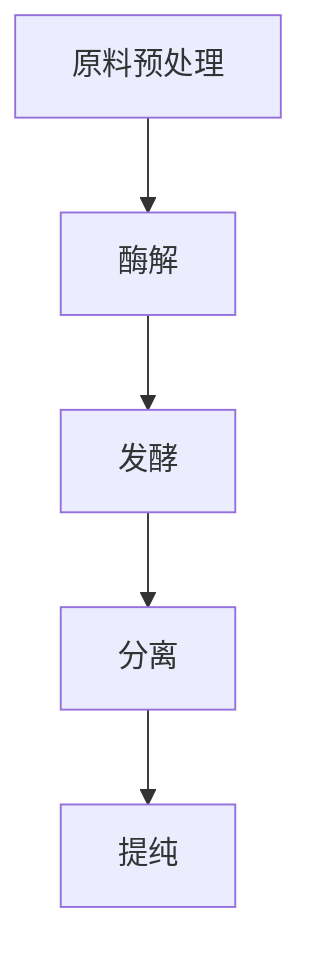
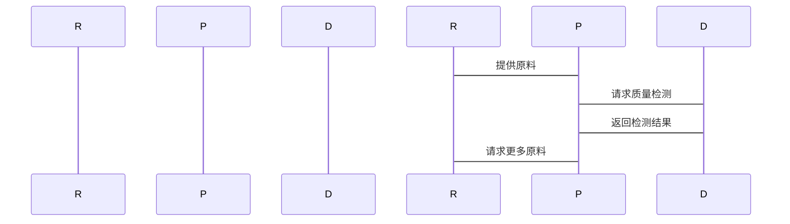

                 


# 生物燃料技术的发展与可再生能源投资

---

## 关键词：生物燃料技术、可再生能源、投资分析、能源转型、技术发展

---

## 摘要：  
生物燃料技术作为可再生能源领域的重要组成部分，正在全球范围内得到广泛关注和投资。本文从生物燃料技术的基本概念、发展历程、核心原理、算法优化、系统架构以及投资分析等多个维度展开，深入探讨生物燃料技术的现状与未来发展趋势。通过实际案例分析和数学模型推导，本文为读者提供了一套全面的生物燃料技术发展与可再生能源投资的解决方案。

---

# 第一部分: 生物燃料技术的发展与可再生能源投资概述

## 第1章: 生物燃料技术的基本概念与背景

### 1.1 生物燃料的定义与分类

#### 1.1.1 什么是生物燃料  
生物燃料是指由生物物质（如植物、动物脂肪、生物质等）经过加工转化得到的燃料，包括液体燃料和气体燃料。生物燃料可以替代传统化石燃料，减少碳排放，是实现可持续能源的重要途径。

#### 1.1.2 生物燃料的分类  
生物燃料主要分为以下几类：  
1. **第一代生物燃料**：来源于传统的农业作物（如玉米、甘蔗）加工而成的乙醇和生物柴油。  
2. **第二代生物燃料**：来源于非食用生物质（如秸秆、林业剩余物）通过先进生物技术（如酶解、发酵）生产的纤维素乙醇和生物柴油。  
3. **第三代生物燃料**：来源于 algae（微藻）等高附加值生物体生产的生物柴油和生物天然气。  

#### 1.1.3 生物燃料的优势与挑战  
- **优势**：可再生性、低碳性、减少对化石燃料的依赖。  
- **挑战**：生产成本高、技术复杂、原料供应不稳定。

---

### 1.2 生物燃料技术的发展历程

#### 1.2.1 早期生物燃料的应用  
生物燃料的使用可以追溯到古代，例如酒精发酵技术用于生产乙醇燃料。

#### 1.2.2 现代生物燃料技术的兴起  
20世纪末，随着环保意识的增强和能源危机的加剧，生物燃料技术开始快速发展，尤其是第二代生物燃料的出现。

#### 1.2.3 生物燃料技术的未来趋势  
未来，生物燃料技术将更加高效、低成本，第三代生物燃料（如微藻生物柴油）将成为主流。

---

### 1.3 生物燃料在可再生能源中的地位

#### 1.3.1 可再生能源的概念与分类  
可再生能源包括太阳能、风能、水能、生物质能等。

#### 1.3.2 生物燃料在可再生能源中的作用  
生物燃料是生物质能的重要载体，是实现能源转型的重要组成部分。

#### 1.3.3 生物燃料与传统能源的对比  
生物燃料具有可再生性、低碳性，但目前成本较高，技术复杂。

---

## 第2章: 生物燃料技术的核心概念与原理

### 2.1 生物燃料的生产过程

#### 2.1.1 生物燃料的原料选择  
- 第一代：玉米、甘蔗等。  
- 第二代：秸秆、林业剩余物。  
- 第三代：微藻。  

#### 2.1.2 生物燃料的生产步骤  
1. **原料预处理**：破碎、灭菌。  
2. **主发酵过程**：酶解、发酵。  
3. **后处理**：分离、提纯。  

#### 2.1.3 生物燃料的质量控制  
- 含量分析：碳含量、氧含量。  
- 安全性测试：燃烧特性、热值。  

---

### 2.2 生物燃料技术的关键技术

#### 2.2.1 酶解技术  
- 酶解过程：通过酶的作用将生物质分解为糖类。  
- 酶的种类：纤维素酶、半纤维素酶。  

#### 2.2.2 催化技术  
- 催化反应：将糖类转化为燃料。  
- 催化剂类型：酶催化剂、化学催化剂。  

#### 2.2.3 发酵技术  
- 发酵过程：利用微生物发酵生产乙醇。  
- 微生物种类：酵母菌、细菌。  

---

### 2.3 生物燃料技术的数学模型与公式

#### 2.3.1 生物燃料产量的数学模型  
$$ \text{产量} = \text{原料量} \times \text{转化效率} $$  

#### 2.3.2 生物燃料生产效率的计算公式  
$$ \text{效率} = \frac{\text{实际产量}}{\text{理论产量}} \times 100\% $$  

#### 2.3.3 生物燃料成本的优化公式  
$$ \text{总成本} = \text{原料成本} + \text{生产成本} + \text{运输成本} $$  

---

## 第3章: 生物燃料技术的算法原理与系统分析

### 3.1 生物燃料生产的算法原理

#### 3.1.1 生物燃料生产流程的优化算法  
- 算法步骤：原料预处理 → 酶解 → 发酵 → 分离 → 提纯。  
- 算法流程图如下：



---

### 3.2 生物燃料生产系统的架构设计

#### 3.2.1 生物燃料生产系统的组成  
- 原料供应模块。  
- 生产模块（酶解、发酵）。  
- 质量检测模块。  

#### 3.2.2 生物燃料生产系统的功能模块  
- **原料模块**：负责原料的输入和预处理。  
- **生产模块**：负责酶解、发酵过程的控制。  
- **检测模块**：负责燃料质量的检测和反馈。  

---

### 3.3 生物燃料生产系统的交互流程图

#### 3.3.1 生物燃料生产流程的交互图  


---

## 第4章: 生物燃料技术的项目实战与投资分析

### 4.1 生物燃料项目的环境搭建

#### 4.1.1 生物燃料项目的基本要求  
- 设备：酶解设备、发酵设备。  
- 原料：秸秆、林业剩余物。  

#### 4.1.2 生物燃料项目的原料采购  
- 选择合适的原料供应商。  
- 确保原料质量稳定。  

---

### 4.2 生物燃料项目的系统实现

#### 4.2.1 生物燃料生产的代码实现  
```python
def produce_biol燃料():
    原料 = 输入原料()
    预处理(原料)
    酶解(原料)
    发酵()
    分离()
    提纯()
    返回 生物燃料
```

---

### 4.3 生物燃料项目的投资分析

#### 4.3.1 生物燃料投资的基本原则  
- 长期视角：投资周期长，需考虑通货膨胀。  
- 风险控制：技术风险、市场风险、政策风险。  

#### 4.3.2 生物燃料投资的风险评估  
- 技术风险：技术不成熟可能导致成本过高。  
- 市场风险：市场需求波动。  
- 政策风险：政府政策变化影响投资回报。  

---

## 第5章: 总结与展望

### 5.1 总结  
生物燃料技术是实现能源转型的重要手段，具有广阔的发展前景。  

### 5.2 未来展望  
- 技术创新：进一步提高生产效率，降低成本。  
- 投资方向：加大对第三代生物燃料技术的投资。  
- 市场拓展：拓展生物燃料的应用场景，如交通领域。  

---

## 作者：AI天才研究院/AI Genius Institute & 禅与计算机程序设计艺术 /Zen And The Art of Computer Programming  

---

**免责声明**：  
本文内容仅供参考，具体投资决策需结合实际情况，建议投资者在决策前进行充分的市场调研和风险评估。

