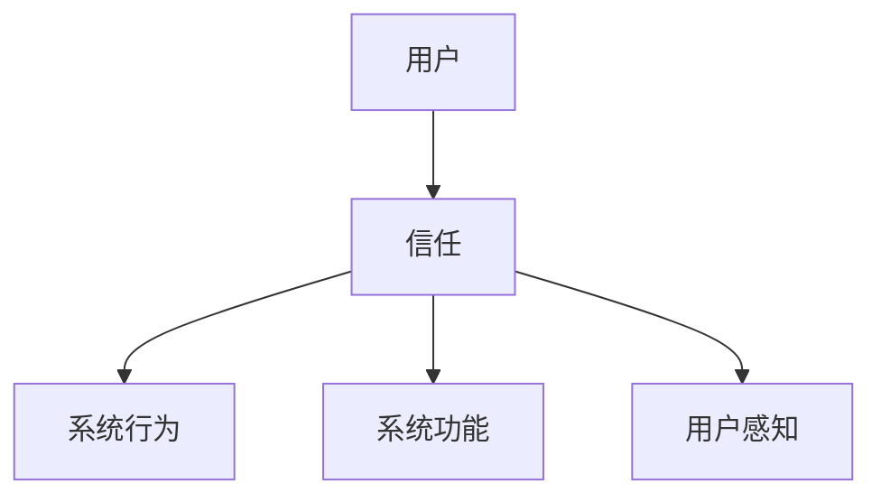

                 


# 用户信任的建立与维护

## 关键词
用户信任, 信任模型, 人机交互, 系统可靠性, 可信赖性, 可解释性

## 摘要
用户信任的建立与维护是人机交互和系统设计中的核心问题。本文从用户信任的核心概念出发，分析其构成要素和影响因素，构建数学模型，设计系统架构，并通过实际案例展示如何在项目中实现用户信任的建立与维护。文章内容涵盖理论分析、算法实现和系统设计，旨在为技术实践者提供全面的指导。

---

## 第一部分: 用户信任的背景与概念

### 第1章: 用户信任的定义与重要性

#### 1.1 信任的定义与核心要素
信任的定义是用户对系统或服务的可靠性、可信赖性和可解释性的综合感知。用户信任的核心要素包括系统能力、行为可预测性、透明性和用户控制能力。信任的层次模型从低到高分为感知信任、行为信任和情感信任。

#### 1.2 用户信任在人机交互中的作用
信任在用户体验中的重要性体现在用户对系统的依赖程度、系统可用性以及用户行为的可预测性。信任是用户与系统交互的基础，影响用户的满意度和长期使用。

#### 1.3 用户信任的背景与挑战
在数字化时代，用户信任的建立面临复杂性增加、用户感知差异和系统边界模糊的挑战。信任的建立需要系统具备可靠性和透明性，同时满足用户的个性化需求。

---

### 第2章: 用户信任的核心概念与模型

#### 2.1 用户信任的核心概念
信任的核心概念包括可靠性、可解释性和可控性。可靠性是系统在预期条件下正常工作的能力；可解释性是用户能够理解系统行为的能力；可控性是用户对系统行为的干预能力。

#### 2.2 用户信任的构成要素
用户信任的构成要素包括系统能力、行为可预测性、透明性和用户控制能力。系统能力是系统完成任务的能力；行为可预测性是系统行为的可预期性；透明性是系统行为的可解释性；用户控制能力是用户对系统行为的干预能力。

#### 2.3 用户信任模型的构建
用户信任模型的构建需要考虑信任的影响因素，如系统性能、行为可预测性和用户控制能力。通过概念属性特征对比表和ER实体关系图，可以清晰地展示信任模型的构成要素和关系。

---

### 第3章: 用户信任的影响因素与数学模型

#### 3.1 影响用户信任的主要因素
影响用户信任的主要因素包括系统性能与响应时间、系统行为的可预测性以及用户对系统的控制能力。这些因素共同作用，影响用户对系统的信任程度。

#### 3.2 用户信任的数学模型构建
基于概率的信任评估模型是一个有效的数学模型，其公式为：
$$ P(Trust) = \frac{1}{1 + e^{-\beta X}} $$
其中，$X$ 表示信任影响因素向量，$\beta$ 是模型参数。

#### 3.3 算法实现与流程图
基于层次分析法的信任权重分配是另一个重要的算法，其矩阵表示为：
$$ A = \begin{bmatrix} 1 & a_{12} & a_{13} \\ a_{21} & 1 & a_{23} \\ a_{31} & a_{32} & 1 \end{bmatrix} $$
算法流程图如下：


---

## 第二部分: 用户信任的系统架构与实现

### 第4章: 系统架构设计

#### 4.1 系统功能设计
系统功能设计包括信任评估模块、用户行为分析模块和系统反馈模块。信任评估模块负责计算用户信任度；用户行为分析模块负责分析用户行为；系统反馈模块负责根据信任度调整系统行为。

#### 4.2 系统架构设计
系统架构设计采用分层架构，包括数据层、业务逻辑层和用户界面层。数据层负责存储用户信任数据；业务逻辑层负责处理信任评估和系统反馈；用户界面层负责展示系统行为和用户反馈。

#### 4.3 系统接口设计
系统接口设计包括信任评估接口、用户行为分析接口和系统反馈接口。这些接口通过RESTful API进行通信，确保系统各部分协同工作。

#### 4.4 系统交互设计
系统交互设计采用用户中心的设计理念，确保用户能够方便地进行操作和反馈。系统通过用户反馈调整信任评估模型，实现动态优化。

---

### 第5章: 项目实战

#### 5.1 环境安装
项目实战需要安装Python、NumPy、Scikit-learn和Mermaid工具。安装命令如下：
```
pip install numpy scikit-learn
```

#### 5.2 核心代码实现
信任评估模型的Python代码实现如下：
```python
import numpy as np
from sklearn.linear_model import LogisticRegression

# 示例数据
X = np.array([[1, 0], [0, 1], [1, 1], [0, 0]])
y = np.array([1, 1, 1, 0])

# 模型训练
model = LogisticRegression()
model.fit(X, y)

# 预测
new_X = np.array([[1, 1]])
print(model.predict(new_X))
```

#### 5.3 案例分析
通过一个社交网络中的用户信任管理案例，分析如何利用信任评估模型进行用户行为分析和系统反馈。案例分析包括数据采集、模型训练和系统优化三个步骤。

#### 5.4 项目小结
项目小结总结了用户信任建立与维护的关键点，包括信任模型的设计、算法实现和系统优化。通过实际案例，验证了信任模型的有效性和系统的可行性。

---

## 第三部分: 最佳实践与总结

### 第6章: 最佳实践

#### 6.1 小结
用户信任的建立与维护是一个复杂而重要的问题，需要从系统的角度进行综合考虑。信任模型的设计、算法实现和系统优化是建立用户信任的关键步骤。

#### 6.2 注意事项
在实际应用中，需要注意信任模型的动态优化、用户隐私保护和系统透明性。同时，要根据不同场景调整信任评估模型，确保用户信任的有效性。

#### 6.3 拓展阅读
推荐阅读《Building Trust in Automated Systems》和《Human-Computer Interaction》等相关书籍，深入理解用户信任的理论与实践。

---

## 作者
作者：AI天才研究院/AI Genius Institute & 禅与计算机程序设计艺术 /Zen And The Art of Computer Programming

