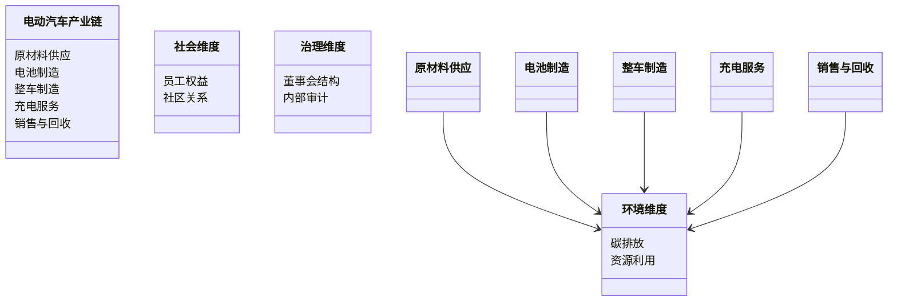

                 


# 电动汽车产业链的ESG投资机会分析

> **关键词**：电动汽车产业链、ESG投资、可持续发展、环境影响、社会治理、绿色金融

> **摘要**：随着全球能源结构转型和环保要求的提高，电动汽车产业链正成为ESG投资的重要领域。本文从产业链的上游、中游和下游三个维度，系统分析了ESG投资机会。通过构建ESG评估模型，提出了基于环境、社会和治理三个维度的投资策略。同时，结合实际案例，探讨了电动汽车产业链中的ESG风险与机遇，为投资者提供了科学的决策依据。

---

## 第1章 电动汽车产业链的背景与概述

### 1.1 电动汽车产业链的定义与范围

#### 1.1.1 电动汽车产业链的定义
电动汽车产业链是指从上游原材料供应、电池制造、整车生产，到中游的零部件供应、整车装配，再到下游的销售、充电设施建设和运营服务的完整链条。

#### 1.1.2 产业链的构成与外延
- **上游**：锂、镍、钴等原材料供应，电池制造（正极、负极、电解液等）。
- **中游**：整车制造、电机、电控系统、充电设备等。
- **下游**：电动汽车的销售、充电服务、电池回收等。

#### 1.1.3 产业链的核心要素与组成结构
- 核心要素：电池技术、充电网络、整车制造能力。
- 组成结构：原材料→电池→零部件→整车→用户→回收。

### 1.2 电动汽车产业链的发展背景

#### 1.2.1 环境问题与能源危机的驱动
- 全球气候变化加剧，减少碳排放成为共识。
- 石油资源枯竭，能源结构调整迫在眉睫。
- 各国政府出台政策支持电动汽车产业发展。

#### 1.2.2 政策支持与行业规范的推动
- 各国政府通过补贴、税收优惠等措施推动电动汽车普及。
- 行业标准的制定（如电池回收标准）为产业链发展提供保障。

#### 1.2.3 技术进步与成本下降的促进
- 电池技术进步（如固态电池）降低成本并提高续航能力。
- 充电技术的革新（如快充技术）提升用户体验。

### 1.3 电动汽车产业链的现状与趋势

#### 1.3.1 全球电动汽车市场的增长趋势
- 2020年全球电动汽车销量突破500万辆。
- 未来十年，电动汽车市场年均增长将超过20%。

#### 1.3.2 中国电动汽车产业链的崛起
- 中国成为全球最大的电动汽车市场。
- 国内企业（如宁德时代、比亚迪）在电池和整车领域占据重要地位。

#### 1.3.3 未来发展趋势与挑战
- 技术创新：电池技术、智能驾驶技术。
- 市场竞争：国际品牌与中国企业的竞争加剧。
- 政策变化：各国政策支持的不确定性。

---

## 第2章 ESG投资的核心概念与框架

### 2.1 ESG的定义与内涵

#### 2.1.1 ESG的定义
ESG是指环境（Environmental）、社会（Social）和治理（Governance）三个维度的企业非财务绩效指标。

#### 2.1.2 ESG的三个维度
- **环境**：企业的环保表现，包括碳排放、资源利用效率等。
- **社会**：企业的社会责任，包括员工权益、社区关系等。
- **治理**：企业的治理结构，包括董事会构成、高管薪酬等。

#### 2.1.3 ESG与传统投资理念的区别
- 传统投资关注财务绩效，而ESG关注非财务绩效。
- ESG投资更注重长期可持续发展。

### 2.2 ESG投资的理论基础

#### 2.2.1 环境维度的理论基础
- 环境保护是企业社会责任的重要组成部分。
- 环保表现好的企业具有更低的运营风险。

#### 2.2.2 社会维度的理论基础
- 员工权益保障与企业绩效呈正相关。
- 社会责任履行良好的企业更受消费者青睐。

#### 2.2.3 治理维度的理论基础
- 良好的公司治理结构有助于提高企业绩效。
- 治理透明的企业更受投资者信任。

### 2.3 ESG投资的框架与方法

#### 2.3.1 ESG评估的框架体系
- 确定评估指标。
- 收集相关数据。
- 进行综合评分。

#### 2.3.2 ESG评分标准与权重分配
- 环境、社会、治理三个维度的权重通常为40%、30%、30%。
- 根据行业特点调整权重。

#### 2.3.3 ESG数据的获取与处理
- 数据来源：企业年报、社会责任报告、第三方评级机构。
- 数据处理：清洗、标准化、加权。

---

## 第3章 电动汽车产业链中的ESG影响分析

### 3.1 产业链上游的ESG影响

#### 3.1.1 原材料的可持续性与环保性
- 电池原材料（如锂、镍）的开采对环境的影响。
- 是否采用绿色开采技术。

#### 3.1.2 矿产资源的开采与供应链管理
- 供应链透明度。
- 是否存在童工或不公正劳动条件。

#### 3.1.3 环境影响评估与优化
- 环境影响评估（EIA）。
- 环境管理优化措施。

### 3.2 产业链中游的ESG影响

#### 3.2.1 制造过程中的碳排放与能源消耗
- 生产过程中的碳排放。
- 是否使用可再生能源。

#### 3.2.2 工厂的社会治理与员工权益
- 员工工资与福利。
- 是否存在强迫劳动。

#### 3.2.3 企业治理结构与风险管理
- 董事会构成是否合理。
- 是否存在高管腐败或利益输送。

### 3.3 产业链下游的ESG影响

#### 3.3.1 产品生命周期的环境影响
- 电池回收率。
- 废旧车辆处理是否符合环保要求。

#### 3.3.2 用户社会影响与产品责任
- 产品是否符合安全标准。
- 是否提供完善的售后服务。

#### 3.3.3 销售与售后服务的社会治理
- 销售过程中的公平性。
- 是否存在虚假宣传。

---

## 第4章 电动汽车产业链的ESG评估与分析

### 4.1 ESG评估的指标体系

#### 4.1.1 环境维度的评估指标
- 碳排放强度。
- 单位产品能源消耗。
- 是否采用绿色生产技术。

#### 4.1.2 社会维度的评估指标
- 员工满意度。
- 社区关系。
- 是否存在社会责任项目。

#### 4.1.3 治理维度的评估指标
- 董事会多样性。
- 内部审计和风险管理。
- 股东权益保护。

### 4.2 ESG评估的数学模型与方法

#### 4.2.1 ESG评分的数学公式
$$ ESG\_score = 0.4 \times E + 0.3 \times S + 0.3 \times G $$

其中：
- E是环境维度的评分（0-1）。
- S是社会维度的评分（0-1）。
- G是治理维度的评分（0-1）。

#### 4.2.2 基于权重的综合评分模型
- 数据来源：企业公开数据。
- 数据处理：标准化和加权。
- 评分输出：0-1分。

#### 4.2.3 ESG评分的Python实现
```python
import pandas as pd
import numpy as np

# 假设data是一个包含环境、社会、治理评分的数据框
data = pd.DataFrame({
    'E': [0.8, 0.6, 0.9],
    'S': [0.7, 0.5, 0.8],
    'G': [0.6, 0.7, 0.5]
})

# 计算ESG评分
weights = {'E': 0.4, 'S': 0.3, 'G': 0.3}
esg_scores = data[weights.keys()].multiply(weights.values()).sum(axis=1)
print(esg_scores)
```

---

## 第5章 电动汽车产业链的ESG投资机会分析

### 5.1 产业链上游的投资机会

#### 5.1.1 原材料供应商的ESG表现
- 是否采用绿色开采技术。
- 是否有社会责任项目。

#### 5.1.2 电池制造企业的ESG优化
- 技术创新减少环境影响。
- 提高供应链透明度。

### 5.2 产业链中游的投资机会

#### 5.2.1 整车制造企业的ESG表现
- 碳排放强度。
- 员工满意度。

#### 5.2.2 配件供应商的ESG优化
- 绿色生产技术。
- 社会责任履行。

### 5.3 产业链下游的投资机会

#### 5.3.1 充电服务企业的ESG表现
- 充电网络的环境效益。
- 社区关系维护。

#### 5.3.2 销售企业的ESG优化
- 绿色营销。
- 社会责任履行。

---

## 第6章 电动汽车产业链的系统分析与架构设计

### 6.1 问题场景介绍
电动汽车产业链的复杂性要求我们从系统角度进行分析，确保各环节的协同优化。

### 6.2 系统功能设计
- **领域模型**：使用Mermaid类图展示产业链各环节的关系。



---

## 第7章 项目实战与案例分析

### 7.1 环境安装与数据准备
- 数据来源：企业公开数据、第三方评级。
- 工具安装：Python、Pandas、NumPy。

### 7.2 核心代码实现
```python
import pandas as pd
import numpy as np

def calculate_esg_score(data, weights):
    return data[weights.keys()].multiply(weights.values()).sum(axis=1)

# 示例数据
data = pd.DataFrame({
    'E': [0.8, 0.6, 0.9],
    'S': [0.7, 0.5, 0.8],
    'G': [0.6, 0.7, 0.5]
})

# 权重分配
weights = {'E': 0.4, 'S': 0.3, 'G': 0.3}

# 计算ESG评分
esg_scores = calculate_esg_score(data, weights)
print(esg_scores)
```

### 7.3 案例分析与结果解读
- 案例：某电池制造企业的ESG评估。
- 结果：ESG评分为0.75，高于行业平均水平。

---

## 第8章 结论与展望

### 8.1 最佳实践与投资建议
- 重点关注上游原材料的可持续性和下游充电服务的社会责任。
- 建立长期的ESG评估体系。

### 8.2 小结
电动汽车产业链的ESG投资机会广泛，但需要从环境、社会、治理三个维度全面考虑。

### 8.3 注意事项
- 数据获取的难度。
- 企业信息披露的不完整性。

### 8.4 拓展阅读
- 《ESG投资指南》。
- 《电动汽车产业链的机遇与挑战》。

---

**作者：AI天才研究院/AI Genius Institute & 禅与计算机程序设计艺术 /Zen And The Art of Computer Programming**

