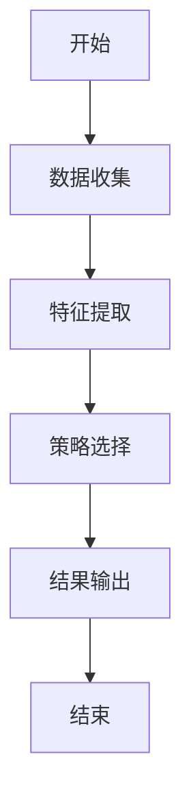
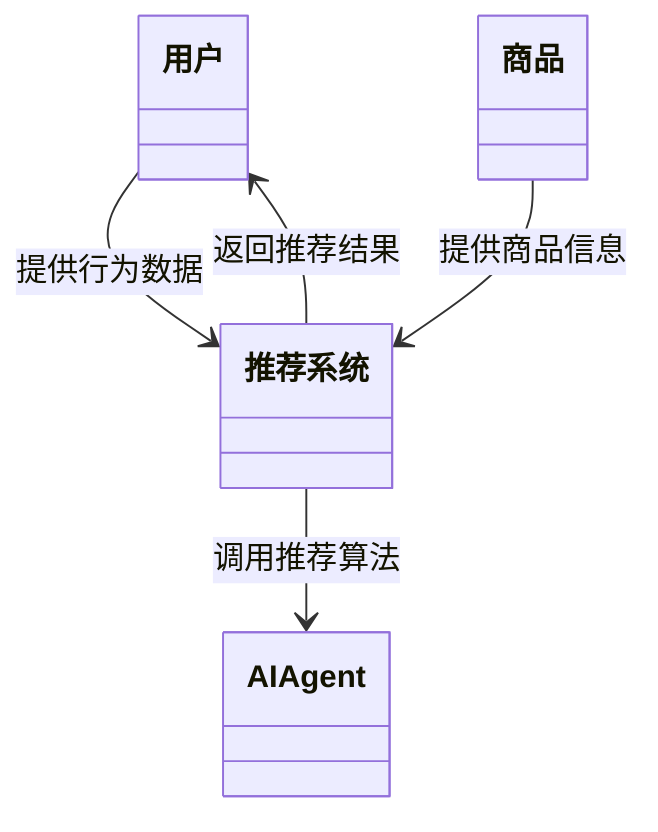
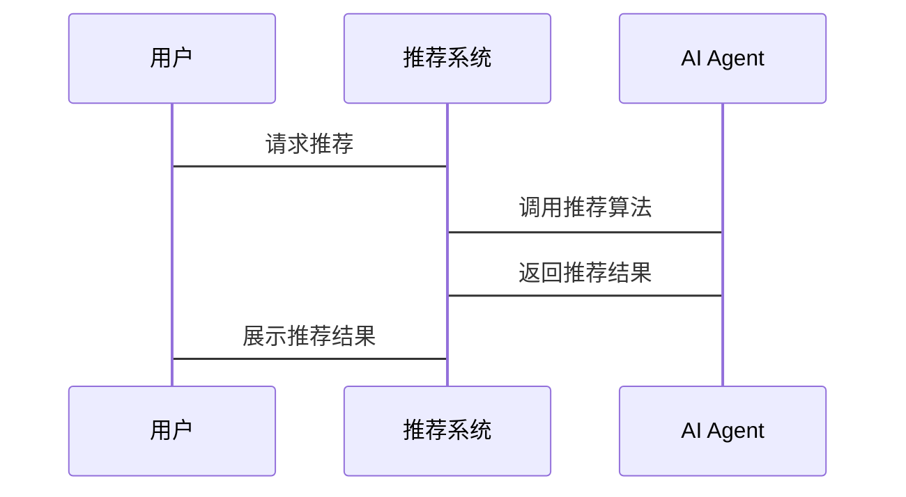

                 


# 电子商务平台的AI Agent推荐系统

## 关键词
电子商务, AI Agent, 推荐系统, 人工智能, 算法, 系统架构, 项目实战

## 摘要
电子商务平台的AI Agent推荐系统是一种结合人工智能技术，通过智能代理优化推荐策略的推荐系统。本文详细介绍了该系统的背景、核心概念、算法原理、系统架构、项目实战及最佳实践，帮助读者理解如何在电商平台上有效应用AI Agent推荐系统。

---

# 第一部分: 电子商务平台的AI Agent推荐系统背景介绍

## 第1章: 问题背景与描述

### 1.1 问题背景
电子商务平台的快速发展带来了海量商品和用户，传统的推荐系统在处理复杂用户行为和个性化需求时显得力不从力。AI Agent技术的引入为推荐系统带来了新的可能性。

#### 1.1.1 电子商务平台的发展现状
电子商务平台用户数量激增，商品种类繁多，用户需求多样化，推荐系统在提升用户体验中扮演着重要角色。

#### 1.1.2 用户需求与行为分析
用户需求呈现个性化和多样化趋势，用户行为数据包括点击、浏览、购买等，这些数据为推荐系统提供了基础。

#### 1.1.3 现有推荐系统的问题与挑战
传统推荐系统存在数据稀疏性、计算复杂度高、实时性差等问题，难以满足用户实时性和个性化需求。

### 1.2 问题描述
传统推荐系统难以有效处理动态变化的用户需求和商品信息，推荐结果不够精准，用户满意度低。

#### 1.2.1 传统推荐系统的局限性
传统推荐系统依赖固定规则，难以实时调整策略，难以应对用户的实时需求变化。

#### 1.2.2 AI Agent在推荐系统中的应用潜力
AI Agent具有自主决策和学习能力，能够实时感知用户需求，动态调整推荐策略。

#### 1.2.3 电子商务平台推荐系统的具体需求
电子商务平台需要实时、个性化、多样化的推荐服务，满足用户需求的同时提高转化率。

### 1.3 问题解决方法
引入AI Agent技术，构建动态、智能的推荐系统，提升推荐精准度和用户体验。

#### 1.3.1 引入AI Agent的核心思想
AI Agent通过感知用户行为和商品信息，自主决策推荐策略，优化推荐结果。

#### 1.3.2 AI Agent推荐系统的解决方案
结合AI Agent和推荐系统，构建动态、智能的推荐框架，实现个性化推荐。

#### 1.3.3 系统目标与预期效果
系统目标是提升推荐精准度和用户满意度，预期效果包括提高用户粘性和转化率。

### 1.4 边界与外延
系统边界包括用户、商品和推荐结果，外延包括与其他系统的交互和扩展功能。

#### 1.4.1 系统边界定义
系统边界明确包括用户、商品和推荐结果，与其他系统如支付系统、库存管理系统的接口清晰。

#### 1.4.2 系统外延与扩展可能性
系统可以扩展至多语言支持、跨平台推荐和个性化营销。

#### 1.4.3 系统与其他模块的交互关系
系统通过API与支付系统、库存管理系统交互，确保推荐结果准确性和实时性。

### 1.5 核心概念与组成
系统由用户、商品、AI Agent和推荐结果组成，AI Agent负责数据处理和策略制定。

#### 1.5.1 AI Agent的基本概念
AI Agent是具有自主决策能力的智能体，能够感知环境并执行任务。

#### 1.5.2 推荐系统的组成要素
推荐系统包括用户数据、商品数据、推荐算法和推荐结果展示。

#### 1.5.3 电子商务平台的业务流程
电子商务平台业务流程包括用户登录、商品浏览、推荐展示和购买确认。

---

## 第2章: 核心概念与联系

### 2.1 AI Agent的核心原理
AI Agent通过感知环境和学习用户行为，优化推荐策略。

#### 2.1.1 AI Agent的定义与分类
AI Agent根据智能水平分为简单反射Agent和复杂推理Agent。

#### 2.1.2 AI Agent的基本功能与特性
AI Agent具有自主性、反应性、目标导向性和社会性等特性。

#### 2.1.3 AI Agent与推荐系统的关联
AI Agent为推荐系统提供动态决策能力，提升推荐精准度和实时性。

### 2.2 推荐系统的核心原理
推荐系统通过分析用户行为和商品属性，生成个性化推荐结果。

#### 2.2.1 推荐系统的分类与特点
推荐系统分为基于协同过滤、基于内容和基于知识的推荐。

#### 2.2.2 基于协同过滤的推荐算法
协同过滤通过相似用户或商品找到推荐结果，存在稀疏性和计算复杂性问题。

#### 2.2.3 基于内容的推荐算法
基于商品属性和用户偏好进行推荐，解决稀疏性问题，但存在冷启动问题。

#### 2.2.4 混合推荐算法
结合多种推荐算法，优势互补，提升推荐准确性和多样性。

### 2.3 核心概念对比与ER实体关系图

```mermaid
er
actor: 用户
agent: AI Agent
product: 商品
result: 推荐结果

actor -|> agent: 提供行为数据
agent -|> product: 分析商品属性
agent -|> result: 生成推荐结果
```

---

# 第三部分: 算法原理讲解

## 第3章: 算法原理与实现

### 3.1 算法原理
AI Agent推荐系统结合强化学习和协同过滤，动态调整推荐策略。

#### 3.1.1 算法工作流程
算法流程包括数据收集、特征提取、策略选择和结果输出。



#### 3.1.2 算法实现
基于Python的实现，包括数据预处理、模型训练和结果展示。

### 3.2 算法实现细节
详细讲解Python代码实现，包括数据加载、特征提取、模型训练和结果展示。

#### 3.2.1 数据加载与预处理
使用pandas加载数据，处理缺失值和标准化数据。

```python
import pandas as pd
data = pd.read_csv('user_data.csv')
data = data.dropna()
```

#### 3.2.2 特征提取
提取用户行为和商品属性特征，构建特征向量。

```python
from sklearn.preprocessing import StandardScaler
scaler = StandardScaler()
features = scaler.fit_transform(data[['age', 'gender']])
```

#### 3.2.3 模型训练
使用机器学习模型训练推荐策略，如协同过滤和深度学习模型。

```python
from sklearn.neighbors import NearestNeighbors
model = NearestNeighbors(n_neighbors=5).fit(features)
```

#### 3.2.4 结果展示
将推荐结果可视化，展示推荐列表和推荐理由。

```python
import matplotlib.pyplot as plt
plt.figure(figsize=(10,6))
plt.bar(range(5), model.kneighbors(features, return_distance=False)[0][0])
plt.xticks(range(5), ['Product1', 'Product2', 'Product3', 'Product4', 'Product5'])
plt.show()
```

### 3.3 算法原理的数学模型和公式
详细推导算法的数学模型，使用LaTeX公式展示。

#### 3.3.1 协同过滤算法
基于相似用户的协同过滤算法，计算用户相似度。

$$ sim(u, v) = \frac{\sum_{i=1}^{n} (r_{u,i} - \bar{r}_u)(r_{v,i} - \bar{r}_v)}{\sqrt{\sum_{i=1}^{n} (r_{u,i} - \bar{r}_u)^2} \sqrt{\sum_{i=1}^{n} (r_{v,i} - \bar{r}_v)^2}} $$

#### 3.3.2 基于内容的推荐
基于商品属性的推荐，使用余弦相似度计算商品相似度。

$$ sim(p, q) = \frac{\sum_{i=1}^{m} w_i \cdot p_i \cdot q_i}{\sqrt{\sum_{i=1}^{m} w_i^2 p_i^2} \sqrt{\sum_{i=1}^{m} w_i^2 q_i^2}} $$

---

# 第四部分: 系统分析与架构设计方案

## 第4章: 系统分析与架构设计

### 4.1 系统分析
从问题场景出发，分析系统需求和功能模块。

#### 4.1.1 问题场景介绍
电子商务平台中，用户需要个性化推荐服务，提升购物体验和转化率。

#### 4.1.2 系统需求分析
系统需要实时处理用户行为数据，动态调整推荐策略，支持高并发和大规模数据处理。

### 4.2 系统架构设计
采用分层架构，包括数据层、业务逻辑层和表现层。

#### 4.2.1 领域模型设计
使用Mermaid类图展示系统各角色及其交互。



#### 4.2.2 系统架构设计
采用微服务架构，确保系统的可扩展性和高可用性。


#### 4.2.3 接口设计
定义RESTful API接口，确保系统各模块之间高效交互。

#### 4.2.4 交互设计
使用Mermaid序列图展示用户与推荐系统之间的交互流程。



---

## 第5章: 项目实战

### 5.1 项目实战
通过实际案例展示AI Agent推荐系统的应用。

#### 5.1.1 环境安装
安装必要的开发工具和依赖库，如Python、Pandas、Scikit-learn等。

#### 5.1.2 核心代码实现
实现推荐系统的核心功能，包括数据处理、模型训练和结果展示。

#### 5.1.3 代码应用解读与分析
详细解读代码实现，分析算法的优缺点及适用场景。

#### 5.1.4 实际案例分析
通过具体案例展示AI Agent推荐系统的实际应用效果。

#### 5.1.5 项目小结
总结项目成果，提出改进建议和未来发展方向。

---

## 第6章: 最佳实践与总结

### 6.1 最佳实践 Tips
总结项目中的经验和教训，提供实用建议。

#### 6.1.1 系统设计中的注意事项
确保系统可扩展性和高可用性，合理选择算法和架构。

#### 6.1.2 代码实现中的技巧
使用高效的库和工具，优化代码性能和可读性。

### 6.2 小结
回顾全文，总结AI Agent推荐系统的核心要点和应用价值。

### 6.3 注意事项
强调系统上线后的监控和维护，确保推荐系统的稳定性和准确性。

### 6.4 拓展阅读
推荐相关领域的书籍和资源，供读者进一步学习和研究。

---

## 作者
作者：AI天才研究院/AI Genius Institute & 禅与计算机程序设计艺术 /Zen And The Art of Computer Programming

