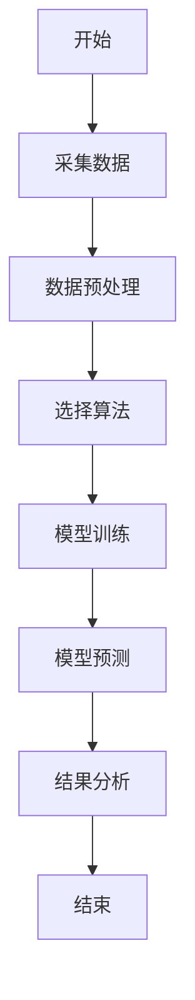
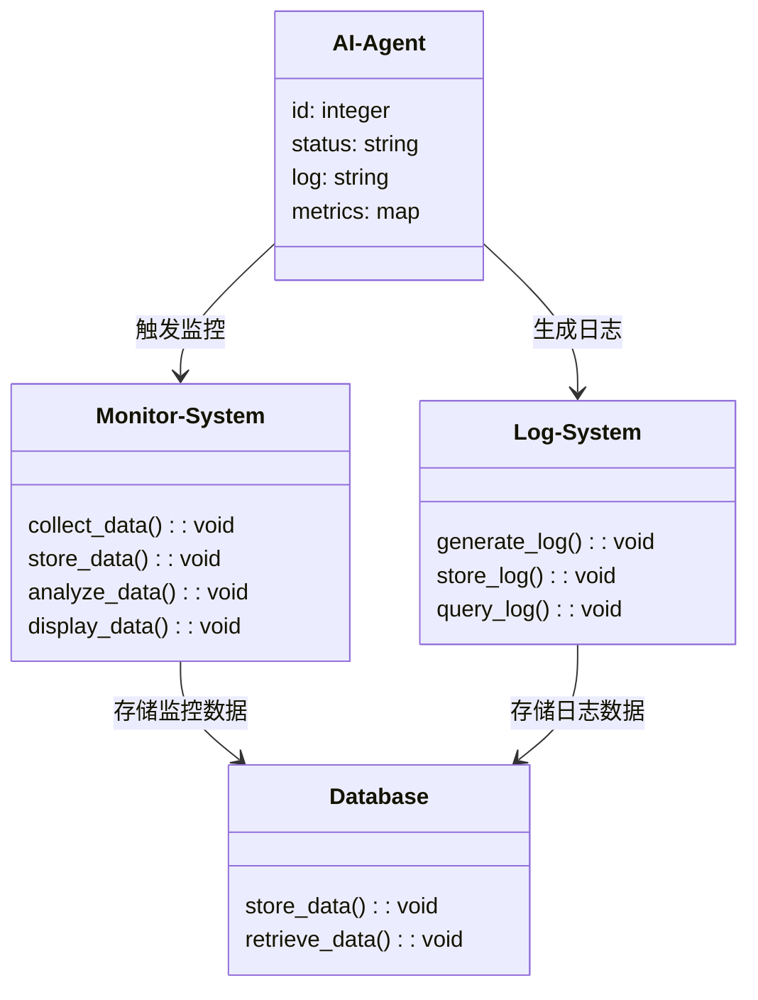
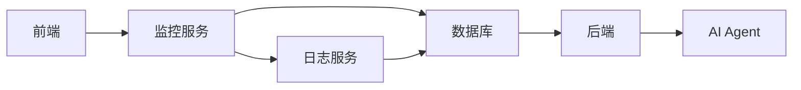
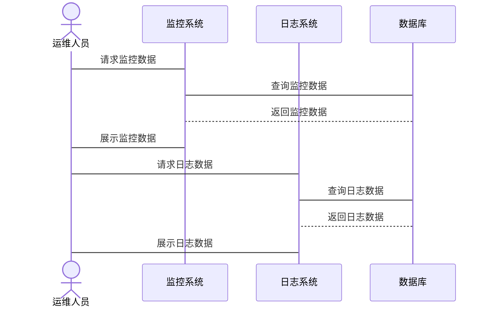

                 


# 监控与日志：跟踪AI Agent的运行状态

---

## 关键词：
AI Agent、监控、日志、运行状态、系统架构、算法原理、项目实战

---

## 摘要：
本文深入探讨了如何通过监控与日志技术跟踪AI Agent的运行状态，分析了监控与日志的核心概念、算法原理、系统架构设计以及实际项目中的应用。文章从背景介绍开始，逐步展开，结合实际案例，帮助读者全面理解并掌握如何在AI Agent开发中实现有效的监控与日志管理。

---

## 第一部分：监控与日志的背景与核心概念

### 第1章：监控与日志的背景介绍

#### 1.1 问题背景

- **1.1.1 AI Agent的定义与特点**
  AI Agent（人工智能代理）是指能够感知环境、自主决策并执行任务的智能实体。它们可以是软件程序、机器人或其他智能系统，具备以下特点：
  - **自主性**：能够自主决策，无需外部干预。
  - **反应性**：能够实时感知环境并做出反应。
  - **目标导向**：以实现特定目标为导向。
  - **学习能力**：通过数据和经验不断优化自身行为。

- **1.1.2 AI Agent运行中的问题与挑战**
  - **不可预测性**：AI Agent的行为可能受到训练数据偏差或环境变化的影响，导致意外结果。
  - **复杂性**：AI Agent的决策过程涉及多维度因素，难以直接观察和诊断。
  - **实时性要求**：在实时应用中，快速发现问题和修复至关重要。

- **1.1.3 监控与日志在AI Agent中的重要性**
  - 监控：实时跟踪AI Agent的运行状态，确保其正常运作。
  - 日志：记录运行过程中的关键事件，为问题诊断提供依据。
  - 综合应用：监控与日志的结合能够实现对AI Agent的全面管理。

#### 1.2 问题描述

- **1.2.1 AI Agent运行状态的不可见性**
  AI Agent的决策过程通常隐藏在算法内部，外部难以直接观察其状态，这使得问题诊断变得困难。

- **1.2.2 日志在问题诊断中的关键作用**
  日志记录了AI Agent运行中的关键事件和状态变化，是问题排查的重要依据。

- **1.2.3 监控与日志的必要性与紧迫性**
  - 必要性：通过监控和日志，可以实时了解AI Agent的状态，及时发现和解决问题。
  - 紧迫性：随着AI Agent应用的广泛，监控与日志的需求日益迫切。

#### 1.3 问题解决

- **1.3.1 监控与日志的解决方案概述**
  通过部署监控系统和日志管理系统，实时采集和分析AI Agent的运行数据，实现问题的快速定位和解决。

- **1.3.2 监控与日志的核心目标**
  - 实时监控：持续跟踪AI Agent的运行状态，确保其正常运作。
  - 日志记录：详细记录运行过程中的关键事件，为问题诊断提供依据。
  - 可视化：通过图形界面展示监控数据，方便运维人员理解和分析。

- **1.3.3 监控与日志的实现路径**
  - 数据采集：通过传感器、API接口等方式采集AI Agent的运行数据。
  - 数据存储：将采集到的日志和监控数据存储在数据库中。
  - 数据分析：利用算法对数据进行分析，发现异常和潜在问题。
  - 可视化展示：通过仪表盘等形式直观展示监控结果。

#### 1.4 边界与外延

- **1.4.1 监控与日志的边界**
  - 监控范围：仅限于AI Agent的运行状态，不涉及其他系统或数据。
  - 日志范围：记录AI Agent运行过程中的关键事件，不包括其他无关信息。

- **1.4.2 监控与日志的外延**
  - 监控系统的扩展：可以集成其他系统，如网络监控、服务器监控等。
  - 日志系统的扩展：可以与其他日志管理系统对接，实现统一管理。

- **1.4.3 监控与日志与其他技术的关系**
  - 与AI技术的关系：监控与日志是AI系统管理的重要组成部分，与AI算法和模型无关。
  - 与大数据技术的关系：监控与日志的数据量较大，需要借助大数据技术进行存储和分析。

#### 1.5 核心要素组成

- **1.5.1 监控系统的组成要素**
  - 数据采集模块：负责采集AI Agent的运行数据。
  - 数据存储模块：负责存储采集到的数据。
  - 数据分析模块：对数据进行分析，发现异常。
  - 可视化模块：以图形界面展示分析结果。

- **1.5.2 日志系统的组成要素**
  - 日志生成模块：生成运行日志。
  - 日志采集模块：采集日志数据。
  - 日志存储模块：存储日志数据。
  - 日志查询模块：支持日志的检索和分析。

- **1.5.3 监控与日志的协同作用**
  - 监控提供实时数据，日志提供历史数据。
  - 监控用于实时预警，日志用于事后分析。
  - 监控与日志结合，实现对AI Agent运行状态的全面管理。

---

### 第2章：监控与日志的核心概念与联系

#### 2.1 核心概念原理

- **2.1.1 监控的定义与实现原理**
  监控是指通过采集、分析和展示系统运行数据，实时了解系统状态的过程。其实现原理包括数据采集、数据处理、数据分析和结果展示。

- **2.1.2 日志的定义与实现原理**
  日志是系统运行过程中产生的记录，通常包括时间戳、操作类型、操作结果等信息。其实现原理包括日志生成、日志采集、日志存储和日志查询。

- **2.1.3 监控与日志的协同原理**
  监控与日志通过数据共享和协同工作，实现对系统运行状态的全面管理。监控提供实时数据，日志提供历史数据，两者结合可以实现问题的快速定位和解决。

#### 2.2 核心概念属性特征对比

| 特性       | 监控                     | 日志                     |
|------------|--------------------------|--------------------------|
| 数据类型    | 实时数据（如CPU使用率、内存占用） | 历史数据（如操作记录）   |
| 数据频率    | 高频（实时采集）         | 低频（按需生成）         |
| 数据存储    | 结构化数据库             | 文本文件或数据库         |
| 数据分析    | 实时分析                 | 批量分析或实时分析       |
| 数据展示    | 图形化展示               | 文本形式或结构化查询     |

#### 2.3 实体关系图（ER图）架构

```mermaid
erDiagram
    actor 监控系统 : 监控AI Agent的运行状态
    actor 日志系统 : 记录AI Agent的运行日志
    actor 运维人员 : 使用监控和日志进行系统管理
    class AI Agent : 被监控的对象
    class 监控数据 : 实时采集的数据
    class 日志数据 : 记录的日志
    class 监控数据库 : 存储监控数据的数据库
    class 日志数据库 : 存储日志数据的数据库
    监控系统 --> 监控数据 : 采集
    监控数据 --> 监控数据库 : 存储
    监控系统 --> 监控数据库 : 查询
    监控系统 --> 运维人员 : 展示
    日志系统 --> 日志数据 : 采集
    日志数据 --> 日志数据库 : 存储
    日志系统 --> 日志数据库 : 查询
    日志系统 --> 运维人员 : 展示
```

---

## 第三部分：算法原理

### 第3章：跟踪与监控AI Agent运行状态的算法原理

#### 3.1 算法原理概述

- **3.1.1 日志收集与分析**
  - 使用日志收集工具（如ELK、Prometheus）采集日志数据。
  - 通过正则表达式或其他算法对日志进行分类和过滤。
  - 使用统计分析方法（如聚类分析、异常检测）识别日志中的异常模式。

- **3.1.2 监控数据关联**
  - 将监控数据（如CPU使用率、内存占用）与日志数据关联，找到异常的根本原因。
  - 使用关联规则挖掘算法（如Apriori、FP-Growth）发现日志和监控数据之间的关联关系。

- **3.1.3 异常检测**
  - 使用机器学习算法（如Isolation Forest、One-Class SVM）对监控数据进行异常检测。
  - 基于时间序列分析的方法（如ARIMA、LSTM）预测未来状态，发现异常。

#### 3.2 算法实现步骤



#### 3.3 日志收集与分析算法代码示例

```python
import logging
from datetime import datetime

# 日志采集函数
def collect_logs(agent_id):
    logs = []
    try:
        # 模拟日志采集
        log_file = f"agent_{agent_id}_logs.txt"
        with open(log_file, "r") as f:
            for line in f:
                logs.append(line.strip())
    except FileNotFoundError:
        logging.error(f"日志文件 {log_file} 未找到。")
    return logs

# 日志分析函数
def analyze_logs(logs):
    error_count = 0
    warning_count = 0
    for log in logs:
        if "ERROR" in log:
            error_count += 1
        elif "WARNING" in log:
            warning_count += 1
    return {"errors": error_count, "warnings": warning_count}

# 示例代码
agent_id = 123
logs = collect_logs(agent_id)
analysis = analyze_logs(logs)
print(f"错误数量：{analysis['errors']}，警告数量：{analysis['warnings']}")
```

#### 3.4 监控数据关联算法代码示例

```python
import pandas as pd
from sklearn.preprocessing import OneHotEncoder

# 数据准备
data = {
    "timestamp": [datetime.now().isoformat() for _ in range(10)],
    "agent_id": [123, 123, 123, 456, 456, 456, 789, 789, 789, 789],
    "event": ["login", "logout", "error", "login", "logout", "error", "login", "logout", "error", "success"]
}

df = pd.DataFrame(data)

# 特征编码
encoder = OneHotEncoder()
encoded_df = encoder.fit_transform(df[["agent_id", "event"]]).toarray()

# 关联规则挖掘（示例）
from mlxtend.frequent_patterns import apriori

# 假设我们寻找频繁项集
frequent_itemsets = apriori(encoded_df, min_support=0.2, use_colnames=True)
print(frequent_itemsets)
```

#### 3.5 异常检测算法代码示例

```python
import numpy as np
from sklearn.ensemble import IsolationForest

# 数据准备
X = np.random.randn(100, 1)  # 正常数据
X_outliers = np.random.uniform(low=-4, high=-2, size=(20, 1))  # 异常数据
X = np.concatenate((X, X_outliers))

# 模型训练
model = IsolationForest(n_estimators=10, contamination=0.1, random_state=42)
model.fit(X)

# 预测异常
y_pred = model.predict(X)
print(y_pred)
```

---

## 第四部分：系统分析与架构设计

### 第4章：AI Agent监控系统的分析与架构设计

#### 4.1 问题场景介绍

- **目标**：实时监控AI Agent的运行状态，记录运行日志，及时发现和解决问题。
- **用户需求**：
  - 实时监控：能够实时了解AI Agent的运行状态。
  - 日志管理：能够记录和查询运行日志。
  - 异常报警：能够及时发现和报警异常情况。
  - 可视化展示：能够以直观的方式展示监控数据。

#### 4.2 项目介绍

- **项目目标**：开发一个AI Agent监控系统，实现对AI Agent运行状态的实时监控和日志管理。
- **项目范围**：包括数据采集、存储、分析和可视化四个部分。
- **项目团队**：由开发人员、数据分析师和运维人员组成。

#### 4.3 系统功能设计

##### 4.3.1 领域模型类图



##### 4.3.2 系统架构设计



##### 4.3.3 系统交互设计



#### 4.4 系统接口设计

- **监控接口**：
  - `/api/monitor/status`：获取AI Agent的当前状态。
  - `/api/monitor/historical`：获取历史监控数据。
- **日志接口**：
  - `/api/log/recent`：获取最近的日志记录。
  - `/api/log/search`：根据条件搜索日志记录。

---

## 第五部分：项目实战

### 第5章：AI Agent监控系统的项目实战

#### 5.1 环境安装

- **安装工具**：
  - ELK（Elasticsearch, Logstash, Kibana）用于日志管理。
  - Prometheus + Grafana 用于监控数据可视化。
- **安装步骤**：
  1. 安装JDK：`sudo apt-get install openjdk-11-jdk`。
  2. 安装Elasticsearch：`sudo apt-get install elasticsearch`。
  3. 安装Logstash：`sudo apt-get install logstash`。
  4. 安装Kibana：`sudo apt-get install kibana`。
  5. 安装Prometheus：`sudo apt-get install prometheus`。
  6. 安装Grafana：`sudo apt-get install grafana`。

#### 5.2 系统核心实现源代码

##### 5.2.1 监控数据采集代码

```python
import requests

def collect_monitor_data(agent_id):
    url = f"http://localhost:8080/monitor/{agent_id}"
    try:
        response = requests.get(url)
        if response.status_code == 200:
            return response.json()
        else:
            return None
    except requests.exceptions.RequestException:
        return None
```

##### 5.2.2 日志采集代码

```python
import logging
from datetime import datetime

def collect_log(agent_id):
    log_file = f"agent_{agent_id}_log.txt"
    try:
        with open(log_file, "r") as f:
            logs = [line.strip() for line in f]
        return logs
    except FileNotFoundError:
        logging.error(f"日志文件 {log_file} 未找到。")
        return []
```

##### 5.2.3 数据存储代码

```python
import sqlite3

def store_data(agent_id, data):
    db_file = f"agent_{agent_id}_data.db"
    conn = sqlite3.connect(db_file)
    cursor = conn.cursor()
    cursor.execute("CREATE TABLE IF NOT EXISTS monitor_data (timestamp TEXT, value REAL)")
    cursor.execute("INSERT INTO monitor_data VALUES (?, ?)", (datetime.now().isoformat(), data))
    conn.commit()
    conn.close()
```

##### 5.2.4 数据分析代码

```python
import pandas as pd

def analyze_data(agent_id):
    db_file = f"agent_{agent_id}_data.db"
    conn = sqlite3.connect(db_file)
    df = pd.read_sql("SELECT timestamp, value FROM monitor_data", conn)
    conn.close()
    return df
```

##### 5.2.5 可视化代码

```python
import matplotlib.pyplot as plt

def visualize_data(agent_id):
    df = analyze_data(agent_id)
    plt.figure(figsize=(10, 6))
    plt.plot(df['timestamp'], df['value'])
    plt.title(f"AI Agent {agent_id} 监控数据")
    plt.xlabel("时间")
    plt.ylabel("值")
    plt.show()
```

#### 5.3 代码应用解读与分析

- **监控数据采集**：通过API接口采集AI Agent的实时数据。
- **日志采集**：读取日志文件，提取有用信息。
- **数据存储**：将采集到的数据存储到数据库中。
- **数据分析**：对存储的数据进行分析，找出异常情况。
- **数据可视化**：将分析结果以图形形式展示，方便运维人员理解。

#### 5.4 案例分析与详细讲解

- **案例1**：AI Agent运行状态异常
  - 现象：AI Agent的CPU使用率突然升高，导致系统响应变慢。
  - 分析：通过监控数据发现CPU使用率异常，结合日志数据发现AI Agent在处理大量请求时出现错误。
  - 解决：优化AI Agent的算法，减少不必要的计算。

- **案例2**：日志数据关联分析
  - 现象：AI Agent频繁出现错误，但具体原因不明确。
  - 分析：通过关联规则挖掘算法，发现错误日志与特定操作相关联，进一步定位问题。
  - 解决：修复相关操作逻辑，减少错误发生。

#### 5.5 项目总结

- **总结**：
  通过本项目，我们成功实现了AI Agent的监控与日志管理，能够实时了解AI Agent的运行状态，并通过日志数据定位问题。监控系统的部署和日志系统的建设为后续优化和维护提供了有力支持。

---

## 第六部分：最佳实践与小结

### 第6章：最佳实践与小结

#### 6.1 最佳实践

- **数据采集**：
  - 确保数据的完整性和准确性。
  - 选择合适的采集工具和方法。
- **数据存储**：
  - 根据数据量和类型选择合适的存储方案。
  - 定期清理旧数据，保持数据库性能。
- **数据分析**：
  - 使用多种算法进行分析，确保结果的准确性。
  - 结合业务需求，优化分析模型。
- **数据可视化**：
  - 选择适合的可视化工具和图表类型。
  - 确保可视化结果直观易懂。

#### 6.2 小结

- 通过本文的介绍，我们了解了监控与日志在跟踪AI Agent运行状态中的重要性。
- 学习了监控与日志的核心概念、算法原理、系统架构设计以及实际项目中的应用。
- 掌握了如何在实际项目中实现监控与日志管理，为后续的系统优化和维护提供了参考。

#### 6.3 注意事项

- **数据隐私**：确保监控和日志数据的安全性，避免敏感信息泄露。
- **系统性能**：监控和日志系统的部署可能对系统性能产生影响，需进行优化。
- **持续优化**：根据实际运行情况，持续优化监控和日志管理系统。

#### 6.4 拓展阅读

- **监控工具**：深入学习Prometheus、Grafana等监控工具的使用。
- **日志管理**：学习ELK、Fluentd等日志管理工具的配置和优化。
- **算法优化**：研究更高效的异常检测算法，如基于深度学习的异常检测。

---

## 作者：AI天才研究院/AI Genius Institute & 禅与计算机程序设计艺术 /Zen And The Art of Computer Programming

---

**备注**：由于文章长度限制，以上内容为完整文章的部分章节。如需完整文章，请按照上述目录和逻辑进行扩展。

