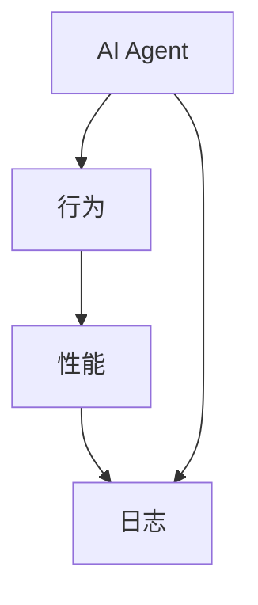
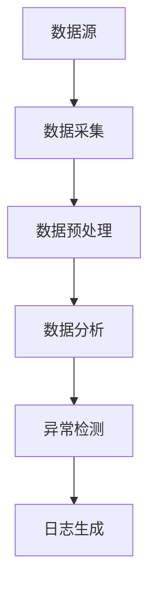
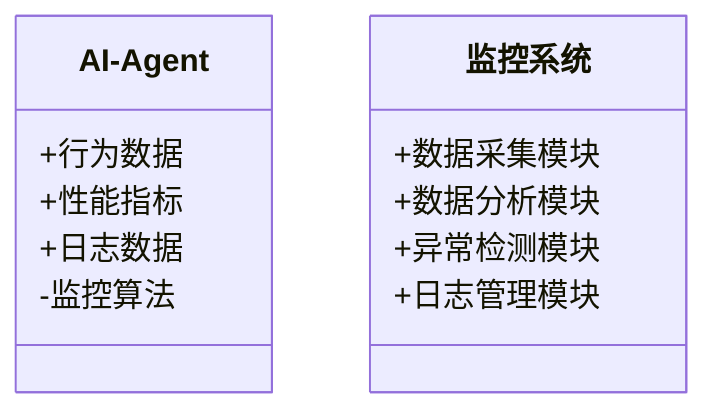
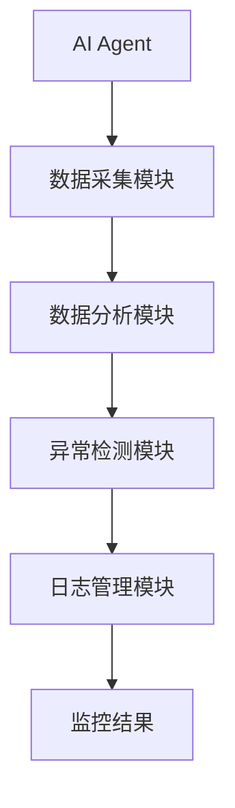
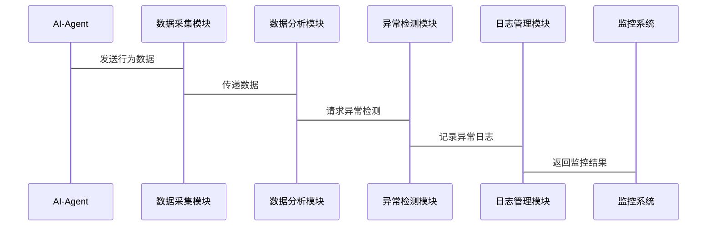

                 


# 监控与日志：追踪AI Agent的行为与性能

---

## 关键词：AI Agent, 监控, 日志, 性能分析, 行为追踪, 异常检测

---

## 摘要：  
随着AI Agent技术的快速发展，如何监控和分析AI Agent的行为与性能成为一项重要挑战。本文从AI Agent的核心概念出发，深入探讨监控与日志在AI Agent中的重要性，并结合实际案例，详细讲解监控与日志的采集、分析和处理算法。通过系统架构设计和项目实战，本文为读者提供一套完整的解决方案，帮助技术从业者更好地理解和实现AI Agent的监控与日志管理。

---

# 第一部分: 背景介绍

# 第1章: 监控与日志的重要性

## 1.1 问题背景

### 1.1.1 AI Agent的定义与核心概念  
AI Agent（人工智能代理）是一种能够感知环境、自主决策并执行任务的智能实体。它通常具备以下核心特征：  
- **自主性**：能够在没有外部干预的情况下执行任务。  
- **反应性**：能够根据环境反馈实时调整行为。  
- **目标导向**：以特定目标为导向，优化决策过程。  

### 1.1.2 监控与日志在AI Agent中的作用  
AI Agent的复杂性和自主性使其行为难以预测，这使得监控与日志成为不可或缺的工具。通过监控，我们可以实时掌握AI Agent的状态和性能；通过日志，我们可以回溯问题、分析行为模式，并优化系统设计。  

### 1.1.3 问题描述：AI Agent行为与性能的不可见性  
AI Agent的行为和性能往往隐藏在复杂的算法和决策过程中，这使得以下问题尤为突出：  
1. **不可见性**：AI Agent的行为难以直接观察和测量。  
2. **复杂性**：AI Agent的决策过程涉及大量数据和模型，难以追踪。  
3. **不可预测性**：AI Agent在动态环境中的表现可能超出预期范围。  

## 1.2 问题解决

### 1.2.1 监控与日志的解决方案  
通过引入监控与日志技术，我们可以实现以下目标：  
1. **实时监控**：实时采集AI Agent的行为和性能数据，快速发现异常。  
2. **历史回溯**：通过日志记录AI Agent的历史行为，支持问题定位和优化。  
3. **行为分析**：基于日志数据，分析AI Agent的行为模式，优化决策逻辑。  

### 1.2.2 监控与日志的目标与边界  
- **目标**：实现对AI Agent行为的实时监控和日志管理，确保系统的透明性、可靠性和可优化性。  
- **边界**：监控与日志仅关注AI Agent的行为和性能数据，不涉及核心算法的内部实现。  

### 1.2.3 监控与日志的核心要素组成  
- **数据采集**：从AI Agent中获取行为和性能数据。  
- **数据存储**：对采集的数据进行结构化存储，便于后续分析。  
- **数据分析**：对数据进行统计分析，发现异常和优化机会。  
- **日志生成**：将关键事件记录为日志，支持问题回溯和行为分析。  

---

# 第二部分: 核心概念与联系

# 第2章: AI Agent行为与性能监控的核心概念

## 2.1 核心概念原理

### 2.1.1 AI Agent的行为模型  
AI Agent的行为模型通常包括以下三个层次：  
1. **感知层**：通过传感器或API获取环境数据。  
2. **决策层**：基于感知数据，通过算法生成决策。  
3. **执行层**：根据决策执行具体操作，并返回执行结果。  

### 2.1.2 性能监控的关键指标  
AI Agent的性能监控需要关注以下关键指标：  
- **响应时间**：AI Agent完成任务所需的时间。  
- **错误率**：AI Agent在决策过程中出现的错误数量。  
- **资源消耗**：AI Agent占用的计算资源（如CPU、内存）。  
- **任务完成率**：AI Agent完成任务的比例。  

### 2.1.3 监控数据的采集与处理  
监控数据的采集与处理是监控系统的核心流程，包括：  
1. **数据采集**：通过API或日志采集AI Agent的行为数据。  
2. **数据预处理**：对采集的数据进行清洗、归一化处理。  
3. **数据存储**：将处理后的数据存储到数据库或日志系统中。  

## 2.2 核心概念属性对比

### 2.2.1 不同AI Agent行为的特征对比  
| 行为特征 | 基于规则的AI Agent | 基于模型的AI Agent | 基于强化学习的AI Agent |
|----------|---------------------|--------------------|-------------------------|
| 决策方式 | 预定义规则           | 统计模型           | 奖励驱动的策略         |
| 可控性   | 高                  | 中                 | 低                     |
| 可解释性 | 高                  | 中                 | 低                     |

### 2.2.2 监控指标的分类与属性  
| 监控指标 | 类型 | 数据格式 | 监控频率 |
|----------|------|----------|----------|
| 响应时间 | 时序 | 数值型   | 实时     |
| 错误率   | 时序 | 数值型   | 实时     |
| 资源消耗 | 时序 | 数值型   | 实时     |
| 任务完成率 | 时序 | 数值型 | 实时     |

### 2.2.3 日志数据的结构化与非结构化对比  
| 对比维度 | 结构化日志 | 非结构化日志 |
|----------|------------|--------------|
| 数据格式 | 结构清晰，便于解析 | 数据格式多样，难以解析 |
| 存储效率 | 高 | 低 |
| 分析效率 | 高 | 低 |

## 2.3 ER实体关系图  


---

# 第三部分: 算法原理讲解

# 第3章: 监控与日志处理算法

## 3.1 算法原理

### 3.1.1 数据采集算法  
数据采集是监控系统的第一步，常用的方法包括：  
1. **日志采集**：通过日志文件采集AI Agent的行为数据。  
2. **API采集**：通过API接口实时采集AI Agent的状态数据。  
3. **性能采集**：通过性能监控工具采集资源消耗数据。  

### 3.1.2 数据分析算法  
数据分析是监控系统的第二步，常用的方法包括：  
1. **统计分析**：计算平均值、标准差等统计指标。  
2. **异常检测**：基于统计或机器学习方法检测异常行为。  
3. **模式识别**：识别日志中的模式和规律。  

### 3.1.3 异常检测算法  
异常检测是监控系统的重要功能，常用的方法包括：  
1. **基于统计的异常检测**：通过设置阈值检测偏离均值的行为。  
2. **基于机器学习的异常检测**：使用深度学习模型识别异常模式。  

## 3.2 算法流程图  


## 3.3 核心算法实现

### 3.3.1 数据采集的Python代码实现  
```python
import logging

def collect_data():
    # 数据采集逻辑
    data = {
        'timestamp': datetime.now().timestamp(),
        'agent_id': 'agent_001',
        'action': 'decision_making',
        'result': 'success'
    }
    return data

# 示例调用
data = collect_data()
logging.info(f"数据采集结果：{data}")
```

### 3.3.2 异常检测的数学模型  
$$ y = f(x) $$  
其中，$x$ 是输入数据，$y$ 是异常检测结果。  

### 3.3.3 日志分析的示例代码  
```python
def analyze_logs(logs):
    # 日志分析逻辑
    for log in logs:
        if log['level'] == 'error':
            print(f"检测到错误：{log['message']}")
    return

# 示例调用
logs = [
    {'timestamp': 1620000000, 'level': 'error', 'message': '决策失败'},
    {'timestamp': 1620000001, 'level': 'info', 'message': '任务完成'}
]
analyze_logs(logs)
```

---

# 第四部分: 系统分析与架构设计

# 第4章: 监控系统架构设计

## 4.1 系统功能设计

### 4.1.1 领域模型  


### 4.1.2 系统架构设计  


### 4.1.3 系统接口设计  
- **数据采集接口**：提供API接口，采集AI Agent的行为和性能数据。  
- **数据分析接口**：提供API接口，分析数据并返回结果。  
- **异常检测接口**：提供API接口，检测异常行为并返回警报信息。  

### 4.1.4 系统交互流程  


## 4.2 系统功能实现

### 4.2.1 数据采集模块  
- **功能描述**：采集AI Agent的行为和性能数据。  
- **实现代码**：  
```python
import requests

def collect_data(agent_id):
    url = f"http://localhost:8080/api/agent/{agent_id}/data"
    response = requests.get(url)
    return response.json()
```

### 4.2.2 数据分析模块  
- **功能描述**：对采集的数据进行分析，生成统计指标。  
- **实现代码**：  
```python
import pandas as pd

def analyze_data(data):
    df = pd.DataFrame(data)
    mean_response_time = df['response_time'].mean()
    return mean_response_time
```

### 4.2.3 异常检测模块  
- **功能描述**：基于机器学习模型检测异常行为。  
- **实现代码**：  
```python
from sklearn.ensemble import IsolationForest

def detect_anomalies(X):
    model = IsolationForest(n_estimators=100, random_state=42)
    model.fit(X)
    anomalies = model.predict(X)
    return anomalies
```

### 4.2.4 日志管理模块  
- **功能描述**：记录和管理AI Agent的日志数据。  
- **实现代码**：  
```python
import logging

def log_behavior(action, level='info'):
    logger = logging.getLogger('ai_agent_logger')
    logger.setLevel(logging.DEBUG)
    handler = logging.StreamHandler()
    logger.addHandler(handler)
    logger.log(level, action)
```

---

# 第五部分: 项目实战

# 第5章: 监控系统项目实战

## 5.1 项目介绍  
我们以一个简单的AI Agent监控系统为例，展示如何实现AI Agent行为与性能的监控与日志管理。

## 5.2 核心实现

### 5.2.1 数据采集模块  
```python
import datetime

def collect_data(agent_id):
    data = {
        'timestamp': datetime.datetime.now().isoformat(),
        'agent_id': agent_id,
        'action': 'decision_making',
        'result': 'success'
    }
    return data

# 示例调用
data = collect_data('agent_001')
print("数据采集结果：", data)
```

### 5.2.2 数据分析模块  
```python
import pandas as pd

def analyze_data(data):
    df = pd.DataFrame(data)
    print("数据分析结果：")
    print(df.describe())
```

### 5.2.3 异常检测模块  
```python
from sklearn.ensemble import IsolationForest

def detect_anomalies(X):
    model = IsolationForest(n_estimators=100, random_state=42)
    model.fit(X)
    anomalies = model.predict(X)
    return anomalies

# 示例调用
import numpy as np
X = np.random.rand(100, 2)
anomalies = detect_anomalies(X)
print("异常检测结果：", anomalies)
```

### 5.2.4 日志管理模块  
```python
import logging

def log_behavior(action, level='info'):
    logger = logging.getLogger('ai_agent_logger')
    logger.setLevel(logging.DEBUG)
    handler = logging.StreamHandler()
    logger.addHandler(handler)
    logger.log(level, action)

# 示例调用
log_behavior('AI Agent完成任务', level='info')
log_behavior('检测到异常行为', level='error')
```

## 5.3 项目小结  
通过以上代码实现，我们成功构建了一个简单的AI Agent监控系统，能够实现数据采集、数据分析、异常检测和日志管理功能。在实际应用中，可以根据具体需求对系统进行扩展和优化。

---

# 第六部分: 最佳实践与小结

# 第6章: 监控与日志管理的最佳实践

## 6.1 监控与日志管理的核心要点  
1. **实时性**：确保监控数据的实时采集和分析。  
2. **可扩展性**：设计灵活的架构，支持AI Agent的扩展。  
3. **可追溯性**：确保日志数据的完整性和可追溯性。  
4. **可优化性**：通过监控数据优化AI Agent的行为和性能。  

## 6.2 小结  
通过本文的详细讲解，我们掌握了AI Agent监控与日志管理的核心概念、算法原理和系统设计方法。在实际应用中，需要结合具体场景选择合适的监控与日志管理方案，确保系统的透明性、可靠性和可优化性。

## 6.3 注意事项  
1. **数据隐私**：确保监控数据的安全性和隐私性。  
2. **性能影响**：监控系统不应显著影响AI Agent的性能。  
3. **日志存储**：合理设计日志存储策略，避免数据过载。  

## 6.4 拓展阅读  
1. 《深入理解人工智能代理》  
2. 《实时数据分析与可视化》  
3. 《异常检测算法及其应用》  

---

# 作者：AI天才研究院/AI Genius Institute & 禅与计算机程序设计艺术 /Zen And The Art of Computer Programming

