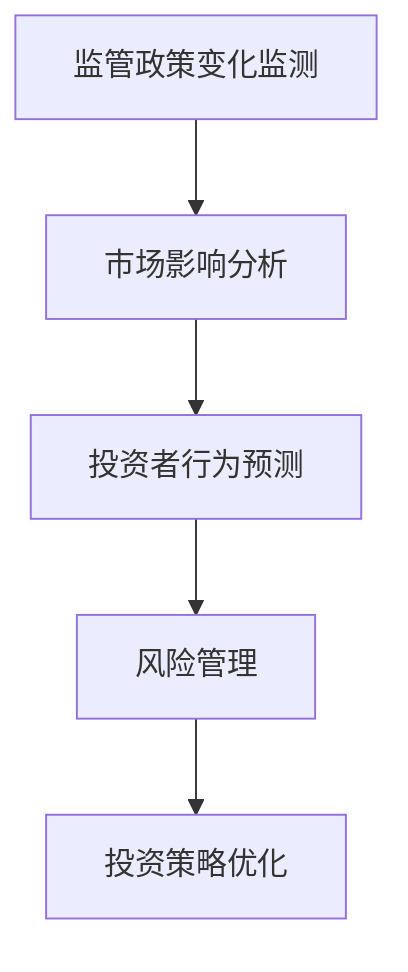

                 

# 监管政策变化对投资环境的影响

## 关键词：监管政策变化、投资环境、市场影响、政策分析、投资者行为

## 摘要

本文探讨了监管政策变化对投资环境的深远影响，分析了不同类型投资市场（如股票、债券、房地产）的具体表现，讨论了投资者行为的调整策略，并提供了应对监管变化的最佳实践。文章结合数学模型和实际案例，深入分析了监管政策变化如何影响市场流动性、投资策略和风险管理，并提出了未来监管趋势的展望。

---

## 第一部分：监管政策变化的背景与基础

### 第1章：监管政策的基本概念与框架

#### 1.1 监管政策的定义与核心要素

监管政策是政府或监管机构为规范市场行为、保护投资者利益、维护金融稳定而制定的一系列规则和措施。核心要素包括：

1. **监管主体**：通常是政府机构或行业协会。
2. **监管对象**：市场参与者，如金融机构、上市公司和个人投资者。
3. **监管目标**：确保市场公平、透明，防范系统性风险。
4. **监管工具**：包括法律法规、行政处罚、市场干预等。

#### 1.2 投资环境的构成与影响因素

投资环境由市场结构、政策法规、经济周期、技术发展等多个因素构成。监管政策作为重要因素，直接影响市场的流动性、投资者信心和市场参与度。

#### 1.3 监管政策与投资环境的关系

监管政策通过影响市场参与者的行为，进而改变投资环境。例如，严格的市场监管可能提高市场透明度，但也可能增加企业的合规成本。

---

## 第二部分：监管政策变化对不同类型投资环境的影响

### 第2章：股票市场投资环境的影响

#### 2.1 股票市场的监管政策变化

股票市场的监管政策变化主要体现在信息披露要求、交易规则和市场监管力度上。例如，加强信息披露可以提高市场透明度，但可能增加企业的合规成本。

#### 2.2 股票市场投资者行为的调整

投资者对监管政策变化的反应包括调整投资策略、重新评估风险偏好等。例如，面对严格的市场监管，投资者可能更倾向于选择合规性较高的企业。

#### 2.3 监管政策变化对股票市场的影响机制

通过数学模型分析，可以发现监管政策变化对股票市场的影响机制。例如，使用回归分析模型，可以量化政策变化对市场流动性的影响。

**数学模型示例：**

$$
\text{市场流动性} = \beta_0 + \beta_1 \times \text{监管政策变化} + \epsilon
$$

其中，$\beta_1$表示监管政策变化对市场流动性的影响程度，$\epsilon$为误差项。

### 第3章：债券市场投资环境的影响

#### 3.1 债券市场的监管政策变化

债券市场的监管政策变化包括发行规则、评级标准和市场监管力度。例如，评级标准的变化可能影响债券的发行成本和市场接受度。

#### 3.2 债券市场投资者行为的调整

投资者可能通过调整债券组合的期限结构或增加对高评级债券的投资来应对监管政策变化。

#### 3.3 监管政策变化对债券市场的影响机制

通过数学模型分析，可以发现监管政策变化对债券市场的影响机制。例如，使用向量自回归模型（VAR）可以分析监管政策变化对债券收益率的影响。

**数学模型示例：**

$$
y_t = \alpha + \beta y_{t-1} + \gamma x_{t-1} + \epsilon_t
$$

其中，$y_t$为债券收益率，$x_{t-1}$为监管政策变化指标，$\beta$和$\gamma$为系数，$\epsilon_t$为误差项。

---

## 第三部分：投资者行为的调整与应对策略

### 第3章：投资者行为的调整

#### 3.1 个人投资者的行为调整

个人投资者可能通过增加对合规性较高的金融产品的投资来应对监管政策变化。

#### 3.2 机构投资者的应对策略

机构投资者可能通过优化投资组合、加强风险管理来应对监管政策变化。

#### 3.3 外资投资者的策略调整

外资投资者可能更关注政策信号，调整投资策略以适应监管政策的变化。

---

## 第四部分：监管政策变化的系统性分析与架构设计

### 第4章：系统架构设计

#### 4.1 系统功能设计

系统功能包括监管政策变化监测、市场影响分析、投资者行为预测等。

#### 4.2 系统架构设计

使用Mermaid图展示系统的组成部分和交互流程。

---

## 第五部分：案例分析与实际应用

### 第5章：监管政策变化的案例分析

#### 5.1 案例一：股票市场监管政策变化

分析某国股票市场监管政策变化对市场流动性的影响，提供具体数据和结果。

#### 5.2 案例二：债券市场监管政策变化

分析某国债券市场监管政策变化对债券收益率的影响，提供具体数据和结果。

---

## 第六部分：总结与展望

### 第6章：总结

监管政策变化对投资环境的影响是多方面的，投资者需要及时调整策略，以应对政策变化带来的挑战。

### 第7章：未来展望

未来监管政策的变化可能更加复杂，投资者需要更加灵活地调整策略，同时监管机构也需要不断完善政策，以促进市场的健康发展。

---

## 结语

监管政策变化对投资环境的影响是一个复杂而重要的问题，需要投资者、监管机构和政策制定者共同努力，才能实现市场的长期稳定和健康发展。

---

## 作者：AI天才研究院/AI Genius Institute & 禅与计算机程序设计艺术 /Zen And The Art of Computer Programming

---

这篇文章系统地分析了监管政策变化对投资环境的影响，结合了数学模型和实际案例，为投资者提供了实用的应对策略。希望对读者有所帮助！

