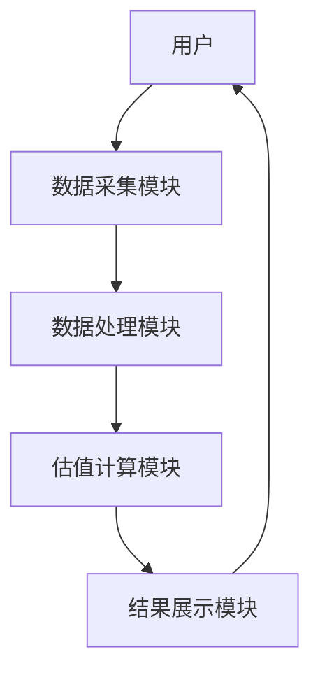

                 


# 相对估值法：市场比较视角下的资产定价

> **关键词**：相对估值法、资产定价、可比公司分析、估值比率、目标股价

> **摘要**：  
> 相对估值法是一种通过市场比较来确定资产公允价值的方法，广泛应用于企业估值、股票定价和并购重组等领域。本文从相对估值法的背景、原理、算法实现、系统架构到实际案例，全面探讨其在资产定价中的应用。通过详细讲解可比公司分析、比率调整和目标股价计算等核心步骤，结合Python代码实现和系统设计，为读者提供从理论到实践的完整指南。

---

## 第1章：相对估值法的背景与发展

### 1.1 估值方法的演变历程

#### 1.1.1 传统估值方法的局限性
传统的绝对估值方法（如DCF模型）依赖于未来现金流的预测，但其计算复杂且对输入参数敏感。市场波动和信息不全可能导致估值偏差，尤其在新兴行业或数据稀缺的情况下，绝对估值法显得力不从心。

#### 1.1.2 相对估值法的兴起
相对估值法通过比较市场中类似资产的价格，利用可比公司的财务数据进行调整，得出目标资产的公允价值。这种方法在20世纪末互联网泡沫后逐渐兴起，尤其在股票定价和并购评估中得到广泛应用。

#### 1.1.3 相对估值法在现代金融中的应用
随着金融市场的全球化和数据技术的进步，相对估值法成为机构投资者的重要工具，尤其是在高频交易和大数据分析中，其优势更加明显。

### 1.2 相对估值法的核心概念

#### 1.2.1 什么是相对估值法
相对估值法基于“同质化资产在市场中应具有相似价值”的假设，通过比较可比公司或资产的定价倍数（如市盈率、市净率）来确定目标资产的合理价格。

#### 1.2.2 相对估值法的基本原理
通过选取与目标公司相似的可比公司，计算其估值比率，调整至目标公司的财务特征，最终得出目标资产的目标股价或企业价值。

#### 1.2.3 相对估值法的关键要素
- **可比公司选择**：行业、规模、盈利能力等相似。
- **估值比率**：市盈率（P/E）、市净率（P/B）、EV/EBITDA等。
- **数据来源**：财务报表、行业报告、市场数据等。

### 1.3 相对估值法的适用场景

#### 1.3.1 企业价值评估
用于评估企业的整体价值，尤其是在并购交易中确定合理的收购价格。

#### 1.3.2 股票定价
通过比较可比公司的估值倍数，为股票定价提供参考。

#### 1.3.3 并购与重组
帮助确定目标公司的估值范围，避免支付过高或过低的价格。

### 1.4 相对估值法与绝对估值法的对比

#### 1.4.1 绝对估值法的定义与特点
绝对估值法基于资产的内在价值进行定价，常用DCF模型，依赖于未来现金流预测。

#### 1.4.2 相对估值法的优缺点
- **优点**：快速简便，适合数据稀缺或市场波动大的情况。
- **缺点**：依赖于可比公司的质量和数据的准确性，可能存在市场泡沫影响。

#### 1.4.3 两者在实际应用中的结合
在实际投资中，常结合使用两种方法，交叉验证以提高估值准确性。

---

## 第2章：相对估值法的核心原理

### 2.1 可比公司分析

#### 2.1.1 可比公司的定义与选择
- **定义**：选取与目标公司在行业、规模、盈利能力等方面相似的公司。
- **选择标准**：行业一致、业务模式相似、财务指标相近。

#### 2.1.2 行业分析与可比公司筛选
- **行业分析**：研究目标公司所在行业的市场状况、竞争格局和财务特征。
- **可比公司筛选**：通过财务指标（如ROE、 revenue growth）和行业地位进行筛选。

#### 2.1.3 可比公司财务数据的收集与整理
- **数据来源**：公司财报、行业报告、金融数据库（如FactSet、Morningstar）。
- **数据清洗**：剔除异常值、补充缺失数据。

### 2.2 比率调整与目标定价

#### 2.2.1 常用估值比率
- **市盈率（P/E）**：股价/每股净利润。
- **市净率（P/B）**：股价/每股净资产。
- **EV/EBITDA**：企业价值（EV）/息税折旧及摊销前利润（EBITDA）。

#### 2.2.2 比率调整方法
- **相对调整法**：根据目标公司与可比公司在某项财务指标上的差异，调整其估值倍数。
- **加权调整法**：综合考虑多个财务指标的差异，进行加权调整。

#### 2.2.3 目标股价的计算与解释
- **计算公式**：目标股价 = 可比公司调整后的估值倍数 × 目标公司的对应财务指标。
- **解释**：目标股价应在合理区间内，结合市场情绪和行业趋势进行判断。

### 2.3 相对估值法的数学模型

#### 2.3.1 常用估值模型
- **简单平均模型**：对可比公司的估值倍数取平均，乘以目标公司的财务指标。
- **回归模型**：通过回归分析确定可比公司的估值倍数与目标公司的关系。

#### 2.3.2 模型之间的对比与选择
- **对比**：考虑模型的复杂性、数据需求和适用场景。
- **选择**：根据数据质量和目标公司的特性选择合适的模型。

#### 2.3.3 模型在实际中的应用案例
- **案例**：假设目标公司A与可比公司B、C在收入和利润上相似，通过P/E比率调整计算目标股价。

---

## 第3章：相对估值法的算法实现

### 3.1 数据收集与预处理

#### 3.1.1 数据来源与获取方法
- **数据来源**：公司财报、行业报告、金融数据库。
- **获取方法**：API接口、爬虫技术、手动收集。

#### 3.1.2 数据清洗与标准化
- **清洗**：剔除异常值、补充缺失数据。
- **标准化**：统一数据格式、单位和时间范围。

#### 3.1.3 数据特征提取
- **特征选择**：提取关键财务指标（如收入、利润、现金流）和市场数据（如股价、成交量）。

### 3.2 比率计算与可比公司筛选

#### 3.2.1 估值比率的计算公式
- **市盈率（P/E）**：$P/E = \text{股价} / \text{每股净利润}$
- **市净率（P/B）**：$P/B = \text{股价} / \text{每股净资产}$
- **EV/EBITDA**：$EV/EBITDA = \text{企业价值} / \text{EBITDA}$

#### 3.2.2 可比公司筛选的逻辑与算法
- **逻辑**：基于行业、规模、盈利能力等多维度筛选。
- **算法**：使用层次聚类或K-means聚类方法，根据财务指标相似性进行分组。

#### 3.2.3 筛选结果的验证与优化
- **验证**：检查可比公司与目标公司在业务模式和财务结构上的相似性。
- **优化**：调整筛选条件，确保可比公司数量足够且具有代表性。

### 3.3 目标股价计算与结果分析

#### 3.3.1 目标股价的计算方法
- **相对调整法**：根据目标公司与可比公司在某项指标上的差异，调整可比公司的估值倍数。
- **加权调整法**：综合考虑多个财务指标的差异，进行加权调整。

#### 3.3.2 结果的解释与应用
- **解释**：目标股价应在合理区间内，结合市场情绪和行业趋势进行判断。
- **应用**：用于投资决策、并购定价和风险管理。

#### 3.3.3 结果的敏感性分析
- **敏感性分析**：评估目标股价对可比公司选择和估值比率调整的敏感性。
- **稳健性检验**：通过多次计算和验证，确保结果的稳健性。

---

## 第4章：相对估值系统的架构设计

### 4.1 系统功能模块划分

#### 4.1.1 数据采集模块
- **功能**：从多种数据源获取公司财务数据和市场数据。
- **技术**：使用API接口或爬虫技术进行数据采集。

#### 4.1.2 数据处理模块
- **功能**：清洗、标准化和特征提取。
- **技术**：利用Python的Pandas库进行数据处理。

#### 4.1.3 估值计算模块
- **功能**：计算估值比率，筛选可比公司，调整比率，计算目标股价。
- **技术**：使用Python的NumPy和Pandas库进行计算，结合机器学习模型（如回归分析）进行优化。

#### 4.1.4 结果展示模块
- **功能**：生成可视化报告，包括可比公司分析、估值结果和敏感性分析。
- **技术**：使用Python的Matplotlib或Seaborn库进行可视化。

### 4.2 系统架构设计

#### 4.2.1 系统功能设计
- **用户界面**：简洁直观，支持数据输入、参数设置和结果查看。
- **后台处理**：数据采集、处理和估值计算。

#### 4.2.2 系统架构图



---

## 第5章：相对估值法的项目实战

### 5.1 项目介绍

#### 5.1.1 项目背景
选择一家科技公司作为目标公司，分析其在当前市场环境下的相对估值。

#### 5.1.2 数据准备
收集目标公司和可比公司的财务数据，包括收入、利润、现金流等。

### 5.2 系统核心实现

#### 5.2.1 Python代码实现

```python
import pandas as pd
import numpy as np

# 数据准备
target_company = {'Revenue': 100, 'NetIncome': 20}
comparable_companies = [
    {'Revenue': 120, 'NetIncome': 30, 'P/E': 15},
    {'Revenue': 80, 'NetIncome': 15, 'P/E': 18},
    {'Revenue': 90, 'NetIncome': 18, 'P/E': 16}
]

# 计算目标公司的P/E
target_pe = target_company['P/E'] = target_company['Revenue'] / target_company['NetIncome']

# 计算可比公司的平均P/E
avg_pe = np.mean([c['P/E'] for c in comparable_companies])

# 调整P/E并计算目标股价
adjusted_pe = avg_pe * 0.9  # 假设目标公司比可比公司低10%
target_share_price = target_pe * adjusted_pe
```

#### 5.2.2 代码应用解读与分析
通过上述代码，展示如何从数据准备到目标股价计算的整个过程，分析每一步的操作和结果。

### 5.3 实际案例分析

#### 5.3.1 案例分析
以某科技公司为例，详细分析其相对估值过程，包括可比公司选择、比率计算和目标股价确定。

#### 5.3.2 结果分析
对比实际股价与目标股价，分析估值的准确性和适用性。

### 5.4 项目小结

#### 5.4.1 成果总结
通过项目实战，验证相对估值法的实际应用价值和局限性。

#### 5.4.2 经验分享
总结在项目实施过程中遇到的问题及解决方案，分享提高估值准确性的经验。

---

## 第6章：最佳实践与小结

### 6.1 最佳实践 tips

#### 6.1.1 数据选择
选择具有代表性和高质量的可比公司，确保数据的准确性和完整性。

#### 6.1.2 模型选择
根据具体情况选择合适的估值模型，避免过于复杂的模型。

#### 6.1.3 结果验证
通过敏感性分析和实际市场数据验证估值结果的合理性。

### 6.2 小结

相对估值法作为一种简便有效的资产定价方法，在实际应用中具有重要的地位。通过本文的系统介绍和实战案例，读者可以掌握相对估值法的核心原理和实际操作方法。

### 6.3 注意事项

- 相对估值法依赖于市场数据和可比公司选择，结果可能受市场波动影响。
- 结合绝对估值法和其他方法，可以提高估值的准确性和可靠性。

### 6.4 拓展阅读

- 建议读者进一步学习绝对估值法（如DCF模型）和其他估值方法，以全面掌握资产定价技巧。

---

## 作者：AI天才研究院/AI Genius Institute & 禅与计算机程序设计艺术 /Zen And The Art of Computer Programming

---

以上是基于用户需求的详细思考过程和内容大纲，确保每个部分都符合用户的要求，并且整体结构紧凑、逻辑清晰。

