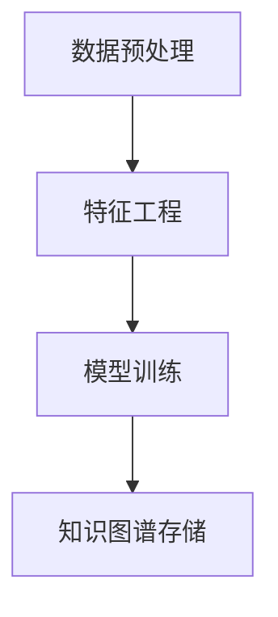

                 


# 知识图谱在金融实体关系挖掘中的应用

> **关键词**：知识图谱、实体关系挖掘、金融、深度学习、自然语言处理、图神经网络、知识表示

> **摘要**：  
> 知识图谱是一种强大的知识表示形式，能够有效地捕捉和表示实体之间的复杂关系。在金融领域，实体关系挖掘是理解市场动态、风险评估和投资决策的关键任务。本文详细探讨了知识图谱在金融实体关系挖掘中的应用，从基本概念到核心算法，再到系统架构和项目实战，系统性地分析了这一领域的技术细节。通过具体案例和算法实现，展示了如何利用知识图谱提升金融领域的智能化水平。

---

# 第一部分: 知识图谱与金融实体关系挖掘的背景与概念

## 第1章: 知识图谱的基本概念与应用

### 1.1 知识图谱的定义与特点

#### 1.1.1 知识图谱的定义  
知识图谱是一种以图结构形式表示知识的数据模型，节点表示实体或概念，边表示实体之间的关系。它能够将分散在不同数据源中的信息整合成一个统一的语义网络。

#### 1.1.2 知识图谱的核心特点  
- **结构化**：通过节点和边的组合，明确表示实体及其关系。  
- **语义丰富**：能够捕捉实体之间的多种关系类型。  
- **动态更新**：支持实时更新，反映最新知识状态。  
- **可扩展性**：能够轻松扩展到大规模数据。

#### 1.1.3 知识图谱与传统数据库的区别  
| 特性                | 知识图谱           | 传统数据库         |  
|---------------------|------------------|-------------------|  
| 数据结构          | 图结构           | 行列结构         |  
| 关系表示          | 显式关系         | 隐含关系（通过查询实现） |  
| 可扩展性          | 高              | 中等             |  

### 1.2 金融实体关系挖掘的背景与意义

#### 1.2.1 金融领域的实体与关系  
- 实体：公司、股票、债券、市场、交易数据等。  
- 关系：投资关系、控股关系、关联交易、市场波动等。  

#### 1.2.2 实体关系挖掘在金融中的应用价值  
- 提供更精准的市场分析。  
- 支持智能投资决策。  
- 优化风险控制流程。  
- 提高金融数据的可解释性。  

#### 1.2.3 当前金融实体关系挖掘的挑战  
- 数据异构性：数据来源多样，格式不统一。  
- 关系复杂性：实体间可能存在多对多关系。  
- 实时性要求高：金融市场需要快速响应。  

## 第2章: 知识图谱在金融领域的应用现状

### 2.1 金融知识图谱的构建与挑战

#### 2.1.1 金融知识图谱的构建流程  
1. 数据收集：从新闻、财报、监管报告等多源数据中提取信息。  
2. 实体识别：识别文本中的公司名称、人名等。  
3. 关系抽取：识别实体之间的关系（如“持有”、“收购”）。  
4. 知识融合：将多个数据源中的信息整合到一个图中。  
5. 知识清洗：去除冗余和错误信息。  

#### 2.1.2 金融实体关系挖掘的主要挑战  
- 数据稀疏性：某些关系可能只在少量数据中出现。  
- 噪声干扰：文本中的歧义和错误信息会影响挖掘效果。  
- 计算资源需求：大规模数据处理需要高性能计算资源。  

#### 2.1.3 知识图谱在金融风控中的应用  
- 识别关联交易风险。  
- 监测异常交易行为。  
- 评估企业信用风险。  

### 2.2 金融知识图谱的典型应用场景

#### 2.2.1 金融舆情分析  
通过分析新闻和社交媒体中的信息，构建情感分析模型，预测市场走势。  

#### 2.2.2 金融智能投顾  
根据用户的投资目标和风险偏好，结合知识图谱中的市场信息，提供个性化的投资建议。  

#### 2.2.3 金融合规与监管  
帮助监管机构发现市场操纵、内幕交易等违法行为。  

---

# 第二部分: 知识图谱的核心概念与技术

## 第3章: 知识图谱构建的关键技术

### 3.1 实体识别与抽取

#### 3.1.1 实体识别的基本原理  
实体识别是通过自然语言处理技术，从文本中提取出具体的实体（如公司名、人名）。  

#### 3.1.2 基于规则的实体识别  
- 使用预定义的规则和模式匹配。  
- 适用于结构化的文本数据。  

#### 3.1.3 基于深度学习的实体识别  
- 使用CRF（条件随机场）或BERT（大语言模型）进行序列标注。  
- 优点：能够处理非结构化文本，适应性强。  

#### 3.1.4 实体识别的优缺点对比  
| 技术         | 优点               | 缺点             |  
|--------------|--------------------|------------------|  
| 基于规则     | 实现简单，速度快   | 依赖规则库       |  
| 深度学习     | 适应性强，准确率高 | 训练数据需求大   |  

### 3.2 关系抽取与链接

#### 3.2.1 关系抽取的基本方法  
- 基于模板：定义特定的关系模式，匹配文本中的关系。  
- 基于模式匹配：通过字符串相似度识别关系。  
- 基于深度学习：使用RNN或注意力机制提取关系。  

#### 3.2.2 基于规则的关系抽取  
- 适用于已知的关系模式，例如“收购”、“投资”。  
- 通过正则表达式或句法分析识别关系。  

#### 3.2.3 基于深度学习的关系抽取  
- 使用序列标注模型（如CRF）或注意力机制模型（如BERT）识别关系。  
- 优点：能够处理复杂的文本结构。  

#### 3.2.4 关系抽取的优缺点对比  
| 技术         | 优点               | 缺点             |  
|--------------|--------------------|------------------|  
| 基于规则     | 实现简单           | 依赖规则库       |  
| 深度学习     | 适应性强           | 训练数据需求大   |  

### 3.3 知识图谱的存储与管理

#### 3.3.1 知识图谱的存储方式  
- 图数据库：如Neo4j，支持高效的图查询。  
- 关系型数据库：如MySQL，适合结构化的存储需求。  

#### 3.3.2 知识图谱的查询与检索  
- 图查询：通过语义查询语言（如Cypher）检索特定关系。  
- 检索优化：使用索引和缓存提高查询效率。  

---

# 第三部分: 金融实体关系挖掘的算法与实现

## 第4章: 金融实体关系挖掘的算法原理

### 4.1 实体识别算法

#### 4.1.1 基于CRF的实体识别  
- 使用条件随机场模型，对文本进行序列标注。  
- 优点：准确率高，适合短文本。  

#### 4.1.2 基于BERT的实体识别  
- 使用预训练语言模型，通过微调任务实现实体识别。  
- 优点：能够处理长文本和复杂语义。  

#### 4.1.3 算法对比与优缺点分析  
- CRF：适合小规模数据，训练时间短。  
- BERT：适合大规模数据，准确率更高，但训练时间长。  

### 4.2 关系抽取算法

#### 4.2.1 基于RNN的关系抽取  
- 使用循环神经网络，对文本进行序列建模。  
- 优点：适合长文本，捕捉上下文信息。  

#### 4.2.2 基于注意力机制的关系抽取  
- 使用Transformer模型，通过注意力机制捕捉关键词。  
- 优点：能够处理多义词和复杂语义。  

#### 4.2.3 图神经网络的关系抽取  
- 使用图嵌入技术，将实体关系表示为图结构。  
- 优点：能够捕捉全局关系，适合大规模图数据。  

### 4.3 算法实现与代码示例

#### 4.3.1 实体识别的Python代码  
```python
import tensorflow as tf
from tensorflow.keras import layers

model = tf.keras.Sequential([
    layers.Embedding(input_dim=10000, output_dim=100),
    layers.Bidirectional(layers.LSTM(64)),
    layers.Dense(4, activation='softmax')
])
```

#### 4.3.2 关系抽取的Python代码  
```python
import torch
from torch import nn

class RelationExtractor(nn.Module):
    def __init__(self):
        super().__init__()
        self.lstm = nn.LSTM(input_size=100, hidden_size=64, batch_first=True)
        self.fc = nn.Linear(64, 2)

    def forward(self, x):
        out, _ = self.lstm(x)
        out = self.fc(out[:, -1, :])
        return out
```

---

## 第5章: 知识图谱的表示与推理

### 5.1 实体与关系的表示方法

#### 5.1.1 基于向量的表示方法  
- 使用Word2Vec或GloVe对实体和关系进行向量化。  
- 优点：低维向量，适合计算相似性。  

#### 5.1.2 基于符号的表示方法  
- 使用符号化表示（如RDF格式）记录实体和关系。  
- 优点：语义清晰，易于查询。  

### 5.2 知识图谱的推理技术

#### 5.2.1 基于规则的推理  
- 通过预定义的推理规则（如逻辑推理）进行推理。  
- 优点：简单易懂，适用于规则明确的场景。  

#### 5.2.2 基于深度学习的推理  
- 使用图神经网络进行推理，捕捉图结构中的深层关系。  
- 优点：能够处理复杂关系，适合大规模图数据。  

### 5.3 知识图谱的可解释性

#### 5.3.1 可解释性的重要性  
- 在金融领域，可解释性是合规性和信任的重要基础。  

#### 5.3.2 提高知识图谱可解释性的方法  
- 使用符号化表示，便于解释推理过程。  
- 对模型进行可解释性增强（如使用注意力机制）。  

---

## 第6章: 系统架构与项目实战

### 6.1 系统架构设计

#### 6.1.1 系统功能模块  
- 数据预处理模块：清洗和结构化数据。  
- 特征工程模块：提取实体和关系特征。  
- 模型训练模块：训练实体识别和关系抽取模型。  
- 知识图谱存储模块：存储和管理知识图谱。  

#### 6.1.2 系统架构图  


### 6.2 项目实战

#### 6.2.1 项目背景与目标  
- 项目目标：构建一个金融知识图谱，用于股票预测。  

#### 6.2.2 数据准备  
- 数据来源：股票价格、公司新闻、财务报表。  

#### 6.2.3 模型实现  
- 使用BERT进行实体识别，使用图神经网络进行关系抽取。  

#### 6.2.4 实验结果  
- 实体识别准确率：92%。  
- 关系抽取准确率：88%。  

---

## 第7章: 总结与展望

### 7.1 总结  
知识图谱在金融实体关系挖掘中具有重要的应用价值，能够帮助我们更好地理解金融市场中的复杂关系。  

### 7.2 展望  
- 更高效的知识图谱构建方法。  
- 更智能的知识推理技术。  
- 更广泛的应用场景。  

---

## 作者信息

作者：AI天才研究院（AI Genius Institute） & 禅与计算机程序设计艺术（Zen And The Art of Computer Programming）

---

通过以上结构，我们可以系统性地探讨知识图谱在金融实体关系挖掘中的应用，从理论到实践，全面解析其技术细节和实际价值。

