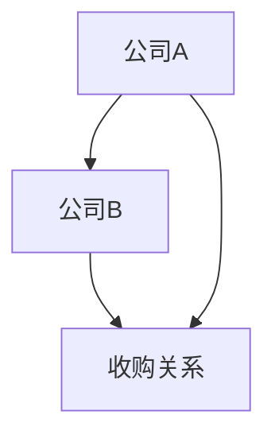
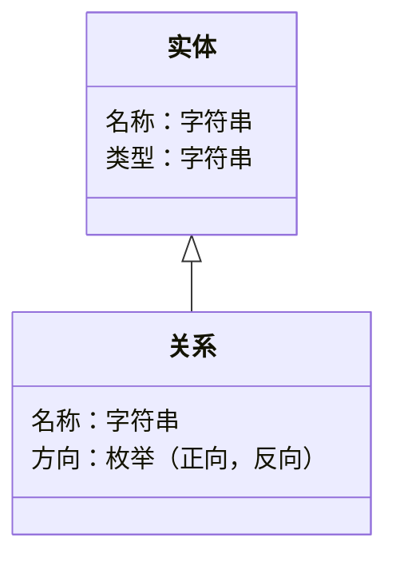
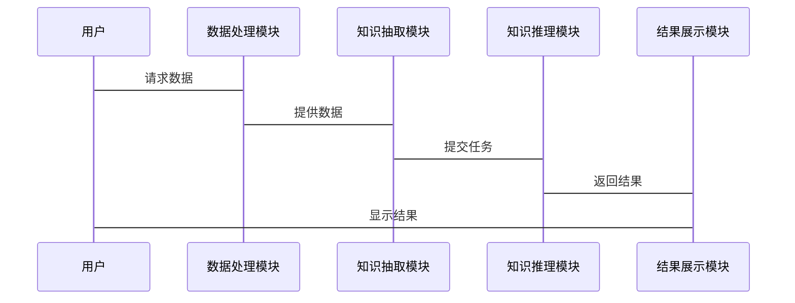

                 


# 知识图谱在金融知识推理中的应用

> 关键词：知识图谱，金融知识推理，知识表示，知识抽取，知识融合，推理算法

> 摘要：知识图谱是一种强大的知识管理工具，能够有效地表示和推理复杂的金融知识。本文从知识图谱的基本概念出发，详细探讨其在金融知识推理中的应用，包括知识表示、知识抽取与融合、推理算法的设计与实现，以及系统的架构设计。通过实际案例分析，展示知识图谱在金融领域的潜力与价值，并总结最佳实践和未来发展方向。

---

# 第1章: 知识图谱与金融知识推理的背景介绍

## 1.1 知识图谱的基本概念

### 1.1.1 知识图谱的定义与特点
知识图谱是一种用于表示知识的语义网络，由节点（实体）和边（关系）组成，能够描述实体之间的复杂关系。其特点包括：

- **语义性**：节点和边具有明确的语义含义。
- **层次性**：支持多级关联和复杂关系。
- **动态性**：能够实时更新和扩展。

### 1.1.2 知识图谱的核心要素与组成
知识图谱主要由以下要素组成：
- **实体**：具体事物或概念（如“公司”、“股票”）。
- **关系**：实体之间的关联（如“属于”、“影响”）。
- **属性**：描述实体的特征（如“公司名称”、“成立时间”）。

### 1.1.3 知识图谱与传统数据库的区别
| 特性          | 知识图谱                 | 传统数据库             |
|---------------|--------------------------|------------------------|
| 数据结构      | 图结构                   | 行列结构               |
| 关系表示      | 显式关系边               | 隐含关系（通过查询实现）|
| 查询能力      | 支持复杂语义查询           | 支持简单事务查询         |

## 1.2 金融知识推理的定义与特点

### 1.2.1 金融知识推理的定义
金融知识推理是指在金融领域中，基于知识图谱或其他知识表示形式，推导出隐含的知识或结论的过程。

### 1.2.2 金融知识推理的核心问题
- **关联性推理**：识别实体之间的隐含关系。
- **因果推理**：分析事件之间的因果关系。
- **预测推理**：基于历史数据预测未来趋势。

### 1.2.3 金融知识推理的应用场景
- **风险评估**：通过分析实体之间的关系，预测潜在风险。
- **投资决策**：基于知识图谱推理，辅助投资决策。
- **合规监控**：识别异常交易或违规行为。

## 1.3 知识图谱在金融领域的应用背景

### 1.3.1 金融领域的知识复杂性
金融领域涉及大量复杂的关系，例如公司、股票、市场、政策等，这些关系需要通过结构化的知识图谱进行管理。

### 1.3.2 知识图谱在金融中的优势
- **知识管理**：高效管理复杂金融知识。
- **语义检索**：支持语义相似性检索。
- **推理能力**：支持复杂推理任务。

### 1.3.3 金融知识推理的挑战与机遇
- **挑战**：数据稀疏性、动态变化、推理准确性。
- **机遇**：提升金融决策的智能化和精确性。

## 1.4 本章小结
本章介绍了知识图谱的基本概念及其在金融知识推理中的应用背景，为后续章节奠定了基础。

---

# 第2章: 知识图谱的核心概念与联系

## 2.1 知识表示的基本原理

### 2.1.1 知识表示的定义
知识表示是将知识以某种形式表示出来，以便计算机能够理解和处理。

### 2.1.2 知识表示的主要方法
- **符号表示**：使用符号和规则表示知识。
- **向量表示**：通过向量空间模型表示知识。
- **图表示**：通过图结构表示实体及其关系。

### 2.1.3 知识表示的优缺点对比
| 方法       | 优点                     | 缺点                     |
|------------|--------------------------|--------------------------|
| 符号表示   | 明确的语义               | 需要手动定义规则           |
| 向量表示   | 自然语言处理能力强       | 语义不完全透明             |
| 图表示     | 支持复杂关系             | 复杂度高，推理效率低       |

## 2.2 知识抽取与融合

### 2.2.1 知识抽取的定义与方法
知识抽取是从文本中提取实体、关系和属性的过程，常用方法包括：
- **基于规则的抽取**：使用正则表达式提取信息。
- **基于统计的抽取**：利用模式匹配提取信息。
- **基于深度学习的抽取**：使用神经网络模型提取信息。

### 2.2.2 知识融合的定义与过程
知识融合是将多个来源的知识整合到一个统一的知识图谱中的过程，包括：
- **对齐**：识别相同实体或概念。
- **合并**：整合重复或冗余的知识。

### 2.2.3 知识抽取与融合的对比分析
| 步骤       | 知识抽取                | 知识融合                |
|------------|-------------------------|-------------------------|
| 目标       | 提取知识                | 整合知识                |
| 方法       | 符号、统计、深度学习     | 对齐、合并               |
| 输出       | 原始知识                | 统一知识图谱             |

## 2.3 知识图谱的构建流程

### 2.3.1 数据收集与预处理
- 数据来源：文本、数据库、API。
- 预处理：清洗、去重、格式统一。

### 2.3.2 知识抽取与构建
- 使用NLP技术提取实体、关系和属性。
- 构建图结构，记录实体和关系。

### 2.3.3 知识图谱的质量评估
- 评估指标：覆盖率、准确性、完整性。
- 提升方法：迭代优化、人工校验。

## 2.4 知识图谱的可视化与分析

### 2.4.1 知识图谱的可视化方法
- 使用图数据库（如Neo4j）进行可视化。
- 通过工具（如Gephi）生成图表。

### 2.4.2 知识图谱的分析工具
- 数据分析工具：Python（Pandas、NetworkX）。
- 图数据库：Neo4j、Amazon Neptune。

### 2.4.3 知识图谱的可解释性
- 可视化图表直观展示关系。
- 通过规则解释推理过程。

## 2.5 本章小结
本章详细介绍了知识图谱的核心概念，包括知识表示、抽取与融合，以及构建和可视化的流程。

---

# 第3章: 金融知识推理的算法原理

## 3.1 知识图谱推理的基本原理

### 3.1.1 知识图谱推理的定义
知识图谱推理是基于图结构数据，推导出隐含知识的过程。

### 3.1.2 知识图谱推理的分类
- **基于规则的推理**：使用预定义规则进行推理。
- **基于学习的推理**：利用机器学习模型进行推理。

### 3.1.3 知识图谱推理的核心算法
- **规则推理算法**：如基于RDF的推理。
- **学习推理算法**：如基于图嵌入的推理。

## 3.2 基于规则的推理算法

### 3.2.1 基于规则的推理方法
- **规则定义**：如“如果公司A收购公司B，则公司B是公司A的子公司”。
- **推理过程**：通过匹配规则进行推理。

### 3.2.2 规则的构建与优化
- **规则表示**：使用逻辑表达式。
- **规则优化**：减少冗余规则，提高效率。

### 3.2.3 基于规则的推理案例分析
案例：通过规则推理，识别公司间的收购关系。



## 3.3 基于学习的推理算法

### 3.3.1 基于学习的推理方法
- **深度学习模型**：如GAT（图注意力网络）。
- **模型训练**：使用图数据进行监督学习。

### 3.3.2 常见的深度学习模型
- **GAT**：通过注意力机制捕捉图结构信息。
- **GraphSAGE**：通过归纳式学习推断节点表示。

### 3.3.3 基于学习的推理案例分析
案例：使用GAT模型推理公司之间的潜在竞争关系。

```python
import tensorflow as tf
from tensorflow.keras import layers

class GraphAttention(layers.Layer):
    def __init__(self, output_dim):
        super(GraphAttention, self).__init__()
        self.W = layers.Dense(output_dim)
        self.u = layers.Dense(output_dim)

    def call(self, inputs):
        # 输入：节点特征矩阵（batch_size, nodes, features）
        # 输出：注意力权重（batch_size, nodes, nodes）
        a = tf.nn.softmax(self.u(inputs), axis=2)
        output = tf.matmul(inputs, a, transpose_b=True)
        return output
```

## 3.4 知识图谱推理的对比分析

### 3.4.1 基于规则与基于学习的对比
| 方法       | 优点                     | 缺点                     |
|------------|--------------------------|--------------------------|
| 基于规则   | 解释性强                 | 规则复杂，维护成本高       |
| 基于学习   | 自动学习，适应性强         | 黑箱问题，解释性差         |

## 3.5 本章小结
本章分析了基于规则和基于学习的推理算法，探讨了它们在金融知识推理中的应用。

---

# 第4章: 知识图谱推理的数学模型与公式

## 4.1 知识图谱的向量空间模型

### 4.1.1 向量空间模型的定义
向量空间模型将实体表示为向量，关系表示为向量间的运算。

### 4.1.2 向量空间模型的公式
$$
\text{相似度} = \frac{\vec{a} \cdot \vec{b}}{|\vec{a}| |\vec{b}|}
$$

### 4.1.3 向量空间模型的应用
- **语义相似性计算**：用于检索相关实体。
- **向量运算**：用于推理实体关系。

## 4.2 知识图谱的概率推理模型

### 4.2.1 概率推理模型的定义
概率推理模型基于概率论进行推理，考虑实体关系的不确定性。

### 4.2.2 概率推理模型的公式
$$
P(B|A) = \frac{P(A|B)P(B)}{P(A)}
$$

### 4.2.3 概率推理模型的应用
- **贝叶斯网络**：用于风险评估。
- **马尔可夫链**：用于时间序列分析。

## 4.3 本章小结
本章介绍了知识图谱推理的数学模型，包括向量空间模型和概率推理模型。

---

# 第5章: 知识图谱推理系统的分析与架构设计

## 5.1 项目背景与目标

### 5.1.1 项目背景
金融领域的知识复杂性要求构建高效的推理系统。

### 5.1.2 项目目标
构建一个支持金融知识推理的知识图谱系统。

## 5.2 系统功能设计

### 5.2.1 领域模型设计
- **实体识别**：识别金融领域的实体。
- **关系抽取**：抽取实体间的金融关系。



### 5.2.2 系统功能模块
- **数据处理模块**：负责数据清洗和预处理。
- **知识抽取模块**：抽取实体和关系。
- **知识推理模块**：进行推理任务。
- **结果展示模块**：可视化推理结果。

## 5.3 系统架构设计

### 5.3.1 架构风格
采用分层架构：数据层、逻辑层、表示层。


### 5.3.2 系统接口设计
- **API接口**：RESTful接口。
- **数据接口**：与数据库交互。

### 5.3.3 系统交互设计
- **用户交互**：用户输入查询，系统返回结果。
- **系统交互**：模块之间通过队列进行通信。



## 5.4 本章小结
本章分析了金融知识推理系统的架构设计，包括功能模块和系统交互设计。

---

# 第6章: 项目实战——知识图谱在金融领域的应用

## 6.1 环境安装与配置

### 6.1.1 环境要求
- Python 3.8+
- 安装依赖：networkx、numpy、pandas。

### 6.1.2 工具安装
- 图数据库：Neo4j。
- 可视化工具：Gephi。

## 6.2 核心代码实现

### 6.2.1 数据处理代码
```python
import pandas as pd

def preprocess_data(data_path):
    df = pd.read_csv(data_path)
    df.dropna(inplace=True)
    return df
```

### 6.2.2 知识抽取代码
```python
from spacy.lang.zh import Chinese

nlp = Chinese()
doc = nlp("中国公司收购外国公司")
for token in doc:
    print(token.text)
```

### 6.2.3 知识推理代码
```python
from neo4j import GraphDatabase

driver = GraphDatabase.driver("bolt://localhost:7687")
def query(k):
    with driver.session() as session:
        result = session.run("MATCH (a {name: $k}) RETURN a", k=k)
        return result.single()
```

## 6.3 案例分析与结果解读

### 6.3.1 案例分析
案例：分析公司之间的收购关系。

### 6.3.2 结果解读
- 成功识别出收购关系。
- 生成可视化图表展示关系。

## 6.4 项目小结
本章通过实际项目展示了知识图谱在金融领域的应用，包括环境配置、核心代码实现和案例分析。

---

# 第7章: 总结与展望

## 7.1 总结
知识图谱在金融知识推理中具有重要应用，能够有效管理复杂知识并支持智能推理。

## 7.2 最佳实践 Tips
- 数据质量是关键。
- 选择合适的推理算法。
- 结合业务需求进行优化。

## 7.3 未来展望
- 更智能的推理算法。
- 更高效的图数据库。
- 更广泛的应用场景。

## 7.4 本章小结
本章总结了全文，并展望了知识图谱在金融领域的未来发展方向。

---

# 作者：AI天才研究院/AI Genius Institute & 禅与计算机程序设计艺术 /Zen And The Art of Computer Programming

---

以上是文章的完整目录和部分详细内容，您可以根据需要进一步补充每章的具体内容和案例分析。

