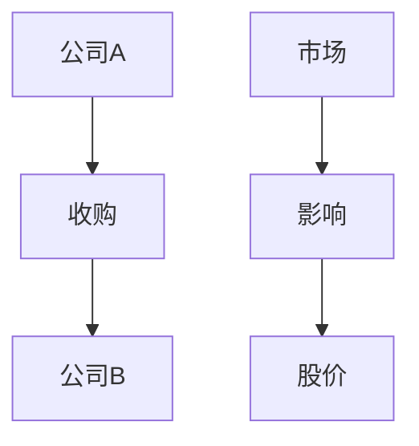
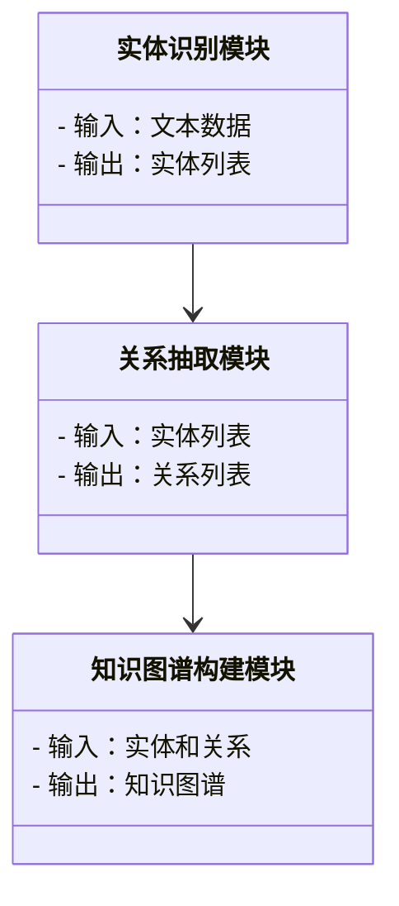

                 


# 知识图谱在金融研究中的构建与应用

> 关键词：知识图谱、金融研究、数据挖掘、人工智能、实体识别、关系抽取、金融分析

> 摘要：知识图谱是一种结构化数据的组织方式，能够有效地表示实体及其之间的关系。本文详细探讨了知识图谱在金融研究中的构建方法与应用场景，包括实体识别、关系抽取、知识图谱的构建与优化，以及在金融风险评估、投资决策支持和市场趋势分析中的具体应用。通过系统分析与架构设计，结合实际案例，本文为读者提供了一个全面了解知识图谱在金融领域的构建与应用的框架。

---

## 第一部分: 知识图谱在金融研究中的构建与应用概述

### 第1章: 知识图谱与金融研究的背景介绍

#### 1.1 知识图谱的核心概念

##### 1.1.1 知识图谱的定义与特点
知识图谱是一种以图结构形式表示知识的数据库，节点表示实体或概念，边表示实体之间的关系。其特点包括：
- **结构化**：实体及其关系以图结构表示。
- **可扩展性**：支持大规模数据的存储与查询。
- **语义丰富性**：通过关系和属性描述实体的语义信息。

##### 1.1.2 金融研究中的知识图谱应用背景
金融领域涉及大量的数据，包括公司信息、市场动态、投资行为等。知识图谱能够将这些数据结构化，便于分析和挖掘。

##### 1.1.3 知识图谱在金融研究中的意义与价值
- **数据整合**：将分散的金融数据整合到统一的知识图谱中。
- **语义理解**：通过关系抽取，提升对金融数据的理解能力。
- **决策支持**：基于知识图谱的分析结果，辅助投资决策。

#### 1.2 金融研究中的知识图谱构建需求

##### 1.2.1 金融数据的多样性与复杂性
金融数据包括文本、表格、图结构等多种形式，数据来源多样，结构复杂。

##### 1.2.2 知识图谱在金融研究中的问题解决
- **数据孤岛问题**：通过知识图谱整合分散数据。
- **语义理解问题**：通过关系抽取和实体识别，提升数据语义理解能力。

##### 1.2.3 知识图谱的边界与外延
知识图谱的边界包括金融领域的实体和关系，外延则扩展到其他领域如社交媒体数据。

#### 1.3 知识图谱的核心要素与概念结构

##### 1.3.1 实体与关系的定义
- **实体**：金融领域的具体事物，如公司、股票、市场等。
- **关系**：实体之间的关联，如“公司A收购公司B”、“市场波动影响股价”。

##### 1.3.2 知识图谱的属性特征对比
| 属性 | 描述 |
|------|------|
| 实体类型 | 公司、股票、市场等 |
| 实体关系 | 收购、影响、关联等 |
| 属性值 | 公司市值、股价波动等 |

##### 1.3.3 知识图谱的构建流程与方法
1. 数据收集：从金融数据库、新闻、社交媒体等来源获取数据。
2. 实体识别与抽取：识别文本中的公司名称、股票代码等实体。
3. 关系抽取：提取实体之间的关系，如“公司A收购公司B”。
4. 知识图谱构建：将实体和关系整合到知识图谱中。

### 第2章: 知识图谱的核心概念与联系

#### 2.1 知识图谱的原理与实现

##### 2.1.1 知识图谱的构建流程
1. 数据预处理：清洗和标注数据。
2. 实体识别：使用NLP技术识别实体。
3. 关系抽取：基于规则或机器学习方法抽取关系。
4. 知识图谱存储：使用图数据库（如Neo4j）存储知识图谱。

##### 2.1.2 知识图谱的存储与表示
- **存储**：使用图数据库存储实体和关系。
- **表示**：使用RDF（Resource Description Framework）表示实体和关系。

##### 2.1.3 知识图谱的推理与应用
- **推理**：基于知识图谱进行逻辑推理，发现隐含关系。
- **应用**：用于金融风险评估、投资决策支持等。

#### 2.2 知识图谱的实体关系图架构



#### 2.3 知识图谱的核心算法与实现

##### 2.3.1 实体识别与抽取算法
- **算法选择**：使用CRF（条件随机场）或深度学习模型（如BERT）进行实体识别。

##### 2.3.2 关系抽取与推理算法
- **算法选择**：基于规则的匹配或基于机器学习的关系抽取。

##### 2.3.3 知识图谱的优化与增强
- **优化方法**：通过数据清洗和去重提升知识图谱的质量。

#### 2.4 本章小结

### 第3章: 知识图谱构建的算法原理与实现

#### 3.1 知识图谱构建的算法原理

##### 3.1.1 实体识别与抽取算法
- **原理**：基于NLP技术，识别文本中的实体。
- **实现**：使用预训练模型（如BERT）进行实体识别。

##### 3.1.2 关系抽取与推理算法
- **原理**：基于上下文信息，识别实体之间的关系。
- **实现**：使用深度学习模型（如LSTM）进行关系抽取。

##### 3.1.3 知识图谱的优化与增强
- **原理**：通过数据清洗和去重，优化知识图谱的质量。
- **实现**：使用图数据库进行数据存储和优化。

#### 3.2 算法实现的数学模型与公式

##### 3.2.1 实体识别的数学模型
$$ P(w_i | w_{i-1}, w_{i-2}, \dots, w_{i-n}) $$

##### 3.2.2 关系抽取的数学模型
$$ R(e_i, e_j) = \text{True} \text{ 或 } \text{False} $$

#### 3.3 算法实现的Python源代码

##### 3.3.1 实体识别代码
```python
import spacy

nlp = spacy.load("en_core_web_sm")

text = "Apple收购了公司B"
doc = nlp(text)
for ent in doc.ents:
    print(ent.text, ent.label_)
```

##### 3.3.2 关系抽取代码
```python
from spacy.matcher import Matcher

nlp = spacy.load("en_core_web_sm")
matcher = Matcher(nlp.vocab)

pattern = [
    {"LOWER": "acquire"},
    {"NOUN": "Company"}
]
matcher.add("Acquire", [pattern])

doc = nlp("Company A acquired Company B")
matches = matcher(doc)
for start, end in matches:
    print(doc[start:end].text)
```

#### 3.4 本章小结

### 第4章: 知识图谱在金融研究中的系统分析与架构设计

#### 4.1 金融知识图谱的系统分析

##### 4.1.1 金融知识图谱的项目背景
- **背景**：金融领域数据分散，语义理解不足，需要知识图谱整合数据。

##### 4.1.2 金融知识图谱的项目目标
- **目标**：构建金融知识图谱，支持金融分析和决策。

##### 4.1.3 金融知识图谱的项目范围
- **范围**：涵盖公司、市场、投资行为等金融实体。

#### 4.2 系统功能设计

##### 4.2.1 系统功能模块划分
- **数据采集**：从多种数据源采集金融数据。
- **数据处理**：清洗和标注数据。
- **知识图谱构建**：识别实体和关系，构建知识图谱。
- **知识图谱应用**：支持金融分析和决策。

##### 4.2.2 系统功能流程设计


#### 4.3 本章小结

---

## 第二部分: 知识图谱在金融研究中的应用

### 第5章: 金融风险评估中的知识图谱应用

#### 5.1 知识图谱在风险评估中的作用
- **作用**：通过分析公司之间的关系，识别潜在风险。

#### 5.2 知识图谱在风险评估中的具体应用
- **应用**：识别公司间的关联交易，评估市场风险。

#### 5.3 实际案例分析
- **案例**：利用知识图谱分析某公司的收购行为，评估其对市场的影响。

### 第6章: 投资决策支持中的知识图谱应用

#### 6.1 知识图谱在投资决策中的作用
- **作用**：通过分析市场趋势和公司关系，辅助投资决策。

#### 6.2 知识图谱在投资决策中的具体应用
- **应用**：基于知识图谱进行股票推荐。

#### 6.3 实际案例分析
- **案例**：分析市场趋势和公司关系，推荐投资组合。

### 第7章: 市场趋势分析中的知识图谱应用

#### 7.1 知识图谱在市场分析中的作用
- **作用**：通过分析市场动态和公司行为，预测市场趋势。

#### 7.2 知识图谱在市场分析中的具体应用
- **应用**：预测行业趋势，识别市场机会。

#### 7.3 实际案例分析
- **案例**：分析行业趋势，预测市场波动。

---

## 第三部分: 知识图谱的构建与优化

### 第8章: 知识图谱的构建流程与优化方法

#### 8.1 知识图谱的构建流程
1. 数据预处理：清洗和标注数据。
2. 实体识别：识别文本中的实体。
3. 关系抽取：提取实体之间的关系。
4. 知识图谱存储：存储实体和关系到图数据库。

#### 8.2 知识图谱的优化方法
- **数据清洗**：去除重复和错误数据。
- **数据增强**：通过外部数据源丰富知识图谱。

### 第9章: 知识图谱的可视化与分析工具

#### 9.1 知识图谱的可视化工具
- **工具**：使用Neo4j的Cypher查询语言进行可视化。

#### 9.2 知识图谱的分析工具
- **工具**：使用图分析算法（如PageRank）进行图谱分析。

---

## 第四部分: 总结与展望

### 第10章: 知识图谱在金融研究中的总结与展望

#### 10.1 总结
- **总结**：知识图谱在金融研究中有广泛的应用，能够整合数据，提升语义理解能力。

#### 10.2 未来的发展方向
- **方向**：知识图谱的动态更新、多模态数据的融合、跨领域的知识图谱构建。

#### 10.3 最佳实践 tips
- **数据质量**：确保数据的准确性和完整性。
- **模型优化**：持续优化实体识别和关系抽取算法。
- **隐私保护**：注意数据隐私和安全问题。

---

## 作者：AI天才研究院/AI Genius Institute & 禅与计算机程序设计艺术 /Zen And The Art of Computer Programming

---

**本文基于知识图谱在金融研究中的构建与应用，详细探讨了其在金融风险评估、投资决策支持和市场趋势分析中的应用。通过系统分析与架构设计，结合实际案例，本文为读者提供了一个全面了解知识图谱在金融领域的构建与应用的框架。**

---

**总结：** 知识图谱在金融研究中的构建与应用是一个复杂而重要的课题。通过本文的系统分析和实际案例，读者可以深入了解知识图谱在金融领域的潜力和应用价值。未来，随着技术的进步，知识图谱将在金融研究中发挥更大的作用，为金融决策提供更强大的支持。

