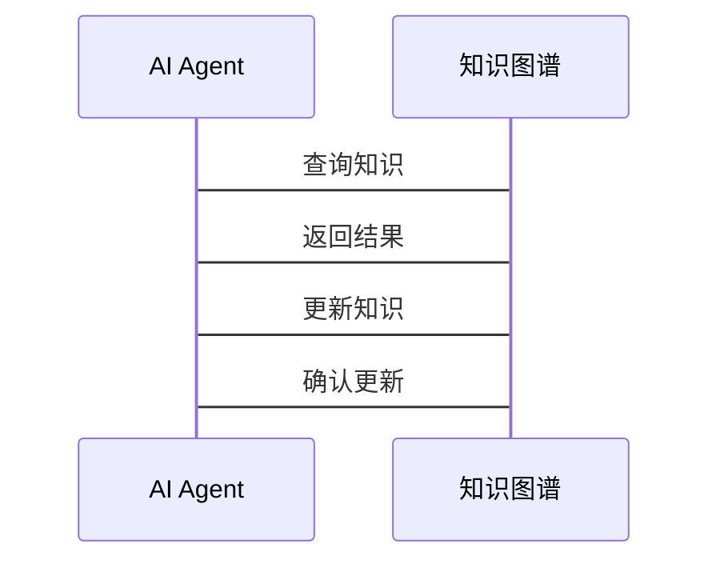
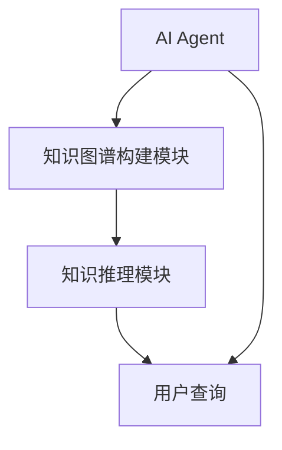

                 


# 知识图谱集成：扩展AI Agent的知识储备

## 关键词：
知识图谱, AI Agent, 知识集成, 语义理解, 数据建模, 知识推理

## 摘要：
知识图谱作为一种结构化的语义知识表示方法，正在成为扩展AI Agent知识储备的重要工具。本文将深入探讨知识图谱的构建、表示、推理及其与AI Agent的集成方法，通过实际案例展示如何利用知识图谱提升AI Agent的语义理解和推理能力。文章还将分析知识图谱在不同场景中的应用，为AI Agent的知识管理提供新的思路。

---

# 正文

## 第一部分：知识图谱概述

### 第1章：知识图谱的定义与特点

#### 1.1 知识图谱的定义与特点

知识图谱是一种以图结构形式表示知识的语义网络，由节点（实体）和边（关系）组成，能够描述现实世界中的实体及其关系。以下是知识图谱的核心特点：

- **语义表达**：知识图谱通过结构化的形式表达实体之间的关系，能够捕捉语义信息。
- **可扩展性**：知识图谱可以不断扩展，新增实体和关系，适应不同领域的需求。
- **层次化组织**：知识图谱通常以层次化的方式组织实体，便于分类和检索。

#### 1.2 AI Agent的基础概念

AI Agent（智能体）是一种能够感知环境并采取行动以实现目标的实体。AI Agent可以分为以下几类：

- **简单反射型**：基于简单的规则做出反应。
- **基于模型的反射型**：使用内部模型进行推理和决策。
- **目标驱动型**：以目标为导向，主动采取行动。

#### 1.3 知识图谱在AI Agent中的作用

知识图谱为AI Agent提供了丰富的知识储备，帮助其更好地理解上下文、推理问题并做出决策。以下是其主要作用：

- **知识扩展**：通过知识图谱，AI Agent能够获取外部知识，弥补其训练数据的局限性。
- **语义理解**：知识图谱提供语义信息，帮助AI Agent理解用户意图。
- **推理能力**：知识图谱支持推理算法，增强AI Agent的逻辑推理能力。

---

## 第二部分：知识图谱的构建

### 第2章：知识图谱的构建

#### 2.1 数据获取与预处理

知识图谱的构建通常需要从多种数据源获取数据，包括结构化数据（如数据库）和非结构化数据（如文本）。以下是数据预处理的关键步骤：

1. **数据清洗**：去除噪声数据，确保数据的准确性和一致性。
2. **数据格式转换**：将数据转换为适合构建知识图谱的格式（如RDF或JSON-LD）。
3. **数据融合**：将来自不同数据源的数据进行整合，消除冗余。

#### 2.2 知识建模与本体设计

知识建模是构建知识图谱的核心步骤，需要设计本体（Ontology）来描述实体及其关系。以下是知识建模的关键点：

1. **实体与关系定义**：明确实体的类型（如“人”、“组织”）和关系（如“属于”、“创作”）。
2. **本体编辑与验证**：通过工具（如Protégé）进行本体设计，并验证本体的合理性。

#### 2.3 知识图谱的存储与管理

知识图谱的存储和管理需要选择合适的数据库技术。以下是常用的技术：

1. **图数据库**：如Neo4j，适合存储和查询图结构数据。
2. **RDF三元组存储**：如Jena，支持RDF数据的存储和查询。

---

## 第三部分：知识图谱的表示与推理

### 第3章：知识图谱的表示与推理

#### 3.1 知识图谱的表示方法

知识图谱可以通过多种方式表示，以下是常见的表示方法：

1. **图表示**：使用节点和边表示实体及其关系。
2. **向量表示**：将实体表示为向量，便于计算相似性。

#### 3.2 知识推理的基本原理

知识推理是通过已有的知识推导出新的事实。以下是常见的推理方法：

1. **基于规则的推理**：通过预定义的规则进行推理。
2. **基于概率的推理**：利用概率论进行推理，如贝叶斯网络。

#### 3.3 知识图谱推理的实现

以下是基于邻接矩阵的推理算法示例：

```python
def breadth_first_search(start_node, target_node):
    queue = deque()
    visited = set()
    queue.append(start_node)
    visited.add(start_node)
    while queue:
        current_node = queue.popleft()
        if current_node == target_node:
            return True
        for neighbor in graph[current_node]:
            if neighbor not in visited:
                visited.add(neighbor)
                queue.append(neighbor)
    return False
```

---

## 第四部分：AI Agent的知识需求分析

### 第4章：AI Agent的知识需求分析

#### 4.1 AI Agent的知识体系构建

AI Agent的知识体系需要覆盖多个层次，以下是层次划分：

1. **基础层**：AI Agent的基本知识，如语法和词汇。
2. **领域层**：特定领域的专业知识。
3. **动态层**：知识的更新和演变。

#### 4.2 知识图谱与AI Agent的匹配

知识图谱与AI Agent的匹配需要考虑以下因素：

1. **知识图谱的选择标准**：知识的准确性、完整性。
2. **AI Agent的任务需求**：任务的复杂性和具体目标。

---

## 第五部分：知识图谱与AI Agent的集成方案

### 第5章：知识图谱与AI Agent的集成方案

#### 5.1 知识图谱与AI Agent的集成方法

以下是知识图谱与AI Agent的集成方法：

1. **知识抽取**：从知识图谱中提取相关知识。
2. **知识融合**：将知识图谱中的知识与AI Agent的已有知识结合。
3. **知识推理**：利用知识图谱进行推理，辅助AI Agent决策。

#### 5.2 知识图谱与AI Agent的交互设计

以下是知识图谱与AI Agent的交互流程图：



---

## 第六部分：项目实战

### 第6章：项目实战

#### 6.1 知识图谱构建与AI Agent集成

##### 6.1.1 项目介绍

项目名称：智能问答系统

目标：构建一个基于知识图谱的智能问答系统。

##### 6.1.2 系统功能设计

功能模块：

- 知识图谱构建模块
- AI Agent交互模块
- 知识推理模块

##### 6.1.3 系统架构设计

系统架构图：



##### 6.1.4 系统实现

以下是知识图谱构建的Python代码示例：

```python
from kgconstruction import KnowledgeGraphBuilder

builder = KnowledgeGraphBuilder()
builder.add_entity("Person", "Alice")
builder.add_relation("knows", "Alice", "Bob")
graph = builder.build()
```

##### 6.1.5 实际案例分析

案例分析：基于知识图谱的问答系统在医疗领域的应用。

---

## 第七部分：扩展与展望

### 第7章：扩展与展望

#### 7.1 知识图谱的前沿技术

1. **动态知识图谱**：支持实时更新的知识图谱。
2. **多模态知识图谱**：结合文本、图像等多种数据形式的知识图谱。

#### 7.2 知识图谱与AI Agent的未来发展方向

1. **增强交互性**：提升知识图谱与AI Agent的交互效率。
2. **跨领域应用**：探索知识图谱在不同领域的广泛应用。

---

## 作者信息

作者：AI天才研究院/AI Genius Institute & 禅与计算机程序设计艺术 /Zen And The Art of Computer Programming

---

希望这篇博客文章能够帮助读者理解知识图谱在扩展AI Agent知识储备中的重要性，并为实际应用提供参考。

